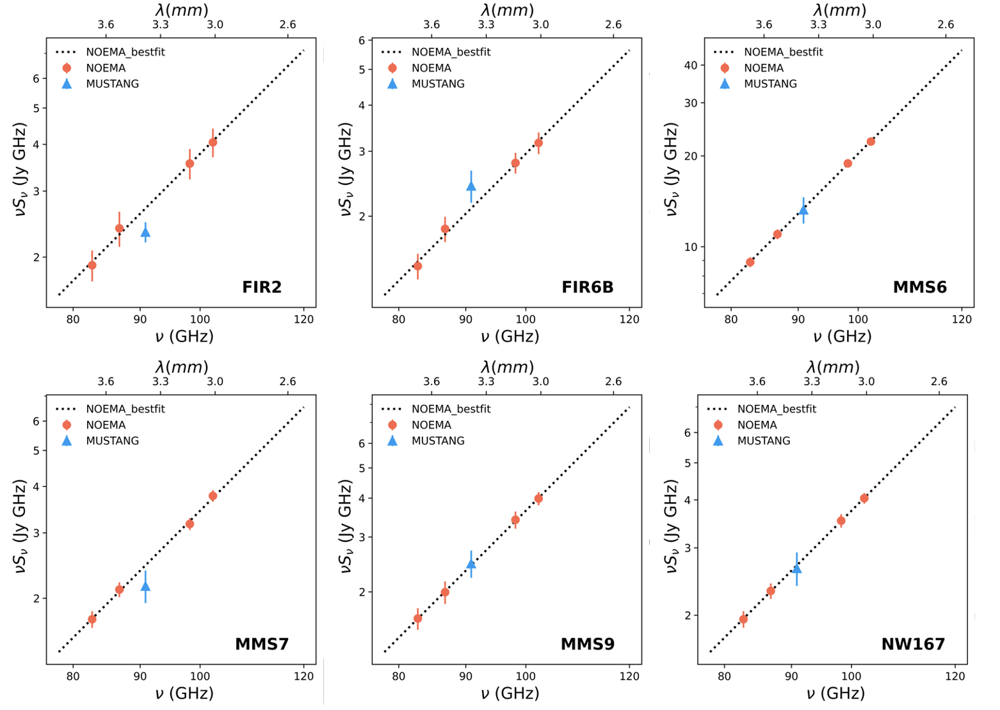
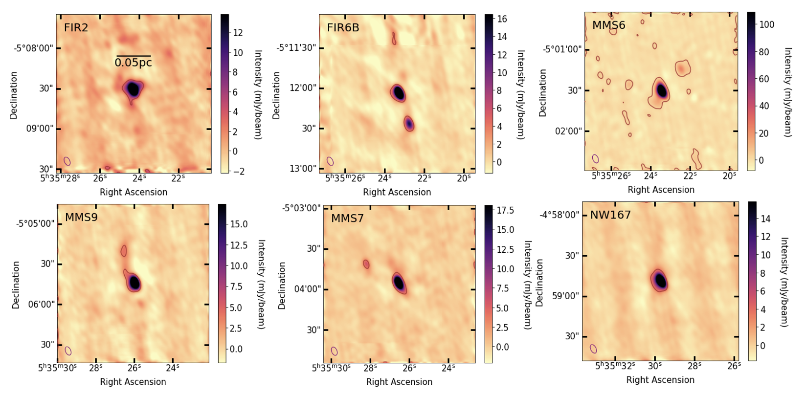

$\newcommand{\ensuremath}{}$
$\newcommand{\xspace}{}$
$\newcommand{\object}[1]{\texttt{#1}}$
$\newcommand{\farcs}{{.}''}$
$\newcommand{\farcm}{{.}'}$
$\newcommand{\arcsec}{''}$
$\newcommand{\arcmin}{'}$
$\newcommand{\ion}[2]{#1#2}$
$\newcommand{\textsc}[1]{\textrm{#1}}$
$\newcommand{\hl}[1]{\textrm{#1}}$
$\newcommand{\footnote}[1]{}$
$\newcommand{\vdag}{(v)^\dagger}$
$\newcommand$
$\newcommand$
$\newcommand{\mum}{\text{\mum}}$
$\newcommand{\Jybeam}{\text{Jy beam^{-1}}}$

# Peculiar Dust Emission within the Orion Molecular Cloud

<mark>Appeared on: 2024-11-20</mark> -  _Accepted to ApJ, 18 pages, 4 figures, 6 Tables_

P. Nozari, et al. -- incl., <mark>T. Henning</mark>

**Abstract:** It is widely assumed that dust opacities in molecular clouds follow a  power-law profile with an index, $\beta$ . Recent studies of the Orion Molecular Cloud (OMC) 2/3 complex, however, show a flattening in the spectral energy distribution (SED) at $ \lambda > 2$ mm implying non-constant indices on scales $\gtrsim$ 0.08 pc. The origin of this flattening is not yet known but it may be due to the intrinsic properties of the dust grains or contamination from other sources of emission. We investigate the SED slopes in OMC 2/3 further using observations of six protostellar cores with NOEMA from 2.9 mm to 3.6 mm and ALMA-ACA in Band 4 (1.9 -- 2.1 mm) and Band 5 (1.6 -- 1.8 mm)    on core and envelope scales of $\sim 0.02 - 0.08$ pc. We confirm flattened opacity indices between 2.9 mm and 3.6 mm for the six cores with $\beta \approx -0.16 - 1.45$ , which are notably lower than the $\beta$ values of $> 1.3$ measured for these sources on $0.08$ pc scales from single-dish data. Four sources have consistent SED slopes between the ALMA data and the NOEMA data.  We propose that these sources may have a significant fraction of emission coming from large dust grains in embedded disks, which biases the emission more at longer wavelengths. Two sources, however, had inconsistent slopes between the ALMA and NOEMA data, indicating  different origins of emission.These results highlight how care is needed when combining multi-scale observations or extrapolating single-band observations to other wavelengths.

**Figure 3. -** SEDs for the six sources with best-fit power-law slopes for the ALMA data (dashed) and NOEMA data (dotted). The yellow areas show the uncertainty on the ALMA slope from 10\% flux calibration errors. Solid lines show the modified blackbody functions from single-dish data (*Herschel* at 0.16 -- 0.5 mm and IRAM+GISMO at 2 mm) from \citet{Sadavoy2016}. (*fig:omc_result*)

**Figure 4. -** SEDs for the six sources with best-fit power-law slopes for the NOEMA data (dotted). The 3 mm GBT MUSTANG \citep{mason2020} are included for comparison but were not used in the fitting.  {To facilitate a robust comparison, the NOEMA data were smoothed to match the 10.8 $\arcsec$ resolution of the GBT data.} (*fig:NOEMA_MUSTANG_result*)

**Figure 1. -** Cleaned NOEMA images of all six protostellar cores in OMC 2/3 for the LSB-I baseband at a central frequency of 86.78157 GHz.   {Contours represent a 5$\sigma$ level.} The synthesized beam is plotted in the bottom left corner.   {These maps represent the unsmoothed NOEMA observations.} (*fig:source_gallery*)

