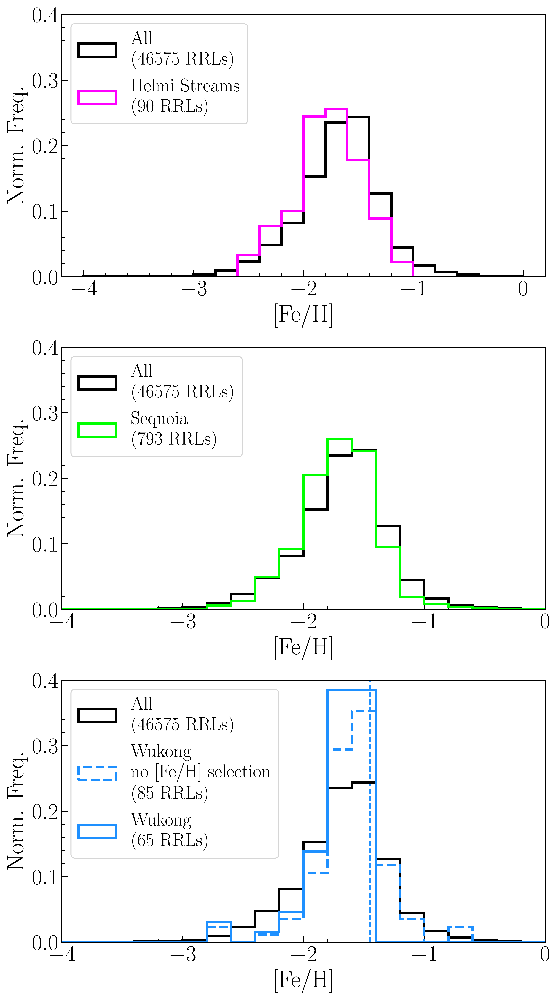

$\newcommand{\ensuremath}{}$
$\newcommand{\xspace}{}$
$\newcommand{\object}[1]{\texttt{#1}}$
$\newcommand{\farcs}{{.}''}$
$\newcommand{\farcm}{{.}'}$
$\newcommand{\arcsec}{''}$
$\newcommand{\arcmin}{'}$
$\newcommand{\ion}[2]{#1#2}$
$\newcommand{\textsc}[1]{\textrm{#1}}$
$\newcommand{\hl}[1]{\textrm{#1}}$
$\newcommand{\footnote}[1]{}$
$\newcommand{\dt}[1]{{\tt #1}}$
$\newcommand{\vdag}{(v)^\dagger}$
$\newcommand$
$\newcommand$
$\newcommand{\KIAA}{\affiliation{Kavli Institute for Astronomy and$
$Astrophysics, Peking University, Beijing 100871, China}}$
$\newcommand{\DoA}{\affiliation{Department of Astronomy, School of Physics,$
$Peking University, Beijing 100871, China}}$
$\newcommand{\UCAS}{\affiliation{School of Astronomy and Space Science, University of Chinese Academy of Sciences, Beijing 100049, China}}$
$\newcommand{\NAOC}{\affiliation{CAS Key Laboratory of Optical Astronomy, National Astronomical Observatories, Chinese Academy of Sciences, Beijing 100101, China}}$
$\newcommand{\IFAA}{\affiliation{Institute for Frontiers in Astronomy and Astrophysics, Beijing Normal University, Beijing 102206, China}}$
$\newcommand{\MPI}{\affiliation{Max-Planck-Institute for Astronomy Königstuhl 17, D-69117, Heidelberg, Germany}}$
$\newcommand{\QNU}{\affiliation{College of Physics and Electronic Engineering, Qilu Normal University, Jinan 250200, China}}$
$\newcommand{\TGU}{\affiliation{Center for Astronomy and Space Sciences, China Three Gorges University, Yichang 443002, China}}$
$\newcommand{\SHAO}{\affiliation{Shanghai Astronomical Observatory, 80 Nandan Road, Shanghai 200030, China}}$
$\newcommand{\THU}{\affiliation{Department of Astronomy, Tsinghua University, Beijing 100084, China}}$

# Identifying the Galactic Substructures in 5D Space Using All-sky RR Lyrae Stars in Gaia DR3

<mark>Appeared on: 2024-11-21</mark> -  _23 pages, 19 figures, 4 tables, accepted for publication in ApJ, version before language edition_

S. Sun, et al. -- incl., <mark>R. Zhang</mark>, <mark>H.-W. Rix</mark>

**Abstract:** Motivated by the vast gap between photometric and spectroscopic data volumes, there is great potential in using 5D kinematic information to identify and study substructures of the Milky Way. We identify substructures in the Galactic halo using 46,575 RR Lyrae stars (RRLs) from Gaia DR3 with the photometric metallicities and distances newly estimated by [Li, et. al (2023)]() . Assuming a Gaussian prior distribution of radial velocity, we calculate the orbital distribution characterized by the integrals of motion for each RRL based on its 3D positions, proper motions and corresponding errors, and then apply the friends-of-friends algorithm to identify groups moving along similar orbits. We have identified several known substructures, including Sagittarius (Sgr) Stream, Hercules-Aquila Cloud (HAC), Virgo Overdensity (VOD), Gaia-Enceladus-Sausage (GES), Orphan-Chenab stream, Cetus-Palca, Helmi Streams, Sequoia, Wukong and Large Magellanic Cloud (LMC) leading arm, along with 18 unknown groups. Our findings indicate that HAC and VOD have kinematic and chemical properties remarkably similar to GES, with most HAC and VOD members exhibiting eccentricity as high as GES, suggesting that they may share a common origin with GES. The ability to identify the low mass and spatially dispersed substructures further demonstrates the potential of our method, which breaks the limit of spectroscopic survey and is competent to probe the substructures in the whole Galaxy. Finally, we have also identified 18 unknown groups with good spatial clustering and proper motion consistency, suggesting more excavation of Milky Way substructures in the future with only 5D data.

**Figure 5. -** The metallicity distributions of the Helmi streams (top panel), Sequoia (middle panel) and Wukong (bottom panel), shown with magenta, lime and blue lines, respectively. The black lines in all panels represent the total sample. The vertical dashed line in the bottom panel represents [Fe/H]=$-$1.45. (*fig:Helmi_Sequoia_Wukong_FeH*)

**Figure 8. -** The spatial distributions of the all known substructures identified by our RRL sample in the $(l,b)$ and $(X,Z)$ spaces. These substructures are shown in two columns of panels for clarity. The numbers in parentheses are the number of candidates for each substructure. The black dashed areas in the upper left panel represent the regions of HAC and VOD in Table \ref{tab:diffuse_sub}. The black stars and black dots in the bottom two panels present the position of the Sun and the Galactic center, respectively. The black triangle in the left two panels represent the position of LMC center. The overlap between several pairs of substructures in Table \ref{tab:overlap} is listed in the legend and can be directly observed. (*fig:all_known_lbXZ*)

**Figure 13. -** The heliocentric distance and metallicity distributions of the total sample and the members of HAC, VOD, and GES. (*fig:d_FeH_HAC_VOD_GES*)

