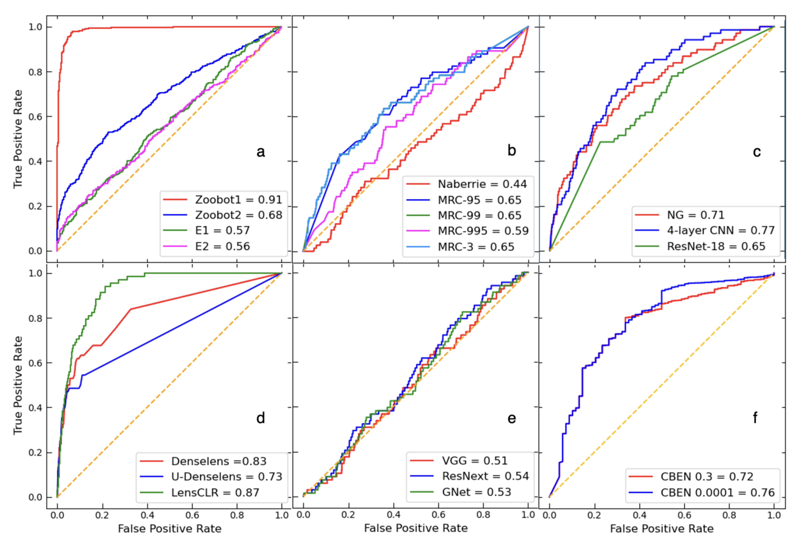
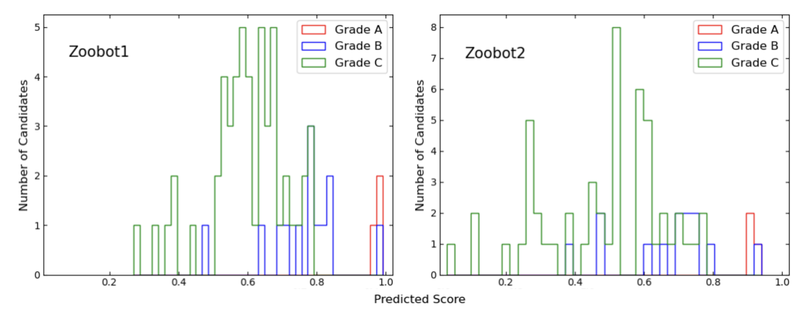
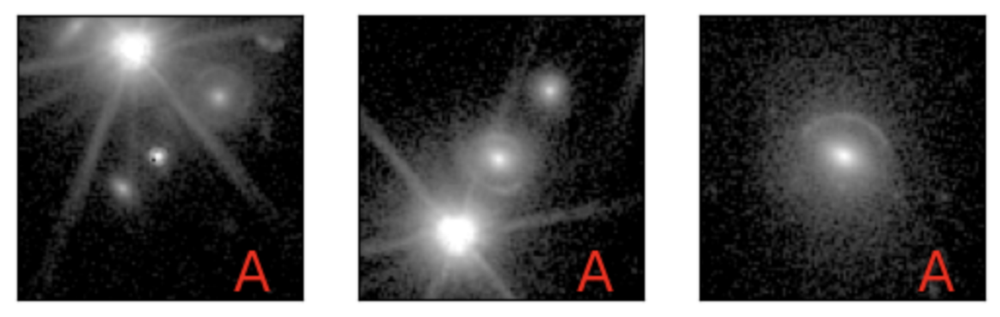

$\newcommand{\ensuremath}{}$
$\newcommand{\xspace}{}$
$\newcommand{\object}[1]{\texttt{#1}}$
$\newcommand{\farcs}{{.}''}$
$\newcommand{\farcm}{{.}'}$
$\newcommand{\arcsec}{''}$
$\newcommand{\arcmin}{'}$
$\newcommand{\ion}[2]{#1#2}$
$\newcommand{\textsc}[1]{\textrm{#1}}$
$\newcommand{\hl}[1]{\textrm{#1}}$
$\newcommand{\footnote}[1]{}$
$\newcommand{\orcid}[1]$

# $\Euclid$: Searches for strong gravitational lenses using convolutional neural nets in Early Release Observations   of the Perseus field   $\thanks{This paper is published on     behalf of the Euclid Consortium.}$

<mark>Appeared on: 2024-11-27</mark> -  _22 pages, 11 figures, Euclid consortium paper, A&A submitted_

R. Pearce-Casey, et al. -- incl., <mark>K. Jahnke</mark>, <mark>M. Schirmer</mark>

**Abstract:** The Euclid Wide Survey (EWS) is predicted to find approximately $\num{170000}$ galaxy-galaxy strong lenses from its lifetime observation of $\num{14000}\textrm{ deg}^2$ of the sky. Detecting this many lenses by visual inspection with professional astronomers and citizen scientists alone is infeasible. As a result, machine learning algorithms, particularly convolutional neural networks (CNNs), have been used as an automated method of detecting strong lenses, and have proven fruitful in finding galaxy-galaxy strong lens candidates, such that the usage of CNNs in lens identification has increased. We identify the major challenge to be the automatic detection of galaxy-galaxy strong lenses while simultaneously maintaining a low false positive rate, thus producing a pure and complete sample of strong lens candidates from $\Euclid$ with a limited need for visual inspection. One aim of this research is to have a quantified starting point on the achieved purity and completeness with our current version of CNN-based detection pipelines for the VIS images of EWS. This work is vital in preparing our CNN-based detection pipelines to be able to produce a pure sample of the $>\num{100000}$ strong gravitational lensing systems widely predicted for $\Euclid$ . We select all sources with VIS $\IE<23$ mag from the $\Euclid$ Early Release Observation imaging of the Perseus field. We apply a range of CNN architectures to detect strong lenses in these cutouts. All our networks perform extremely well on simulated data sets and their respective validation sets. However, when applied to real $\Euclid$ imaging, the highest lens purity is just $\sim11$ \% . Among all our networks, the false positives are typically identifiable by human volunteers as, for example, spiral galaxies, multiple sources, and artifacts, implying that improvements are still possible, perhaps via a second, more interpretable lens selection filtering stage. There is currently no alternative to human classification of CNN-selected lens candidates. Given the expected $\sim10^5$ lensing systems in $\Euclid$ , this implies $10^6$ objects for human classification, which while very large is not in principle intractable and not without precedent.

**Figure 10. -** ROC curves for the networks described in Section \ref{sec: Methods}.  Performance of the \texttt{Zoobot} networks are shown in panel (a), \texttt{Naberrie} and \texttt{MRC} networks are shown in (b), \texttt{NG}, \texttt{4-layer CNN}, and \texttt{ResNet-18} are shown in (c), and \texttt{Denselens} and \texttt{LencCLR} are shown in (d). The performance of the networks described in Sect. \ref{ssec:Leuzzi} are shown in (e), and (f) shows the \texttt{CBEN} networks at two voting values $\beta=0.3$ and $\beta=0.0001$, respectively. The orange diagonal line marked represents the expected performance of an entirely random classifier. The values in the legend of each subplot represent the true positive recovery for each network. Higher performance is represented in general by curves approaching the top-left corner of the plots. The best performing gravitational lens classifiers are the \texttt{Zoobot1} and \texttt{LensCLR} networks. (*fig:ROCAUC*)

**Figure 5. -** Distribution of predicted scores by \texttt{Zoobot1}(left) and \texttt{Zoobot2}(right) for lens candidates across grades $A$, $B$, and $C$. Grade $A$ lens candidates are confidently identified by both networks, shown to the right of the distribution in red at a high value of $p_{\sfont{LENS}}$. Grade $B$ predicted scores are shown in blue and are more varied for \texttt{Zoobot2}. The predicted scores for grade $C$ lens candidates have the most variation amongst grades, shown in green, for both networks illustrating that \texttt{Zoobot1} and \texttt{Zoobot2} are not as confident in identifying grade $C$ lens candidates. (*fig:Zoobot Distribution*)

**Figure 1. -** The three grade $A$ candidate lenses found by a visual inspection of $\num{12086}$ stamps from the Perseus cluster. The grade $A$ candidates show clear lensing features. The \IE-band images are $10^{\prime\prime}\times10^{\prime\prime}$. Detailed lens models for these candidates are shown in Appendix C of \cite{barroso2024euclidearlyreleaseobservations}. (*fig:grade a*)

