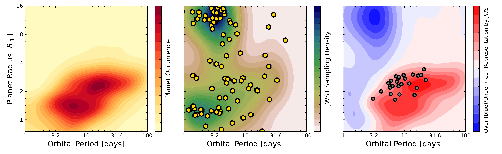
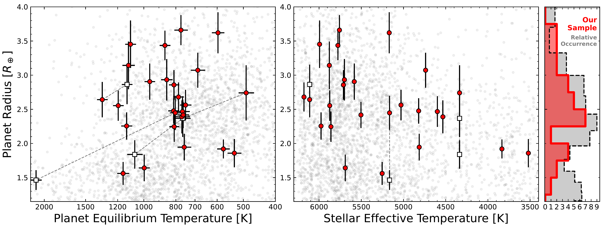

$\newcommand{\ensuremath}{}$
$\newcommand{\xspace}{}$
$\newcommand{\object}[1]{\texttt{#1}}$
$\newcommand{\farcs}{{.}''}$
$\newcommand{\farcm}{{.}'}$
$\newcommand{\arcsec}{''}$
$\newcommand{\arcmin}{'}$
$\newcommand{\ion}[2]{#1#2}$
$\newcommand{\textsc}[1]{\textrm{#1}}$
$\newcommand{\hl}[1]{\textrm{#1}}$
$\newcommand{\footnote}[1]{}$
$\newcommand{\vdag}{(v)^\dagger}$
$\newcommand$
$\newcommand$
$\newcommand{\psj}{PSJ}$
$\newcommand{\ntarg}{26\xspace}$
$\newcommand{\ntoi}{31\xspace}$
$\newcommand{\vsini}{\ensuremath{v \sin i}\xspace}$
$\newcommand{\teff}{\ensuremath{T_\mathrm{eff}}\xspace}$
$\newcommand{\kms}{km~s\ensuremath{^{-1}}\xspace}$
$\newcommand{\kzz}{\ensuremath{K_{zz}}}$
$\newcommand{\soo}{SO_2}$
$\newcommand{\coo}{CO_2}$
$\newcommand{\water}{H_2O}$
$\newcommand{\methane}{CH_4}$
$\newcommand{\co}[2]{\ensuremath{^{#1}\textrm{C}^{#2}\textrm{O}}\xspace}$
$\newcommand{\car}[1]{\ensuremath{^{#1}\textrm{C}}\xspace}$
$\newcommand{\ox}[1]{\ensuremath{^{#1}\textrm{O}}\xspace}$
$\newcommand{\update}$
$\newcommand{\tirr}{\ensuremath{T_\mathrm{irr}}}$
$\newcommand{\TESS}{{\em TESS}}$
$\newcommand{\tess}{{\em TESS}}$
$\newcommand{\spitzer}{{\em Spitzer}}$
$\newcommand{\gj}{GJ~1252}$
$\newcommand{\gjb}{GJ~1252b}$
$\newcommand{\rp}{1.180}$
$\newcommand{\urp}{\pm0.078}$
$\newcommand{\vesc}{5.4}$
$\newcommand{\uvesc}{\pm0.8}$
$\newcommand{\tday}{1410}$
$\newcommand{\utday}{^{+91}_{-125}}$
$\newcommand{\depth}{149}$
$\newcommand{\udepth}{^{+25}_{-32}}$
$\newcommand{\te}{2458668.3575}$
$\newcommand{\ute}{^{+0.0019}_{-0.0007}}$
$\newcommand{\dt}{+1.4}$
$\newcommand{\udt}{^{+2.8}_{-1.0}}$
$\newcommand{\abUL}{0.41}$
$\newcommand{\fLL}{0.40}$
$\newcommand{\fabLL}{0.37}$
$\newcommand{\ecoswnosign}{0.0025}$
$\newcommand{\ecosw}{+0.0025}$
$\newcommand{\uecosw}{^{+0.0049}_{-0.0018}}$
$\newcommand{\psurfUL}{8.9}$
$\newcommand{\age}{3.9}$
$\newcommand{\uage}{0.4}$
$\newcommand{\referee}$
$\newcommand{\vdag}{(v)^\dagger}$
$\newcommand$
$\newcommand$
$\newcommand{\psj}{PSJ}$
$\newcommand{\ntarg}{26\xspace}$
$\newcommand{\ntoi}{31\xspace}$
$\newcommand{\vsini}{\ensuremath{v \sin i}\xspace}$
$\newcommand{\teff}{\ensuremath{T_\mathrm{eff}}\xspace}$
$\newcommand{\kms}{km~s\ensuremath{^{-1}}\xspace}$
$\newcommand{\kzz}{\ensuremath{K_{zz}}}$
$\newcommand{\soo}{SO_2}$
$\newcommand{\coo}{CO_2}$
$\newcommand{\water}{H_2O}$
$\newcommand{\methane}{CH_4}$
$\newcommand{\co}[2]{\ensuremath{^{#1}\textrm{C}^{#2}\textrm{O}}\xspace}$
$\newcommand{\car}[1]{\ensuremath{^{#1}\textrm{C}}\xspace}$
$\newcommand{\ox}[1]{\ensuremath{^{#1}\textrm{O}}\xspace}$
$\newcommand{\update}$
$\newcommand{\tirr}{\ensuremath{T_\mathrm{irr}}}$
$\newcommand{\TESS}{{\em TESS}}$
$\newcommand{\tess}{{\em TESS}}$
$\newcommand{\spitzer}{{\em Spitzer}}$
$\newcommand{\gj}{GJ~1252}$
$\newcommand{\gjb}{GJ~1252b}$
$\newcommand{\rp}{1.180}$
$\newcommand{\urp}{\pm0.078}$
$\newcommand{\vesc}{5.4}$
$\newcommand{\uvesc}{\pm0.8}$
$\newcommand{\tday}{1410}$
$\newcommand{\utday}{^{+91}_{-125}}$
$\newcommand{\depth}{149}$
$\newcommand{\udepth}{^{+25}_{-32}}$
$\newcommand{\te}{2458668.3575}$
$\newcommand{\ute}{^{+0.0019}_{-0.0007}}$
$\newcommand{\dt}{+1.4}$
$\newcommand{\udt}{^{+2.8}_{-1.0}}$
$\newcommand{\abUL}{0.41}$
$\newcommand{\fLL}{0.40}$
$\newcommand{\fabLL}{0.37}$
$\newcommand{\ecoswnosign}{0.0025}$
$\newcommand{\ecosw}{+0.0025}$
$\newcommand{\uecosw}{^{+0.0049}_{-0.0018}}$
$\newcommand{\psurfUL}{8.9}$
$\newcommand{\age}{3.9}$
$\newcommand{\uage}{0.4}$
$\newcommand{\referee}$

# OrCAS: Origins, Compositions, and Atmospheres of Sub-neptunes. I.  Survey Definition

<mark>Appeared on: 2024-11-27</mark> -  _20 pages, 4 figures, 4 tables, 26 sub-Neptunes, 31 TOIs. Accepted to AJ_

<mark>I. J. M. Crossfield</mark>, et al. -- incl., <mark>L. Kreidberg</mark>

**Abstract:** Sub-Neptunes --- volatile-rich exoplanets smaller than Neptune --- areintrinsically the most common type of planet known.  However, theformation and nature of these objects, as well as the distinctionsbetween sub-classes (if any), remain unclear.  Two powerful tools totease out the secrets of these worlds are measurements of (i)atmospheric composition and structure revealed by transit and/oreclipse spectroscopy, and (ii) mass, radius, and density revealed bytransit photometry and Doppler spectroscopy.  Here we present OrCAS, asurvey to better elucidate the origins, compositions, and atmospheresof sub-Neptunes.  This radial velocity survey uses a repeatable,quantifiable metric to select targets suitable for subsequenttransmission spectroscopy and address key science themes about theatmospheric \& internal compositions and architectures of thesesystems.  Our survey targets $\ntarg$ systems with transitingsub-Neptune planet candidates, with the overarching goal of increasingthe sample of such planets suitable for subsequent atmosphericcharacterization.  This paper lays out our survey's science goals,defines our target prioritization metric, and performs light-curvefits and statistical validation using existing $\TESS$ photometry andground-based follow-up observations.  Our survey serves to continueexpanding the sample of small exoplanets with well-measured propertiesorbiting nearby bright stars, ensuring fruitful studies of thesesystems for many years to come.

**Figure 3. -**  Target prioritization. * Left:* Planet occurrence rate
   ([Fulton and Petigura 2018]()) , showing that sup-Neptunes and super-Earths are
  the most common planets on short-period orbits. * Center:* Gold
  hexagons show transiting exoplanets targeted by JWST in Cycles
  1 \& 2 (our survey began before Cycle 3 results were announced); the shading is a Kernel Density Estimate map showing that hot
  Jupiters and super-Earths were the most commonly targeted
  planets. * Right:* Difference of the two heat maps, showing that
  temperate sub-Neptunes (red region) remain underrepresented by JWST
  relative to the intrinsic underlying population. We identified our
  targets (gray points) by weighting by this under-representation, TSM,
  and observing efficiency (see text for details).
 (*fig:triptych*)

**Figure 6. -**  Target prioritization. * Left:* Planet occurrence rate
   ([Fulton and Petigura 2018]()) , showing that sup-Neptunes and super-Earths are
  the most common planets on short-period orbits. * Center:* Gold
  hexagons show transiting exoplanets targeted by JWST in Cycles
  1 \& 2 (our survey began before Cycle 3 results were announced); the shading is a Kernel Density Estimate map showing that hot
  Jupiters and super-Earths were the most commonly targeted
  planets. * Right:* Difference of the two heat maps, showing that
  temperate sub-Neptunes (red region) remain underrepresented by JWST
  relative to the intrinsic underlying population. We identified our
  targets (gray points) by weighting by this under-representation, TSM,
  and observing efficiency (see text for details).
 (*fig:triptych*)

**Figure 5. -** Our target sample, showing the distribution of fit planet
  size, temperature, and stellar $T_\mathrm{eff}$. Red points are our
  primary sample, white points are known companions to our targets,
  dashed lines connect  planets orbiting the same target star, and light gray
  points are other known exoplanets. The histogram at * right*
  shows how our planet sizes (red) compare to the intrinsic occurrence
  of sub-Neptunes \citep[gray,][]{fulton:2018}. Noted that these
  best-fit radii differ from the TESS-reported radii plotted in
  Fig. \ref{fig:triptych}c.
 (*fig:sample*)

