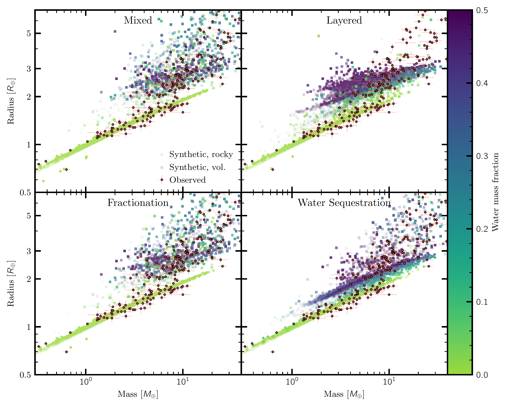
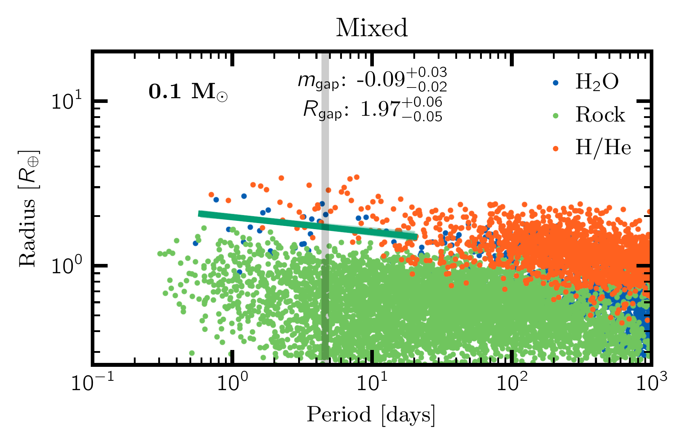
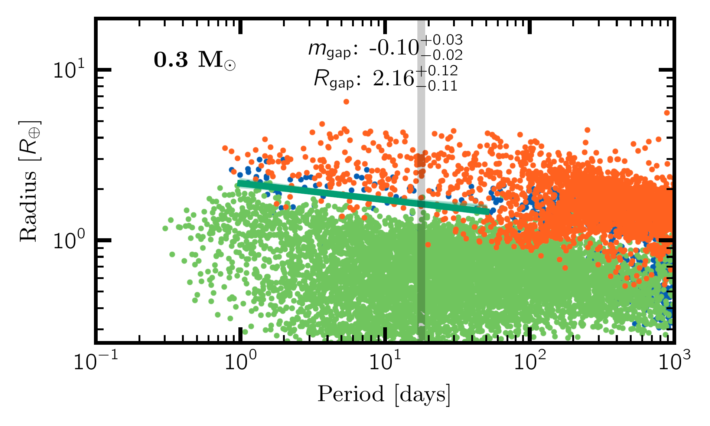
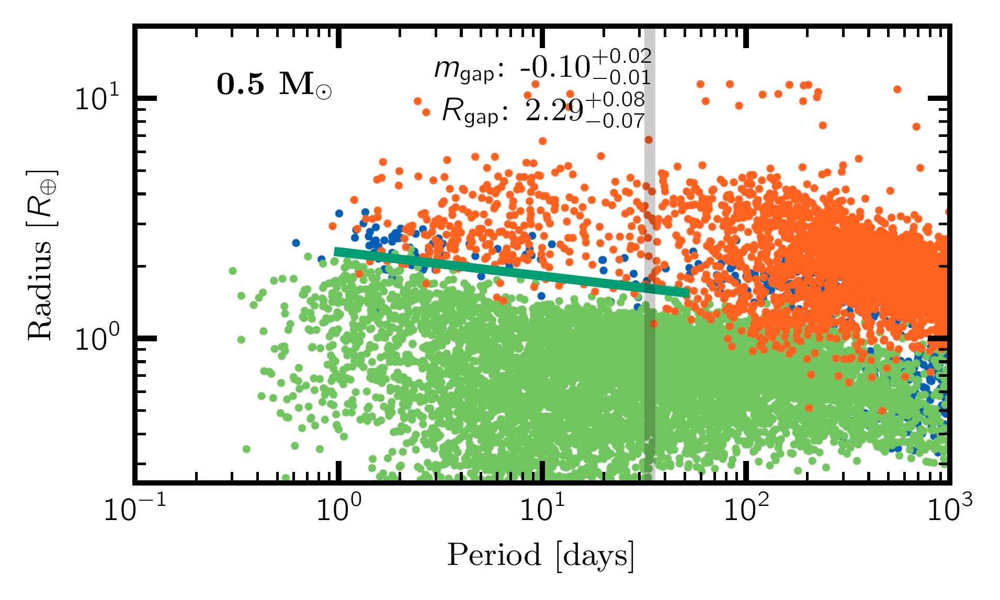
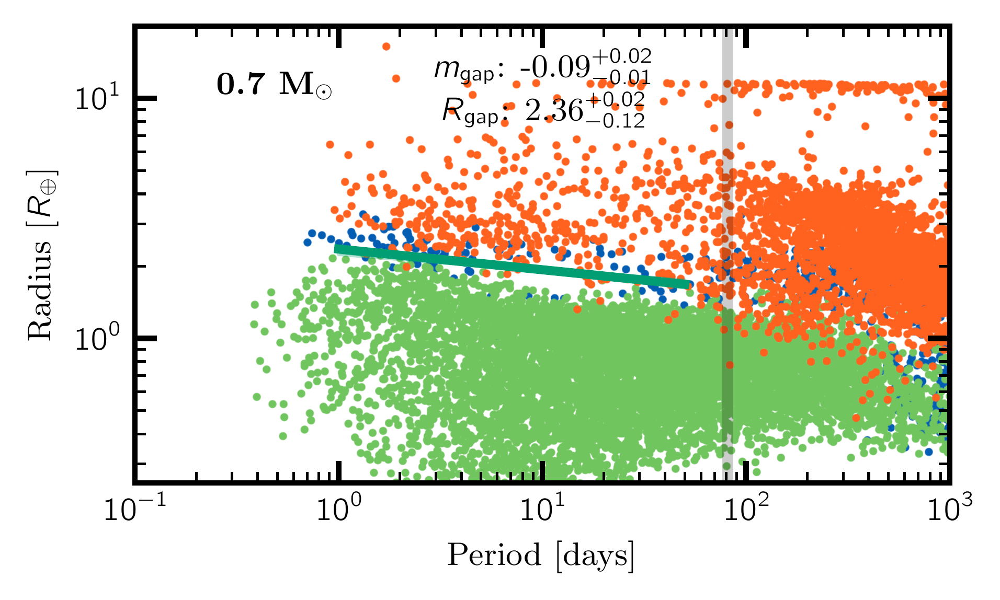
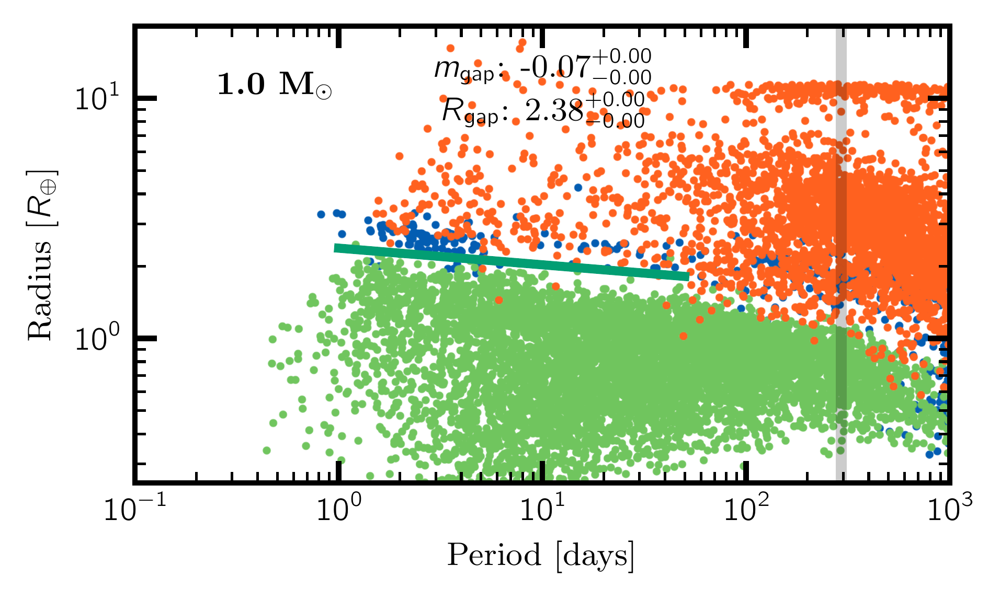
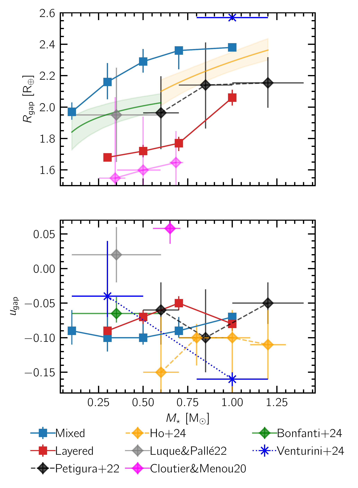

$\newcommand{\ensuremath}{}$
$\newcommand{\xspace}{}$
$\newcommand{\object}[1]{\texttt{#1}}$
$\newcommand{\farcs}{{.}''}$
$\newcommand{\farcm}{{.}'}$
$\newcommand{\arcsec}{''}$
$\newcommand{\arcmin}{'}$
$\newcommand{\ion}[2]{#1#2}$
$\newcommand{\textsc}[1]{\textrm{#1}}$
$\newcommand{\hl}[1]{\textrm{#1}}$
$\newcommand{\footnote}[1]{}$
$\newcommand$
$\newcommand$
$\newcommand$
$\newcommand$
$\newcommand$
$\newcommand$
$\newcommand$
$\newcommand$
$\newcommand$
$\newcommand$
$\newcommand$
$\newcommand$
$\newcommand$
$\newcommand{\svgwidth}{.9\linewidth}$

# Water-rich sub-Neptunes and rocky super Earths around different Stars: Radii shaped by Volatile Partitioning, Formation, and Evolution

<mark>Appeared on: 2024-11-27</mark> -  _25 pages, 17 figures, submitted to A&A_

<mark>R. Burn</mark>, et al.

**Abstract:** Despite precise characterization measurements, the nature of planets with radii ranging from 2 to 4 Earth radii, the sub-Neptunes, remains unknown due to degeneracies in interior models. However, a statistical ensemble of small planets with measured masses and radii around different stars has been compiled by the field. It can be used to test the prediction of large water reservoirs on sub-Neptunes by planet formation theory with orbital migration. We want to find out whether this water reservoir is included in photoevaporative winds and how much of it can partition into the rocky and metallic interior. We couple the result of a planetary formation model with planetesimal and gas accretion as well as orbital migration to evolution models which assume perfect mixing of water with H/He in the envelope or complete segregation. For the mixed envelopes, we also include an analytic treatment of fractionation during photoevaporative mass-loss. Further, the effect of equilibrium dissolution of water into an assumed magma ocean and into the metallic core is studied for the first time in coupled formation-evolution models. Out of the tested scenarios, the mass-radius relation of exoplanets is best matched under the mixed assumption without water sequestration to the interior. We quantify the radius valley location and scaling with stellar mass. Fractionation is not found to significantly alter the composition of the planets for our initial conditions due to initially massive envelopes on all planets. In contrast, water sequestration has a profound effect on the radius evolution and compositional budget of the planets. The model predicts the preservation of large quantities of water even if the gaseous envelope is lost. Planets with corresponding bulk densities are not observed in comparably large numbers. By combining formation and evolution model, we probe a parameter space favored by core accretion theory. We conclude that observationally searching for the imprint of fractionation on present-day exoplanet atmospheres can constrain initial gas mass fractions of exoplanets but not the occurrence of photoevaporative mass loss in general. The dissolution of different volatiles into the planetary interior and solidification of the magma ocean are natural next steps for comprehensive treatment of atmosphere-interior interaction.

**Figure 13. -** Mass versus radius diagram of observed and synthetic planets. The four panels show the resulting planets using different model variations contrasted against the observational data from Parc2024. The synthetic data for all models is sampled according to the stellar mass distribution of the observations and an estimate of the detection and transit probability is applied. More saturated dots imply that the planet was sampled multiple times due to being more likely to be detected and their color is given by the planets' water mass fraction. (*fig:m_R_all*)

**Figure 4. -** Period versus radius of unbiased, synthetic planets using the mixed model around stars of different masses. For each stellar mass (top left), a gap in the data was fitted (\texttt{gapfit}, \citealp{Loyd2020}) and the resulting slope ($u_{\rm gap}$) and locus ($R_{\rm gap}$) in logarithmic space are listed. The gray line marks $a_{\rm runaway}$(Eq. \ref{eq:runaway}) within which runaway heating occurs. (*fig:period_radius_Mstars*)

**Figure 5. -** Comparison of derived loci $R_{\rm gap}$ and slopes with orbital period $u_{\rm gap}$ for the radius valley. Observational data from Petigura2022, [ and é (2022)](http://doi.org/10.1126/science.abl7164), Ho2024, Bonfanti2024 is shown with diamond shaped markers and errors in x-direction showing the range of stellar masses included. From this work, only the Mixed (light blue squares) and Layered (red squares) model output is included here since the Fractionation model gives similar results to the Mixed case and for the Sequestration model no trustworthy fit can be obtained. For the same reason, Venturini2024(dark blue) did not report $R_{\rm gap}$ for their sample of modeled planets around low stellar mass. The values for $R_{\rm gap}$ by [ and é (2022)](http://doi.org/10.1126/science.abl7164) is read-off from their figure. The results of Cloutier2020 and Petigura2022 are based on occurrences instead of detections. For Petigura2022 the values for $R_{\rm gap}$ were shifted to 1 day orbital period (incl. Gaussian error propagation). For the results from Cloutier2020, we report their values which were obtained from marginalizing over orbital periods. The values are only comparable to the other derivations because their derived $u_{\rm gap}$ is close to zero. For \citet[][green line and region, $M_{\rm star}<0.6 $M$_{\odot}$]{Bonfanti2024} and \citet[][orange, $0.6$M$_{\odot} \apprle M_{\rm star}\apprle 1.2 $M$_{\odot}$]{Ho2024}, we show their fitted continuous function for $R_{\rm gap}(M_\star)$ with shaded regions marking 16 to 84\% confidence intervals. (*fig:rgap_ugap_comparison*)

