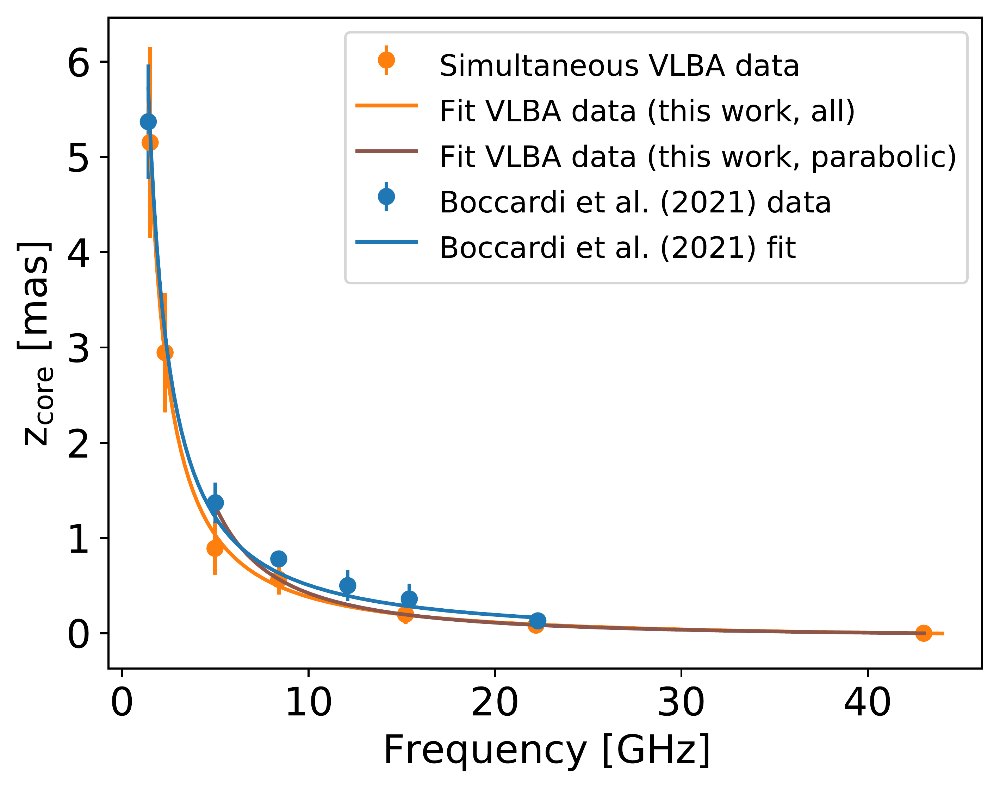
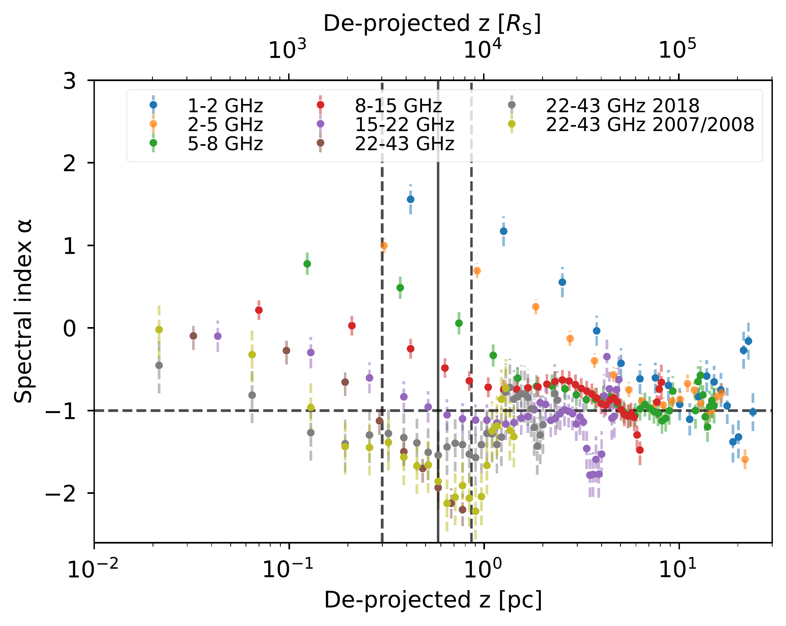

$\newcommand{\ensuremath}{}$
$\newcommand{\xspace}{}$
$\newcommand{\object}[1]{\texttt{#1}}$
$\newcommand{\farcs}{{.}''}$
$\newcommand{\farcm}{{.}'}$
$\newcommand{\arcsec}{''}$
$\newcommand{\arcmin}{'}$
$\newcommand{\ion}[2]{#1#2}$
$\newcommand{\textsc}[1]{\textrm{#1}}$
$\newcommand{\hl}[1]{\textrm{#1}}$
$\newcommand{\footnote}[1]{}$
$\newcommand{\jr}[1]{\textcolor{orange}{JR: #1}}$
$\newcommand{\gm}{\color{blue}}$
$\newcommand{\mk}[1]{\textcolor{violet}{MK: #1}}$
$\newcommand$

# Spectral and magnetic properties of the jet base in NGC 315

<mark>Appeared on: 2024-12-02</mark> -  _16 pages, 19 figures, accepted for publication in A&A_

L. Ricci, et al. -- incl., <mark>G. Mattia</mark>

**Abstract:**            The dynamic of relativistic jets in the inner parsec regions is deeply affected by the nature of the magnetic fields. The level of magnetization of the plasma, as well as the geometry of these fields on compact scales, have not yet been fully constrained. In this paper we employ multi-frequency and multi-epoch very long baseline interferometry observations of the nearby radio galaxy NGC 315. We aim to derive insights into the magnetic field properties on sub-parsec and parsec scales by examining observational signatures such as the spectral index, synchrotron turnover frequency, and brightness temperature profiles. This analysis is performed by considering the properties of the jet acceleration and collimation zone, which can be probed thanks to the source vicinity, as well as the inner part of the jet conical region. We observe remarkably steep values for the spectral index on sub-parsec scales ($\alpha \sim -2$, $S_\nu \propto \nu^\alpha$) which flatten around $\alpha \sim -0.8$ on parsec scales. We suggest that the observed steep values may result from particles being accelerated via diffusive shock acceleration mechanisms in magnetized plasma and subsequently experiencing cooling through synchrotron losses. The brightness temperature of the 43 GHz cores indicates a dominance of the magnetic energy at the jet base, while the cores at progressively lower frequencies reveal a gradual transition towards equipartition. Based on the spectral index and brightness temperature along the incoming jet, and by employing theoretical models, we derive that the magnetic field strength has a close-to-linear dependence with distance going from parsec scales up to the jet apex. Overall, our findings are consistent with a toroidal-dominated magnetic field on all the analyzed scales.         

**Figure 2. -** Core position as a function of frequency for the two different data sets: i) the multi-frequency VLBA data set (orange points); ii) the multi-frequency and multi-epoch data set presented in [Boccardi, Perucho and Casadio (2021)]()(blue points). The blue line represents the best-fit values presented in [Boccardi, Perucho and Casadio (2021)](), the orange line traces the best-fit performed in this paper by employing all the data, and the purple line highlights the best-fit curve obtained using only the data points at 8, 15, 22, and 43 GHz. (*fig:core_shift*)

**Figure 3. -** Turnover frequency along the ridgeline as a function of distance from the 43 GHz core. The multiple data points at the same distance are from the different possible core-shift configurations. The orange points represent the upper boundary, while the green ones the lower boundary. The turnover frequency decreases from $10   \mathrm{GHz} \lesssim \nu_\mathrm{br} \lesssim 35   \mathrm{GHz}$ in the 43 GHz core, down to $\sim 6   \mathrm{GHz}$ at $\sim 0.7   \mathrm{pc}$. (*fig:turnover_evolution*)

**Figure 7. -** Average spectral index as a function of distance from the 43 GHz core for different pairs of frequencies. In addition to the VLBA data set here presented, we re-present for comparison the 22-43 GHz spectral index values for the two epochs presented by [Ricci, Boccardi and Nokhrina (2022)](). At high frequencies, remarkably steep spectral index values down to $\alpha \sim -2$ are observed within one parsec from the core, corresponding to ${\sim}10^4   R_\mathrm{S}$. Downstream, a convergence towards flatter values $\alpha \sim -0.8$ is observed at all frequencies. The black vertical lines highlight the jet break point, as proposed in  ([Boccardi, Perucho and Casadio 2021]()) , while the horizontal dashed line is set at $\alpha = -1$ as reference. (*fig:alpha_profiles*)

