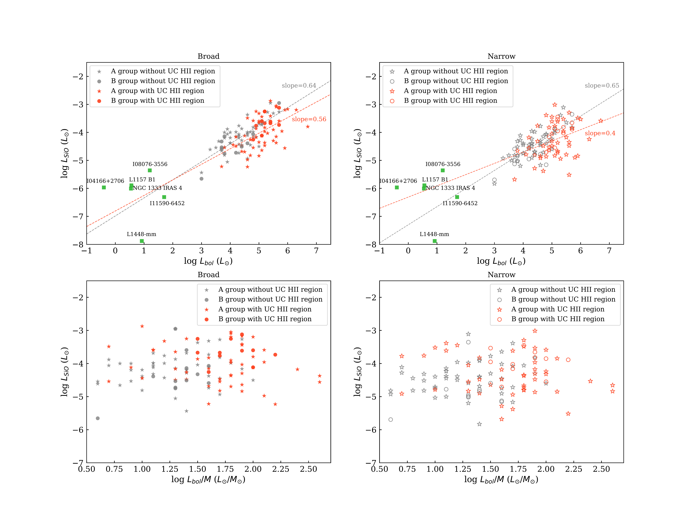
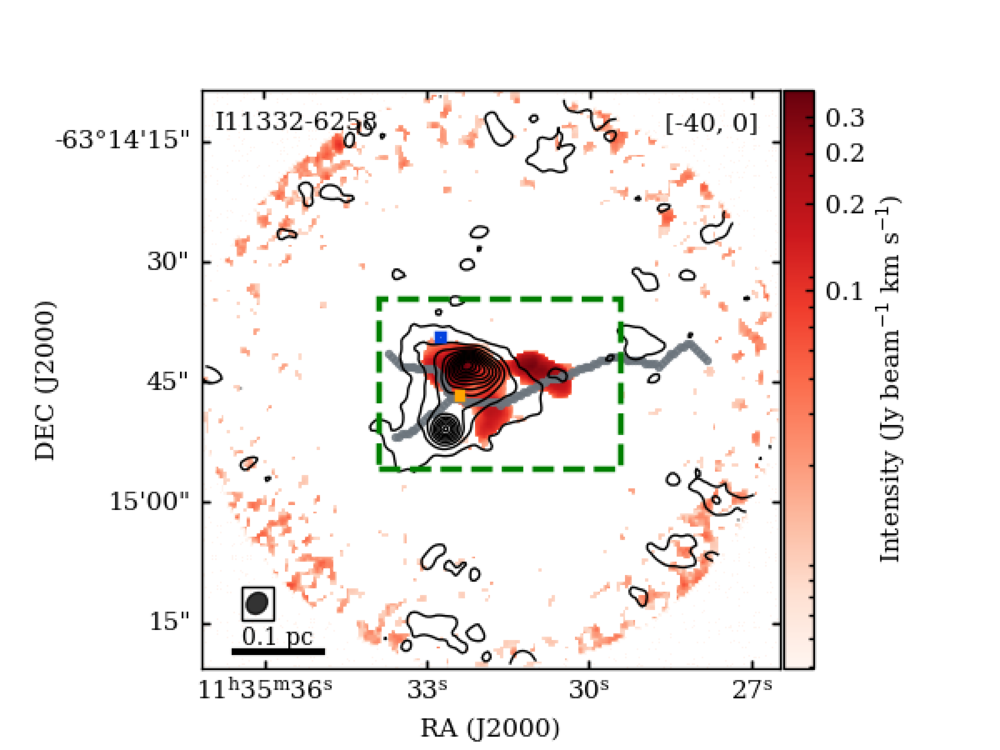
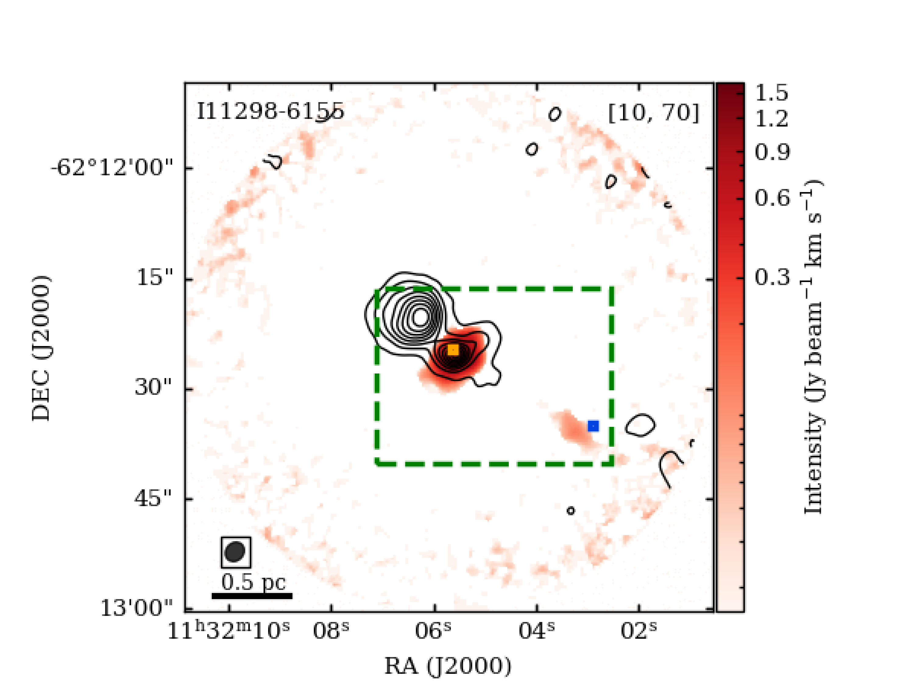
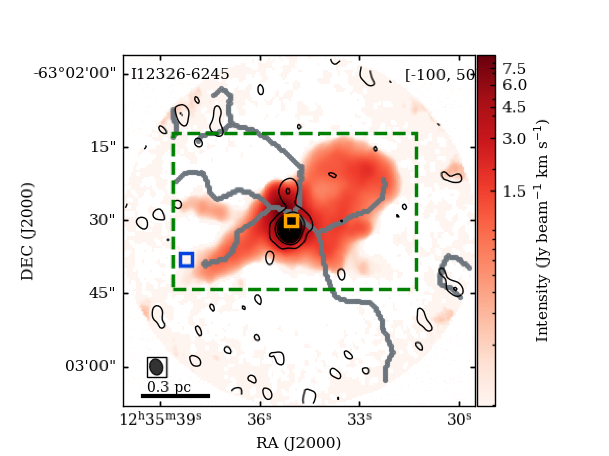
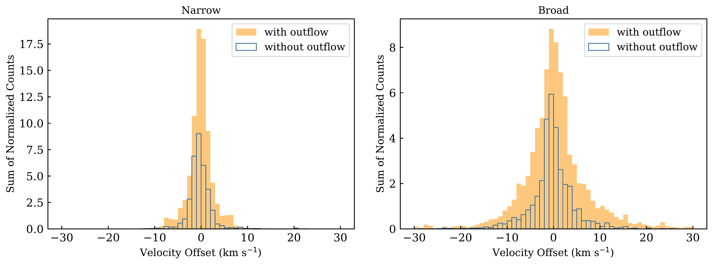
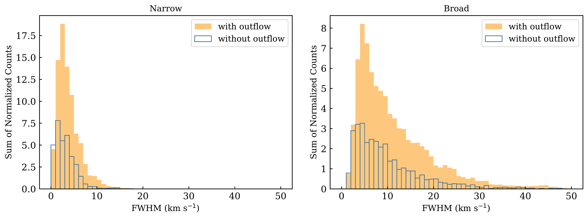

$\newcommand{\ensuremath}{}$
$\newcommand{\xspace}{}$
$\newcommand{\object}[1]{\texttt{#1}}$
$\newcommand{\farcs}{{.}''}$
$\newcommand{\farcm}{{.}'}$
$\newcommand{\arcsec}{''}$
$\newcommand{\arcmin}{'}$
$\newcommand{\ion}[2]{#1#2}$
$\newcommand{\textsc}[1]{\textrm{#1}}$
$\newcommand{\hl}[1]{\textrm{#1}}$
$\newcommand{\footnote}[1]{}$
$\newcommand$
$\newcommand$
$\newcommand$
$\newcommand$
$\newcommand$
$\newcommand{\thebibliography}{\DeclareRobustCommand{\VAN}[3]{##3}\VANthebibliography}$

# ATOMS: ALMA Three-millimeter Observations of Massive Star-forming regions – $\uppercase$$\expandafter{\romannumeral19}$. The origin of SiO emission

<mark>Appeared on: 2024-12-02</mark> -  _23 pages, 14 figures_

R. Liu, et al. -- incl., <mark>S. Li</mark>

**Abstract:** The production of silicon monoxide (SiO) can be considered as a fingerprint of shock interaction.In this work, we use high-sensitivity observations of the SiO (2-1) and H $^{13}$ CO $^{+}$ (1-0) emission to investigate the broad and narrow SiO emission toward 146 massive star-forming regions in the ATOMS survey. We detected SiO emission in 136 regions and distinguished broad and narrow components across the extension of 118 sources (including 58 UC H ii regions) with an average angular resolution of 2.5 $^{\prime}^{\prime}$ .The derived SiO luminosity ( $L_\textup{SiO}$ ) across the whole sample shows that the majority of $L_\textup{SiO}$ (above 66 $\%$ ) can be attributed to broad SiO, indicating its association with strong outflows.The comparison of the ALMA SiO images with the filamentary skeletons identified from H $^{13}$ CO $^{+}$ and in the infrared data (at 4.5, 8, and 24 $\upmu$ m), further confirms that most SiO emission originates from outflows. However, note that for nine sources in our sample, the observed SiO emission may be generated by expanding UC H ii regions. There is a moderate positive correlation between the bolometric luminosity ( $L_\textup{bol}$ ) and $L_\textup{SiO}$ for both components (narrow and broad). The UC H ii sources show a weaker positive correlation between $L_\textup{bol}$ and $L_\textup{SiO}$ and higher $L_\textup{SiO}$ compared to the sources without UC H ii regions. These results imply that the SiO emission from UC H ii sources might be affected by UV-photochemistry induced by UC H ii regions.

**Figure 10. -** _ Upper panels_: The SiO luminosity ($L_\textup{sio}$) versus  bolometric luminosity ($L_\textup{bol}$).
The filled and empty gray stars present broad and narrow SiO components in _A groups_ without UC Hii regions, and the filled and empty gray circles depict broad and narrow SiO
components in _B groups_ without UC Hii regions.
The filled and empty red stars show broad and narrow SiO components in _A groups_ hosting UC Hii regions, while the filled and empty red circles display broad and narrow SiO components in _B groups_ with UC Hii regions.
The filled green rectangles show the low-mass stars  (2022MNRAS.512.5214D, [Jiménez-Serra, et. al 2011](https://ui.adsabs.harvard.edu/abs/2011ApJ...739...80J), [Spezzano, et. al 2020](https://ui.adsabs.harvard.edu/abs/2020A&A...640A..74S), [Santiago-García, et. al 2009](https://ui.adsabs.harvard.edu/abs/2009A&A...495..169S), [ and Lee 2020](https://ui.adsabs.harvard.edu/abs/2020A&ARv..28....1L)) .
In the upper left panel, the gray line shows a linear fit of log $(L_\textrm{sio} / L_{\sun})$$= (0.64\pm0.07)$ log $(L_\textrm{bol} / L_{\sun})$ - $6.98\pm0.32$ obtained for sources without UC Hii regions, while the red line shows the linear fit log $(L_\textrm{sio} / L_{\sun})$$ = (0.56\pm0.11)$ log $(L_\textrm{bol} / L_{\sun})$ - $6.81\pm0.58$ obtained for sources hosting UC Hii sources.
In the upper right panel, the gray line displays the linear fit
log $(L_\textrm{sio} / L_{\sun})$$ = (0.65\pm0.08)$ log $(L_\textrm{bol} / L_{\sun})$ - $7.30\pm0.33$ derived for sources without UC Hii regions, while the red line is used to show the linear fit
log $(L_\textrm{sio} / L_{\sun})$$ = (0.40\pm0.13)$ log $(L_\textrm{bol} / L_{\sun})$ - $6.31\pm0.68$ inferred for sources hosting UC Hii regions.
_ Lower panels_: $L_\textup{sio}$ vs. $L_\textup{bol}/M$. No apparent correlation is seen either for the broad or for the narrow components. The symbols are the same as in the upper panels. (*fig10*)

**Figure 4. -** Four representative sources imaged with ALMA within the ATOMS program. The background corresponds to the SiO (2-1) integrated intensity maps. The black contours show the 3 mm continuum emission detected with ALMA, and contours are from 5$\sigma$ to the peak values in steps of 10$\sigma$.
The bold gray lines represent the filament skeletons identified using H$^{13}$CO$^+$ as reported by zhou2022atoms. The green dashed rectangle is the area of the SiO emission maps where the SiO line profiles have been decomposed into different velocity components. The orange and blue rectangles, with the broadest and narrowest SiO line widths, respectively, indicate the locations where SiO and H$^{13}$CO$^+$ have been extracted.
The field of view (FOV) is 72$^{\prime}^{\prime}$ corresponding with the FOV of the ALMA observations. All images have been primary-beam corrected. The source name and integrated velocity ranges (in km s$^{-1}$) are shown on the upper left and right corners, respectively. The beam size is reported in the lower left corner. The same images are provided for all sources within the supplementary material. (*fig3*)

**Figure 6. -** The histogram shows the velocity offset compared to the systemic velocity and line width distribution of the broad and narrow components of the SiO emission for the entire sample. The open blue histograms correspond to the sources without outflow activity, and the orange-filled histograms represent the sources exhibiting outflow activity. The outflow sources can be found in Table \ref{tab:TableA1}. (*fig5*)

