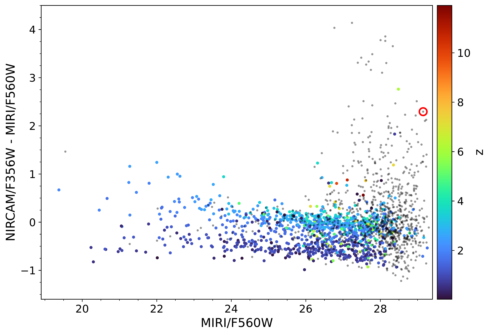
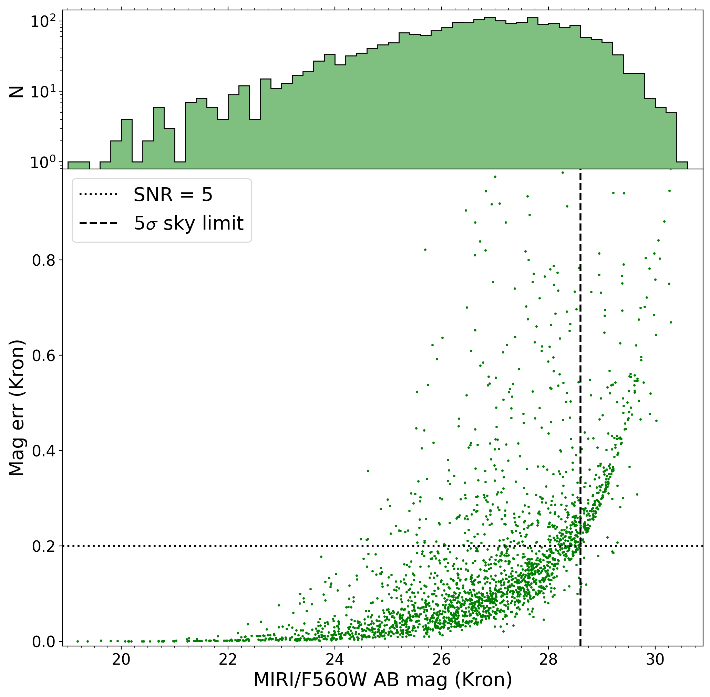

$\newcommand{\ensuremath}{}$
$\newcommand{\xspace}{}$
$\newcommand{\object}[1]{\texttt{#1}}$
$\newcommand{\farcs}{{.}''}$
$\newcommand{\farcm}{{.}'}$
$\newcommand{\arcsec}{''}$
$\newcommand{\arcmin}{'}$
$\newcommand{\ion}[2]{#1#2}$
$\newcommand{\textsc}[1]{\textrm{#1}}$
$\newcommand{\hl}[1]{\textrm{#1}}$
$\newcommand{\footnote}[1]{}$
$\newcommand{\mum}{{\mum}}$
$\newcommand{\mjy}{{\muJy}}$
$\newcommand{\lya}{{Ly\alpha}}$
$\newcommand{\ha}{H\alpha}$
$\newcommand{\pa}{Pa \alpha}$
$\newcommand{\brb}{Br\beta}$
$\newcommand{\brg}{Br\gamma}$
$\newcommand{\brd}{Br\delta}$
$\newcommand{\hb}{H\beta}$
$\newcommand{\hg}{H\gamma}$
$\newcommand{\hd}{H\delta}$
$\newcommand{\oii}{[O {\sc ii}]}$
$\newcommand{\oiii}{[O {\sc iii}]}$
$\newcommand{\nii}{[N {\sc ii}]}$
$\newcommand{\hi}{H {\sc i}}$
$\newcommand{\hii}{H {\sc ii}}$
$\newcommand{\zsun}{Z_\odot}$
$\newcommand{\msun}{M_\odot}$
$\newcommand{\msunyr}{M_\odot/yr}$
$\newcommand{\sfrkpc}{M_\odot/yr/kpc^2}$
$\newcommand{\lfuv}{L_{\rm FUV}}$
$\newcommand{\lsun}{L_\odot}$
$\newcommand{\bull}{\bullet}$
$\newcommand{\fesc}{f_{esc, Ly\alpha}}$
$\newcommand{\fesclyc}{f_{esc}}$
$\newcommand{\hiz}{high-z}$
$\newcommand{\z}{z}$
$\newcommand$
$\newcommand$
$\newcommand$
$\newcommand$
$\newcommand$
$\newcommand$
$\newcommand$
$\newcommand$
$\newcommand$
$\newcommand$
$\newcommand{\ergc}{{erg/s/cm^2/Å }}$
$\newcommand{\ergl}{{erg/s/cm^2}}$
$\newcommand{\htwo}{{H_2}}$
$\newcommand{\fet}{{[Fe{\sc ii}]}}$
$\newcommand{\flam}{{f_{\lambda}}}$
$\newcommand{\lamrest}{\lambda_{\rm rest}}$
$\newcommand{\lamobs}{\lambda_{\rm obs}}$

#  MIRI Deep Imaging Survey (MIDIS) of the Hubble Ultra Deep Field$\thanks{Based on results from the MIRI European Consortium Guaranteed Time Observations, program 1283}$ : Project description and early results for the galaxy population detected at 5.6 $\mum$ 

<mark>Appeared on: 2024-12-02</mark> -  _submitted to A&A on July 30, 2024_

G. Östlin, et al. -- incl., <mark>F. Walter</mark>

**Abstract:** The recently launched James Webb Space Telescope (JWST) is opening new observing windows on the distant universe. Among JWST's instruments, the Mid Infrared Instrument (MIRI) offers the unique capability of imaging observations at wavelengths $\lambda > 5\mu$ m. This enables unique access to the rest frame near infra-red (NIR, $\lambda \ge 1$ $\mum$ ) emission from galaxies at redshifts $z>4$ and the visual ( $\lambda \gtrsim 5000$ Å) rest frame for $z>9$ . We here report on the guaranteed time observations (GTO) from the MIRI European Consortium, of the Hubble Ultra Deep Field (HUDF), forming the MIRI Deep Imaging Survey (MIDIS), consisting of an on source integration time of $\sim41$ hours in the MIRI/F560W (5.6 $\mu$ m) filter.   To our knowledge, this constitutes the longest single filter exposure obtained with JWST of an extragalactic field as yet. The HUDF is one of the most observed  extragalactic fields, with extensive multi-wavelength coverage, where (before  JWST) galaxies up to $z\sim 7$ have been  confirmed, and at $z>10$ suggested, from HST photometry. We aim to characterise the galaxy population in HUDF at 5.6 $\mu$ m, enabling studies such as: the rest frame NIR morphologies for galaxies at $z\lesssim4.6$ ,  probing mature stellar populations and emission lines  in $z>6$ sources, intrinsically red and dusty galaxies, and active galactic nuclei (AGN) and their host galaxies at intermediate redshifts. We have reduced the MIRI data using the $*JWST*$ pipeline, augmented by in-house custom scripts. We measure the noise characteristics of the resulting image. Galaxy photometry has been obtained, and photometric redshifts have been estimated for sources with available multi wavelength photometry (and compared to spectroscopic redshifts when available). Over the deepest part of our image  the 5 $\sigma$ point source limit is 28.65 mag AB (12.6 nJy), $\sim0.35$ mag better than predicted by the JWST exposure time calculator.   We find $\sim2500$ sources, the overwhelming majority of which are distant galaxies, but note that spurious sources likely remain at faint magnitudes due to imperfect cosmic ray rejection in the JWST pipeline.   More than 500 galaxies with available spectroscopic redshifts, up to $z\approx11$ have been identified, the majority of which are at $z<6$ .   More than 1000 galaxies have reliable photometric redshift estimates, of which $\sim25$ are  at $6<z<12$ .   The point spread function in the F560W filter has a FWHM of $\approx0.2\arcsec$ (corresponding to $1.4$ kpc at $z=4$ ), allowing the near infrared rest frame   morphologies  for the first time to be resolved up to $z\sim4$ . As expected, the  light distributions are smoother than at shorter wavelength, and trace the stellar mass distributions.    Moreover, $>100$ objects with very red  NIRCam vs MIRI (3.6--5.6 $\mum$ $>1$ ) colours have been found, indicating dusty or old stellar populations at high redshifts. We conclude that MIDIS  surpasses pre-flight expectations and that deep MIRI imaging has a great potential for characterizing the galaxy population from cosmic noon to dawn.

**Figure 14. -** F560W magnitude vs NIRCAM/F356W--F560W color. Only sources with a F560W (F356W) magnitude uncertainty of 0.2 (0.5) or lower are included. The red circle indicates a confirmed MERO currently under investigation (Jermann et al. in prep). The colors indicate photometric redshift of the sources (gray points do not have a valid redshift estimate). (*color-mag*)

**Figure 4. -** 
   Top: F560W number counts for Kron magnitudes.
   Bottom: F560W Kron magnitudes vs photometric uncertainty. The derived $5\sigma$ point source limiting magnitude is indicated by the dashed vertical line.  (*f560err+hist*)

**Figure 9. -** Left: The F560W image with linear intensity scaling. Colored patches show regions where we have estimated the noise (see Table \ref{depthtable}) with different depths: the deepest area (A), where obs 1-2, 4-6 overlap (yellow). The deep area (B), where obs 4 does not overlap fully with the others (green). Outside these areas, there is coverage at less depth, notably the NE extension which only has observations from obs 4. The area with at least 7h of combined integration is denoted C (purple). The orientation is in the detector plane (x,y). Right: Exposure time map. (*image-exposuremap*)

