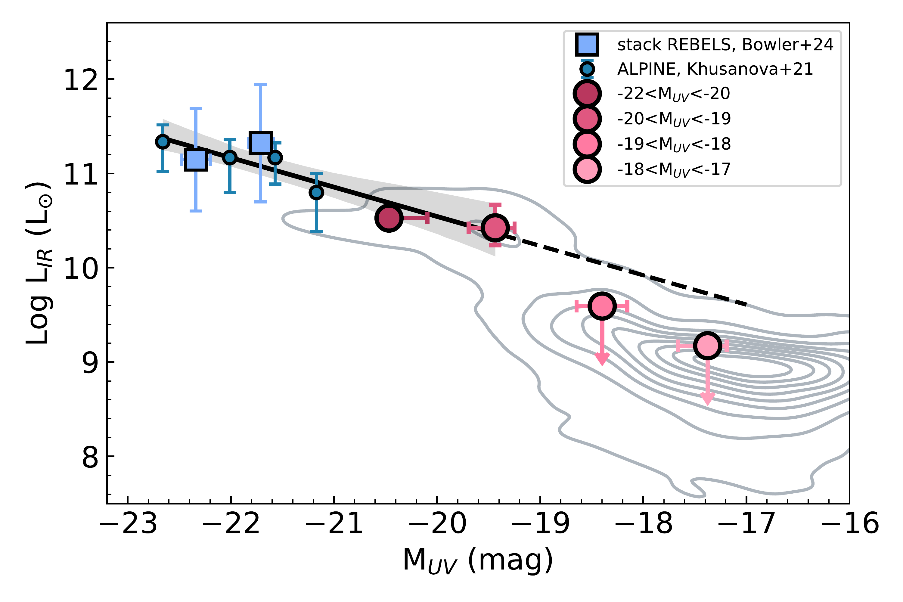
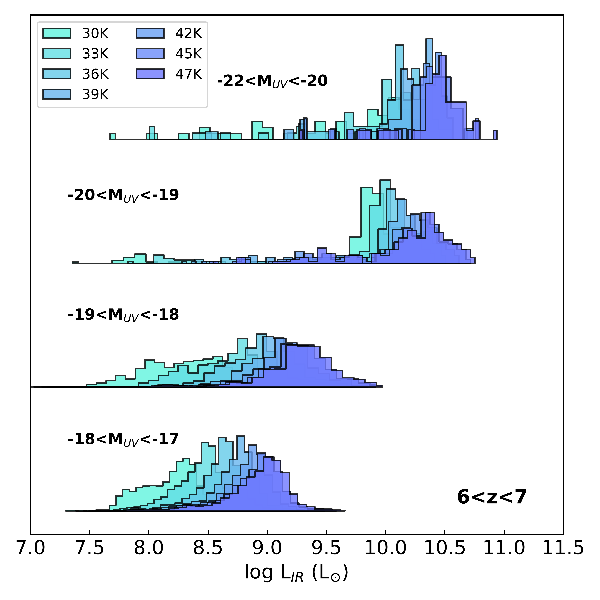
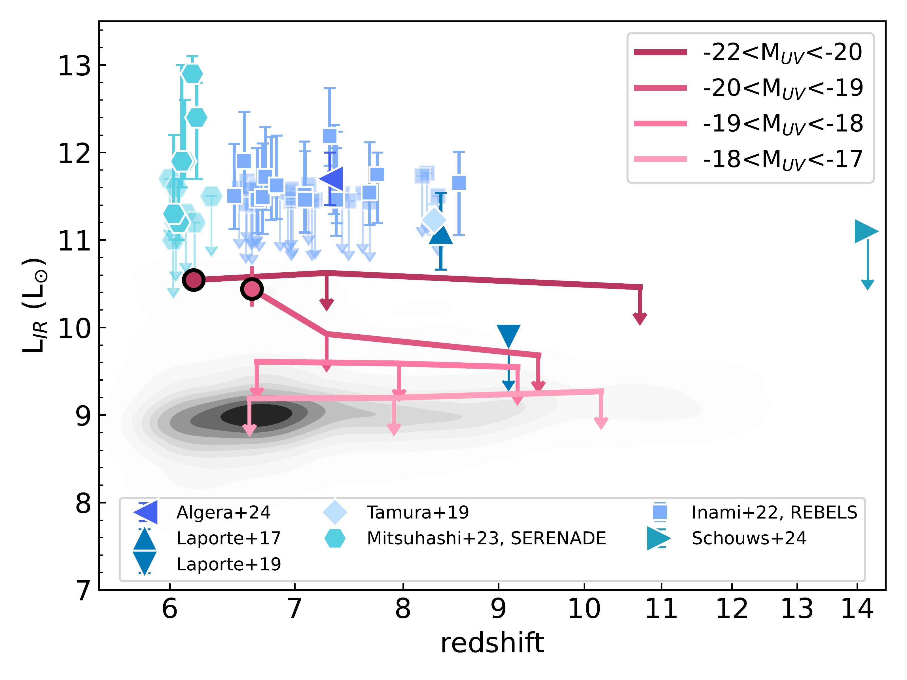

$\newcommand{\ensuremath}{}$
$\newcommand{\xspace}{}$
$\newcommand{\object}[1]{\texttt{#1}}$
$\newcommand{\farcs}{{.}''}$
$\newcommand{\farcm}{{.}'}$
$\newcommand{\arcsec}{''}$
$\newcommand{\arcmin}{'}$
$\newcommand{\ion}[2]{#1#2}$
$\newcommand{\textsc}[1]{\textrm{#1}}$
$\newcommand{\hl}[1]{\textrm{#1}}$
$\newcommand{\footnote}[1]{}$
$\newcommand{\tabularfootnotes}{$
$   \setcounter{savedfootnote}{\value{footnote}}$
$   \setcounter{footnote}{0}$
$   \newcommand{\thefootnote}{\textit{\arabic{footnote}}}$
$}$
$\newcommand{\restorefootnotes}{$
$   \setcounter{footnote}{\value{savedfootnote}}$
$   \newcommand{\thefootnote}{\arabic{footnote}}$
$}$
$\newcommand{\arraystretch}{1.5}$
$\newcommand{\epsilon}{\varepsilon}$
$\newcommand{\thefootnote}{\textit{\arabic{footnote}}}$
$\newcommand{\thefootnote}{\arabic{footnote}}$
$\newcommand\cigale{{{\sc cigale}}}$
$\newcommand\microns{{ \mum}}$
$\newcommand\HI{{H{\sc i}}}$
$\newcommand\HInewcommand{{H{\sc i}-newcommand}}$

# Dust emission from the bulk of galaxies at the Epoch of Reionization

<mark>Appeared on: 2024-12-04</mark> -  _Submitted to A&A_

L. Ciesla, et al. -- incl., <mark>E. Schinnerer</mark>

**Abstract:** The excess of UV bright galaxies observed at $z>10$ has been one of the major surprises from the JWST early observations.Several explanations have been proposed to understand the mild change in space density of the UV bright galaxies at these high redshifts, among them an evolution of dust attenuation properties in galaxies.However, our view of dust in primordial galaxies is limited towards a few tens of $z\sim7$ galaxies, pre-selected from UV-optical observations, and are thus not necessarily representative of the bulk of the sources at these redshifts.In this work, we aim at constraining the dust properties of galaxies at $6<z<12$ by making the most of the A $^3$ COSMOS database in the JADES/GOODS-South field.We stacked ALMA band 6 and 7 observations of 4464 JADES galaxies covered by the A $^3$ COSMOS database and used the measurements as constraints to perform UV-to-FIR SED modelling.We obtain tentative signals for the brightest UV galaxies ( $M_{\mathrm{UV}}<-19$ mag) as well as for the most massive ones ( $\log M_\star/M_\odot>9$ ) at $6<z<7$ , and upper limits for fainter ( $M_{\mathrm{UV}}>-19$ mag), lower mass sources ( $\log M_\star/M_\odot<9$ ), and at higher redshift ( $z>7$ ).Fitting these $6<z<7$ galaxies with ALMA constraints results in lower star formation rates ( $-0.4$ dex) and FUV attenuation ( $-0.5$ mag) for galaxies with $\log M_\star/M_\odot>8$ , compared to the fit without FIR.We extend the $L_{\mathrm{IR}}$ vs $M_{\mathrm{UV}}$ relation down to $M_{\mathrm{UV}}=-19$ mag and show a tentative breakdown of the relation at fainter UV magnitudes.The positions of the JADES $z\sim6.5$ sample on the infrared excess (IRX) versus $\beta$ and IRX versus $M_\star$ diagrams are consistent with those of the ALPINE ( $z\sim5.5$ ) and REBELS ( $z\sim6.5$ ) samples, suggesting that the dust composition and content of our mass-selected sample are similar to these UV-selected galaxies.Extending our analysis of the infrared properties to $z>7$ galaxies, we find a non-evolution of $\beta$ in the $M_{\mathrm{UV}}$ range probed by our sample (-17.24 $^{+0.54}_{-0.62}$ ) and highlight the fact that samples from the literature are not representative of the bulk of galaxy populations at $z>6$ .We confirm a linear relation between A $_{\rm V}$ and sSFR $^{-1}$ with a flatter slope than previously reported due to the use of ALMA constraints.Our results suggest that rapid and significant dust production has already happened by $z\sim7$ .

**Figure 4. -**  Infrared luminosity as a function of UV magnitude. The contours show the position of the whole sample with $L_{\mathrm{IR}}$ obtained from the fit using the ALMA constraint. Big circles with black borders are the weighted median values in four UV magnitude bins. Stacked or median values for samples from the literature are show in various shades of blue symbols \citep{Bowler24,Khusanova21}.  (*fig:lir_muv*)

**Figure 7. -** $L_{\mathrm{IR}}$ distributions of galaxies in the four UV magnitude bins considered in this work, assuming different dust temperatures. (*fig:lir_muv_lowT*)

**Figure 10. -**  IR luminosity as a function of redshift for our sample (black contours, downward arrows indicate upper limits) and different samples from the literature \citep[shades of blue,][]{Laporte17,Laporte19,Tamura19,Inami22,Mitsuhashi24,Schouws24}. Symbols with downward arrows are upper limits. Circles with black border are our fiducial UV magnitude bins. (*fig:lirz*)

