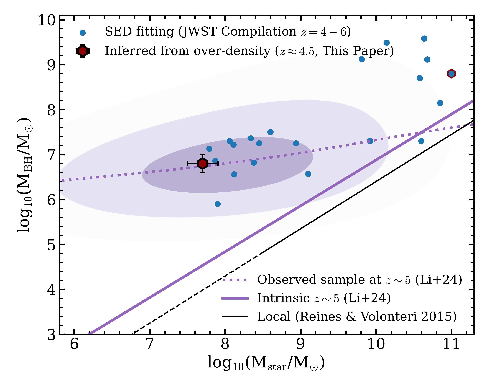
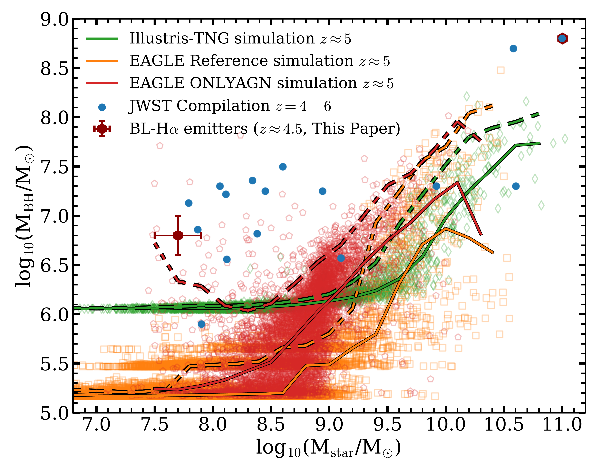
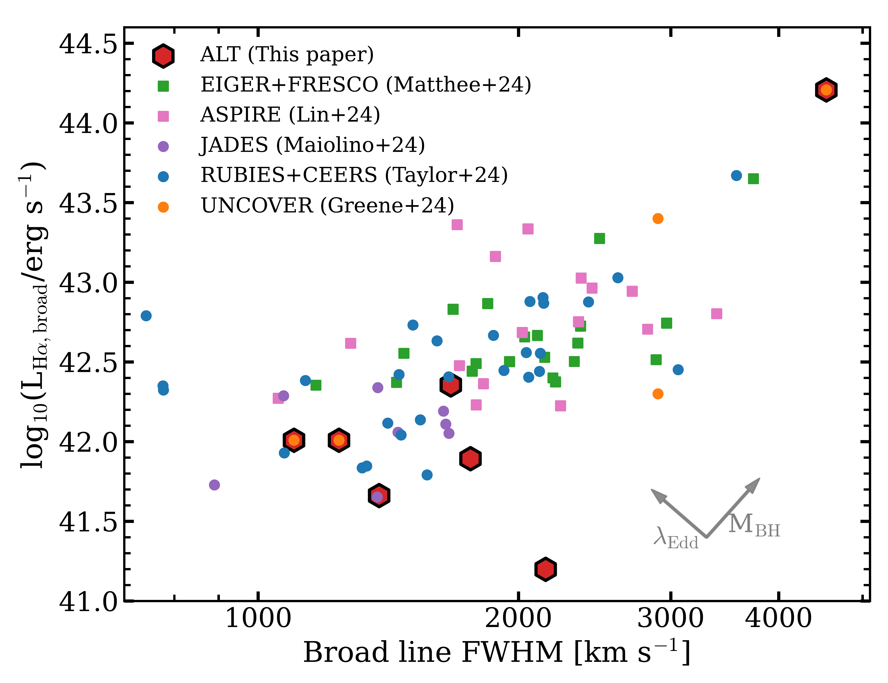

$\newcommand{\ensuremath}{}$
$\newcommand{\xspace}{}$
$\newcommand{\object}[1]{\texttt{#1}}$
$\newcommand{\farcs}{{.}''}$
$\newcommand{\farcm}{{.}'}$
$\newcommand{\arcsec}{''}$
$\newcommand{\arcmin}{'}$
$\newcommand{\ion}[2]{#1#2}$
$\newcommand{\textsc}[1]{\textrm{#1}}$
$\newcommand{\hl}[1]{\textrm{#1}}$
$\newcommand{\footnote}[1]{}$

# Environmental Evidence for Overly Massive Black Holes in Low Mass Galaxies and a Black Hole - Halo Mass Relation at $z\sim5$

<mark>Appeared on: 2024-12-05</mark> -  _19 pages, 15 figures. Submitted to ApJ. Main results in Figures 12, 13, 14. Comments welcome_

J. Matthee, et al. -- incl., <mark>A. d. Graaff</mark>

**Abstract:** $\it$ JWST observations have unveiled faint active galactic nuclei (AGN) at high-redshift that provide insights on the formation of supermassive black holes (SMBHs) and their coevolution with galaxies. However, disentangling stellar from AGN light in these sources is challenging. Here, we use an empirical approach to infer the average stellar mass of 6 faint broad line (BL) H $\alpha$ emitters at $z=4-5$ with BH masses $\approx6  (4-15)\times10^6$ M $_{\odot}$ , with a method independent of their spectral energy distribution (SED). We use the deep $_ JWST_$ /NIRcam grism survey ALT to measure the over-densities around BL-H $\alpha$ emitters and around a spectroscopic reference sample of $\sim300$ galaxies. In our reference sample, we find that Mpc-scale over-density correlates with stellar mass, while pair counts are flat below $\approx50$ kpc due to satellites. Their large-scale environments suggest that BL-H $\alpha$ emitters are hosted by galaxies with stellar masses $\approx5\times10^7$ M $_{\odot}$ , $\approx40$ times lower than those inferred from galaxy-only SED fits. Adding measurements around more luminous $z\approx6$ AGNs, we find tentative correlations between line width, BH mass and the over-density, suggestive of a steep BH to halo mass relation. The main implications are (1) when BH masses are taken at face value, we confirm extremely high BH to stellar mass ratios of $\approx10$ \% , (2) the low stellar mass galaxies hosting growing SMBHs are in tension with typical hydrodynamical simulations, except those without feedback, (3) a 1 \% duty cycle implied by the host mass hints at super-Eddington accretion, which may imply over-estimated SMBH masses, (4) the masses are at odds with a high stellar density interpretation of the line broadening, (5) our results imply a diversity of galaxy masses, environments and SEDs among AGN samples, depending on their luminosity.

**Figure 10. -** The relation between the stellar mass and SMBH mass for our BL-H$\alpha$ emitter sample (dark red hexagon, where stellar mass is indirectly inferred from their environments), a _ JWST_ literature compilation at $z\approx4-6$(blue points; where stellar mass is inferred from SED fitting, from  ([Carnall, McLure and Dunlop 2023](), [Maiolino, Scholtz and Curtis-Lake 2023](), [Harikane, Zhang and Nakajima 2023](), [Yue, Eilers and Simcoe 2024](), [Kokorev, Chisholm and Endsley 2024](), [Onoue, Ding and Silverman 2024]()) ). We highlight the luminous ALT-66543 (Labbe et al in prep) also with a red hexagon. For reference, we show the local relation measured by [Reines and Volonteri (2015)]() in black (showing the extrapolated range with a dashed line). The luminosity-bias corrected fit to _ JWST_ data from [Li, Silverman and Shen (2024)]() is shown in purple, purple contours show the expected observed distribution from this modeling work.  (*fig:Mstar_MBH*)

**Figure 12. -** The relation between the stellar mass and supermassive black hole mass at $z\approx5$, comparing measurements at $z\approx5$(dark red and blue points from data as in Fig. $\ref{fig:Mstar_MBH}$) with the 100 cMpc box EAGLE ( ([Schaye, Crain and Bower 2015](), [Crain, Schaye and Bower 2015]()) ) and Illustris-TNG ( ([Weinberger, Springel and Hernquist 2017](), [Pillepich, Springel and Nelson 2018]()) ) hydrodynamical simulations (orange and green, respectively). Red shows an EAGLE model without stellar feedback (ONLYAGN; with a 50 cMpc box size). Data-points show individual galaxies. Solid lines show the running median. Dashed lines show the running 95th percentile (where we note the low and high mass ends are impacted by low number statistics). The seed SMBH masses are $\approx10^5$ M$_{\odot}$ and $\approx10^6$ M$_{\odot}$ in EAGLE and Illustris-TNG, respectively. (*fig:Mstar_MBH_sims*)

**Figure 1. -** Compilation of H$\alpha$ broad lines measured with _ JWST_ at $z=4-6$ from NIRCam Grism (red hexagons this paper; green squares EIGER \& FRESCO and ASPIRE in pink) and NIRspec (points, purple JADES, RUBIES and CEERS in blue and UNCOVER in orange) spectroscopy. We highlight how the H$\alpha$ luminosity and width change with SMBH mass and Eddington ratio under the commonly adopted calibrations used. Three of the ALT sources are also in the UNCOVER sample.  (*fig:lha_fwhm*)

