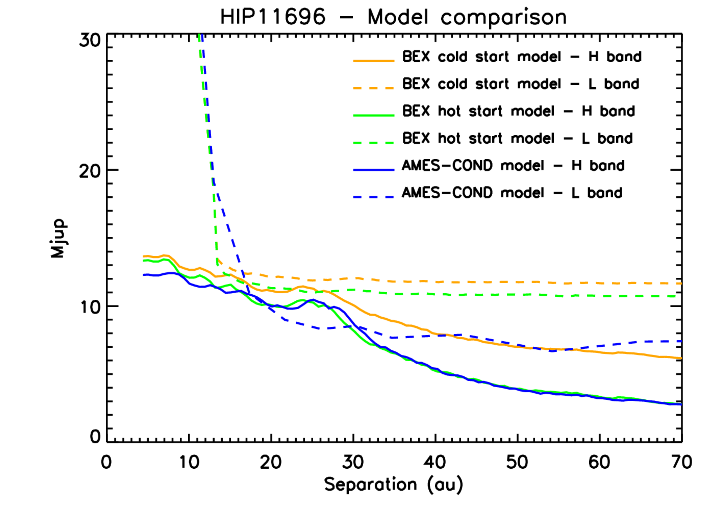
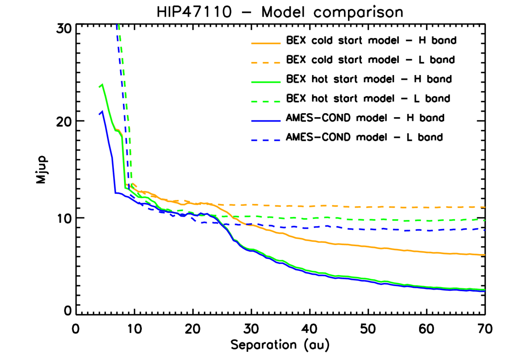
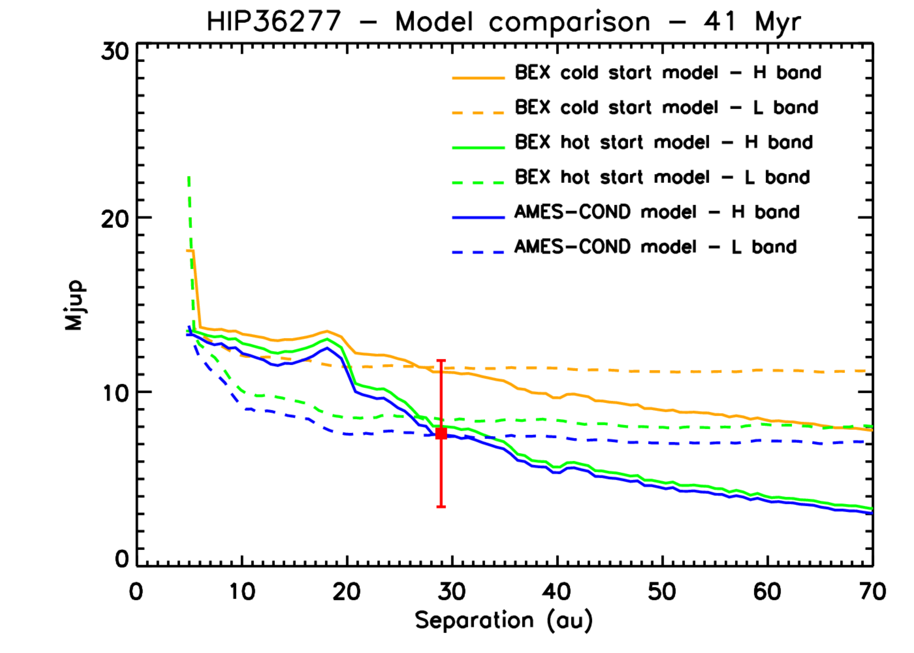
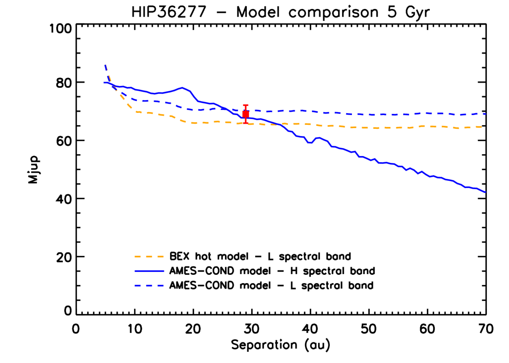
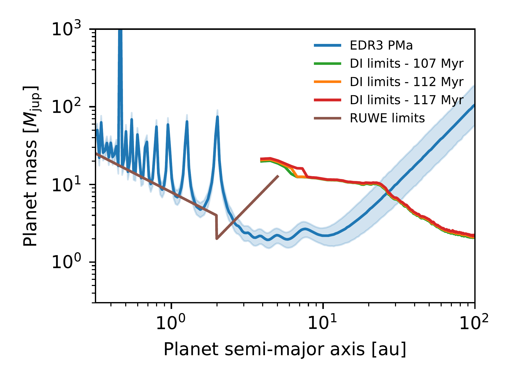
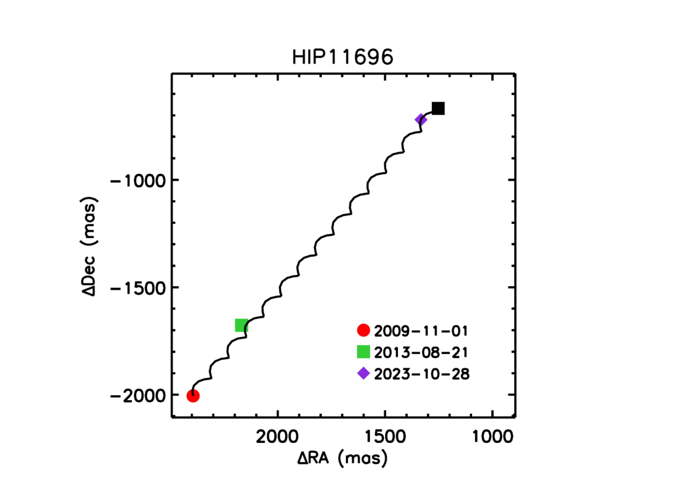

$\newcommand{\ensuremath}{}$
$\newcommand{\xspace}{}$
$\newcommand{\object}[1]{\texttt{#1}}$
$\newcommand{\farcs}{{.}''}$
$\newcommand{\farcm}{{.}'}$
$\newcommand{\arcsec}{''}$
$\newcommand{\arcmin}{'}$
$\newcommand{\ion}[2]{#1#2}$
$\newcommand{\textsc}[1]{\textrm{#1}}$
$\newcommand{\hl}[1]{\textrm{#1}}$
$\newcommand{\footnote}[1]{}$
$\newcommand{\MJup}{M_{\mathrm{Jup}}\xspace}$
$\newcommand{\RJup}{R_{\mathrm{Jup}}}$
$\newcommand{\RSun}{R_{\odot} }$
$\newcommand{\MSun}{M_{\odot} }$
$\newcommand{\LSun}{L_{\odot} }$
$\newcommand{\teff}{T_{e\!f\!f} }$
$\newcommand{\MEarth}{M_{\oplus} }$
$\newcommand{\REarth}{R_{\oplus} }$
$\newcommand{\logg}{log~\emph{g} }$
$\newcommand{\mic}{\mum }$
$\newcommand{\as}{\hbox{^{\prime\prime}} }$
$\newcommand{\thebibliography}{\DeclareRobustCommand{\VAN}[3]{##3}\VANthebibliography}$

# Deep imaging of three accelerating stars using SHARK-NIR and LMIRCam at LBT

<mark>Appeared on: 2024-12-06</mark> -  _12 pages, 9 figures, accepted for publication on MNRAS_

D. Mesa, et al. -- incl., <mark>T. Henning</mark>

**Abstract:** The combination of detection techniques enhances our ability to identify companions orbiting nearby stars. We employed high-contrast imaging to constrain mass and separation of possible companions responsible for the significant proper motion anomalies of the nearby stars HIP 11696, HIP 47110 and HIP 36277. These targets were observed using the LBT’s high-contrast camera, SHARK-NIR, in H-band using a Gaussian coronagraph, and with the LMIRCam instrument in the L’-band and using a vAPP coronagraph. Both observations were conducted simultaneously. Additionally, constraints at short separations from the host star are derived analyzing the renormalized unit weight error (RUWE) values from the Gaia catalogue. We find that the companion responsible for the anomaly signal of HIP 11696 is likely positioned at a distance from 2.5 to 28 astronomical units from its host. Its mass is estimated to be between 4 and 16 Jupiter masses, with the greater mass possible only at the upper end of the separation range. Similar limits were obtained for HIP 47110 where the companion should residebetween 3 and  30 au with a mass between 3 and 10 MJup. For HIP 36277, we identified a faint stellar companion at large separation, though it might be substellar depending on the assumed age for the star. Considering the older age, this object accounts for the absolute value of the PMa vector but not for its direction. Additionally, we found a substellar candidate companion at a closer separation that could explain the PMa signal, considering a younger age for the system.

**Figure 9. -** Comparison of mass limits for HIP 11696 (upper left panel), HIP 47110 (upper right panel) and HIP 36277 (bottom panels) assuming different atmospheric models both for the H (solid lines) and the L (dashed lines) spectral band. For the case of HIP 36277 we considered both the younger age of 41 Myr (bottom left panel) and the older age of $\sim$5 Gyr (bottom right panel). In the latter case, as detailed in the text we could use just a lower number of models. For HIP 36277 we also included the calculated position for the inner faint candidate companion represented by a red square. (*f:modelhip11696*)

**Figure 3. -** Comparison of the plot of mass limits as a function of the separation from the host star to explain the PMa measurement at the Gaia eDR3 epoch (blue lines) for HIP 47110 with the limits in mass obtained from the SHARK-NIR observations and the AMES-COND atmospheric models (orange solid line). The green and the red solid lines represent the mass limits obtained using the minimum and the maximum ages for the star, respectively. Finally, the brown solid line displays the mass limit at a short separation from the star that can be deduced from considerations of the RUWE value. (*f:pmahip47110*)

**Figure 1. -** Relative astrometric position for the candidate companion detected around HIP 11696. The red circle represents the relative position of the object at the NIRC2/KeckII observation epoch, while the green square represents the relative position of the candidate companion at the NIRI observation epoch. Finally, the violet diamond represents the relative position at the epoch of the LBT observation. The error bars on the positions at all epochs are not visible in this plot because of their small dimensions. The solid black line represents the expected relative movement for a background object. The black square is the expected position for a background object at the epoch of the SHARK-NIR and LMIRCam observation. (*f:astrohip11696*)

