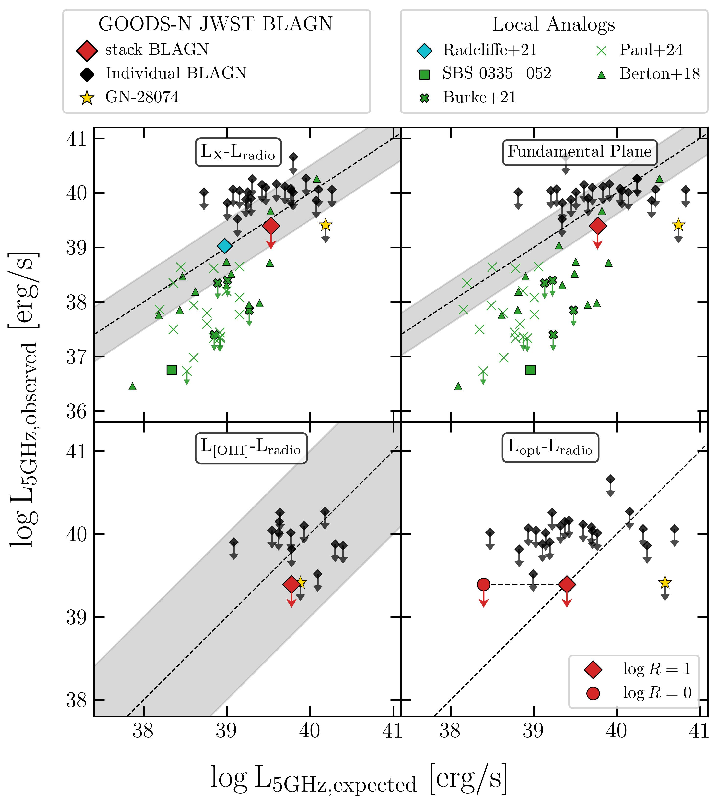
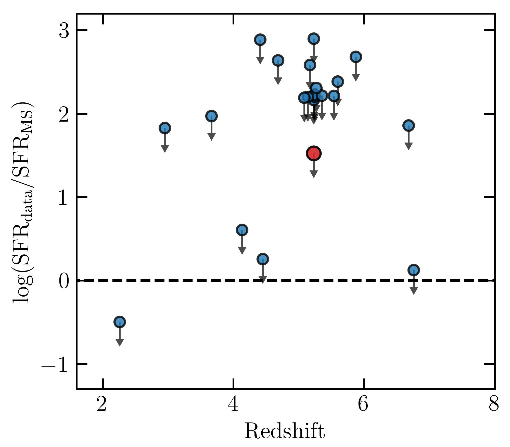
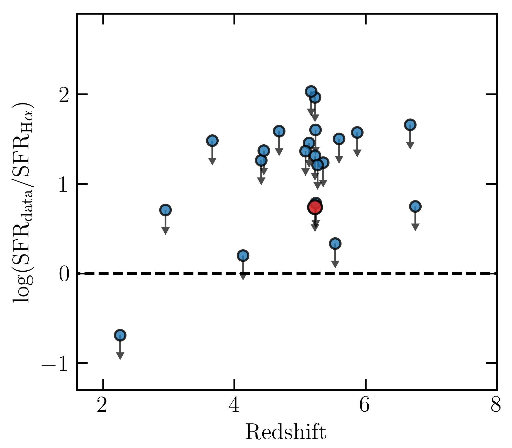

$\newcommand{\ensuremath}{}$
$\newcommand{\xspace}{}$
$\newcommand{\object}[1]{\texttt{#1}}$
$\newcommand{\farcs}{{.}''}$
$\newcommand{\farcm}{{.}'}$
$\newcommand{\arcsec}{''}$
$\newcommand{\arcmin}{'}$
$\newcommand{\ion}[2]{#1#2}$
$\newcommand{\textsc}[1]{\textrm{#1}}$
$\newcommand{\hl}[1]{\textrm{#1}}$
$\newcommand{\footnote}[1]{}$
$\newcommand{\HII}{H {\sc ii}\rm }$
$\newcommand{\NII}{{[N {\sc ii}] }}$
$\newcommand{\NIIs}{{[N {\sc ii}] }}$
$\newcommand{\NVs}{{[N {\sc v}] }}$
$\newcommand{\NIVl}{{N {\sc iv}] \lambda}}$
$\newcommand{\NIVll}{{N {\sc iv}] \lambda\lambda}}$
$\newcommand{\NVl}{{N {\sc v} \lambda}}$
$\newcommand{\NIIl}{{[N {\sc ii}] \lambda}}$
$\newcommand{\NIIll}{{[N {\sc ii}] \lambda\lambda}}$
$\newcommand{\NeIII}{{[Ne {\sc iii} ]}}$
$\newcommand{\NeIIIs}{{[Ne {\sc iii}] }}$
$\newcommand{\NeIIIl}{{[Ne {\sc iii}] \lambda}}$
$\newcommand{\NeIV}{{[Ne {\sc iv}] }}$
$\newcommand{\NeIVs}{{[Ne {\sc iv}] }}$
$\newcommand{\NeIVl}{{[Ne {\sc iv}] \lambda}}$
$\newcommand{\NeIVll}{{[Ne {\sc iv}] \lambda\lambda}}$
$\newcommand{\NeV}{{[Ne {\sc v}] }}$
$\newcommand{\NeVs}{{[Ne {\sc v}] }}$
$\newcommand{\NeVl}{{[Ne {\sc v}] \lambda}}$
$\newcommand{\SII}{{[S {\sc ii}] }}$
$\newcommand{\SIIs}{{[S {\sc ii}] }}$
$\newcommand{\SIIl}{{[S {\sc ii}] \lambda}}$
$\newcommand{\SIIll}{{[S {\sc ii}] \lambda\lambda}}$
$\newcommand{\SIII}{{[S {\sc iii}] }}$
$\newcommand{\SIIIs}{{[S {\sc iii}] }}$
$\newcommand{\SIIIl}{{[S {\sc iii}] \lambda}}$
$\newcommand{\OIII}{{[O {\sc iii}] }}$
$\newcommand{\OIIIs}{{[O {\sc iii}] }}$
$\newcommand{\OIIIsf}{{O {\sc iii}] }}$
$\newcommand{\OIIIl}{{[O {\sc iii}] \lambda}}$
$\newcommand{\OIIIll}{{[O {\sc iii}] \lambda\lambda}}$
$\newcommand{\OII}{{[O {\sc ii}] }}$
$\newcommand{\OIIs}{{[O {\sc ii}] }}$
$\newcommand{\OIIl}{{[O {\sc ii}] \lambda}}$
$\newcommand{\OIIll}{{[O {\sc ii}] \lambda\lambda}}$
$\newcommand{\OI}{{[O {\sc i}] }}$
$\newcommand{\OIs}{{[O {\sc i}] }}$
$\newcommand{\OIl}{{[O {\sc i}] \lambda}}$
$\newcommand{\CII}{{[C {\sc ii}] }}$
$\newcommand{\CIIs}{{C {\sc ii}] }}$
$\newcommand{\CIII}{{C {\sc iii}] }}$
$\newcommand{\CIIIs}{{C {\sc iii}] }}$
$\newcommand{\CIIIll}{\CIIIs\lambda\lambda}$
$\newcommand{\CIV}{{C {\sc iv} }}$
$\newcommand{\CIVs}{{C {\sc iv} }}$
$\newcommand{\CIVll}{{C {\sc iv} \lambda\lambda}\xspace}$
$\newcommand{\CIVl}{{[C {\sc iv} \lambda}\xspace}$
$\newcommand{\HeII}{{He {\sc ii} }}$
$\newcommand{\HeIIl}{{He {\sc ii} \lambda}}$
$\newcommand{\FeII}{{[Fe {\sc ii}] }}$
$\newcommand{\Ha}{H\alpha }$
$\newcommand{\Has}{H\alpha }$
$\newcommand{\Hb}{H\beta }$
$\newcommand{\Hbs}{H\beta }$
$\newcommand{\Hg}{H\gamma }$
$\newcommand{\Lya}{Ly\alpha }$
$\newcommand{\gm}[1]{{\color{black}{\bf[GM: #1]}}}$
$\newcommand{\RMcomm}[1]{{\color{teal}[RM: #1]}}$

# The radio properties of the JWST-discovered AGN

<mark>Appeared on: 2024-12-06</mark> -  _Submitted to A&A, comments are welcome_

G. Mazzolari, et al. -- incl., <mark>S. Belladitta</mark>

**Abstract:** The _James Webb Space Telescope_ (JWST) has discovered a large population of Active Galactic Nuclei (AGN) in the early Universe. A large fraction of these AGN revealed a significant lack of X-ray emission, with observed X-ray luminosity upper limits 2-3 dex lower than expected.  We explore the radio emission of these AGN, focusing on the JWST-selected Broad Line AGN (BLAGN, or type 1) in the GOODS-N field, one of the fields with the best combination of deep radio observations and statistics of JWST-selected, spectroscopically confirmed BLAGN. We use deep radio data at different frequencies (144 MHz, 1.5 GHz, 3 GHz, 5.5 GHz, 10 GHz), and we find that none of the 22 sources investigated is detected at any of the aforementioned frequencies.  Similarly, the radio stacking analysis does not reveal any detection down to an rms of $\sim 0.2\mu$ Jy beam $^{-1}$ , corresponding to a $3\sigma$ upper limit at rest frame 5 GHz of $L_{5GHz}=2\times10^{39}$ erg s $^{-1}$ at the mean redshift of the sample $z\sim 5.2$ . We compared this and individual sources upper limits with expected radio luminosities estimated assuming different AGN scaling relations. For most of the sources the radio luminosity upper limits are still compatible with expectations for radio-quiet (RQ) AGN; nevertheless, the more stringent stacking upper limits and the fact that no detection is found would suggest that JWST-selected BLAGN are weaker than standard AGN even at radio frequencies.  We discuss some scenarios that could explain the possible radio weakness, such as free-free absorption from a dense medium, or the lack of either magnetic field or a corona, possibly as a consequence of super-Eddington accretion. These scenarios would also explain the observed X-ray weakness. We also conclude that $\sim$ 1 dex more sensitive radio observations are needed to better constrain the level of radio emission (or lack thereof) for the bulk of these sources. The Square Kilometer Array Observatory (SKAO) will likely play a crucial role in assessing the properties of this AGN population.

**Figure 7. -** Observed rest-frame 5GHz radio luminosity versus expected rest-frame 5GHz radio luminosity of different samples of high-z and local BLAGN according to the four RQ AGN relations described in Sect. \ref{sec:Lradexp}. The black data points represent the JWST-detected BLAGN analyzed in this work, the red diamond their stack, the gold star the BLAGN GN-28074 reported in [Juod\vzbalis, Ji and Maiolino (2024)](). The green symbols indicate sources from different local analog samples. The green square represents the position of SBS 0355-052  ([Hatano, Ouchi and Nakajima 2023](), [Johnson, Hunt and Reines 2009]()) , the thick crosses represent the metal-poor dwarf BLAGN reported in [Burke, et. al (2021)](), the thin crosses the X-ray weak BLAGN reported in [Paul, Plotkin and Brandt (2024)](), the filled triangles the radio detected and RQ NLS1 reported in [Berton, Congiu and Järvelä (2018)](). The light blue data point in the top-left panel represents the stack of the X-ray selected but radio undetected AGN on the GOODS-N field performed by [Radcliffe, Barthel and Garrett (2021)](). The red diamond and the black data points in the bottom-right panel, are computed considering $\log R=1$, while the red circle indicate the expected radio luminosity assuming $\log R=0$. The gray shaded areas represent the scatter of the relations, while the black dashed line is the 1:1 relation. (*fig:RQ_panel*)

**Figure 2. -** Ratio between the SFR derived from the radio luminosity upper limits and the SFR derived assuming the MS of [Popesso, Concas and Cresci (2023)](). The red data point corresponds to the value of the stack. The black dashed line traces the threshold below which the $SFR_{MS}$ becomes incompatible with the radio undetection. (*fig:SFR_MS*)

**Figure 4. -** Ratio between the SFR derived from the radio luminosity upper limits and the SFR derived assuming the whole $\Ha$ emission (narrow+broad) to be due to SF. The red data point corresponds to the value of the stack. The black dashed line traces the threshold below which the $SFR_{H\alpha}$ becomes incompatible with the radio undetection. (*fig:SFR_Ha*)

