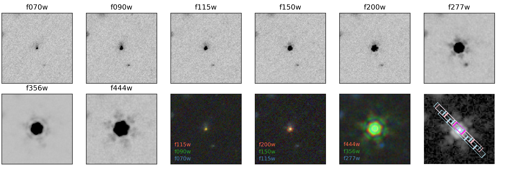
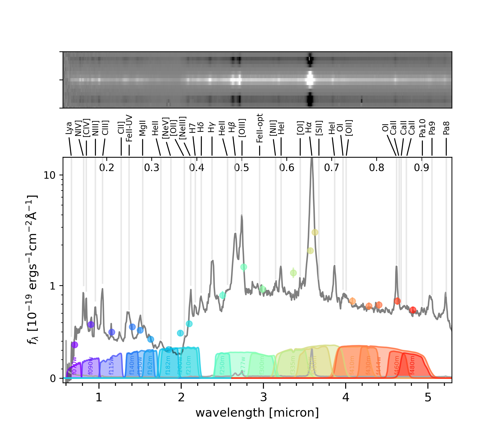

$\newcommand{\ensuremath}{}$
$\newcommand{\xspace}{}$
$\newcommand{\object}[1]{\texttt{#1}}$
$\newcommand{\farcs}{{.}''}$
$\newcommand{\farcm}{{.}'}$
$\newcommand{\arcsec}{''}$
$\newcommand{\arcmin}{'}$
$\newcommand{\ion}[2]{#1#2}$
$\newcommand{\textsc}[1]{\textrm{#1}}$
$\newcommand{\hl}[1]{\textrm{#1}}$
$\newcommand{\footnote}[1]{}$
$\newcommand{\angstrom}{\text{ \normalfontÅ}\xspace}$
$\newcommand{\deltare}{\mathrm{\Delta log(r_e)}}$
$\newcommand{\oiii}{[\ion{O}{3}]\xspace}$
$\newcommand{\nii}{[\ion{N}{2}]\xspace}$
$\newcommand{\niilam}{[\ion{N}{2}]\lambda6549,6585\xspace}$
$\newcommand{\feii}{\ion{Fe}{2}\xspace}$
$\newcommand{\nev}{[\ion{Ne}{5}]\xspace}$
$\newcommand{\msun}{M_{\odot}}$
$\newcommand{\sersic}{Sérsic}$
$\newcommand{\mkgroup}{M_{\rm K,  group}}$
$\newcommand{\mstar}{M_*}$
$\newcommand{\mbh}{M_{\rm BH}}$
$\newcommand{\lbol}{L_{\rm bol}}$
$\newcommand{\jwst}{\ensuremath{JWST}}$
$\newcommand{\ivo}[1]{\textcolor{violet}{#1}}$
$\newcommand{\lt}{\textcolor{magenta!60!black}}$
$\newcommand{\catnr}{50,000}$
$\newcommand{\bronzenr}{40}$
$\newcommand{\silvernr}{26}$
$\newcommand{\goldnr}{17}$
$\newcommand{\sourcenum}{17\xspace}$
$\newcommand{\source}{A2744-45924\xspace}$
$\newcommand{\hide}[1]$
$\newcommand{\jw}{\emph{JWST}}$
$\newcommand{\angstrom}{\text{ \normalfontÅ}\xspace}$
$\newcommand{\deltare}{\mathrm{\Delta log(r_e)}}$
$\newcommand{\oiii}{[\ion{O}{3}]\xspace}$
$\newcommand{\nii}{[\ion{N}{2}]\xspace}$
$\newcommand{\niilam}{[\ion{N}{2}]\lambda6549,6585\xspace}$
$\newcommand{\feii}{\ion{Fe}{2}\xspace}$
$\newcommand{\nev}{[\ion{Ne}{5}]\xspace}$
$\newcommand{\msun}{M_{\odot}}$
$\newcommand{\sersic}{Sérsic}$
$\newcommand{\mkgroup}{M_{\rm K,  group}}$
$\newcommand{\mstar}{M_*}$
$\newcommand{\mbh}{M_{\rm BH}}$
$\newcommand{\lbol}{L_{\rm bol}}$
$\newcommand{\jwst}{\ensuremath{JWST}}$
$\newcommand{\ivo}[1]{\textcolor{violet}{#1}}$
$\newcommand{\lt}{\textcolor{magenta!60!black}}$
$\newcommand{\catnr}{50,000}$
$\newcommand{\bronzenr}{40}$
$\newcommand{\silvernr}{26}$
$\newcommand{\goldnr}{17}$
$\newcommand{\sourcenum}{17\xspace}$
$\newcommand{\source}{A2744-45924\xspace}$
$\newcommand{\hide}[1]$
$\newcommand{\jw}{\emph{JWST}}$
$\newcommand{\halpha}{\ensuremath{\mathrm{H}\alpha}\xspace}$
$\newcommand{\hbeta}{\ensuremath{\mathrm{H}\beta}\xspace}$
$\newcommand{\lya}{Ly\alpha}$
$\newcommand{\lyb}{Ly\beta}$
$\newcommand{\MgII}{Mg {\sc ii}\xspace}$
$\newcommand{\CIV}{C {\sc iv}\xspace}$
$\newcommand{\CIII}{C {\sc iii]}\xspace}$
$\newcommand{\FeII}{Fe {\sc ii}\xspace}$
$\newcommand{\NV}{N {\sc v}\xspace}$
$\newcommand{\HeII}{He {\sc ii}\xspace}$
$\newcommand{\MgIIwave}{Mg {\sc ii} \lambda2798}$
$\newcommand{\OIII}{[O {\sc iii}]}$
$\newcommand{\OII}{[O {\sc ii}]}$
$\newcommand{\NeIII}{[Ne {\sc iii}]}$
$\newcommand{\lgL}{\log \left({L_{\rm bol} \over{\rm erg s^{-1}}}\right)}$
$\newcommand{\halpha}{\ensuremath{\mathrm{H}\alpha}\xspace}$
$\newcommand{\hbeta}{\ensuremath{\mathrm{H}\beta}\xspace}$
$\newcommand{\lya}{Ly\alpha}$
$\newcommand{\lyb}{Ly\beta}$
$\newcommand{\MgII}{Mg {\sc ii}\xspace}$
$\newcommand{\CIV}{C {\sc iv}\xspace}$
$\newcommand{\CIII}{C {\sc iii]}\xspace}$
$\newcommand{\FeII}{Fe {\sc ii}\xspace}$
$\newcommand{\NV}{N {\sc v}\xspace}$
$\newcommand{\HeII}{He {\sc ii}\xspace}$
$\newcommand{\MgIIwave}{Mg {\sc ii} \lambda2798}$
$\newcommand{\OIII}{[O {\sc iii}]}$
$\newcommand{\OII}{[O {\sc ii}]}$
$\newcommand{\NeIII}{[Ne {\sc iii}]}$
$\newcommand{\lgL}{\log \left({L_{\rm bol} \over{\rm erg s^{-1}}}\right)}$

# An unambiguous AGN and a Balmer break in an Ultraluminous Little Red Dot at z=4.47 from Ultradeep UNCOVER and All the Little Things Spectroscopy

<mark>Appeared on: 2024-12-09</mark> -  _28 pages,10 figures, submitted to ApJ_

I. Labbe, et al. -- incl., <mark>A. d. Graaff</mark>

**Abstract:** We present a detailed exploration of the most optically-luminous Little Red Dot ( $L_{\mathrm{H}\alpha} = 10^{44}$ erg/s, $L_V=10^{45}$ erg/s, $\mathrm{F444W} = 22$ AB) discovered by JWST to date. Located in the $* UNCOVER*$ Abell 2744 field, source $\source$ was observed by NIRSpec/PRISM with ultradeep spectroscopy reaching $\langle \text{SNR} \rangle \sim 100   \text{pix}^{-1}$ , high-resolution $3-4$  $\micron$ NIRCam/Grism spectroscopy from the $* All the Little Things (ALT)*$ program, and multi-band NIRCam Medium Band imaging from $* Mega Science*$ . The NIRCam spectra reveal high rest-frame equivalent width $W_{\mathrm{H}\alpha,0,\mathrm{broad}} > 800$  $\angstrom$ , broad  H $\alpha$ emission ( $\mathrm{FWHM} \sim 4500$ km/s), on top of narrow, complex H $\alpha$ absorption. NIRSpec data show exceptionally strong rest-frame ultraviolet (UV) to near-infrared (NIR) $\ion{Fe}{2}$ emission ( $W_{\mathrm{FeII-UV},0} \sim 340$ Å), UV $\ion{N}{4}$ ]  $\lambda \lambda 1483, 1486$ and $\ion{N}{3}$ ]  $\lambda 1750$ , and broad NIR $\ion{O}{1}$ $\lambda8446$ emission. The line spectra unambiguously demonstrate a broad-line region (BLR) associated with a possible $M_{\mathrm{BH}} \sim 10^9 M_\odot$ supermassive black hole embedded in dense gas, which might explain the non-detection in ultradeep Chandra X-ray data ( $\gtrsim10\times$ underluminous relative to broad $L_{\halpha}$ ). Strong UV Nitrogen lines suggest supersolar N/O ratios due to rapid star formation or intense radiation fields near the AGN. The observed continuum shows a clear Balmer break at rest-frame $3650$ Å, which cannot be accounted for by power-law AGN alone. A stellar population model produces an excellent fit with a reddened Balmer break and would imply a massive ( $M_* \approx 8 \times 10^{10} M_{\odot}$ ), old $\sim 500$ Myr, compact stellar core, among the densest stellar systems known ( $\rho \approx 3 \times 10^6 M_{\odot}$ /pc $^2$ for $R_{e,\mathrm{optical}} = 70 \pm 10$ pc), and AGN emission lines with extreme intrinsic equivalent width $W_{\mathrm{H}\alpha,0} \gg 1000$  $\angstrom$ . However, although high $M_*$ and $M_{\mathrm{BH}}$ are supported by evidence of a galaxy overdensity containing 40 galaxies at $z=4.41-4.51$ , deep high-resolution spectroscopy is required to confirm stellar absorption and rule out that the Balmer break is instead caused by dense gas surrounding the AGN.

**Figure 19. -** Top: broadband NIRCam images of $\source$ in the short wavelength channel filters F070W, F090W, F115W, F150W, F200W at 20 mas pixel size and long wavelength channel filters F277W, F356W, F444W at 40 mas pixel size. The images are $3$\arcsec$$ on a side. North is up, East is left. Also shown are color composite images and an overlay of the micro-shutter array locations of the NIRSpec PRISM observations. Middle: the 2D NIRSpec/PRISM spectrum used for analysis. Bottom: observed NIRSpec/PRISM spectrum (black) and error array (grey). Positions of key spectroscopic features are indicated. Top axis is rest-frame wavelength in micron. (*fig:thedata*)

**Figure 23. -** Top: broadband NIRCam images of $\source$ in the short wavelength channel filters F070W, F090W, F115W, F150W, F200W at 20 mas pixel size and long wavelength channel filters F277W, F356W, F444W at 40 mas pixel size. The images are $3$\arcsec$$ on a side. North is up, East is left. Also shown are color composite images and an overlay of the micro-shutter array locations of the NIRSpec PRISM observations. Middle: the 2D NIRSpec/PRISM spectrum used for analysis. Bottom: observed NIRSpec/PRISM spectrum (black) and error array (grey). Positions of key spectroscopic features are indicated. Top axis is rest-frame wavelength in micron. (*fig:thedata*)

**Figure 21. -** Model fitting results using only AGN components (model I, top panels), only stellar components (model II, middle), and a mix of AGN and stars (model III, bottom). NIRSpec/PRISM observations (black), uncertainties (dotted), model fits (gray), and normalized residuals are shown. Model I consists of a dust-reddened AGN component (red) and a blue component (here parameterized as a fraction of dust-free scattered light; blue), which dominates at $<2 \micron$ despite being only a small percentage of the red luminosity. The model can produce an apparent sharp break at $\sim3500$Å due to a blend of strong broad emission lines and broad $\ion${Fe}{2} pseudo-continuum at $4000-5500Å$, but leaves significant residuals throughout the rest-frame optical. Model II consists of two FSPS population components, each velocity-broadened according to the stellar mass and effective radius at F300W and where the broad lines are stellar in origin. AGN specific lines are masked. Model III is a mix of AGN and a stellar component. This fit prefers an evolved stellar population to dominating the rest-frame optical to match the observed Balmer break, with significant contribution from AGN emission lines and $\ion${Fe}{2}. Between these models, model III is favored by the data.
 (*fig:agn_detailed_fit*)

