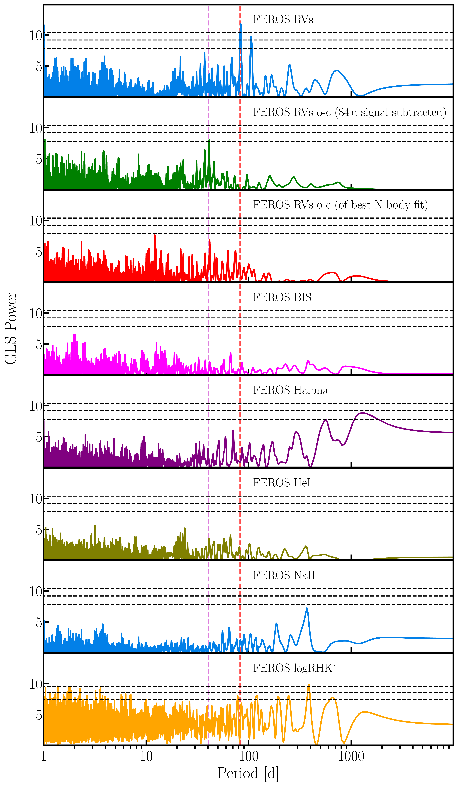
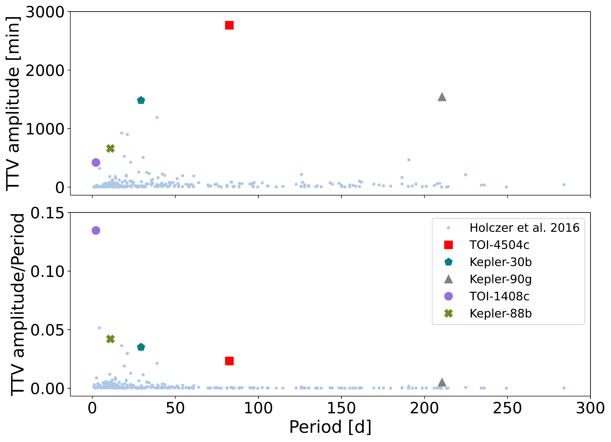
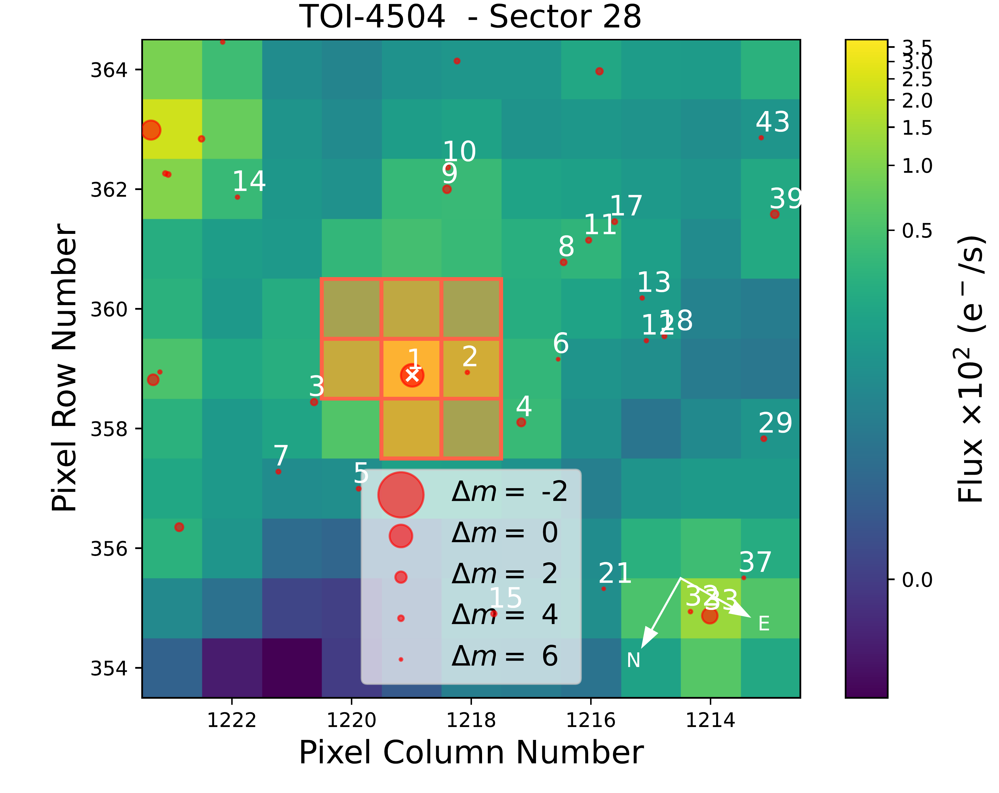

$\newcommand{\ensuremath}{}$
$\newcommand{\xspace}{}$
$\newcommand{\object}[1]{\texttt{#1}}$
$\newcommand{\farcs}{{.}''}$
$\newcommand{\farcm}{{.}'}$
$\newcommand{\arcsec}{''}$
$\newcommand{\arcmin}{'}$
$\newcommand{\ion}[2]{#1#2}$
$\newcommand{\textsc}[1]{\textrm{#1}}$
$\newcommand{\hl}[1]{\textrm{#1}}$
$\newcommand{\footnote}[1]{}$
$\newcommand{\vdag}{(v)^\dagger}$
$\newcommand$
$\newcommand$
$\newcommand{\autoref}$
$\newcommand{\thetable}{A\arabic{table}}$
$\newcommand{\thefigure}{A\arabic{figure}}$
$\newcommand{\equationautorefname}{Eq.}$
$\newcommand{\figureautorefname}{Fig.}$
$\newcommand{\sectionautorefname}{Sect.}$
$\newcommand{\subsectionautorefname}{Sect.}$
$\newcommand{\subsubsectionautorefname}{Sect.}$

# TOI-4504: Exceptionallylarge Transit Timing Variations \ induced by two resonant warm gas giants in a three planet system.

<mark>Appeared on: 2024-12-10</mark> -  _20 pages, 12 figures, accepted in ApJL_

M. Vítková, et al. -- incl., <mark>T. Henning</mark>, <mark>J. Eberhardt</mark>

**Abstract:** We present a joint analysis of TTVs and Doppler data for the transiting exoplanet system TOI-4504. TOI-4504 c is a warm Jupiter-mass planet that exhibits the largest known transit timing variations (TTVs), with a peak-to-node amplitude of $\sim$ 2 days, the largest value ever observed, and a super-period of $\sim$ 930 d. TOI-4504 b and c were identified in public TESS data, while the TTVs observed in TOI-4504 c, together with radial velocity (RV) data collected with FEROS, allowed us to uncover a third, non-transiting planet in this system, TOI-4504 d. We were able to detect transits of TOI-4504 b in the TESS data with a period of 2.4261 $\pm 0.0001$ days and derive a radius of 2.69 $\pm 0.19$ R $_{\oplus}$ . The RV scatter of TOI-4504 was too large to constrain the mass of TOI-4504 b, but the RV signals of TOI-4504 c \& d were sufficiently large to measure their masses. The TTV+RV dynamical model we apply confirms TOI-4504 c as a warm Jupiter planet with an osculating period of 82.54 $\pm 0.02$ d, mass of 3.77 $\pm 0.18$ M $_{\rm J}$ and a radius of 0.99 $\pm 0.05$ R $_{\rm J}$ , while the non-transiting planet TOI-4504 d, has an orbital period of 40.56 $\pm 0.04$ days and mass of 1.42 $_{-0.06}^{+0.07}$ M $_{\rm J}$ . We present the discovery of a system with three exoplanets: a hot sub-Neptune and two warm Jupiter planets. The gas giant pair is stable and likely locked in a first-order 2:1 mean-motion resonance (MMR). The TOI-4504 system is an important addition to MMR pairs, whose increasing occurrence supports a smooth migration into a resonant configuration during the protoplanetary disk phase.

**Figure 5. -** GLS power spectrum of FEROS spectroscopic products of TOI-4504. From top to bottom panels, as labeled, RVs used in this work, RV residuals after subtracting the dominant signal of TOI-4504 c at 84 d, the final the best-fit TTV+RV model residuals, BIS, $\rm{H}_{\alpha}$, He I  Na II, and $\log(R'_{HK})$ activity indicators, respectively. False alarm probability levels of 10\%, 1\%, and 0.1\% are marked with dashed lines, respectively. The red and magenta vertical lines indicate the best-fit periods of the transiting Jovian planet TOI-4504 c, and the non-transiting TOI-4504 d, respectively.  (*activity*)

**Figure 8. -** Position of TOI-4504 c, other planets with significant TTVs and planets from [Holczer, Mazeh and Nachmani (2016)]() in period-TTV amplitude and period-TTV amplitude and period ratio diagram. TTV amplitude is a peak-to-node amplitude of cosinus fit, for Kepler-90 g it is the maximum observed difference between the time lapsed between consecutive transits. (*holczer*)

**Figure 1. -** Target Pixel Files in Sector 28 for TOI-4504 obtained with {$\textsc$ tpfplotter}. The shape of the aperture mask used to extract the photometry is marked with orange. Red dots indicate the sources of the Gaia DR3 catalogue in the field. TOI-4504 is marked with a white cross. (*TPF*)

