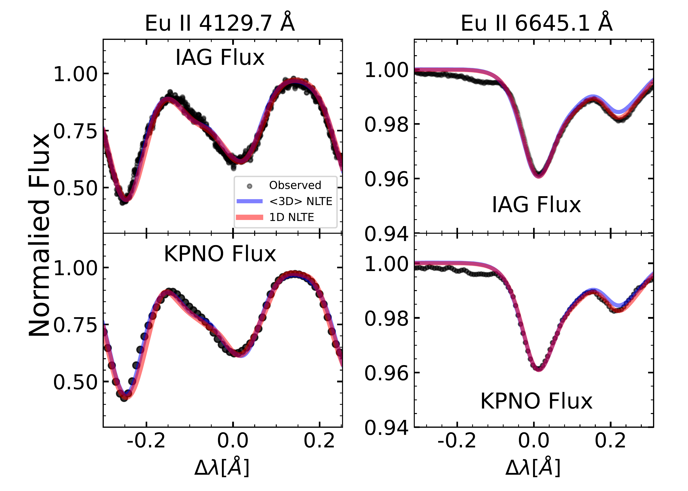
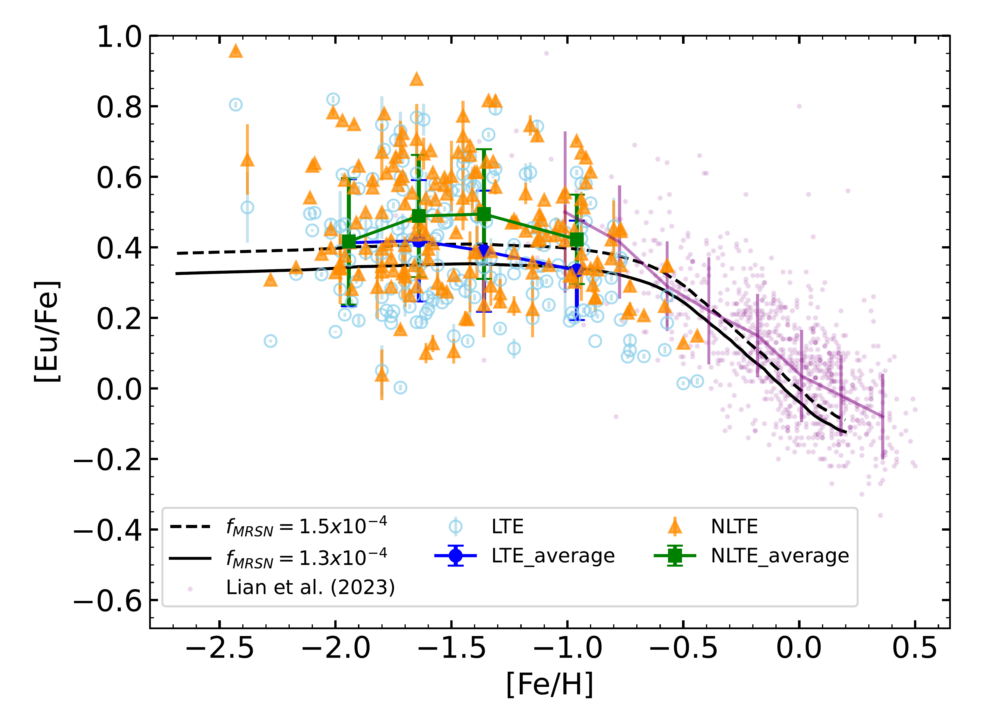
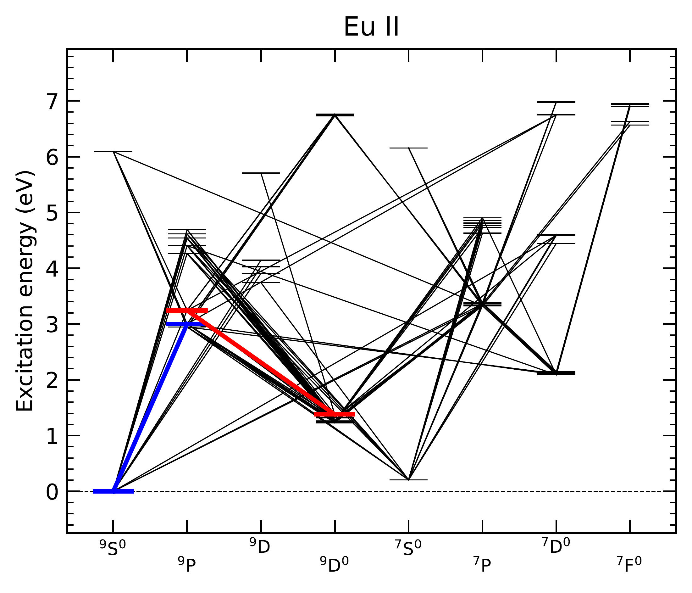

$\newcommand{\ensuremath}{}$
$\newcommand{\xspace}{}$
$\newcommand{\object}[1]{\texttt{#1}}$
$\newcommand{\farcs}{{.}''}$
$\newcommand{\farcm}{{.}'}$
$\newcommand{\arcsec}{''}$
$\newcommand{\arcmin}{'}$
$\newcommand{\ion}[2]{#1#2}$
$\newcommand{\textsc}[1]{\textrm{#1}}$
$\newcommand{\hl}[1]{\textrm{#1}}$
$\newcommand{\footnote}[1]{}$
$\newcommand{\GG}[1]{\textcolor{black}{#1}}$
$\newcommand{\G}[1]{\textcolor{black}{#1}}$
$\newcommand{\jl}[1]{\textcolor{orange}{#1}}$

# NLTE abundances of Eu for a sample of metal-poor stars in the Galactic Halo and Metal-poor Disk with 1D and $<$3D$>$ models

<mark>Appeared on: 2024-12-10</mark> - 

Y. Guo, et al. -- incl., <mark>N. Storm</mark>, <mark>M. Bergemann</mark>

**Abstract:** As a key to chemical evolutionary studies, the distribution of elements in galactic provides a wealth of information to understand the individual star formation histories of galaxies.The r-process is a complex nucleosynthesis process, and the origin of r-process elements is heavily debated.Europium (Eu) is viewed as an almost pure r-process element.Accurate measurements of europium abundances in cool stars are essential for an enhanced understanding of the r-process mechanisms. We measure the abundance of Eu in solar spectra and a sample of metal-poor stars in the Galactic halo and metal-poor disk, with the metallicities ranging from $\GG{$-2.4$}$ to $-0.5$ dex, using non-local thermodynamic equilibrium (NLTE) line formation. We compare these measurements with Galactic Chemical Evolution (GCE) models to $\GG{explore the impact of the NLTE corrections on the contribution of r-process site in Galactic chemical evolution.}$ In this work, we use NLTE line formation, as well as one-dimensional (1D) hydrostatic and spatial averages of 3D hydrodynamical ( $<$ 3D $>$ ) model atmospheres to measure the abundance of Eu based on both the Eu II 4129 Å and Eu II 6645 Å lines for solar spectra and metal-poor stars. We find that $\GG{for Eu II 4129 Å line the NLTE modelling leads to higher (0.04 dex) solar Eu abundance in 1D and higher (0.07 dex) in \GG{$<$3D$>$} NLTE while}$ NLTE modelling leads to higher (0.01 dex) solar Eu abundance in 1D and lower (0.03 dex) in $\GG{$<$3D$>$}$ NLTE for Eu II 6645 Å line. $\GG{Although the NLTE corrections for the Eu II $\lambda$ 4129 Å and Eu II $\lambda$ 6645 Å lines are opposite, the discrepancy between the abundances derived from these individual lines reduces after applying NLTE corrections, highlighting the critical role of NLTE abundance determinations.}$ By comparing these measurements with Galactic chemical evolution (GCE) models, we find that the $\G{amount of NLTE correction does not require significant change of the parameters for Eu production}$ in the GCE models.

**Figure 3. -** The best fitting synthetic spectra of sun for $\GG${$\lambda$ 4129Å (left panels)} and Eu II $\lambda$ 6645Å (right panels) generated from TSFitPy. The red line and blue line represent the synthetic spectra based on 1D and $<$3D$>$ NLTE, respectively. The observed data are shown as black dots. (*fig: Eufit_sun_spectrum*)

**Figure 8. -** The trend of [Eu/Fe] based on the best fitting results of 1D NLTE and LTE.
    $\GG${The green squares and blue dots represent the averaged NLTE and LTE [Eu/Fe] ratios across the selected bins.
    The yellow triangles and cyan circles represent the NLTE and LTE [Eu/Fe] for each stars.
    The purple dots represent 1D LTE Eu abundance measurements of 1274 metal-rich stars from Gaia-ESO survey.
    }
    The dashed and solid lines represent the GCE models with different fraction of massive stars that end up with MRSN instead of CCSN.  (*fig: Eu_trend*)

**Figure 1. -** Grotrian diagram of the $\GG${Eu II model atom}. The model atom are taken from the $\GG${\cite{2024A&AStorm}}. The $\GG${blue} and red lines represent the transitions giving rise to the $\GG${Eu II 4129 Å } and 6645 Å lines, respectively. (*fig: Grotrian diagrams*)

