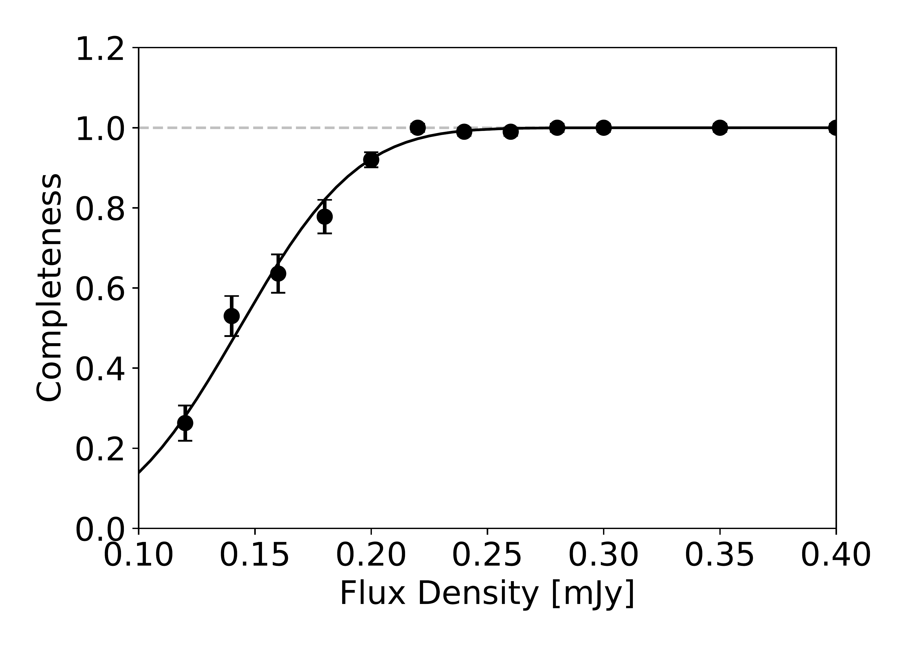

$\newcommand{\ensuremath}{}$
$\newcommand{\xspace}{}$
$\newcommand{\object}[1]{\texttt{#1}}$
$\newcommand{\farcs}{{.}''}$
$\newcommand{\farcm}{{.}'}$
$\newcommand{\arcsec}{''}$
$\newcommand{\arcmin}{'}$
$\newcommand{\ion}[2]{#1#2}$
$\newcommand{\textsc}[1]{\textrm{#1}}$
$\newcommand{\hl}[1]{\textrm{#1}}$
$\newcommand{\footnote}[1]{}$
$\newcommand{\vdag}{(v)^\dagger}$
$\newcommand$
$\newcommand$
$\newcommand{\oii}{\mbox{[\ion{O}{2}]}}$
$\newcommand{\oiii}{\mbox{[\ion{O}{3}]}}$
$\newcommand{\hei}{\mbox{\ion{He}{1}}}$
$\newcommand{\heii}{\mbox{\ion{He}{2}}}$
$\newcommand{\cii}{\mbox{[\ion{C}{2}]}}$
$\newcommand{\nii}{\mbox{[\ion{N}{2}]}}$
$\newcommand{\sii}{\mbox{[\ion{S}{2}]}}$
$\newcommand{\siii}{\mbox{[\ion{S}{3}]}}$
$\newcommand{\hb}{\mbox{H\beta}}$
$\newcommand{\ha}{\mbox{H\alpha}}$
$\newcommand{\lya}{\mbox{Ly\alpha}}$
$\newcommand{\popiii}{\mbox{\ion{Pop}{3}}}$
$\newcommand$
$\newcommand$
$\newcommand$
$\newcommand$
$\newcommand$
$\newcommand$
$\newcommand{\zsp}{\mbox{z_\mathrm{spec}}}$
$\newcommand{\zph}{\mbox{z_\mathrm{phot}}}$
$\newcommand{\lir}{\mbox{L_\mathrm{IR}}}$
$\newcommand{\textred}[1]{\textcolor{red}{#1}}$
$\newcommand{\textblue}[1]{\textcolor{blue}{#1}}$
$\newcommand{\micron}{\si{\micro\meter}}$
$\newcommand{\textred}[1]{{#1}}$
$\newcommand{\textblue}[1]{{#1}}$
$\newcommand{\thefigure}{\thesection\arabic{figure}}$

# A SPectroscopic survey of biased halos In the Reionization Era (ASPIRE): \ Spectroscopically Complete Census of Obscured Cosmic Star Formation Rate Density at $z=4-6$

<mark>Appeared on: 2024-12-11</mark> -  _27 pages, 13 figures, 3 tables. Accepted for publication in ApJ_

F. Sun, et al. -- incl., <mark>Y. Khusanova</mark>, <mark>F. Walter</mark>

**Abstract:** We present a stringent measurement of the dust-obscured star-formation rate density (SFRD) at $z=4-6$ from the ASPIRE JWST Cycle-1 medium and ALMA Cycle-9 large program.We obtained JWST/NIRCam grism spectroscopy and ALMA 1.2-mm continuum map along 25 independent quasar sightlines, covering a total survey area of $\sim$ 35 arcmin $^2$ where we search for dusty star-forming galaxies (DSFGs) at $z = 0 - 7$ .We identify eight DSFGs in seven fields at $z=4-6$ through the detection of $\ha$ or $\oiii$ $\lambda$ 5008 lines, including fainter lines such as $\hb$ , $\oiii$ $\lambda$ 4960, $\nii$ $\lambda$ 6585, $\sii$ $\lambda\lambda$ 6718,6733 for six sources.With this spectroscopically complete DSFG sample at $z=4-6$ and negligible impact from cosmic variance (shot noise), we measure the infrared luminosity function (IRLF) down to $L_\mathrm{IR} \sim 2\times10^{11}$ $\lsun$ .We find flattening of IRLF at $z=4-6$ towards the faint end (power-law slope $\alpha = 0.59_{-0.45}^{+0.39}$ ).We determine the dust-obscured cosmic SFRD at this epoch as $\log[\rho_\mathrm{SFR,IR} / (\mathrm{M}_\odot \mathrm{yr}^{-1} \mathrm{Mpc}^{-3})] = -1.52_{-0.13}^{+0.14}$ .This is significantly higher than previous determination using ALMA data in the Hubble Ultra Deep Field, which is void of DSFGs at $z=4-6$ because of strong cosmic variance (shot noise).We conclude that the majority ( $66\pm7$ \% ) of cosmic star formation at $z \sim 5$ is still obscured by dust.We also discuss the uncertainty of SFRD propagated from far-IR spectral energy distribution and IRLF at the bright end, which will need to be resolved with future ALMA and JWST observations.

**Figure 4. -** 1.2-mm continuum images of 25 quasar fields obtained by ASPIRE ALMA Cycle-9 large program. In the top-left panel, we highlight the design of JWST/NIRCam and ALMA observations.
The whole ALMA 1.2-mm continuum imaging mosaics (_uv_-tapered with FWHM = 1$\arcsec$) are within the full spectral ($\lambda$ = 3.1--4.0 $\micron$ with F356W filter) coverage region of NIRCam module A as indicated by the blue shaded region.
The quasar J0109--3047 ($z=6.791$; cyan circle) is located in the center of ALMA footprint, and one DSFG (J0109m3047.C02 at $z=5.549$) is also highlighted with red circle.
The position angle of NIRCam WFSS observation is 270\arcdeg for J0109 field, and therefore the grism-R dispersion direction is almost from north to south as indicated by the orange arrow.
Note that the dispersion direction depends on the JWST/NIRCam PA and varies from field to field.
ALMA 1.2-mm continuum images of all the other 24 fields are also displayed. Quasars with continuum detection ($z=6.5-6.8$) and spectroscopically confirmed DSFGs at $z=4-6$ are highlighted in cyan and red circles, respectively.
Many DSFGs at other redshifts are also detected with ALMA but not highlighted in this figure.
 (*fig:all_alma*)

**Figure 3. -** Completeness as a function of ALMA flux density on 1$\farcs$0 _uv_-tapered images (before primary beam response correction).
Best-fit error function is shown as the solid black line.
 (*fig:complete*)

**Figure 5. -** JWST NIRCam (red: F356W; green: F200W, blue: F115W) and ALMA 1.2-mm continuum images of DSFGs at $z=4-6$ discovered with the ASPIRE survey. Image sizes are 4$\arcsec$$\times$4$\arcsec$(north up, east left).
Source ID, spectroscopic redshifts and ALMA beam sizes are indicated in the plots.
Most sources appear red in JWST RGB images, indicating that they are highly dust-obscured galaxies at high redshifts.
Note that J0109m3047.C02 is gravitationally lensed by the bright galaxy on the left (see Appendix \ref{apd:01_lens}).
 (*fig:cutout*)

