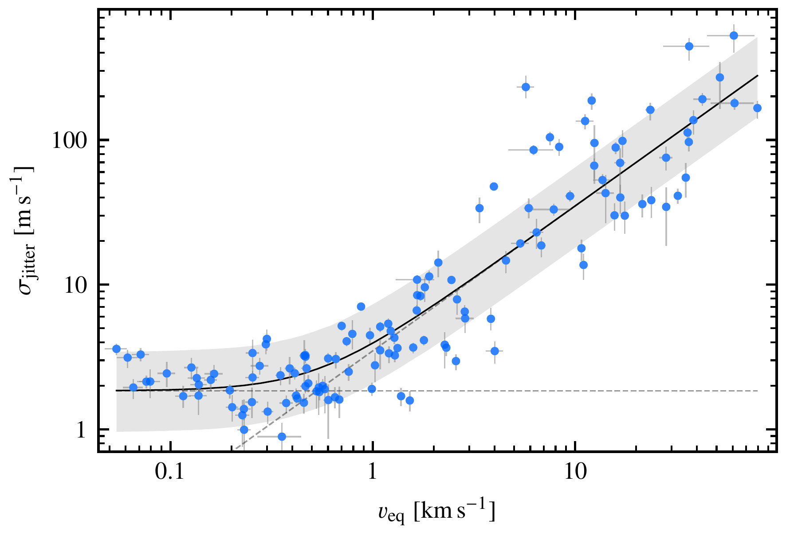
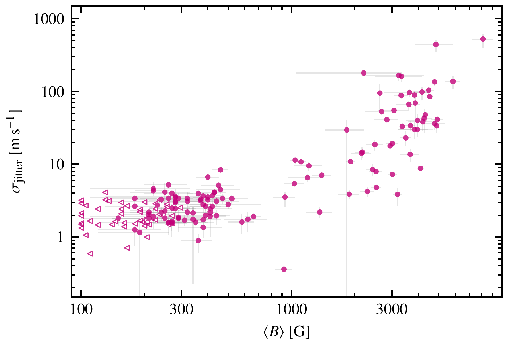
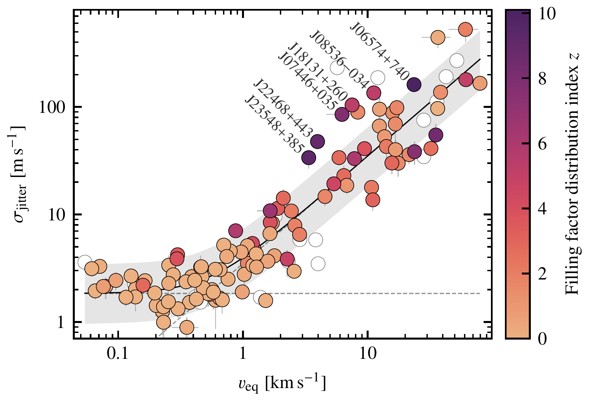

$\newcommand{\ensuremath}{}$
$\newcommand{\xspace}{}$
$\newcommand{\object}[1]{\texttt{#1}}$
$\newcommand{\farcs}{{.}''}$
$\newcommand{\farcm}{{.}'}$
$\newcommand{\arcsec}{''}$
$\newcommand{\arcmin}{'}$
$\newcommand{\ion}[2]{#1#2}$
$\newcommand{\textsc}[1]{\textrm{#1}}$
$\newcommand{\hl}[1]{\textrm{#1}}$
$\newcommand{\footnote}[1]{}$
$\newcommand{\AS}[3]{#1 ^{+#2}_{-#3}}$
$\newcommand{\ASmath}[3]{#1^{+#2}_{-#3}}$
$\newcommand{\serval}{\texttt{serval}}$
$\newcommand{\sim}{{\oldsim}}$
$\newcommand{\bfseries}{\fontseries{b}\selectfont}$

# The CARMENES search for exoplanets around M dwarfs: The impact of rotation and magnetic fields on the radial velocity jitter in cool stars

<mark>Appeared on: 2024-12-11</mark> - 

H. L. Ruh, et al. -- incl., <mark>T. Henning</mark>

**Abstract:** Radial velocity (RV) jitter represents an intrinsic limitation on the precision of Doppler searches for exoplanets that can originate from both instrumental and astrophysical sources. We aim to determine the RV jitter floor in M dwarfs and investigate the stellar properties that lead to RV jitter induced by stellar activity. We determined the RV jitter in $\num{239}$ M dwarfs from the CARMENES survey that are predominantly of mid to late spectral type and solar metallicity. We also investigated the correlation between stellar rotation and magnetic fields with RV jitter. The median jitter in the CARMENES sample is $\SI{3.1}{\meter\per\second}$ , and it is $\SI{2.3}{\meter\per\second}$ for stars with an upper limit of $\SI{2}{\kilo\meter\per\second}$ on their projected rotation velocities. We provide a relation between the stellar equatorial rotation velocity and RV jitter in M dwarfs based on a subsample of $\num{129}$ well-characterized CARMENES stars. RV jitter induced by stellar rotation dominates for stars with equatorial rotation velocities greater than $\SI{1}{\kilo\meter\per\second}$ . A jitter floor of $\SI{2}{\meter\per\second}$ dominates in stars with equatorial rotation velocities below $\SI{1}{\kilo\meter\per\second}$ . This jitter floor likely contains contributions from stellar jitter, instrumental jitter, and undetected companions. We study the impact of the average magnetic field and the distributions of magnetic filling factors on the RV jitter. We find a series of stars with excess RV jitter and distinctive distributions of magnetic filling factors. These stars are characterized by a dominant magnetic field component between $\SIrange{2}{4}{\kilo\gauss}$ . An RV jitter floor can be distinguished from RV jitter induced by activity and rotation based on the stellar equatorial rotation velocity. RV jitter induced by activity and rotation primarily depends on the equatorial rotation velocity. This RV jitter is also related to the distribution of magnetic filling factors, and this emphasizes the role of the magnetic field in the generation of RV jitter.

**Figure 4. -** Jitter-rotation relation for \num{129} CARMENES M dwarfs with known rotation periods. The RV jitter is fit as a function of the stellar rotation velocity $v_{\rm eq}$. The solid line displays the best fit, and the shaded region indicates the prediction interval. The jitter floor and the linear trend (dashed lines) correspond to parameters $\alpha$ and $\beta$ in Eq. (\ref{eq:jitter_vrot}). (*fig:jitter_vrot_all*)

**Figure 6. -** Radial velocity jitter vs. mean magnetic field. The upper limits on the average magnetic field are indicated by triangles. (*fig:jitter_bfield*)

**Figure 9. -** As Fig. \ref{fig:jitter_vrot_all}, but color-coded with the filling factor distributions index and only for stars with measured average magnetic field. The labels mark the series of high-jitter stars with concentrated magnetic field distributions. The empty circles display stars without measurements of the average magnetic field. (*fig:bfield_structure*)

