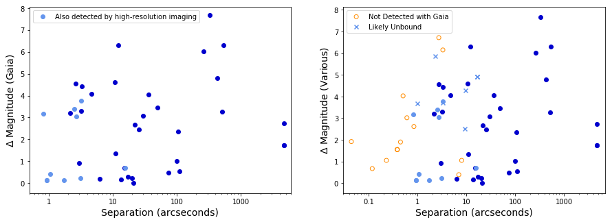
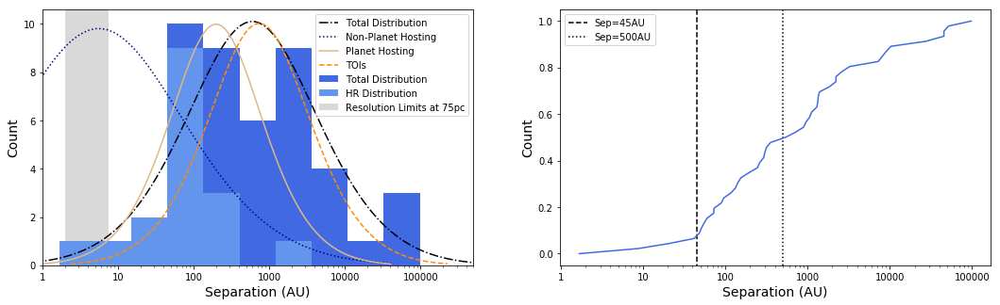
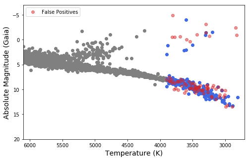

$\newcommand{\ensuremath}{}$
$\newcommand{\xspace}{}$
$\newcommand{\object}[1]{\texttt{#1}}$
$\newcommand{\farcs}{{.}''}$
$\newcommand{\farcm}{{.}'}$
$\newcommand{\arcsec}{''}$
$\newcommand{\arcmin}{'}$
$\newcommand{\ion}[2]{#1#2}$
$\newcommand{\textsc}[1]{\textrm{#1}}$
$\newcommand{\hl}[1]{\textrm{#1}}$
$\newcommand{\footnote}[1]{}$
$\newcommand{\vdag}{(v)^\dagger}$
$\newcommand$
$\newcommand$
$\newcommand{Ç}[1]$

# Demographics of M Dwarf Binary Exoplanet Hosts Discovered by TESS

<mark>Appeared on: 2024-12-12</mark> -  _28 pages, 13 figures, 5 tables, accepted for publication in The Astronomical Journal_

R. A. Matson, et al. -- incl., <mark>I. J. M. Crossfield</mark>

**Abstract:** M dwarfs have become increasingly important in the detection of exoplanets and the study of Earth-sized planets and their habitability. However, 20 $-$ 30 \% of M dwarfs have companions that can impact the formation and evolution of planetary systems. We use high-resolution imaging and Gaia astrometry to detect stellar companions around M dwarf exoplanet hosts discovered by TESS and determine the projected separation and estimated stellar masses for each system. We find 47 companions around 216 M dwarfs and a multiplicity rate of $19.4\pm2.7$ \% that is consistent with field M dwarfs. The binary projected separation distribution is shifted to larger separations, confirming the lack of close binaries hosting transiting exoplanets seen in previous studies.We correct the radii of planets with nearby companions and examine the properties of planets in M dwarf multi-star systems. We also note three multi-planet systems that occur in close binaries ( $\lesssim 50$ au) where planet formation is expected to be suppressed.

**Figure 5. -** _Left_: Magnitude difference as a function of angular separation for companions detected via common proper motion and parallax using Gaia DR3. Companions also detected with high-resolution imaging are shown in light blue. _Right_: Companions detected via Gaia DR3 and the CPM companions of TOI-2221 are plotted in blue, with companions detected using high-resolution imaging and not also detected using Gaia shown in orange. Open circles are companions unresolved by Gaia, or with no proper motion and/or parallax data, which are assumed to be bound (see text for details). Blue $\times$'s show companions present in Gaia with parallax and proper motion data indicating they are not physically bound. Each companion is only plotted once, with overlapping companions a result of the magnitude differences measured in different filters. Comparing the separation ranges of the high resolution and CPM detections demonstrates that while there is overlap, they provide complementary samples. (*fig:Gaiacomps*)

**Figure 10. -** _Left:_ The projected separation distribution in au for M dwarf TOI's with companions. The subset of companions detected with high-resolution (HR) is highlighted in light blue. We converted the observed separations of each system from arcseconds to  au using parallaxes from Gaia, then fit both the total sample (dot dash black line) and the high-resolution subset with Gaussian curves with $\sigma =$ 1.06 and $\sigma =$ 0.65 $\log$(AU), respectively. For the high-resolution sample, the peak is $\mu =$ 66 au,  whereas for the total sample, the peak is $\mu =$ 596 au. The separation distributions of non-planet hosting, planet hosting, and TOI M stars from 2024AJ....167..174C are shown for comparison. The region shaded in gray highlights the inner angular resolution limits of the various high-resolution imaging techniques at 75pc, the mean distance for M dwarfs in our sample. These limits demonstrate that we are sensitive to stellar companions with separations of a few au where the M-dwarf distribution of 2024AJ....167..174C peaks.
    _Right:_ A normalized cumulative distribution function for the projected companion separation in au. The function highlights the deficit of companions within 45 au (indicated by the vertical dashed line). Half of the M dwarf TOI companions are within 500  au (denoted by the vertical dotted line), reflecting the high concentration of companions between $45-500$ au as seen in the histogram on the left. The change in slope at $\sim50$ au is consistent with the semi-major axis cutoffs for close binaries with exoplanets determined by [Kraus, et. al (2016)]() and [Ziegler, Tokovinin and Latiolais (2021)]().
     (*fig:logsep*)

**Figure 1. -** H-R Diagram of TESS TOI candidates. Grey symbols are randomly chosen F, G, K stars taken from the TOI list and plotted here to give a perspective for their locations in an H-R Diagram. Red dots are M star TOIs which have already been deemed to be false positives, while blue dots show the location of the remaining M star TOI candidates. The blue dots above the main sequence are deemed to be giants and are removed from any subsequent analysis. (*fig:hrdiagram*)

