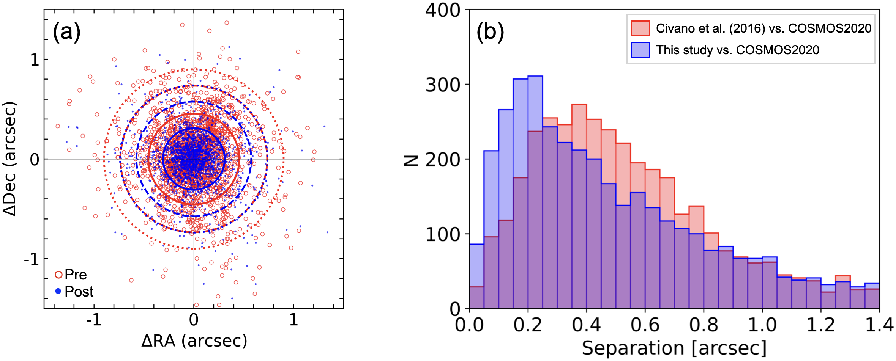
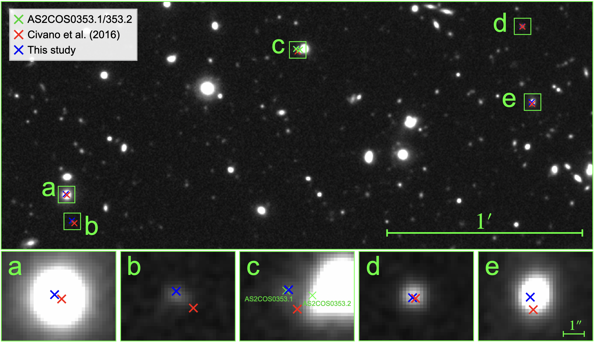

$\newcommand{\ensuremath}{}$
$\newcommand{\xspace}{}$
$\newcommand{\object}[1]{\texttt{#1}}$
$\newcommand{\farcs}{{.}''}$
$\newcommand{\farcm}{{.}'}$
$\newcommand{\arcsec}{''}$
$\newcommand{\arcmin}{'}$
$\newcommand{\ion}[2]{#1#2}$
$\newcommand{\textsc}[1]{\textrm{#1}}$
$\newcommand{\hl}[1]{\textrm{#1}}$
$\newcommand{\footnote}[1]{}$
$\newcommand{\vdag}{(v)^\dagger}$
$\newcommand$
$\newcommand$

# ALMA/SCUBA-2 COSMOS Survey: Properties of X-ray- and SED-selected AGNs in Bright Submillimeter Galaxies

<mark>Appeared on: 2024-12-16</mark> -  _37 pages, 21 figures, accepted for The Astrophysical Journal_

R. Uematsu, et al.

**Abstract:** We investigate the properties of active galactic nuclei (AGNs) in the brightest submillimeter galaxies (SMGs) in the COSMOS field. We utilize the bright sample of ALMA/SCUBA-2 COSMOS Survey (AS2COSMOS), which consists of 260 SMGs with $S_{\mathrm{870}  \mu \mathrm{m}}=0.7\text{--}19.2 \mathrm{mJy}$ at $z=0\text{--}6$ . We perform optical to millimeter spectral energy distribution (SED) modeling for the whole sample. We identify 24 AGN-host galaxies from the SEDs. Supplemented by 23 X-ray detected AGNs (X-ray AGNs), we construct an overall sample of 40 AGN-host galaxies. The X-ray luminosity upper bounds indicate that the X-ray undetected SED-identified AGNs are likely to be nearly Compton thick or have unusually suppressed X-ray emission. From visual classification, we identify $25^{+6}_{-5}$ \% of the SMGs without AGNs as major merger candidates. This fraction is almost consistent with the general galaxy population at $z\sim2$ , suggesting that major mergers are not necessarily required for the enhanced star formation in SMGs. We also identify $47^{+16}_{-15}$ \% of the AGN hosts as major merger candidates, which is about twice as high as that in the SMGs without AGNs. This suggests that major mergers play a key role in triggering AGN activity in bright SMGs.

**Figure 15. -** 
  8 arcsec $\times$ 8 arcsec JWST images of the 40 AS2COSMOS sources in the coverage of both NIRCam and MIRI imaging. The blue, green, and red colors correspond to the F115W+F150W, F277W+F444W, and F770W filters, respectively. We label the merger candidates, which have tidal features (T), disturbed morphology (D) or possible companions (C) (see Section \ref{subsection:morphology}). The major merger candidates are indicated by "M". The X-ray AGNs and the SED AGNs are indicated by "X" and "SED" (see Section \ref{subsubsection:agn_identification} and Section \ref{subsubsection:x-ray_LFIR}). Note that F150W is not used in the composite image of AS2COS0107.1, because this object is outside the coverage of F150W. For the same reason, F444W is not used in the composite image of AS2COS155.1. (*figure:JWST_miri*)

**Figure 2. -** _(a)_
  Positional offsets between optical sources and X-ray sources used for the astrometry correction. The solid, dotted, and dashed circles encompass 68\%, 90\%, and 95\% of the sources before (red) and after (blue) the correction, respectively. _(b)_ Histogram of the separation between the X-ray source positions and the optical to near-infrared source positions in the COSMOS2020 catalog. The red area shows the separation between \citet{2016ApJ...819...62C} and the COSMOS2020 catalog, while the blue area denotes the separation between our X-ray source catalog (Section \ref{subsubsection:x-ray_extraction}) and the COSMOS2020 catalog. (*figure:separation*)

**Figure 3. -** Positions of the X-ray detected sources near AS2COS0353.1 and AS2COS0353.2 plotted over the Ultravista $K_{\mathrm{s}}$-band image. The red points show the X-ray source positions listed in the catalog by \citet{2016ApJ...819...62C}, whereas the blue points show the positions derived in our analysis (Section \ref{subsubsection:x-ray_extraction}). The green points show the positions of AS2COS0353.1 and AS2COS0353.2. The bottom panels show the zoomed-in images of the X-ray sources. (*figure:ximage*)

