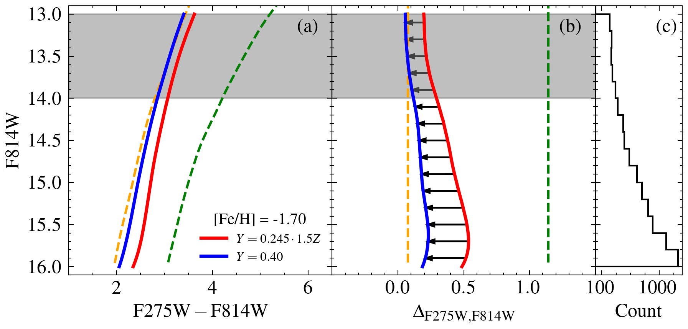
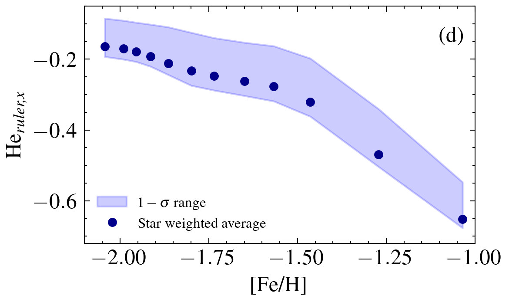
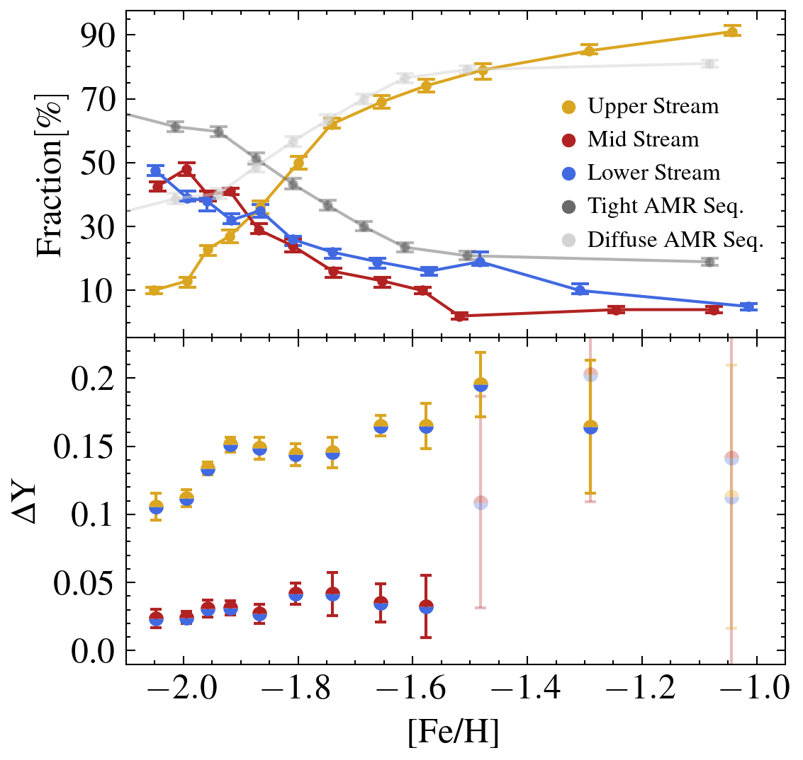

$\newcommand{\ensuremath}{}$
$\newcommand{\xspace}{}$
$\newcommand{\object}[1]{\texttt{#1}}$
$\newcommand{\farcs}{{.}''}$
$\newcommand{\farcm}{{.}'}$
$\newcommand{\arcsec}{''}$
$\newcommand{\arcmin}{'}$
$\newcommand{\ion}[2]{#1#2}$
$\newcommand{\textsc}[1]{\textrm{#1}}$
$\newcommand{\hl}[1]{\textrm{#1}}$
$\newcommand{\footnote}[1]{}$
$\newcommand$
$\newcommand$
$\newcommand$
$\newcommand$
$\newcommand$
$\newcommand$
$\newcommand$
$\newcommand$

# oMEGACat V: Helium Enrichment in $\omega$ Centauri as a Function of Metallicity

<mark>Appeared on: 2024-12-16</mark> - 

<mark>C. Clontz</mark>, et al. -- incl., <mark>M. Häberle</mark>, <mark>N. Neumayer</mark>

**Abstract:** Constraining the helium enhancement in stars is critical for understanding the formation mechanisms of multiple populations in star clusters. However, measuring helium variations for many stars within a cluster remains observationally challenging. We use Hubble Space Telescope photometry combined with MUSE spectroscopic data for over 7,200 red-giant branch stars in $\omc$ to measure helium differences between distinct groups of stars as a function of metallicity separating the impact of helium enhancements from other abundance variations on the pseudo-color (chromosome) diagrams. Our results show that stars at all metallicities have subpopulations with significant helium enhancement ( $\Delta Y_{min} \gtrsim$ 0.11). We find a rapid increase in helium enhancement from low metallicities ( $\rm{[Fe/H] \simeq -2.05}$ to $\rm{[Fe/H] \simeq -1.92})$ , with this enhancement leveling out at $\deltay$ $= 0.154$ at higher metallicities. The fraction of helium-enhanced stars steadily increases with metallicity ranging from 10 \% at $\rm{[Fe/H] \simeq -2.04}$ to over $90\%$ at $\rm{[Fe/H] \simeq -1.04}$ . This study is the first to examine helium enhancement across the full range of metallicities in $\omc$ , providing new insight into its formation history and additional constraints on enrichment mechanisms.

**Figure 6. -** **Helium Ruler vs. [Fe/H]:*** Left Panel --* These three figures show the derivation of the helium ruler. First on the far left, the color magnitude-diagram of two isochrones [Fe/H]$= -1.70$, but with primordial (red) and enhanced (blue) helium abundance are shown. The yellow and green lines show the fiducials used to verticalize the color-magnitude diagram and create the \deltaone color shown in panel (b). The black arrows in this panel show the distance between the verticalized isochrones in each magnitude bin. The histogram in panel (c) shows the number of stars at each magnitude that are used to weight the separation of the helium isochrones and obtain the helium ruler x-distance, He$_{ruler,x}$. The gray region at the top of the panel (b) shows magnitudes excluded from our analysis to ensure consistent length helium ruler vectors for all stars; the rulers at these magnitudes are clearly shorter. * Right Panel --* The derived He$_{ruler,x}$ in the \deltaone color as a function of metallicity. This corresponds to the expected offset in the \deltaone\/x-axis of the chromosome diagram for two populations with $\Delta Y \sim 0.15$. This difference is calculated at each metallicity across the full range of RGB magnitudes; the dark blue points show the He$_{ruler,x}$ determined from the weighted average of all the vectors in the left-middle panel. The blue band shows the 16th and 84th percentile of the vector lengths. (*fig:helium_ruler_creation_and_results*)

**Figure 1. -** **Helium Enhancement vs. Metallicity:**(_Top panel_) The fraction of stars in each of the three streams defined in Fig. \ref{fig:chrom_map} as a function of metallicity (gold, blue, and red lines). Gray lines show the relative numbers of stars in the two different age-metallicity relationship tracks found by [Clontz, Seth and Dotter (2024)]().
(_Bottom panel_) \deltay for the lower-to-middle stream (blue/red points) and the lower-to-upper stream (blue/gold points) as a function of metallicity. The highest metallicity points are shown at low opacity because their results are very uncertain and are based on a small number of stars ($<$30).
 (*fig:streamwise_results*)

**Figure 4. -** **Chromosome/Pseudo-color diagram**: Our sample of 7,277 RGB stars in \omc is shown with each star colored by its metallicity. We separate the RGB stars separate into three distinct streams in this diagram using the diagonal black lines and color-coded labels. The edges of the [Fe/H] bins are indicated by white lines on the color bar (see also Table \ref{table:results}) Spreads in the \deltaone and \deltatwo within metallicity bins are primarily due to light element abundance variations. (*fig:chrom_map*)

