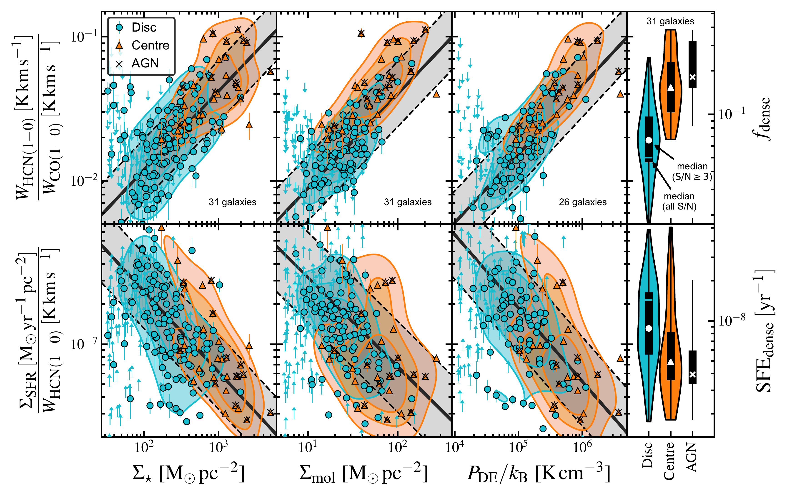
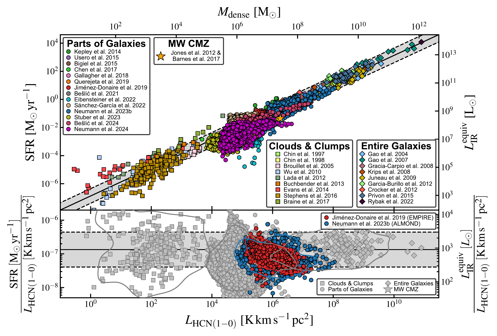
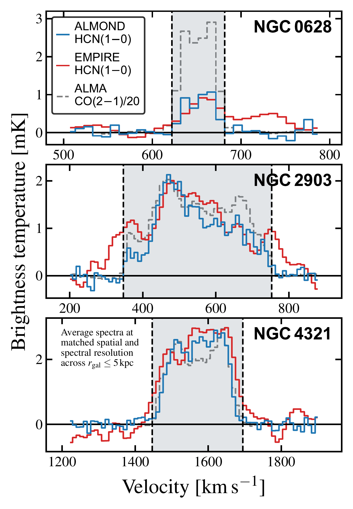

$\newcommand{\ensuremath}{}$
$\newcommand{\xspace}{}$
$\newcommand{\object}[1]{\texttt{#1}}$
$\newcommand{\farcs}{{.}''}$
$\newcommand{\farcm}{{.}'}$
$\newcommand{\arcsec}{''}$
$\newcommand{\arcmin}{'}$
$\newcommand{\ion}[2]{#1#2}$
$\newcommand{\textsc}[1]{\textrm{#1}}$
$\newcommand{\hl}[1]{\textrm{#1}}$
$\newcommand{\footnote}[1]{}$
$\newcommand{\cmark}{\textcolor{green}{\ding{51}}}$
$\newcommand{\xmark}{\textcolor{red}{\ding{55}}}$

# Dense gas scaling relations at kiloparsec scale across nearby galaxies with the ALMA ALMOND and IRAM 30-m EMPIRE surveys

<mark>Appeared on: 2024-12-17</mark> -  _6 pages, 3 figures. Accepted for publication in Astronomy & Astrophysics Letters_

L. Neumann, et al. -- incl., <mark>E. Schinnerer</mark>

**Abstract:** Dense, cold gas is the key ingredient for star formation.   Over the last two decades, HCN(1--0) emission has been utilised as the most accessible dense gas tracer to study external galaxies.   We present new measurements tracing the relationship between dense gas tracers, bulk molecular gas tracers, and star formation in the ALMA ALMOND survey, the largest sample of resolved ( $1-2$ kpc resolution) HCN maps of galaxies in the local universe ( $d < 25 $ Mpc).   We measure HCN/CO, a line ratio sensitive to the physical density distribution, and SFR/HCN, a proxy for the dense gas star formation efficiency, as a function of molecular gas surface density, stellar mass surface density, and dynamical equilibrium pressure across 31 galaxies, increasing the number of galaxies by a factor of $>3$ over the previous largest such study (EMPIRE).    HCN/CO increases (slope of $\approx\num{0.5}$ and scatter of $\approx\SI{0.2}{\dex}$ ), while SFR/HCN decreases (slope of $\approx\num{-0.6}$ and scatter of $\approx\SI{0.4}{\dex}$ ) with increasing molecular gas surface density, stellar mass surface density and pressure.    Galaxy centres with high stellar mass surface density show a factor of a few higher HCN/CO and lower SFR/HCN compared to the disc average, but both environments follow the same average trend.   Our results emphasise that molecular gas properties vary systematically with the galactic environment and demonstrate that the scatter in the Gao-Solomon relation (SFR against HCN) is of physical origin.

**Figure 6. -** Dense gas relations with kiloparsec-scale environment.
HCN/CO _(top)_, a proxy of \fdense, and SFR/HCN _(bottom)_, a proxy of \sfedense, as a function of stellar mass surface density (\sigstar), molecular gas surface density (\sigmol), and dynamical equilibrium pressure (\pde) across 31 galaxies from ALMOND and EMPIRE.
The markers denote significant ($\snr\geq 3$) stacked measurements across disc (circle) and centre (triangle) spaxels.
The downward and upward pointing arrows denote upper (HCN/CO) and lower limits (SFR/HCN).
Filled contours show 25, 50, and 75 percentile kernel density estimates.
Across centres, we indicate the presence of an AGN (cross).
All relations have been fitted with \texttt{LinMix} taking into account measurement uncertainties and upper/lower limits (parameters in Table \ref{tab:environment}).
The black solid line shows the best-fit line and the grey-shaded area indicates the 1-sigma scatter of $\snr\geq 3$ data.
The right panels show violin plots of the HCN/CO and SFR/HCN distribution across the respective samples (disc, centre, centre with AGN), where the black bar and white markers indicate the 25th to 75th percentile range and the median, respectively, across the $\snr\geq 3$ data.
The vertical cyan lines in the disc violins mark the median computed from all \snr data.
 (*fig:hcn_scaling_relations*)

**Figure 5. -** Gao--Solomon relation. Star formation rate (SFR, top) and $\mathrm{SFR}/\lhcn$(proxy of \sfedense, bottom) as a function of HCN luminosity, across a literature compilation and the ALMOND (blue circles) and EMPIRE (red circles) surveys.
Note that we re-calculate SFR across EMPIRE galaxies using a combination of IR and FUV data (see Sect. \ref{sec:data}).
Our literature compilation contains HCN observations that include Galactic clumps and clouds (squares), resolved nearby galaxies (circles) and unresolved entire galaxies (diamonds).
For more details on the compilation see Appendix \ref{sec:app:literature}.
The plotted data points show all (3-sigma) detected sightlines.
The black solid line shows the median SFR/HCN computed from these data points across all data sets (without duplicates across targets), and the dashed lines mark the 1-sigma scatter (Table \ref{tab:gao_solomon}).
The bottom panel shows the ratio SFR/HCN as a function of \lhcn, grouping the data into the same sub-samples where the 10-percentile density contours of the respective sub-samples are shown.
We plot ALMOND and EMPIRE separately, and the blue and red contours present the 10-percentile levels of these surveys.
 (*fig:gao_solomon_relation*)

**Figure 2. -** EMPIRE versus ALMOND: \hcnone average spectra.
The blue and red lines show average HCN brightness temperatures within $\rgal\leq\SI{5}{\kilo\parsec}$ obtained from spatially and spectrally matched ALMOND and EMPIRE observations, respectively, across the three galaxies NGC 628, NGC 2903, NGC 4321 from top to bottom.
The grey dashed line shows (homogenised) \cotwo intensities from PHANGS--ALMA  ([Leroy, Schinnerer and Hughes 2021]()) , scaled down by a factor of 20.
The grey-shaded area indicates the velocity-integration window constructed using the highly significant \cotwo data.
The resulting integrated intensities are quoted in the text.
 (*fig:empire_vs_almond_spectra*)

