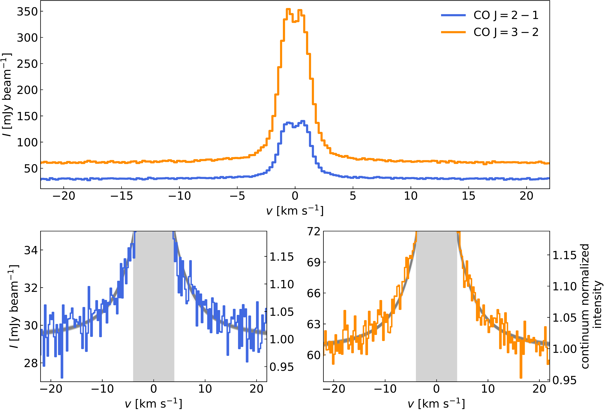
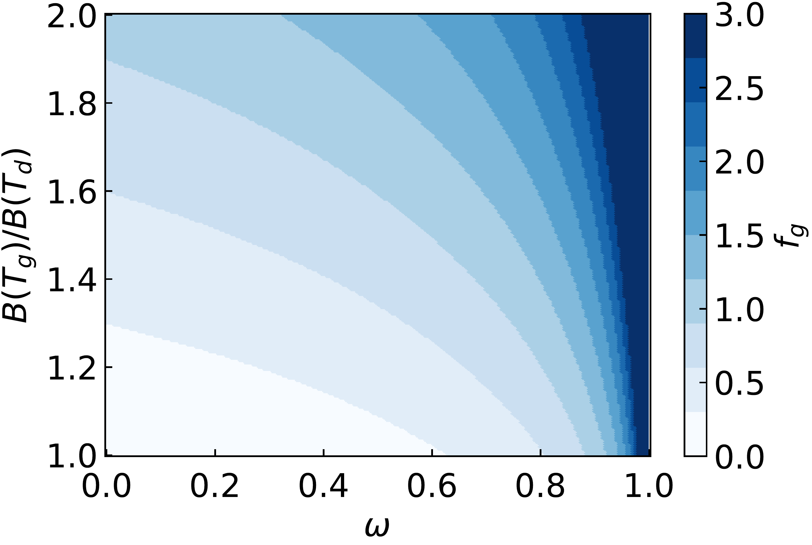

$\newcommand{\ensuremath}{}$
$\newcommand{\xspace}{}$
$\newcommand{\object}[1]{\texttt{#1}}$
$\newcommand{\farcs}{{.}''}$
$\newcommand{\farcm}{{.}'}$
$\newcommand{\arcsec}{''}$
$\newcommand{\arcmin}{'}$
$\newcommand{\ion}[2]{#1#2}$
$\newcommand{\textsc}[1]{\textrm{#1}}$
$\newcommand{\hl}[1]{\textrm{#1}}$
$\newcommand{\footnote}[1]{}$
$\newcommand{\vdag}{(v)^\dagger}$
$\newcommand$
$\newcommand$
$\newcommand{\kms}{{\rm km s^{-1}}}$

# Dust Scattering Albedo at Millimeter-Wavelengths in the TW Hya Disk

<mark>Appeared on: 2024-12-17</mark> -  _19 pages, 16 figures, accepted for publication in ApJ_

T. C. Yoshida, et al. -- incl., <mark>K. Doi</mark>

**Abstract:** Planetary bodies are formed by coagulation of solid dust grains in protoplanetary disks.Therefore, it is crucial to constrain the physical and chemical properties of the dust grains.In this study, we measure the dust albedo at mm-wavelength, which depends on dust properties at the disk midplane.Since the albedo and dust temperature are generally degenerate in observed thermal dust emission, it is challenging to determine them simultaneously.We propose to break this degeneracy by using multiple optically-thin molecular lines as a dust-albedo independent thermometer.In practice, we employ pressure-broadened CO line wings that provide an exceptionally high signal-to-noise ratio as an optically thin line.We model the CO $J=2-1$ and $3-2$ spectra observed by the Atacama Large Millimeter/sub-millimeter Array (ALMA) at the inner region ( $r<6 {\rm au}$ ) of the TW Hya disk and successfully derived the midplane temperature.Combining multi-band continuum observations, we constrain the albedo spectrum at $0.9-3$ mm for the first time without assuming a dust opacity model.The albedo at these wavelengths is high, $\sim0.5-0.8$ , and broadly consistent with the \citet{ricc10} , DIANA, and DSHARP dust models.Even without assuming dust composition, we estimate the maximum grain size to be $\sim 340 \mu m$ , power law index of the grain size distribution to be $>-4.1$ , and porosity to be $<0.96$ .The derived dust size may suggest efficient fragmentation with the threshold velocity of $\sim 0.08 {\rm m s^{-1}}$ .We also note that the absolute flux uncertainty of $\sim10\%$ ( $1\sigma$ ) is measured and used in the analysis, which is approximately twice the usually assumed value.

**Figure 14. -**  CO $J=2-1$(blue) and $J=3-2$(orange) spectra at the center ($r<6 {\rm au}$) of the TW Hya disk. The bottom panels are the zoom-in version of the top panel. The grey lines indicate the models created from parameters randomly sampled from the MCMC chain (Section \ref{sec:res1}). The gray-shaded regions ($|v| < 4 {\rm km s^{-1}}$) are not used for fitting. (*fig:spec*)

**Figure 9. -**  Line emerging factor $f_g$ as a function of $\omega$ and $B(T_g)/B(T_d)$. (*fig:fg*)

**Figure 12. -**  Line emerging factor $f_g$ as a function of $\omega$ and $B(T_g)/B(T_d)$. (*fig:fg*)

