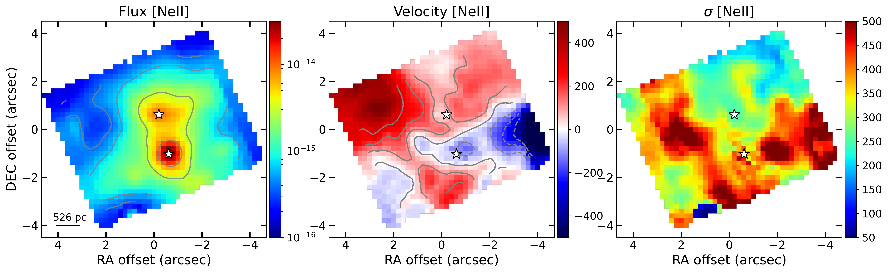
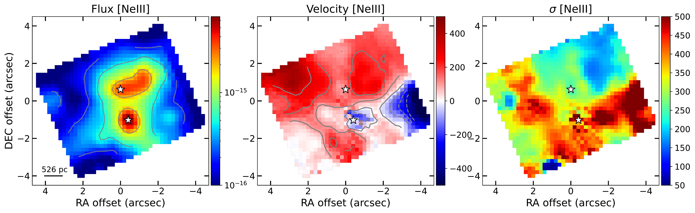
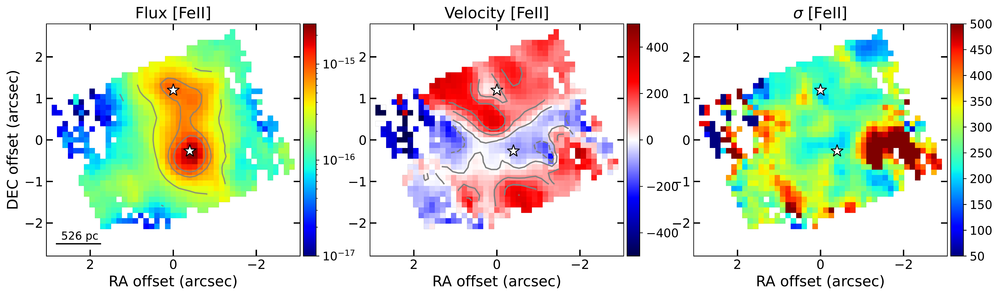
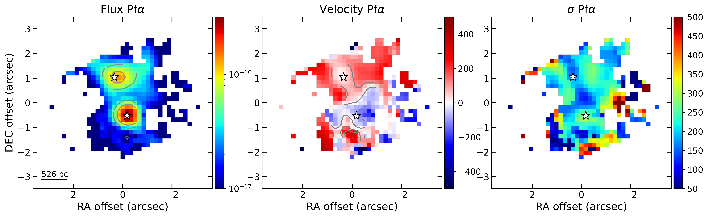
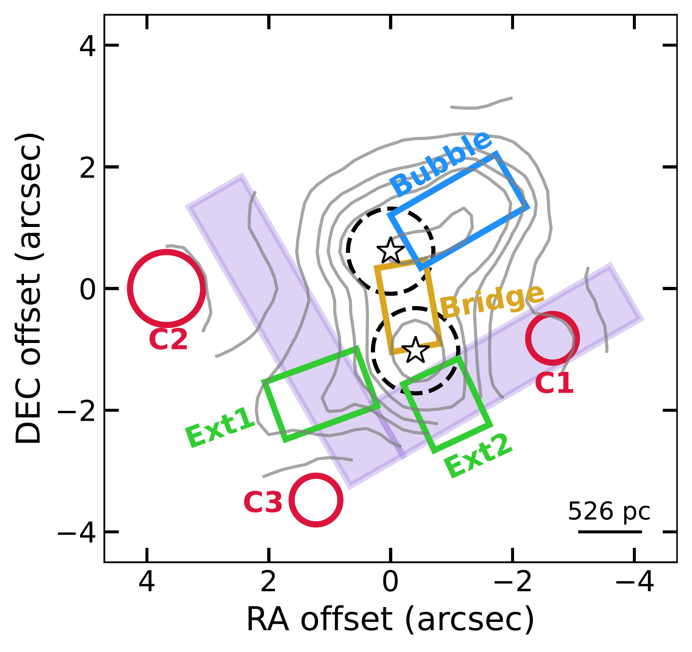
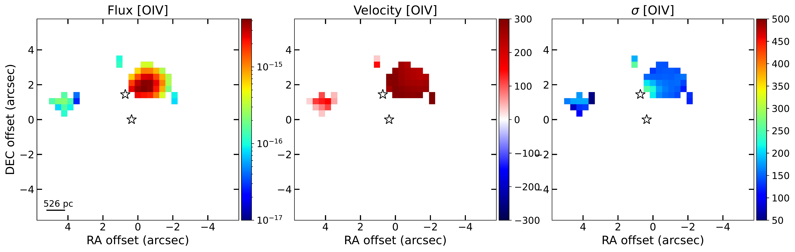
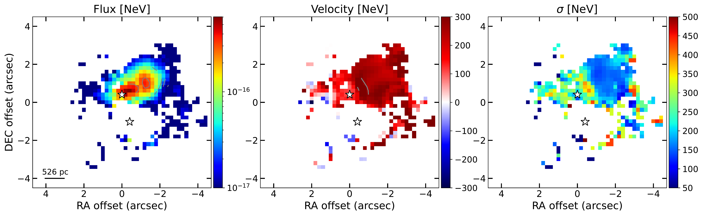
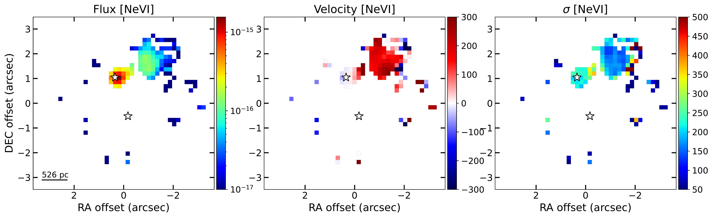
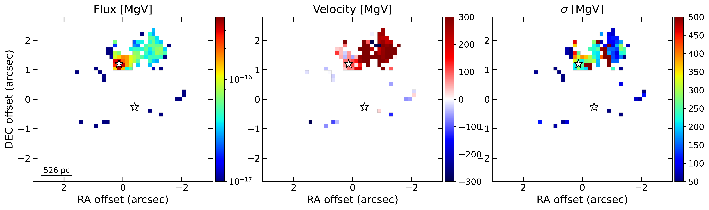

$\newcommand{\ensuremath}{}$
$\newcommand{\xspace}{}$
$\newcommand{\object}[1]{\texttt{#1}}$
$\newcommand{\farcs}{{.}''}$
$\newcommand{\farcm}{{.}'}$
$\newcommand{\arcsec}{''}$
$\newcommand{\arcmin}{'}$
$\newcommand{\ion}[2]{#1#2}$
$\newcommand{\textsc}[1]{\textrm{#1}}$
$\newcommand{\hl}[1]{\textrm{#1}}$
$\newcommand{\footnote}[1]{}$

# MICONIC: dual AGN, star formation, and ionised gas outflows in NGC 6240 seen with MIRI/JWST

<mark>Appeared on: 2024-12-20</mark> -  _23 pages, 10 figures. Accepted for publication in A&A on 26/11/2024_

L. H. Muñoz, et al. -- incl., <mark>F. Walter</mark>, <mark>T. Henning</mark>

**Abstract:** Galaxy mergers are an important and complex phase during the evolution of galaxies. They may trigger nuclear activity and/or strong star forming episodes in the galaxy centres that potentially alter the evolution of the system. As part of the guaranteed time observations (GTO) program Mid-Infrared Characterization Of Nearby Iconic galaxy Centers (MICONIC), we used the medium-resolution spectrometer (MRS) of the Mid-Infrared Instrument (MIRI) on board of the James Webb Space Telescope (JWST) to study NGC 6240. We aim to characterise the dual active galactic nuclei (AGN), the ionised gas outflows and the main properties of the interstellar medium (ISM) over a mapped area of $6.6\arcsec \times 7.7\arcsec$ . We obtained integral field spectroscopic (IFS) mid-infrared data (wavelength from 4.9 to 28 $\mu$ m) of NGC 6240. We modelled the emission lines through a kinematic decomposition that accounts for the possible existence of various components. We have resolved both nuclei for the first time in the full 5-28 $\mu$ m spectral range. The fine-structure lines in the southern (S) nucleus are broader than for the northern (N) nucleus (full width at half maximum of $\geq$ 1500 vs $\sim$ 700 km s $^{-1}$ on average, respectively). High excitation lines, such as [ Ne V ] , [ Ne VI ] , and [ Mg V ] , are clearly detected in the N nucleus. In the S nucleus, the same lines can be detected but only after a decomposition of the PAH features in the integrated spectrum, due to a combination of a strong mid-IR continuum, the broad emission lines, and the intense star formation (SF). The SF is distributed all over the mapped FoV of 3.5 kpc $\times$ 4.1 kpc (projected), with the maximum located around the S nucleus. Both nuclear regions appear to be connected by a bridge region detected with all the emission lines. Based on the observed MRS line ratios and the high velocity dispersion ( $\sigma \sim 600$ km s $^{-1}$ ), shocks are also dominating the emission in this system. We detected the presence of outflows as a bubble north-west from the N nucleus and at the S nucleus. We estimated a ionised mass outflow rate of 1.4 $\pm 0.3$ M $_{\sun}$ yr $^{-1}$ and $1.8\pm0.2$ M $_{\sun}$ yr $^{-1}$ , respectively. Given the derived kinetic power of these outflows, both the AGN and the starburst could have triggered them.

**Figure 8. -** Kinematic maps obtained with the modelling of a single Gaussian for the [Ne II], [Ne III], [Fe II] at 5.34$\mu$m, and Pf$\alpha$ lines (from top to bottom, respectively). The latter line kinematics was obtained after re-binning the cube with a 2$\times$2 box (see Sect. \ref{Sect2:Methodology}). From left to right: flux in erg s$^{-1}$ cm$^{-2}$, velocity in km s$^{-1}$, and velocity dispersion in km s$^{-1}$. The contours in the velocity maps go from $-$300 to 300 km s$^{-1}$(increments of 100 km s$^{-1}$). The contours in the flux maps go from 10$^{-16}$ to 10$^{-14}$ erg s$^{-1}$ cm$^{-2}$(divided in 5 contours), except for Pf$\alpha$(from $10^{-17}$ to $10^{-15}$ erg s$^{-1}$ cm$^{-2}$). White stars indicate the photometric centre for both nuclei in their corresponding sub-channels, and the lower-left line indicate the 1$\arcsec$ physical scale. The (0,0) point in each panel marks the centre of the FoV at each channel. For all maps, north is up and east to the left. (*Fig:KinMapsLowExcit*)

**Figure 1. -** Schematic figure of the main features seen in the flux and kinematic maps of the emission lines superimposed to the [Ne III] flux map contours (see Fig. \ref{Fig:KinMapsLowExcit}). In red we mark the position of the different detected clumps (namely C1, C2, and C3) and in green the extended emission regions (namely Ext1 and Ext2, see Sect. \ref{SubSect3:Results_fluxes}). The bubble-like structure mainly detected with the high-excitation lines is in blue (extending up to $\sim5.2$\arcsec$$, i.e. 2.74 kpc, see Fig. \ref{Fig:KinMapsHighIon} and Sect. \ref{SubSect4:Disc_Outflow}), and the bridge detected between both nuclei (separated $\sim 1.6$\arcsec$$, i.e. $\sim 840$ pc, see Sect. \ref{Subsect3:Results_IntProperties}) is marked in yellow. The purple regions indicate the "V"-shaped structure detected in the velocity dispersion maps. Additionally, we mark with black, dashed circles the region where we integrated the spectra for both nuclei, as well as their position with the white stars. (*Fig:SummaryRegions*)

**Figure 9. -** Kinematic maps obtained with the modelling of a single Gaussian for the [O IV], [Ne V], [Ne VI], and [Mg V] lines, top to bottom respectively. Full description in Fig. \ref{Fig:KinMapsLowExcit}. (*Fig:KinMapsHighIon*)

