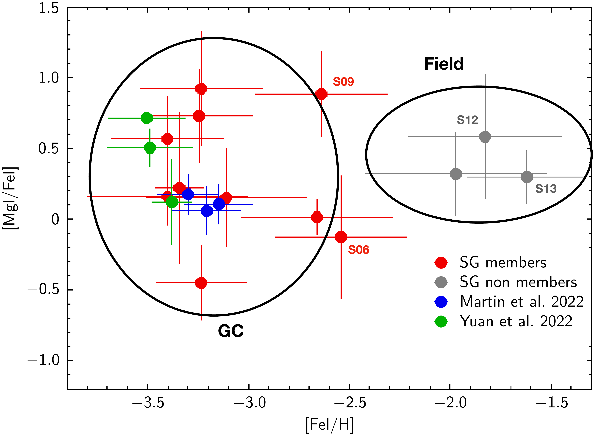
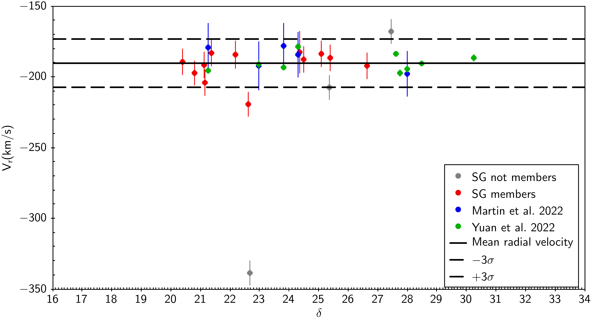

$\newcommand{\ensuremath}{}$
$\newcommand{\xspace}{}$
$\newcommand{\object}[1]{\texttt{#1}}$
$\newcommand{\farcs}{{.}''}$
$\newcommand{\farcm}{{.}'}$
$\newcommand{\arcsec}{''}$
$\newcommand{\arcmin}{'}$
$\newcommand{\ion}[2]{#1#2}$
$\newcommand{\textsc}[1]{\textrm{#1}}$
$\newcommand{\hl}[1]{\textrm{#1}}$
$\newcommand{\footnote}[1]{}$
$\newcommand{\mygi}{MyGIsFOS}$
$\newcommand{\Teff}{\ensuremath{T_\mathrm{eff}}}$
$\newcommand{\gf}{\ensuremath{gf}}$
$\newcommand{\loggf}{\ensuremath{\log gf}}$
$\newcommand{\logg}{\ensuremath{\log g}}$
$\newcommand{\glog}{\ensuremath{\log g}}$
$\newcommand{\kms}{\rm km s ^{-1}}$
$\newcommand{\cobold}{CO^{5}BOLD}$
$\newcommand{\teff}{T\rm_{eff}}$

# The Pristine survey\ XXVI. Chemical abundances of subgiant stars of the extremelymetal-poor stream C-19$\thanks{Based on observations made at ESO with X-shooter, programme109.231F.001}$

<mark>Appeared on: 2025-01-01</mark> -  _Astronomy & Astrophysics - A&A, In press_

P. Bonifacio, et al. -- incl., <mark>N. Martin</mark>, <mark>M. Fouesneau</mark>

**Abstract:** The C-19 stellar stream is the most metal-poor stream known to date. While its width and velocity dispersion indicate a dwarf galaxy origin, its metallicity spread and abundance patterns are more similar to those of globular clusters (GCs). If it is indeed of GC origin,  its extremely low metallicity ( [ Fe/H ] =--3.4, estimated from giant stars)implies that these stellar systems can form out of gas that is as extremely poor in metals as this. Previously,only giant stream stars were observed spectroscopically, although the majorityof stream stars are unevolved stars. We pushed the spectroscopic observations to the subgiant branch stars( $G\approx 20$ ) in order to consolidate the chemical and dynamical propertiesof C-19. We used the high-efficiency spectrograph X-shooter fed bythe ESO 8.2 m VLT telescope to observe 15 candidate subgiant C-19 members.The spectra were used to measure radial velocities and to determinechemical abundances using the $\mygi$ code. We developed a likelihood model that takes metallicity and radial velocities into account. We conclude that12 stars are likely members of C-19, while 3 stars(S05, S12, and S13) are likely contaminants.When these 3 stars are excluded, our modelimplies a mean metallicity $\rm \langle[Fe/H]\rangle = -3.1\pm 0.1$ , the  mean radial velocity is $\langle v_r\rangle=-192\pm3$ $\kms$ ,  andthe velocity dispersion is $\sigma_{vr}=5.9^{+3.6}_{-5.9}$ $\kms$ . This all agrees within errors with previous studies. The A(Mg) of a sample of 15 C-19 members, including 6  giant stars, shows a  standard deviation of 0.44 dex, and the mean uncertainty on Mg is 0.25 dex. Our preferred interpretation of the current data is that C-19 is a disrupted GC.We cannot completely rule out  the possibility that the GC could have belonged to a dwarf galaxy that contained more metal-rich  stars, however. This  scenario would explain the radial velocity members at higher metallicity, as  well as the width and velocity dispersion of the stream. In either case, a GC formed out of gas as poor in metals as these stars seems necessary to explain the existence of C-19.  The possibility that no GC was associated with C-19 cannot be ruled out either.

**Figure 2. -** Probability distribution functions for the five parameters of the inference on the properties of the combined velocity and metallicity distribution of C-19 members. The five parameters are the fraction of contaminants, $\eta$, and the mean and dispersion of the velocity ($\langle v_r\rangle$ and $sigma_{vr}$) and metallicity ($\langle{\rm[Fe/H]}\rangle$ and $\sigma_{\rm[Fe/H]}$) parts of the model. The top panel of each column shows the one-dimensional marginalised probability distribution functions from which the favoured parameter models and related uncertainties are determined. The red contours and histograms show the same after the three likely contaminant stars are removed and the MW contamination is fixed to $\eta=0$. (*corner*)

**Figure 5. -** [Fe/H]--[Mg/Fe] diagram for our programme stars and the stars from
[Martin, Venn and Aguado (2022)]() and [Yuan, Martin and Ibata (2022)]() for which Mg abundances are available. (*mgfe*)

**Figure 1. -** Radial velocities of our program stars and the stars from [Martin, Venn and Aguado (2022)]() and
[Yuan, Martin and Ibata (2022)]() plotted as a function of declination.
The dashed lines indicate three
$\sigma$ shifts from the mean value (represented by the thick line). (*vrad*)

