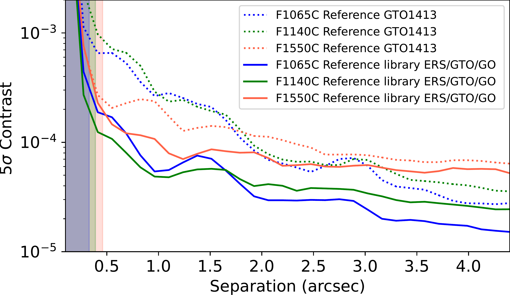
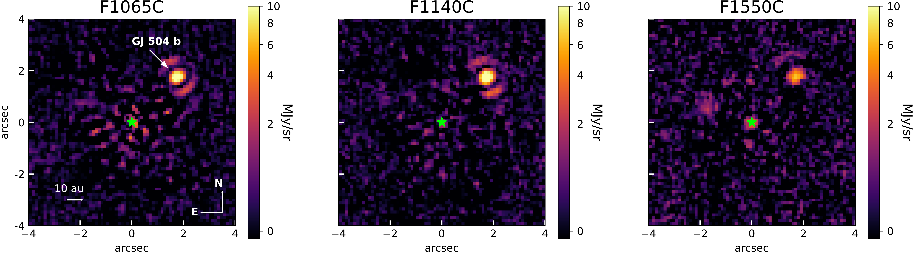
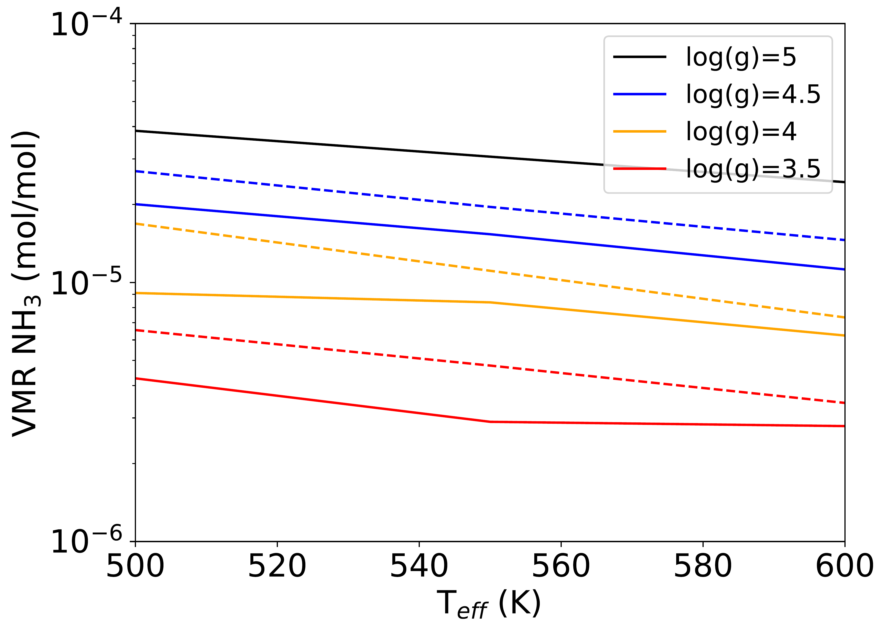

$\newcommand{\ensuremath}{}$
$\newcommand{\xspace}{}$
$\newcommand{\object}[1]{\texttt{#1}}$
$\newcommand{\farcs}{{.}''}$
$\newcommand{\farcm}{{.}'}$
$\newcommand{\arcsec}{''}$
$\newcommand{\arcmin}{'}$
$\newcommand{\ion}[2]{#1#2}$
$\newcommand{\textsc}[1]{\textrm{#1}}$
$\newcommand{\hl}[1]{\textrm{#1}}$
$\newcommand{\footnote}[1]{}$
$\newcommand{\mathilde}[1]{\textcolor{orange}{#1}}$
$\newcommand{\anthony}[1]{\textcolor{magenta}{#1}}$

# First unambiguous detection of ammonia in the atmosphere of a planetary mass companion with JWST/MIRI coronagraphs

<mark>Appeared on: 2025-01-03</mark> -  _Accepted to A&A_

M. Mâlin, et al. -- incl., <mark>T. Henning</mark>, <mark>S. Scheithauer</mark>

**Abstract:** The newly accessible mid-infrared (MIR) window offered by the _James Webb_ Space Telescope (JWST) for exoplanet imaging is expected to provide valuable information to characterize their atmospheres.   In particular, coronagraphs on board the JWST Mid-InfraRed instrument (MIRI) are capable of imaging the coldest directly imaged giant planets at the wavelengths where they emit most of their flux.   The MIRI coronagraphs have been specially designed to detect the $NH_3$ absorption around 10.5 $\mu$ m, which has been predicted by atmospheric models and should be detectable for planets colder than 1200 K. We aim to assess the presence of $NH_3$ while refining the atmospheric parameters of one of the coldest companions detected by directly imaging GJ 504 b.   Its mass is still a matter of debate and depending on the host star age estimate, the companion could either be placed in the brown dwarf regime of $\sim$ 20 M $_{\rm Jup}$ or in the young Jovian planet regime of $\sim$ 4 M $_{\rm Jup}$ . We present an analysis of new MIRI observations, using the coronagraphic filters F1065C, F1140C, and F1550C of the GJ 504 system.   We took advantage of previous observations of reference stars to build a library of images and to perform a more efficient subtraction of the stellar diffraction pattern.   We used an atmospheric grid from the \texttt{Exo-REM} model to refine the atmospheric parameters by combining archival near-infrared (NIR) photometry with the MIR photometry. We detected the presence of $NH_3$ at   12.5 $\sigma$ and measured its volume mixing ratio of 10 $^{5.3 \pm 0.07}$ in the atmosphere of GJ 504 b. These results are in line with atmospheric model expectations for a planetary-mass object and observed in brown dwarfs within a similar temperature range.   The best-fit model with \texttt{Exo-REM} provides updated values of its atmospheric parameters, yielding a temperature of T $_\text{eff}$ = 512 $\pm$ 10 K   and radius of R = 1.08 $^{+0.04}_{-0.03}$ R $_{\rm Jup}$ . These observations demonstrate the capability of MIRI coronagraphs to detect $NH_3$ and to provide the first MIR observations of one of the coldest directly imaged companions. Overall,   $NH_3$ is a key molecule for characterizing the  atmospheres of cold planets, offering valuable insights into their surface gravity.   These observations provide valuable information for future spectroscopic observations planned with JWST, in particular, with the MIRI medium-resolution spectrometer (MRS), which will allow us to characterize the atmosphere of GJ 504 b in depth.

**Figure 2. -** Contrast curve at 5$\sigma$ computed for each filter image.
    All curves are computed using the 4Q-PCA stellar subtraction method.
    The plain lines correspond to the subtraction with the entire library and the dashed lines correspond to the case of using only the reference star from the GTO 1413 program.
    The shaded regions correspond to the inner working angle of the coronagraphs. (*fig:contrast_curve_best*)

**Figure 8. -** Coronagraphic images of GJ 504 in each filter (F1065, F1140, and F1550) after the subtraction of an optimized-reference star.
    The coronagraphic center is illustrated with the small star in green and GJ 504 b is the bright source in the upper right corner, as indicated by the arrow in the F1065C image (first panel).
    An asinh color scale is used to show more details. Images in linear scale are available in the appendix. (*fig:image_sub*)

**Figure 3. -** Abundance of the $NH_3$ according to \texttt{Exo-REM} models as a function of the $T_{eff}$ for several values of $\mathrm{log} g$.
    The dashed lines represent the expectation for an atmosphere with a super-solar metallicity, and the plain line with a solar metallicity. (*fig:nh3_exorem*)

