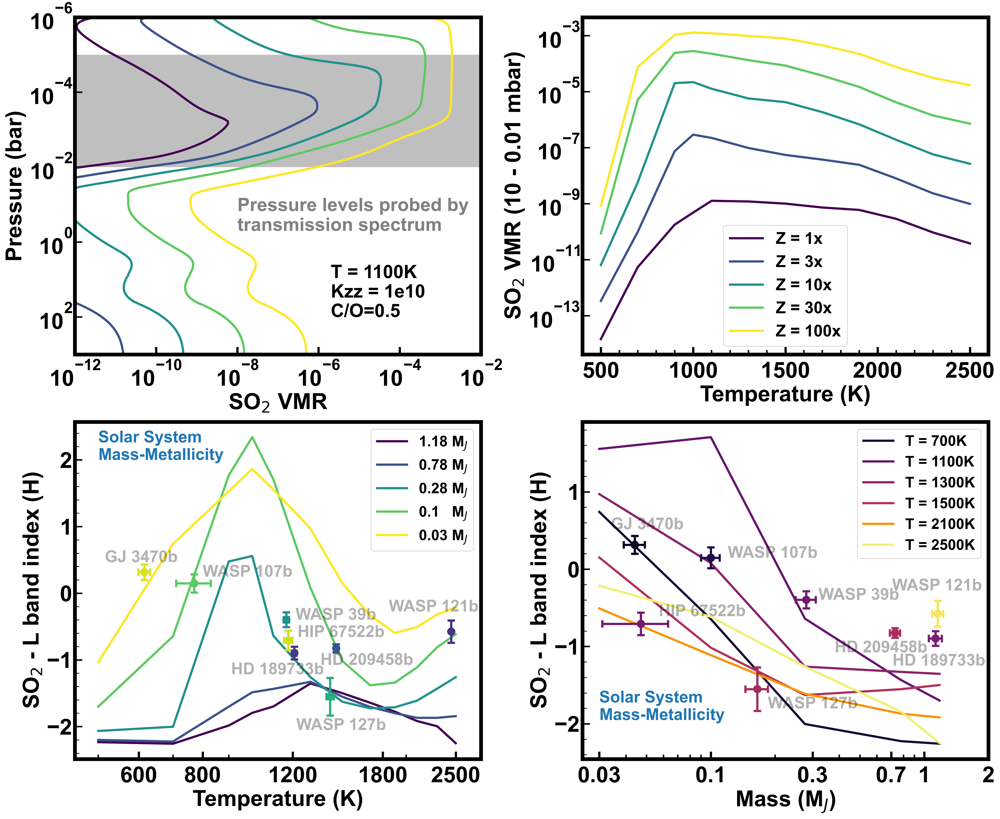
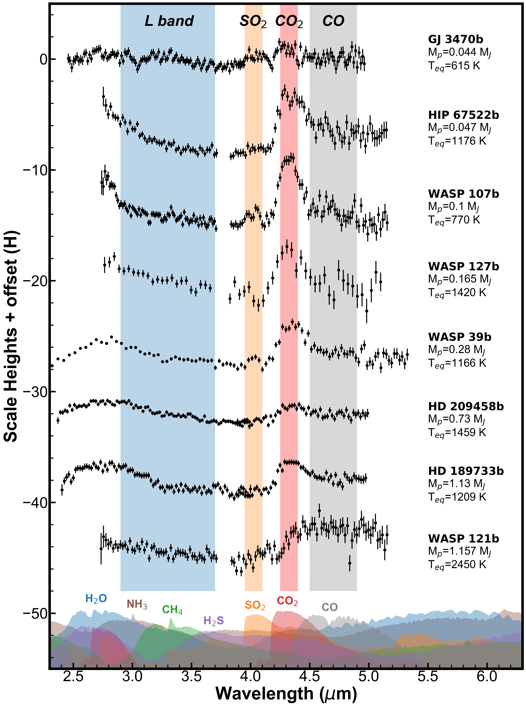
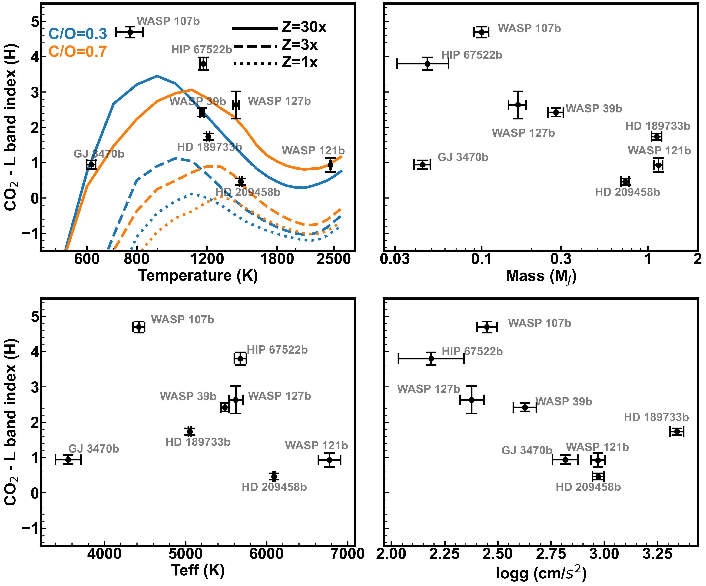

$\newcommand{\ensuremath}{}$
$\newcommand{\xspace}{}$
$\newcommand{\object}[1]{\texttt{#1}}$
$\newcommand{\farcs}{{.}''}$
$\newcommand{\farcm}{{.}'}$
$\newcommand{\arcsec}{''}$
$\newcommand{\arcmin}{'}$
$\newcommand{\ion}[2]{#1#2}$
$\newcommand{\textsc}[1]{\textrm{#1}}$
$\newcommand{\hl}[1]{\textrm{#1}}$
$\newcommand{\footnote}[1]{}$

# Statistical trends in JWST transiting exoplanet atmospheres

<mark>Appeared on: 2025-01-07</mark> -  _Accepted to ApJ, JWST keeps on delivering!_

G. Fu, et al. -- incl., <mark>C. Gapp</mark>

**Abstract:** Our brains are hardwired for pattern recognition as correlations are useful for predicting and understanding nature. As more exoplanet atmospheres are being characterized with JWST, we are starting to unveil their properties on a population level. Here we present a framework for comparing exoplanet transmission spectroscopy from 3 to 5 $\mu$ m with four bands: L (2.9 - 3.7 $\mu$ m), $SO_2$ (3.95 - 4.1 $\mu$ m), $CO_2$ (4.25 - 4.4 $\mu$ m) and CO (4.5 - 4.9 $\mu$ m). Together, the four bands cover the major carbon, oxygen, nitrogen, and sulfur-bearing molecules including $H_2$ O, $CH_4$ , $NH_3$ , $H_2$ S, $SO_2$ , $CO_2$ , and CO. Among the eight high-precision gas giant exoplanet planet spectra we collected, we found strong correlations between the $SO_2$ -L index and planet mass (r=-0.41 $\pm$ 0.09) and temperature (r=-0.64 $\pm$ 0.08), indicating $SO_2$ preferably exists ($SO_2$ -L $>$ -0.5) among low mass ( $\sim<$ 0.$3M_J$ ) and cooler ( $\sim<$ 1200K) targets. We also observe strong temperature dependency for both $CO_2$ -L and CO-L indices. Under equilibrium chemistry and isothermal thermal structure assumptions, we find that the planet sample favors super-solar metallicity and low C/O ratio ( $<$ 0.7). In addition, the presence of a mass-metallicity correlation is favored over uniform metallicity with the eight planets. We further introduce the $SO_2$ -L versus $CO_2$ -L diagram alike the color-magnitude diagram for stars and brown dwarfs. All reported trends here will be testable and be further quantified with existing and future JWST observations within the next few years.

**Figure 4. -** Volume mixing ratio of $SO_2$ in the atmosphere as a function of metallicity for the model grid at 1100K (Top left). Average $SO_2$ VMR across 10 to 0.01 mbar pressure levels versus temperature for five metallicity values (Top right). The model grid-predicted $SO_2$-L values versus temperature for the five metallicity values are shown in the bottom left, with the metallicities converged to planet masses (shown in color) assuming the solar system mass-metallicity relation. The bottom right shows the $SO_2$-L model values versus planet mass at constant temperatures, again with the model metallicities converted to mass via the solar system mass-metallicity relation. (*SO2_models*)

**Figure 2. -** Transmission spectra included in this study. All spectra are normalized by their respective atmospheric scale heights (H) and plotted with a vertical offset. All spectra cover the 2.7 to 5 $\mu$m wavelength range. We picked four bands: L (2.9 - 3.7$\mu$m), $SO_2$(3.95 - 4.1$\mu$m), $CO_2$(4.25 - 4.4$\mu$m) and CO (4.5 - 4.9$\mu$m) which are color shaded with blue, orange, red and grey respectively. These four bands cover major oxygen, carbon, and sulfur-bearing molecules such as $H_2$O, $CH_4$, $NH_3$, $H_2$S, $SO_2$, $CO_2$ and CO. (*fig1*)

**Figure 5. -** $CO_2$-L versus equilibrium temperature (upper left), planet mass (upper right), host star effective temperature (lower left), and planet surface gravity (lower right). There are no clear linear trends, which is expected as $CO_2$ is sensitive to temperature non-monotonically. We overplotted two sets of forward \texttt{PLATON} models with different Z and C/O in the top left panel. (*fig3*)

