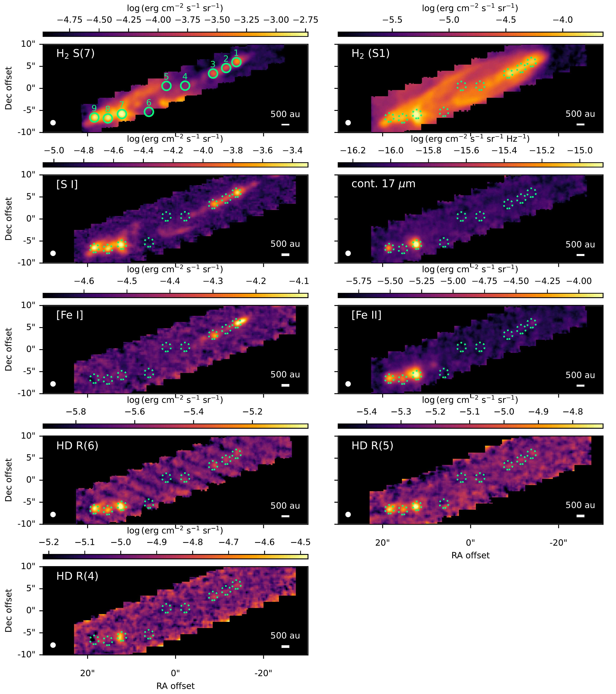
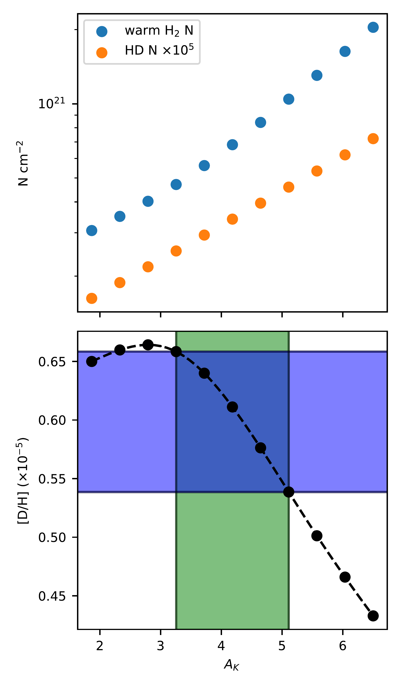
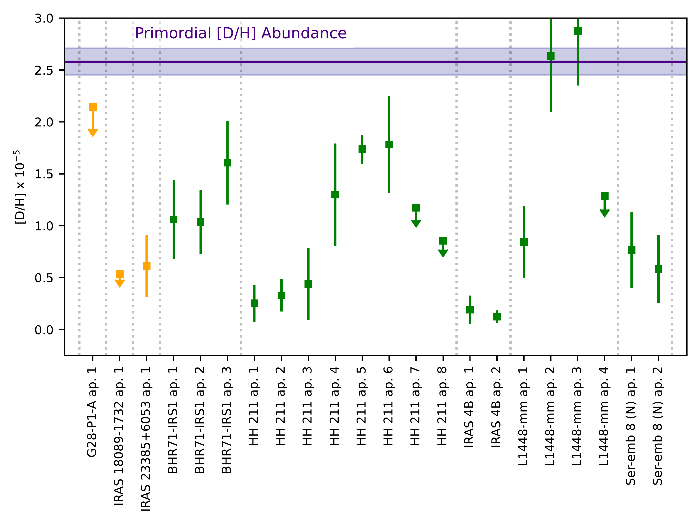

$\newcommand{\ensuremath}{}$
$\newcommand{\xspace}{}$
$\newcommand{\object}[1]{\texttt{#1}}$
$\newcommand{\farcs}{{.}''}$
$\newcommand{\farcm}{{.}'}$
$\newcommand{\arcsec}{''}$
$\newcommand{\arcmin}{'}$
$\newcommand{\ion}[2]{#1#2}$
$\newcommand{\textsc}[1]{\textrm{#1}}$
$\newcommand{\hl}[1]{\textrm{#1}}$
$\newcommand{\footnote}[1]{}$
$\newcommand{\lf}$
$\newcommand{\rgc}{R_\mathrm{GC}}$

# JOYS: The [D/H] abundance derived from protostellar outflows across the Galactic disk measured with JWST

<mark>Appeared on: 2025-01-07</mark> -  _30 Pages, 20 Figures. Accepted for publication in Astronomy and Astrophysics_

L. Francis, et al. -- incl., <mark>H. Beuther</mark>, <mark>T. Henning</mark>

**Abstract:** The total deuterium abundance [ D/H ] in the universe is set by just two processes: the creation of deuterium in Big Bang Nucleosynthesis at an abundance of [ D/H ] $=2.58\pm0.13\times10^{-5}$ , and its destruction within stellar interiors (astration). Measurements of variations in the total [ D/H ] abundance can thus potentially provide a probe of Galactic chemical evolution. However, most observational measurements of [ D/H ] are only sensitive to the gas-phase deuterium, and the amount of deuterium sequestered in dust grains is debated. With the launch of the James Webb Space Telescope (JWST), it is now possible to measure the gas-phase [ D/H ] at unprecedented sensitivity and distances through observation of mid-IR lines of $H_2$ and HD. Comparisons of gas-phase [ D/H ] with the constraints on the total [ D/H ] from the primordial abundance and Galactic chemical evolution models can provide insight into the degree of Deuterium lock-up in grains and the star formation history of our Galaxy. We use data from the JWST Observations of Young protoStars (JOYS) program of 5 nearby and resolved low-mass protostellar outflows and 5 distant high-mass protostellar outflows taken with the JWST Mid Infrafred Instrument (MIRI) Medium Resolution Spectrometer (MRS) to measure gas-phase [ D/H ] via $H_2$ and HD lines, assuming the gas is fully molecular. We extract spectra from various locations in the outflows. Using a rotational diagram analysis covering lines of $H_2$ and HD with similar excitation energies, we derive the column density of HD and $H_2$ or their upper limits. We then calculate the gas-phase [ D/H ] from the column density results, and additionally apply a correction factor for the effect of chemical conversion of HD to atomic D and non-LTE excitation on the HD abundance in the shocks. To investigate the spatial distribution of the bulk gas and species refractory species associated with the dust grains, we also construct integrated line intensity maps of $H_2$ , HD, [ Fe II ] , [ Fe I ] , and [ S I ] lines. A comparison of gas-phase [ D/H ] between our low-mass sources shows variations of up to a factor of $\sim4$ , despite these sources likely having formed in nearly the same region of the Galactic disk that would be expected to have nearly constant total [ D/H ] . Most measurements of gas-phase [ D/H ] from our work or previous studies produce [ D/H ] $\lesssim 1.0\times10^{-5}$ , a factor of $2-4$ lower than found from local UV absorption lines and as expected from Galactic chemical evolution models. In the integrated line intensity maps, the morphology of the HD R(6) line emission is strongly correlated with the $H_2$ S(7), [ S I ] , and [ Fe I ] lines which mostly trace high velocity jet knots and bright bow-shocks. In our extracted spectra along the outflows, there is similarly a strong correlation between the $H_2$ and HD column density and the [ S I ] and [ Fe I ] line flux, however, no correlation is seen between [ D/H ] and the [ S I ] or [ Fe I ] line flux. The variations in [ D/H ] between our low-mass sources and the low [ D/H ] with respect to Galactic chemical evolution models suggest that our observations are not sensitive to the total [ D/H ] . Significant depletion of deuterium onto carbonaceous dust grains is a possible explanation, and tentative evidence of enhanced [ D/H ] towards positions with higher gas-phase Fe abundance is seen in the HH 211 outflow. Deeper observations of HD and $H_2$ across a wider range of shock conditions and modelling of the carbonaceous dust-grain destruction and shock conditions are warranted to test for the effects of depletion.

**Figure 6. -** Integrated line intensity maps for HH 211  of various lines and the continuum at 17 $\mu$m shown with a logarithmic stretch. The maps have been smoothed to a common resolution of 1$\arcsec$, shown by the white circle in the bottom-left. Apertures used for spectral extraction are shown by the green circles. An index for each aperture is provided in the top-left panel. The coordinates of the aperture centers can be found in Table \ref{tab:apertures} of App. \ref{sec:app_apertures}. (*fig:moment0_1*)

**Figure 5. -** Example of the effect of extinction uncertainty on the derived column densities and [D/H] for IRAS 23385+6053 ap 1. _ Upper panel_: Effect of varying extinction on derived column density for the warm $H_2$ component and HD. _ Lower panel_: Effect of varying extinction on the derived $\mathrm{[D/H]}$. The uncertainty in $A_K$ from the single component fit to S(1)-S(4) transitions of $H_2$ is shown as the green shaded region, while the equivalent uncertainty in $\mathrm{[D/H]}$ is shown as the blue shaded region. (*fig:extinction_uncertainty*)

**Figure 10. -** Comparison of [D/H] abundance (Table \ref{tab:DtoH}) in this work. A correction factor of 2.54 has been applied to our [D/H] measurements (see text). Orange symbols show [D/H] in apertures for high-mass sources, while green symbols show [D/H] in apertures from low-mass sources. The dotted grey lines separate different sources. The blue shaded region shows the primordial total [D/H] abundance of  ([Cyburt, et. al 2016]()) . [D/H] upper limits above the primordial abundance are omitted. (*fig:DtoH_scatter*)

