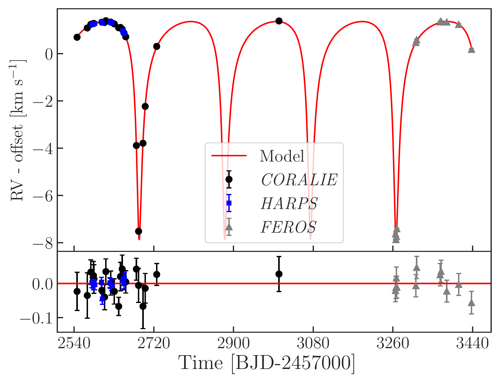
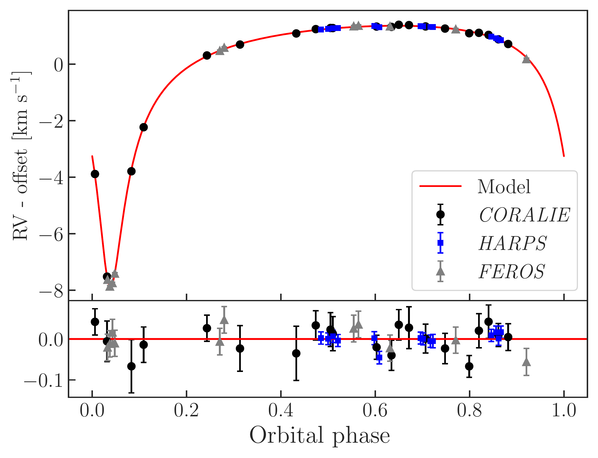
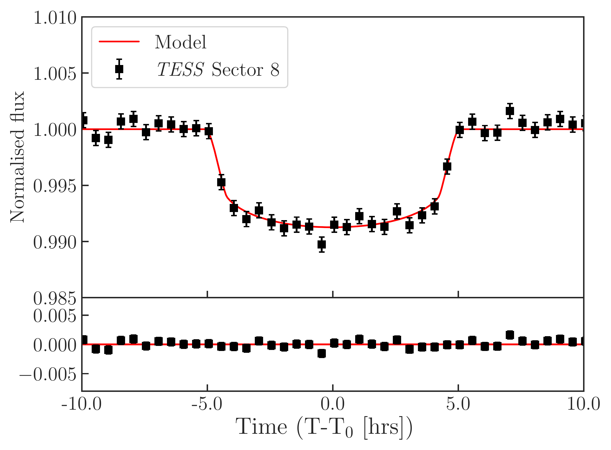
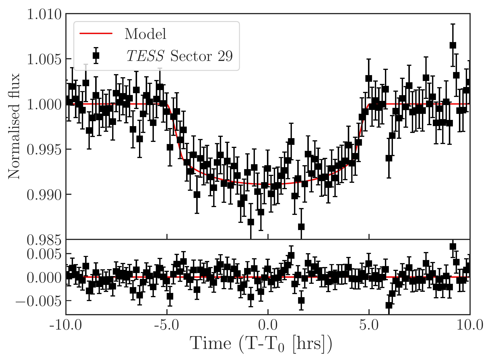
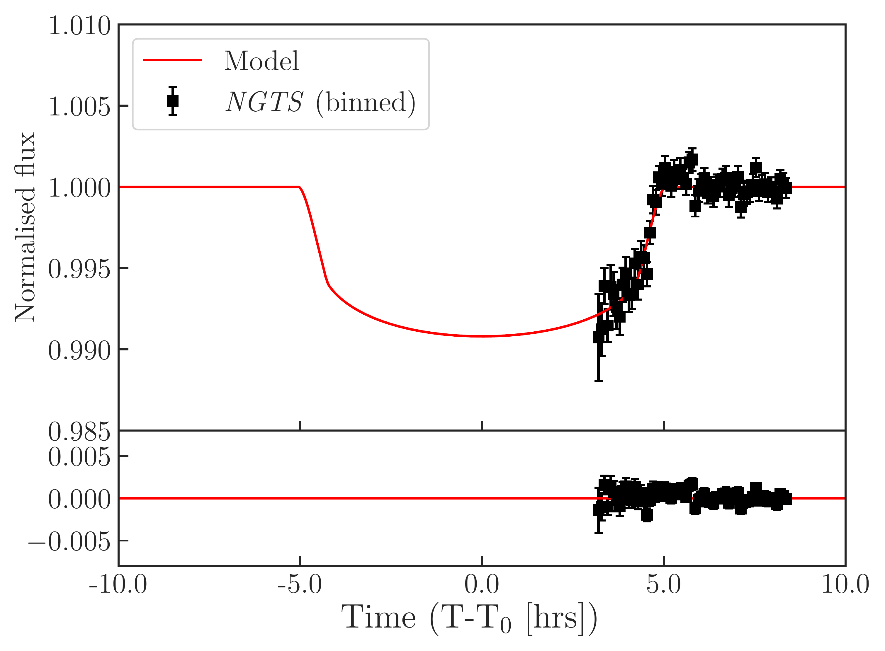
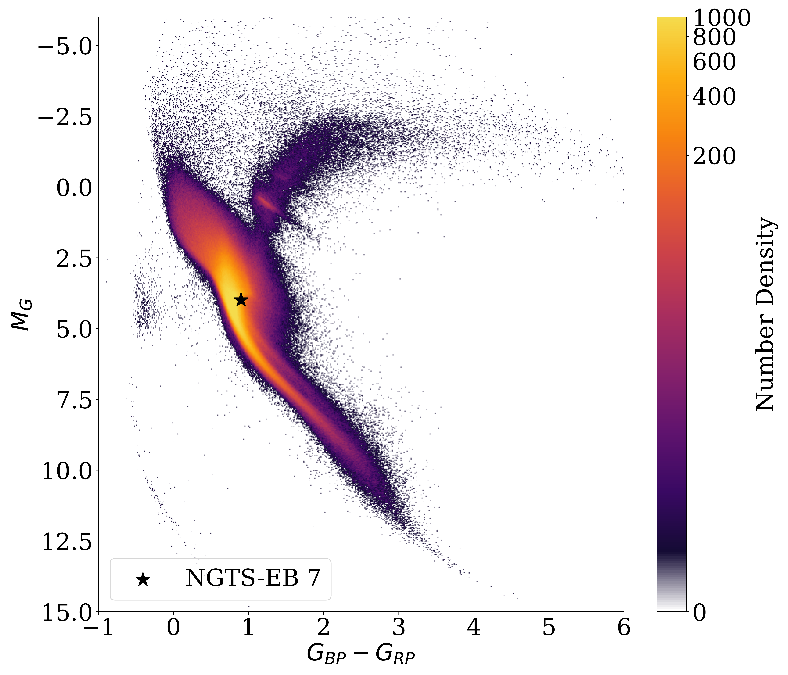

$\newcommand{\ensuremath}{}$
$\newcommand{\xspace}{}$
$\newcommand{\object}[1]{\texttt{#1}}$
$\newcommand{\farcs}{{.}''}$
$\newcommand{\farcm}{{.}'}$
$\newcommand{\arcsec}{''}$
$\newcommand{\arcmin}{'}$
$\newcommand{\ion}[2]{#1#2}$
$\newcommand{\textsc}[1]{\textrm{#1}}$
$\newcommand{\hl}[1]{\textrm{#1}}$
$\newcommand{\footnote}[1]{}$
$\newcommand{\kepler}{{\it Kepler}}$
$\newcommand{\corot}{{\it CoRoT}}$
$\newcommand{\TESS}{{\it TESS}}$
$\newcommand{\tess}{{\it TESS}}$
$\newcommand{\PLATO}{{\it PLATO}}$
$\newcommand{\plato}{{\it PLATO}}$
$\newcommand{\gaia}{{\it Gaia}}$
$\newcommand{\GAIA}{{\it Gaia}}$
$\newcommand{\twomass}{{\it 2MASS}}$
$\newcommand{\JWST}{{\it JWST}}$
$\newcommand{\jwst}{{\it JWST}}$
$\newcommand{\NGTS}{{\it NGTS}}$
$\newcommand{\ngts}{{\it NGTS}}$
$\newcommand{\LSO}{La Silla Observatory}$
$\newcommand{\paranal}{{Paranal Observatory}}$
$\newcommand{\Spitzer}{\textit{Spitzer}}$
$\newcommand{\HARPS}{{\it HARPS}}$
$\newcommand{\harps}{{\it HARPS}}$
$\newcommand{\Minerva}{{\it MINERVA-Australis}}$
$\newcommand{\minerva}{{\it MINERVA-Australis}}$
$\newcommand{\iSHELL}{{\it iSHELL}}$
$\newcommand{\ishell}{{\it iSHELL}}$
$\newcommand{\FEROS}{{\it FEROS}}$
$\newcommand{\feros}{{\it FEROS}}$
$\newcommand{\CORALIE}{{\it CORALIE}}$
$\newcommand{\coralie}{{\it CORALIE}}$
$\newcommand{\Ktwo}{K2}$
$\newcommand{\hires}{{\it HIRES}}$
$\newcommand{\HiRES}{{\it HIRES}}$
$\newcommand{\HIRES}{{\it HIRES}}$
$\newcommand{\pfs}{{\it PFS}}$
$\newcommand{\PFS}{{\it PFS}}$
$\newcommand{\MEarth}{{\it MEarth}}$
$\newcommand{\MEarthSouth}{{\it MEarth-South}}$
$\newcommand{\astep}{{\it ASTEP}}$
$\newcommand{\ASTEP}{{\it ASTEP}}$
$\newcommand{\lco}{{\it LCOGT}}$
$\newcommand{\lcogt}{{\it LCOGT}}$
$\newcommand{\LCO}{{\it LCOGT}}$
$\newcommand{\LCOGT}{{\it LCOGT}}$
$\newcommand{\waspsouth}{{\it WASP-South}}$
$\newcommand{\wasp}{{\it WASP}}$
$\newcommand{\WASP}{{\it WASP}}$
$\newcommand{\kelt}{{\it KELT}}$
$\newcommand{\hatnet}{{\it HATNet}}$
$\newcommand{\hatsouth}{{\it HAT-South}}$
$\newcommand{\cheops}{{\it CHEOPS}}$
$\newcommand{\CHEOPS}{{\it CHEOPS}}$
$\newcommand{\Keck}{{\it Keck}}$
$\newcommand{\keck}{{\it Keck}}$
$\newcommand{\Gemini}{{\it Gemini}}$
$\newcommand{\gemini}{{\it Gemini}}$
$\newcommand{\VLT}{{\it VLT}}$
$\newcommand{\vlt}{{\it VLT}}$
$\newcommand{\SOAR}{{\it SOAR}}$
$\newcommand{\soar}{{\it SOAR}}$
$\newcommand{\tres}{{\it TRES}}$
$\newcommand{\TRES}{{\it TRES}}$
$\newcommand{\kesprint}{{\it KESPRINT}}$
$\newcommand{\KESPRINT}{{\it KESPRINT}}$
$\newcommand{\ucac}{{\it UCAC4}}$
$\newcommand{\apass}{{\it APASS}}$
$\newcommand{\saao}{{\it SAAO}}$
$\newcommand{\SAAO}{{\it SAAO}}$
$\newcommand{\eulercam}{{\it EulerCam}}$
$\newcommand{\trappist}{{\it TRAPPIST}}$
$\newcommand{\TRAPPIST}{{\it TRAPPIST}}$
$\newcommand{\elsauce}{{\it El Sauce}}$
$\newcommand{\speculoos}{{\it SPECULOOS}}$
$\newcommand{\nirps}{{\it NIRPS}}$
$\newcommand{\espresso}{{\it ESPRESSO}}$
$\newcommand{\kms}{km s^{-1}}$
$\newcommand{\ms}{m s^{-1}}$
$\newcommand{\msy}{m s^{-1} yr^{-1}}$
$\newcommand{\masy}{mas yr^{-1}}$
$\newcommand{\wm}{W m^{-2}}$
$\newcommand{\tc}{T\textsubscript{\textit{c}}}$
$\newcommand{\texp}{\mbox{t_{exp}}}$
$\newcommand{\mpl}{\mbox{M_{p}}}$
$\newcommand{\rpl}{\mbox{R\textsubscript{p}}}$
$\newcommand{\mstar}{\mbox{M_{\star}}}$
$\newcommand{\rstar}{\mbox{R_{\star}}}$
$\newcommand{\lstar}{\mbox{L_{\star}}}$
$\newcommand{\mjup}{\mbox{M\textsubscript{J}}}$
$\newcommand{\rjup}{\mbox{R\textsubscript{J}}}$
$\newcommand{\msun}{\mbox{M_{\odot}}}$
$\newcommand{\rsun}{\mbox{R_{\odot}}}$
$\newcommand{\lsun}{\mbox{L_{\odot}}}$
$\newcommand{\ssun}{\mbox{S_{\odot}}}$
$\newcommand{\Lsun}{\mbox{L_{\odot}}}$
$\newcommand{\Msun}{\mbox{M_{\odot}}}$
$\newcommand{\Rsun}{\mbox{R_{\odot}}}$
$\newcommand{\Ssun}{\mbox{S_{\odot}}}$
$\newcommand{\rearth}{R_{\oplus}}$
$\newcommand{\mearth}{M_{\oplus}}$
$\newcommand{\gccc}{g cm^{-3}}$
$\newcommand{\ergscm}{erg s^{-1}cm^{-2}}$
$\newcommand{\teff}{T\textsubscript{eff}}$
$\newcommand{\tmag}{T\textsubscript{mag}}$
$\newcommand{\teq}{T_{\rm eq}}$
$\newcommand{\logg}{\log g}$
$\newcommand{\microm}{\mum}$
$\newcommand{\mone}{\mbox{M_\text{A}}}$
$\newcommand{\rone}{\mbox{R_\text{A}}}$
$\newcommand{\mtwo}{\mbox{M_\text{B}}}$
$\newcommand{\rtwo}{\mbox{R_\text{B}}}$
$\newcommand{\vsini}{v \sin i_\star}$
$\newcommand{\vrad}{v_{\rm rad}}$
$\newcommand{\vmic}{v_{\rm mic}}$
$\newcommand{\vmac}{v_{\rm mac}}$
$\newcommand{\dex}{\rm dex}$
$\newcommand{\met}{[M/H]}$
$\newcommand{\feh}{[Fe/H]}$
$\newcommand{\mgh}{[Mg/H]}$
$\newcommand{\sih}{[Si/H]}$
$\newcommand{\ch}{[C/H]}$
$\newcommand{\oh}{[O/H]}$
$\newcommand{\mdot}{\.{M}}$
$\newcommand{\msunyr}{M_{\odot} yr^{-1}}$
$\newcommand{\MJ}{M_{J}}$
$\newcommand{\RJ}{R_{J}}$
$\newcommand{\halpha}{H\alpha}$
$\newcommand{\hbeta}{H\beta}$
$\newcommand{\sii}{[S {\sc II}] }$
$\newcommand{\oii}{[O {\sc I}] }$
$\newcommand{\oiii}{[O {\sc III}] }$
$\newcommand{\oi}{[O {\sc i}] }$
$\newcommand{\cai}{Ca {\sc I} }$
$\newcommand{\caii}{[Ca {\sc II}] }$
$\newcommand{\feii}{[Fe {\sc II}] }$
$\newcommand{\fei}{[Fe {\sc I}] }$
$\newcommand{\nii}{[N {\sc II}] }$
$\newcommand{\mgi}{Mg {\sc I} }$
$\newcommand{\nai}{[Na {\sc I}]}$
$\newcommand{\msd}{m~s^{-1}~d^{-1}}$
$\newcommand{\gc}{g~cm^{-3}}$
$\newcommand{\lgr}{\log (R^\prime_{HK})}$
$\newcommand{\lgt}{\log~t}$
$\newcommand{\logrhk}{log R^\prime_\mathrm{HK}}$
$\newcommand{\tiara}{\texttt{TIaRA}}$
$\newcommand{\TICID}{TIC 238060327}$
$\newcommand{\OBJID}{\ngts-EB-7}$
$\newcommand{\logrhkval}{-5.12\pm0.17}$
$\newcommand{\secondarydurtot}{12.7\pm0.2}$
$\newcommand{\secondarydurfull}{10.6\pm0.2}$
$\newcommand{\Tnoughtocc}{2459503.5\pm0.1}$
$\newcommand{\phinoughtocc}{0.0900\pm0.0006}$
$\newcommand{\MBMsun}{0.096^{+0.003}_{-0.004}}$
$\newcommand{\MBMjup}{102^{+4}_{-5}}$
$\newcommand{\apodistance}{1.13\pm0.06}$
$\newcommand{\peridistance}{0.189\pm0.009}$
$\newcommand{\hostteff}{5770\pm110}$
$\newcommand{\hostlogg}{4.17\pm0.15}$
$\newcommand{\hostmet}{0.26\pm0.12}$
$\newcommand{\hostvsini}{2.7\pm0.8}$
$\newcommand{\hostrad}{1.45^{+0.07}_{-0.06}}$
$\newcommand{\isohostmass}{1.13^{+0.06}_{-0.07}}$
$\newcommand{\hostage}{10\pm1}$
$\newcommand{\alles}{\texttt{allesfitter}}$
$\newcommand{\paws}{\texttt{PAWS}}$
$\newcommand{\ariadne}{\texttt{astroARIADNE}}$
$\newcommand{\specmatch}{\texttt{specmatch-emp}}$
$\newcommand{\isochrones}{\texttt{isochrones}}$
$\newcommand{\thebibliography}{\DeclareRobustCommand{\VAN}[3]{##3}\VANthebibliography}$

# $\OBJID$, an eccentric, long-period, low-mass eclipsing binary

<mark>Appeared on: 2025-01-09</mark> -  _Main body: 14 pages, 6 figures, 5 tables. Appendices: 7 pages, 5 figures, 5 tables_

T. Rodel, et al. -- incl., <mark>J. Eberhardt</mark>, <mark>T. Henning</mark>

**Abstract:** Despite being the most common types of stars in the Galaxy, the physical properties of late M dwarfs are often poorly constrained. A trend of radius inflation compared to evolutionary models has been observed for earlier type M dwarfs in eclipsing binaries, possibly caused by magnetic activity. It is currently unclear whether this trend also extends to later type M dwarfs below the convective boundary. This makes the discovery of lower-mass, fully convective, M dwarfs in eclipsing binaries valuable for testing evolutionary models – especially in longer-period binaries where tidal interaction between the primary and secondary is negligible. With this context, we present the discovery of the $\OBJID$ AB system, an eclipsing binary containing a late M dwarf secondary and an evolved G-type primary star. The secondary star has a radius of $\BRcompanionRsun$ $\rsun$ , a mass of $\MBMsun$ $\msun$ and follows a highly eccentric (e= $\Be$ ) orbit every $\Bperiod$ days. This makes $\OBJID$ AB the third longest-period eclipsing binary system with a secondary smaller than 200 $\mjup$ with the mass and radius constrained to better than 5 \% . In addition, $\OBJID$ is situated near the centre of the proposed LOPS2 southern field of the upcoming $\plato$ mission, allowing for detection of the secondary eclipse and measurement of the companion's temperature. With its long-period and well-constrained physical properties - $\OBJID$ B will make a valuable addition to the sample of M dwarfs in eclipsing binaries and help in determining accurate empirical mass/radius relations for later M dwarf stars.

**Figure 2. -** Radial velocity measurements of $\OBJID$.Radial velocity measurements of $\OBJID$. Data points from $\coralie$ are denoted with a black circle, $\harps$ is shown with a blue square and $\feros$ with grey triangles. The median fitted RV model is also overplotted in red. The top panel shows the data while the bottom shows the residuals after subtracting the best model fit. Subfigure **(a)** shows the data plotted versus time while **(b)** shows the same data as a function of orbital phase.Radial velocities as a function of time.Radial velocities after phase-folding on the orbital period of \Bperiod days. (*fig:RV_plot*)

**Figure 1. -** Transit lightcurves of $\OBJID$ normalised to the out-of-transit flux levels. Each panel shows the median transit model (see Section \ref{section:allesfitter}) as a solid red line. The transit data plotted is shown as black square markers with errorbars. The top panel of each subfigure shows the data and model while the lower panel of each shows the residuals after the model has been subtracted from the observed data.$\tess$ Sector 8 transit.$\tess$ Sector 29 transit.$\ngts$ transit. (*fig:transits*)

**Figure 3. -** $\gaia$ DR3 Hertzsprung Russell diagram with the position of $\OBJID$ A highlighted with a black star symbol. $\gaia$ BP-RP colour is plotted against absolute magnitude in the G band for all stars in the crossmatched SPOC FFI sample described in \protect[Doyle, et. al (2024)](https://ui.adsabs.harvard.edu/abs/2024MNRAS.529.1802D). The position of $\OBJID$ A shown is consistent with a star beginning to move off the main sequence. (*fig:gaia_HRD*)

