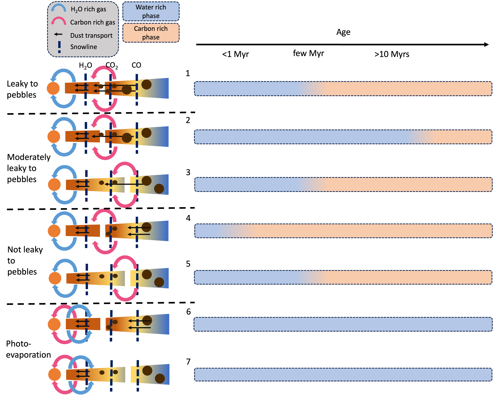
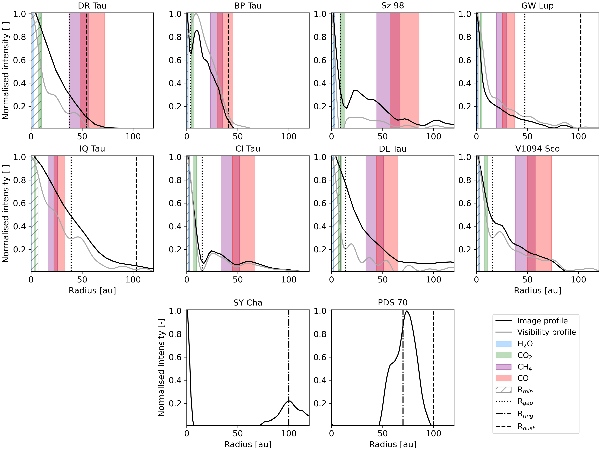
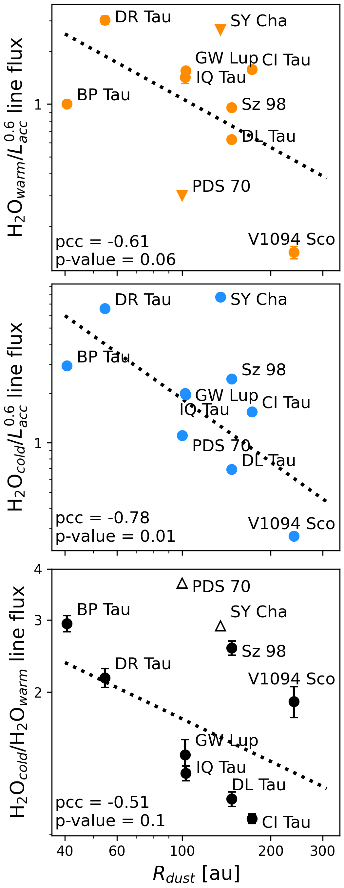

$\newcommand{\ensuremath}{}$
$\newcommand{\xspace}{}$
$\newcommand{\object}[1]{\texttt{#1}}$
$\newcommand{\farcs}{{.}''}$
$\newcommand{\farcm}{{.}'}$
$\newcommand{\arcsec}{''}$
$\newcommand{\arcmin}{'}$
$\newcommand{\ion}[2]{#1#2}$
$\newcommand{\textsc}[1]{\textrm{#1}}$
$\newcommand{\hl}[1]{\textrm{#1}}$
$\newcommand{\footnote}[1]{}$

# MINDS. The influence of outer dust disc structure on the volatile delivery to the inner disc

<mark>Appeared on: 2025-01-09</mark> -  _Accepted for publication in A&A. 29 pages, 12 figures and 10 tables_

D. Gasman, et al. -- incl., <mark>T. Henning</mark>, <mark>G. Perotti</mark>, <mark>K. Schwarz</mark>

**Abstract:** The Atacama Large Millimeter/submillimeter Array (ALMA) has revealed that the millimetre dust structures of protoplanetary discs are extremely diverse, ranging from small and compact dust discs to large discs with multiple rings and gaps. It has been proposed that the strength of $\ce{H2O}$ emission in the inner disc particularly depends on the influx of icy pebbles from the outer disc, a process that would correlate with the outer dust disc radius, and that could be prevented by pressure bumps. Additionally, the dust disc structure should also influence the emission of other gas species in the inner disc. Since terrestrial planets likely form in the inner disc regions, understanding their composition is of interest. This work aims to assess the influence of pressure bumps on the inner disc's molecular reservoirs. The presence of a dust gap, and potentially giant planet formation farther out in the disc, may influence the composition of the inner disc, and thus the building blocks of terrestrial planets. Using the improved sensitivity and spectral resolution of the Mid-InfraRed Instrument's (MIRI) Medium Resolution Spectrometer (MRS) on the _James Webb_ Space Telescope ( _JWST_ ) compared to _Spitzer_ , we compared the observational emission properties of $\ce{H2O}$ , $\ce{HCN}$ , $\ce{C2H2}$ , and $\ce{CO2}$ with the outer dust disc structure from ALMA observations, in eight discs with confirmed gaps in ALMA observations, and two discs with gaps of tens of astronomical units in width, around stars with $M_\star \geq 0.45M_{\odot}$ . We used new visibility plane fits of the ALMA data to determine the outer dust disc radius and identify substructures in the discs. We find that the presence of a dust gap does not necessarily result in weak $\ce{H2O}$ emission. Furthermore, the relative lack of colder $\ce{H2O}$ -emission seems to go hand in hand with elevated emission from carbon-bearing species. Of the discs that show significant substructure within the $\ce{CO}$ and $\ce{CH4}$ snowlines, most show detectable emission from the carbon-bearing species. The discs with cavities and extremely wide gaps appear to behave as a somewhat separate group, with stronger cold $\ce{H2O}$ emission and weak warm $\ce{H2O}$ emission. We conclude that fully blocking radial dust drift from the outer disc seems difficult to achieve, even for discs with very wide gaps or cavities, which can still show significant cold $\ce{H2O}$ emission. However, there does seem to be a dichotomy between discs that show a strong cold $\ce{H2O}$ excess and ones that show strong emission from $\ce{HCN}$ and $\ce{C2H2}$ . Better constraints on the influence of the outer dust disc structure and inner disc composition require more information on substructure formation timescales and disc ages, along with the importance of trapping of (hyper)volatiles like CO and $\ce{CO2}$ into more strongly bound ices like $\ce{H2O}$ and chemical transformation of CO into less volatile species.

**Figure 8. -** Emission properties of the inner disc based on the modelling works by \citet{ref:21KaPiKr}, \citet{ref:23KaPiKr}, \citet{ref:24MaSaBi}, \citet{ref:24LiBiHe}, and \citet{ref:24SeVlDi}. (*fig:scenarios*)

**Figure 6. -** Radial profiles of the disc sample based on the analysis in the image (black line) and visibility plane (grey line). The snowline estimates of \ce{H2O}, \ce{CO2}, \ce{CH4}, and \ce{CO} are indicated by the coloured areas. The minimum distance from the star that can be imaged, based on half the beam radius, is indicated by the hatched area. The $R_\text{gap}$, or the location of the innermost detected local minimum, is indicated by the vertical dotted line. The discs are organised from strongest \ce{H2O}/$L_\text{acc}^{0.6}$(top left) to weakest (bottom right), with the two (pre-)transition discs in the bottom row. (*fig:radial_profiles*)

**Figure 1. -** Average of integrated line fluxes of warm (top, orange) and cold (middle, blue) \ce{H2O} gas, and their ratio (bottom, black), plotted against the outer dust disc radius. The PCCs and p values for these log-log scatter plots are given in the panels, and the corresponding trend is indicated by the dotted black line. Upper and lower limits are indicated by triangles. (*fig:water_radius_corr*)

