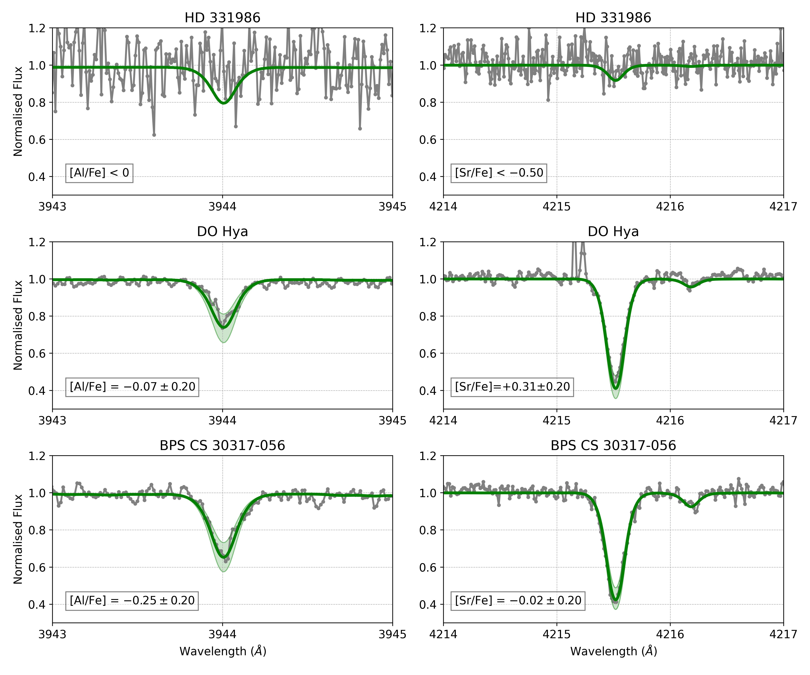
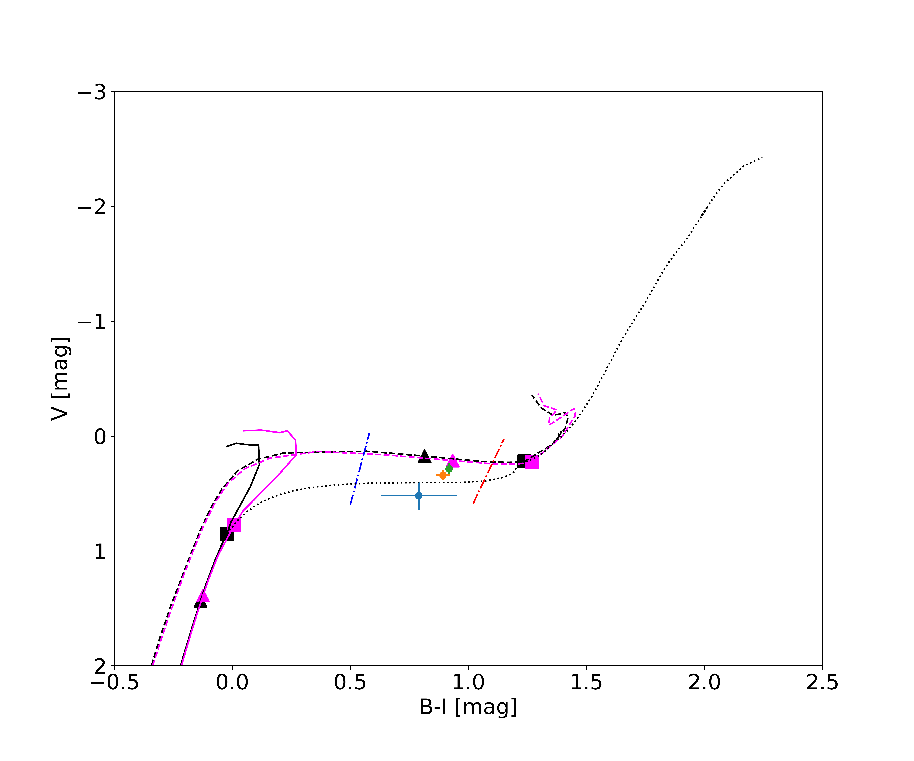
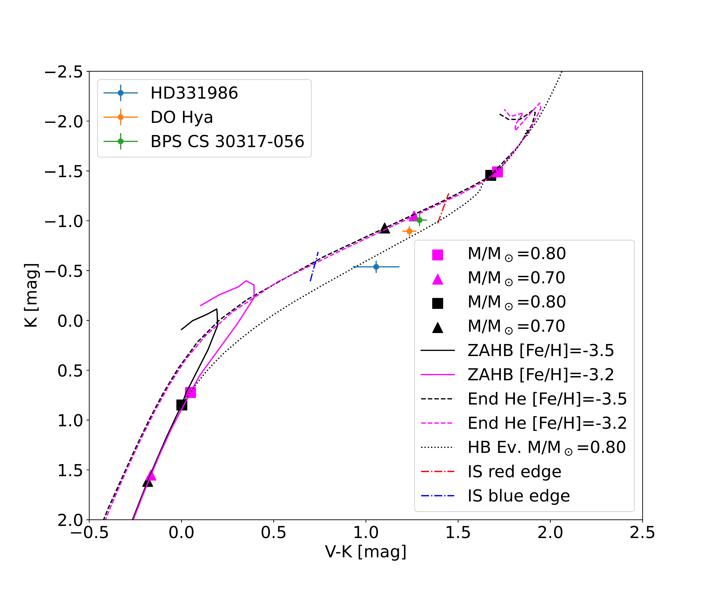
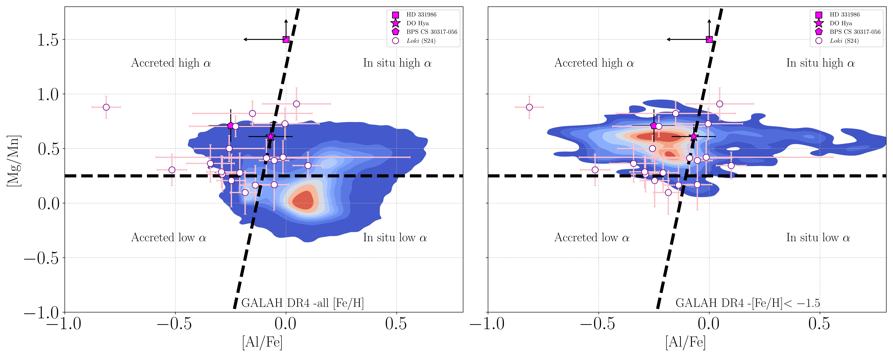

$\newcommand{\ensuremath}{}$
$\newcommand{\xspace}{}$
$\newcommand{\object}[1]{\texttt{#1}}$
$\newcommand{\farcs}{{.}''}$
$\newcommand{\farcm}{{.}'}$
$\newcommand{\arcsec}{''}$
$\newcommand{\arcmin}{'}$
$\newcommand{\ion}[2]{#1#2}$
$\newcommand{\textsc}[1]{\textrm{#1}}$
$\newcommand{\hl}[1]{\textrm{#1}}$
$\newcommand{\footnote}[1]{}$
$\newcommand{\teff}{T_{\text{eff}}}$

# The elderly among the oldest: new evidence for extremely metal-poor RR Lyrae stars$\thanks{Based on observations acquired at the Telescopio Nazionale Galileo under program A43DDT3, on a DDT program with PEPSI at LBT (2021-2022, PI Crestani) and on VLT ESO programs 69.C-0423(A) and 165.N-0276(A).}$

<mark>Appeared on: 2025-01-13</mark> -  _Accepted for publication in Astronomy & Astrophysics; 13 pages. Appendices D-E available on Zenodo_

V. D'Orazi, et al. -- incl., <mark>N. Storm</mark>

**Abstract:** We performed a detailed spectroscopic analysis of three extremely metal-poor RR Lyrae stars, exploring uncharted territories at these low metallicities for this class of stars. Using high-resolution spectra acquired with HARPS-N at TNG, UVES at VLT and PEPSI at LBT, and employing non-LTE spectral synthesis calculations, we provide abundance measurements for Fe, Al, Mg, Ca, Ti, Mn, and Sr.  Our findings indicate that the stars have metallicities of [ Fe/H ] = $-3.40 \pm 0.05$ , $-3.28 \pm 0.02$ , and $-2.77 \pm 0.05$ for HD 331986, DO Hya, and BPS CS 30317-056, respectively. Additionally, we derived their kinematic and dynamical properties to gain insights into their origins. Interestingly, the kinematics of one star (HD 331986) is consistent with the Galactic disc, while the others exhibit Galactic halo kinematics, albeit with distinct chemical signatures. We compared the [ Al/Fe ] and [ Mg/Mn ] ratios of the current targets with recent literature estimates to determine whether these stars were either accreted or formed $in situ$ , finding that the adopted chemical diagnostics are ineffective at low metallicities  ( [ Fe/H ] $\lesssim -$ 1.5).  Finally, the established horizontal branch evolutionary models, indicating that these stars are born hotter at the Zero-Age Horizontal Branch (ZAHB) and then transition into RR Lyrae stars as they evolve, fully support the existence of such low-metallicity RR Lyrae stars. As a consequence, we can anticipate detecting more of them when larger samples of spectra become available from upcoming extensive observational campaigns.

**Figure 4. -** Comparison of the observed (grey) and synthetic (green) spectra. For HD 331986 (upper panel), we present the upper limit synthesis, while for DO Hya (middle panel) and BPS CS 30317-056 (lower panel), we display the best-fit results along with a variation of $\pm 0.2 \mathrm{dex}$(shaded areas). (*fig:synth*)

**Figure 6. -** Left -- Optical $B$-$I$, $V$ CMD showing the location
    of very metal-poor RRLs. The solid lines display predicted Zero Age Horizontal
    Branches at different chemical compositions (see labelled values), while the
    dashed lines the central helium exhaustion for the same chemical compositions
     ([Pietrinferni, Hidalgo and Cassisi 2021]()) .
    Squares and triangles mark different stellar masses along the ZAHB and
    end-of-helium. The almost vertical lines display the blue (hot) and the red (cool)
    edge of the predicted RRL instability strip for Z=1$\times$10$^{-5}$ specifically
    computed for this investigation (see text for more details).
    Right -- Same as the left, but for the optical-NIR ($V$-$K$, $K$) CMD. (*fig:opt_nir_cmd*)

**Figure 5. -** [Mg/Mn] ratios as a function of [Al/Fe] for our three RRLs (filled markers) along with literature estimates, including GALAH DR4 \citep[][density plots in this figure]{buder2024} and $Loki$(empty circles) by [Sestito, Fernandez-Alvar and Brooks (2024)](). (*fig:MgMn_AlFe*)

