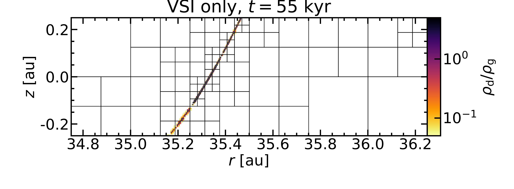
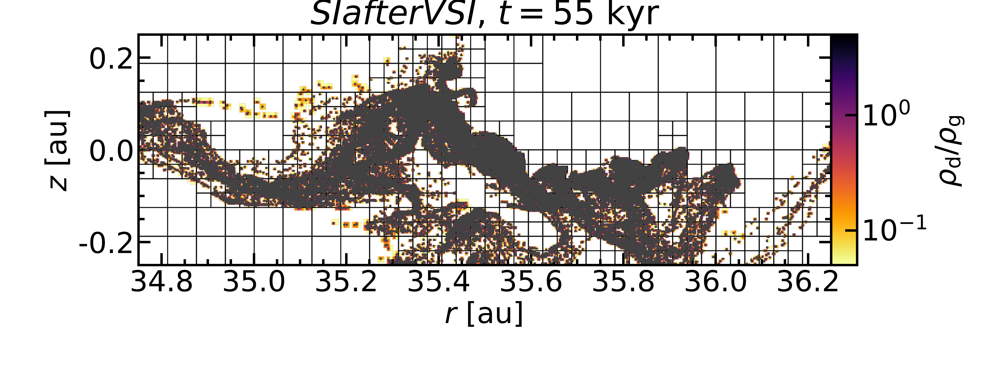
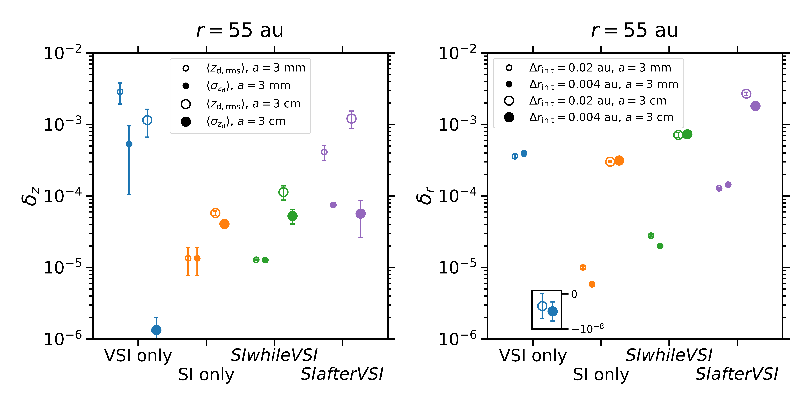
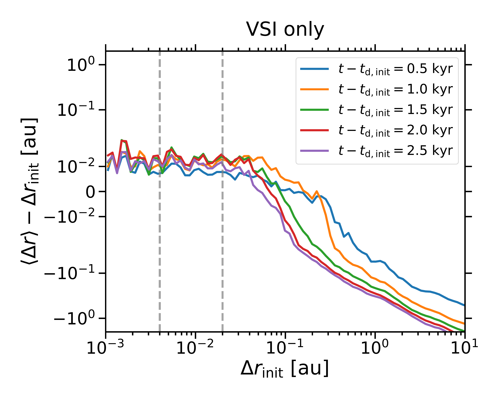
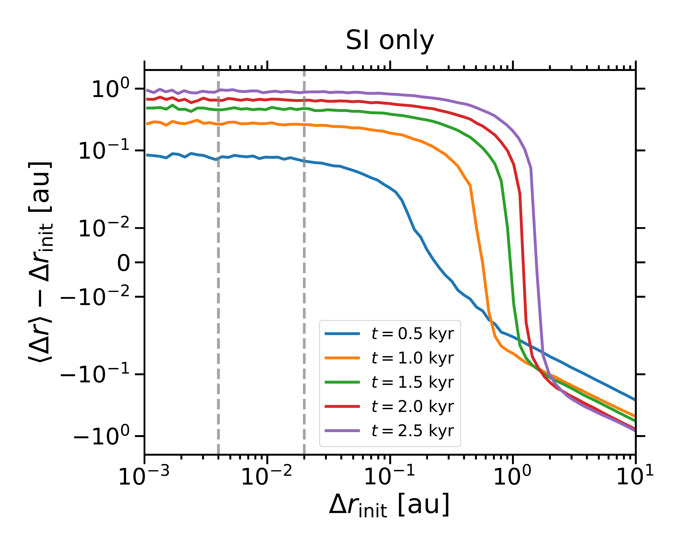

$\newcommand{\ensuremath}{}$
$\newcommand{\xspace}{}$
$\newcommand{\object}[1]{\texttt{#1}}$
$\newcommand{\farcs}{{.}''}$
$\newcommand{\farcm}{{.}'}$
$\newcommand{\arcsec}{''}$
$\newcommand{\arcmin}{'}$
$\newcommand{\ion}[2]{#1#2}$
$\newcommand{\textsc}[1]{\textrm{#1}}$
$\newcommand{\hl}[1]{\textrm{#1}}$
$\newcommand{\footnote}[1]{}$
$\newcommand{\dust}{\textrm{d}}$
$\newcommand{\gas}{\textrm{g}}$
$\newcommand{\mm}{\textrm{mm}}$
$\newcommand{\cm}{\textrm{cm}}$
$\newcommand{\mum}{\text{\textmu}\textrm{m}}$
$\newcommand{\au}{\textrm{au}}$
$\newcommand{\yr}{\textrm{yr}}$
$\newcommand{\kyr}{\textrm{kyr}}$
$\newcommand{\St}{\textrm{St}}$
$\newcommand{\K}{\textrm{K}}$
$\newcommand{\g}{\textrm{g}}$

# The coexistence of the streaming instability and the vertical shear instability in protoplanetary disks: Scale-dependence of dust diffusion

<mark>Appeared on: 2025-01-15</mark> -  _15 pages, 8 figures, 2 tables; accepted for publication in Astronomy & Astrophysics_

U. Schäfer, A. Johansen, <mark>M. Flock</mark>

**Abstract:** The vertical shear instability and the streaming instability are two robust sources of turbulence in protoplanetary disks. The former has been found to induce anisotropic turbulence that is stronger in the vertical than in the radial dimension and to be overall stronger compared to the largely isotropic turbulence caused by the streaming instability. In this study, we shed light on the dust diffusion by the vertical shear instability and the streaming instability separately and together, and in particular on the direction- and scale-dependence of the diffusion. To this end, we employ two-dimensional global models of the two instabilities either in isolation or in combination. The vertical shear instability in isolation diffuses dust more strongly in the vertical direction than the streaming instability in isolation, resulting in a wave-shaped dust layer in our two-dimensional simulations. Compared with this large-scale diffusion, though, our study highlights that the vertical shear instability causes substantially weaker or even negligible small-scale diffusion. We validate this result using previously published three-dimensional simulations. In particular when simulating centimetre-sized dust, the undulating dust layer becomes internally razor-thin. In contrast, the diffusion owing to the streaming instability exhibits only a marginal scale-dependence, with the dust layer possessing a Gaussian shape. In models including both instabilities, the undulating mid-plane layer is broadened to a width set by the intrinsic diffusion level caused by the streaming instability.

**Figure 2. -** Ratio of dust $\rho_{$\dust$}$ to gas (volume) density $\rho_{$\gas$}$ as a function of radius $r$ and height $z$, the latter in units of gas scale heights $H_{$\gas$}$(upper panels). Zoom-in on dust-to-gas density ratio $\rho_{$\dust$}/\rho_{$\gas$}$ as a function of radius $r$ and height $z$, with grid structure and dust particles being plotted as black lines and grey dots, respectively (lower panels). Simulations of the vertical shear instability only and of the scenario *SIafterVSI* with a dust size of $3 $\cm$$ are depicted in the upper and left panel as well as lower and right panel, respectively. While the dust is stirred up to a marginally greater scale height  with respect to the mid-plane in the former simulation, the dust layer is much thinner. Its width indeed amounts to less than a grid cell, while the layer in the latter simulation extends over multiple cells both in the radial and in the vertical dimension. (*fig:dust_concentration_VSI_SIafterVSI*)

**Figure 4. -** Dimensionless coefficients of vertical dust diffusion $\delta_z$ calculated from the time-averaged root mean square $z_{\textrm{d,rms}}$(circles) and standard deviation $\sigma_{z_{$\dust$}}$(squares) of the vertical dust particle positions (left panel). Dimensionless radial dust diffusion coefficients $\delta_r$ computed considering all dust particles that are initially located within $\Delta r_{\textrm{init}}=0.1 $\au$$(circles) or $\Delta r_{\textrm{init}}=0.01 $\au$$(squares). In both panels, open and filled symbols represent simulations with a dust size of $3 $\mm$$ and $3 $\cm$$, respectively. Simulations of only the vertical shear instability, only the streaming instability, the scenario *SIwhileVSI*, and the scenario *SIafterVSI* are depicted using blue, orange, green, and purple markers, respectively. We note that the vertical diffusion coefficients in the vertical shear instability simulation with the larger dust size fall outside of the ordinate range and are therefore plotted in an inset with a different ordinate. (*fig:dust_diffusion_comparison*)

**Figure 5. -** Difference between average and initial radial separation $\Delta r$ of dust particle pairs as a function of their initial separation in simulations of the vertical shear instability (left panel) and the streaming instability (right panel) with $3 $\cm$$-sized dust.  We note that the scale of the abscissa is linear between $10^{-2}$ and $-10^{-2}$ and logarithmic otherwise. If their initial separation is less than \mbox{${\sim}0.1 $\au$$}(equivalent to $0.08$ and $1.5$ gas scale heights at the inner and outer radial boundaries), the distance between two particles remains roughly constant if only the vertical shear instability is simulated, while the streaming instability causes the distance to gradually increase with time (differently coloured solid lines). The dashed grey lines mark initial separations of $0.004 $\au$$ and $0.2 $\au$$; we choose these scales to measure small-scale and large-scale radial diffusion induced by the two instabilities individually and jointly. If the initial separation exceeds \mbox{${\sim}0.1 $\au$$}, on the other hand, two particles move closer together with time in both simulations. This is because the inwards drift speed of the particles increases with the radius, and the separation of particles at different radii thus decreases. (*fig:radial_distance_diffusion_VSI_SI*)

