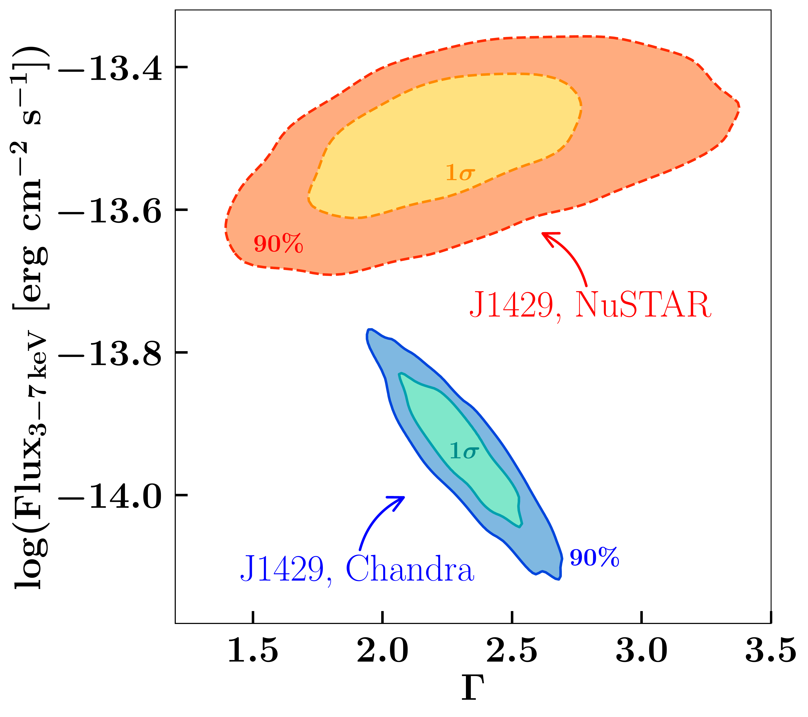
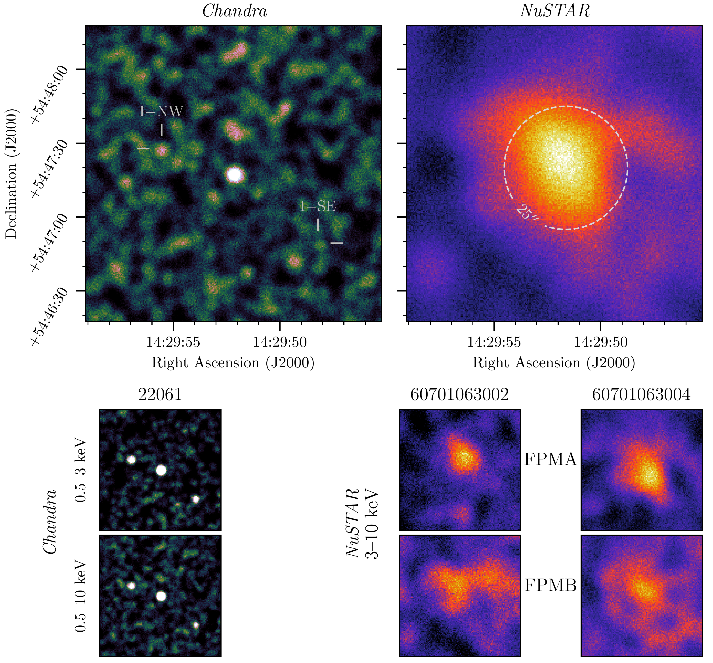
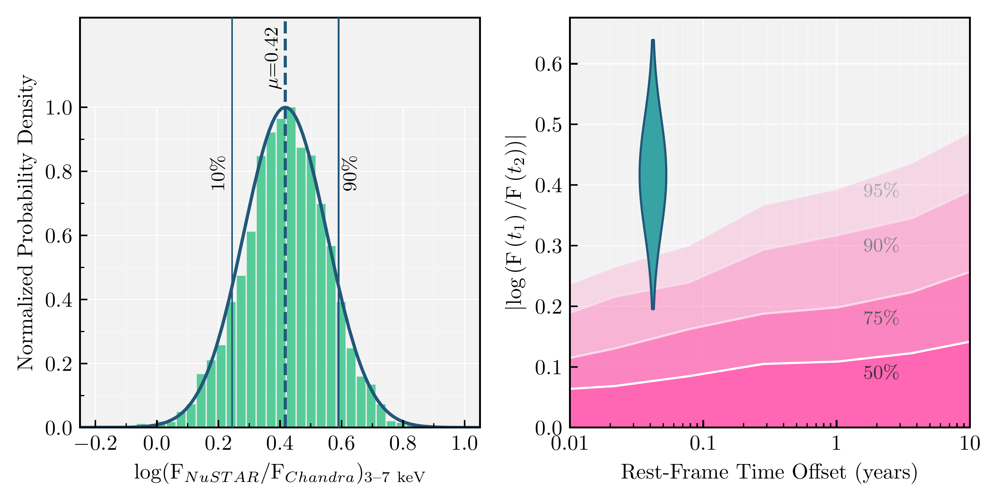

$\newcommand{\ensuremath}{}$
$\newcommand{\xspace}{}$
$\newcommand{\object}[1]{\texttt{#1}}$
$\newcommand{\farcs}{{.}''}$
$\newcommand{\farcm}{{.}'}$
$\newcommand{\arcsec}{''}$
$\newcommand{\arcmin}{'}$
$\newcommand{\ion}[2]{#1#2}$
$\newcommand{\textsc}[1]{\textrm{#1}}$
$\newcommand{\hl}[1]{\textrm{#1}}$
$\newcommand{\footnote}[1]{}$
$\newcommand{\uat}[2]{\href{http://astrothesaurus.org/uat/#2}{#1 (#2)}}$
$\newcommand{\shortname}{J1429+5447}$
$\newcommand{\longname}{\objectname{CFHQS J142952+544717}}$
$\newcommand{\cii}{[C\ensuremath{ \textsc{ii}}]}$
$\newcommand{\mgii}{Mg\ensuremath{ \textsc{ii}}}$
$\newcommand{\RNum}[1]{\uppercase\expandafter{\romannumeral #1\relax}}$

# NuSTAR observations of a varying-flux quasar in the Epoch of Reionization

<mark>Appeared on: 2025-01-15</mark> -  _16 pages, 7 Figures, 3 Tables; accepted for publication in the Astrophysical Journal Letters (ApJL)_

L. Marcotulli, et al. -- incl., <mark>E. Bañados</mark>, <mark>S. Belladitta</mark>, <mark>Y. Khusanova</mark>

**Abstract:** With enough X-ray flux to be detected in a 160 s scan by _SRG_ /eROSITA, the $z=6.19$ quasar $\longname$ is, by far, the most luminous X-ray source known at $z>6$ . We present deep (245 ks) _NuSTAR_ observations of this source; with ${\sim}180$ net counts in the combined observations, $\longname$ is the most distant object ever observed by the observatory. Fortuitously, this source was independently observed by _Chandra_ ${\sim}110$ days earlier, enabling the identification of two nearby ( $30"$ and $45"$ away), fainter X-ray sources. We jointly fit both _Chandra_ and _NuSTAR_ observations \textemdash self-consistently including interloper sources \textemdash and find that, to greater than 90 \% confidence, the observed $3-7 \rm keV$ flux varied by a factor of $\sim2.6$ during that period, corresponding to approximately two weeks in the quasar rest-frame. This brightening is one the most extreme instances of statistically significant X-ray variability seen in the Epoch of Reionization. We discuss possible scenarios that could produce such rapid change, including X-ray emission from jets too faint at radio frequencies to be observed.

**Figure 3. -** $3-7 \rm keV$ posterior flux distribution versus the full-band photon index posterior distribution for $\shortname$ obtained with the simultaneous fit of the three _Chandra_ sources and the co-added _ NuSTAR_ FPMAs (details in Section \ref{sec:month-time}). The $1\sigma$ and 90\% contour levels are reported in the plot. There is no overlap between the two contours, which is a further indication that the flux of the source varied in the four months (observed frame) between observations. The photon index distributions span a similar range, indicating that more likely the source only varied in flux. Note that these photon indices are extracted by fitting datasets covering different energy ranges, and hence cannot be compared one-to-one. (*fig:dist_flux*)

**Figure 1. -** _Chandra_(left) and _NuSTAR_(right) X-ray observations of $\shortname$. All panels show the same $2^\prime \times 2^\prime$ region, and the sets of images are smoothed by Gaussian kernels of radius $2^{\prime\prime}$(_Chandra_) and $8^{\prime\prime}$(_NuSTAR_). **Top:**$3-10 \rm keV$ images of the single _Chandra_ observation and the combined _NuSTAR_ observation. Reticles on the _Chandra_ image mark the positions of I-SW and I-NE. A circular aperture of radius $25^{\prime\prime}$ is drawn around the centroid of the _NuSTAR_ flux. **Bottom Left:**_Chandra_ observations in a soft 0.5\textendash3.0 keV band (upper) and broad 0.5\textendash10.0 keV band (lower). The two interloper sources are clearly seen in these two bands, despite not contributing significant flux to the $3-10 \rm keV$ band. **Bottom Right**: _NuSTAR_ 3\textendash10 keV images of $\shortname$ from observation 60701063002 (N02, left) and 60701063004 (N04, right) with FPMA (top) and FPMB (bottom). $\shortname$ is clearly detected in the combined image as well as the individual exposures, albeit less significantly in the FPMB images owing to the higher background.
       (*fig:sky_images*)

**Figure 4. -** ** Left:** Histogram of the difference between the _Chandra_ and _NuSTAR_$3-7 \rm keV$ posterior flux distribution obtained by simultaneously fitting all three _Chandra_ data sets and the _NuSTAR_ co-added FPMA. The mean (dashed vertical line) and 90\% confidence limit (CL, solid vertical lines) of the distributions obtained by a Gaussian fit (solid line) are shown. This histogram highlights that $\shortname$ varied in flux between the _Chandra_ and _NuSTAR_ epoch of observation at $>90\%$ CL. The mean of the distribution indicates that the _NuSTAR_ flux is $\sim2.6$ times higher than the _Chandra_ one. Moreover, only 0.26\% of the distribution has a value $\leq0$, in support of the fact that it is highly unlikely that the source did not vary between the two epochs. **Right:** 90\% distribution of flux offsets observed for $\shortname$(dark blue-green) relative to flux offsets observed for lower-redshift ($z=[1,2]$) AGN in a broadly similar regime of black hole masses ($M_{\rm BH}>10^8$) and Eddington ratios ($\lambda_{\rm Edd} > 0.01$) by \citet[from dark to light pink]{2024MNRAS.531.4524G}. Most of the probability distribution of observed brightening occupies the region where fewer than 5\% of comparison flux variations reside. The rapidity of such a significant flux offset is thus unusual for an AGN. (*fig:flux_var*)

