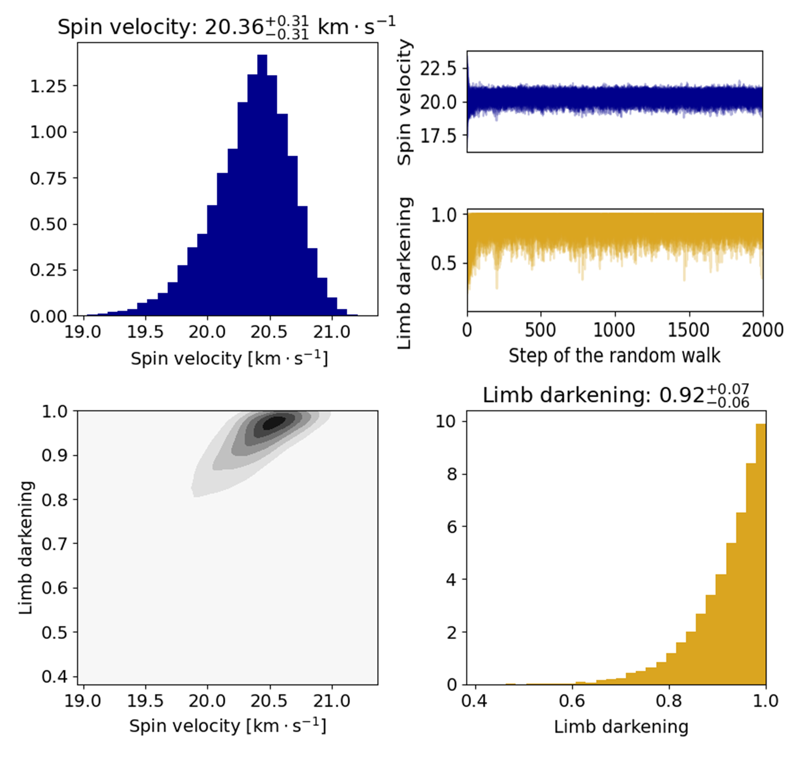
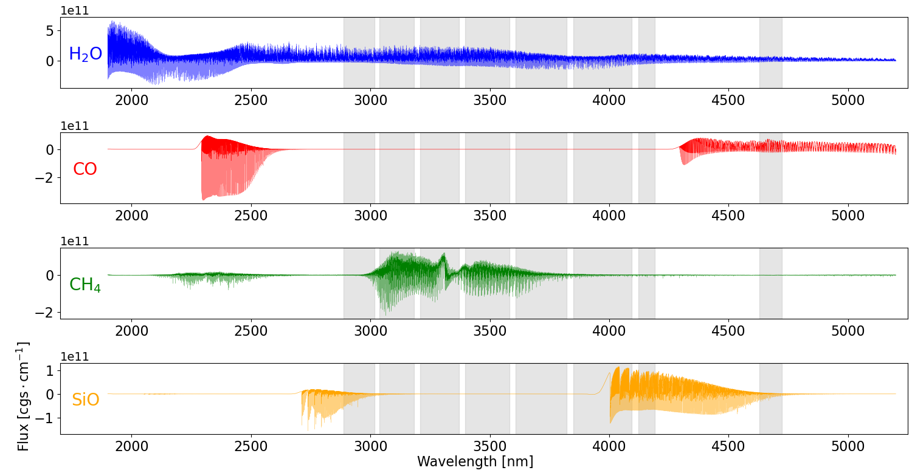

$\newcommand{\ensuremath}{}$
$\newcommand{\xspace}{}$
$\newcommand{\object}[1]{\texttt{#1}}$
$\newcommand{\farcs}{{.}''}$
$\newcommand{\farcm}{{.}'}$
$\newcommand{\arcsec}{''}$
$\newcommand{\arcmin}{'}$
$\newcommand{\ion}[2]{#1#2}$
$\newcommand{\textsc}[1]{\textrm{#1}}$
$\newcommand{\hl}[1]{\textrm{#1}}$
$\newcommand{\footnote}[1]{}$

# Deep high-resolution L band spectroscopy in the $\beta$ Pictoris planetary system$\thanks{Based on observations from the European Southern Observatory, Chile (Programme 0110.C-4301(A)).}$

<mark>Appeared on: 2025-01-16</mark> -  _18 pages, 21 figure, accepted for publication in A&A_

M. Janson, et al. -- incl., <mark>P. Molliere</mark>

**Abstract:** The $\beta$ Pictoris system, with its two directly imaged planets $\beta$ Pic b and $\beta$ Pic c and its well characterised debris disk, is a prime target for detailed characterisation of young planetary systems. Here, we present high-resolution and high-contrast LM band spectroscopy with CRIRES+ of the system, primarily for the purpose of atmospheric characterisation of $\beta$ Pic b. We developed methods for determining slit geometry and wavelength calibration based on telluric absorption and emission lines, as well as methods for point spread function (PSF) modelling and subtraction, and artificial planet injection, in order to extract and characterise planet spectra at a high signal-to-noise ratio ( $S/N$ ) and spectral fidelity. Through cross-correlation with model spectra, we detected $H_2$ O absorption for planet b in each of the 13 individual observations spanning four different spectral settings. This provides a clear confirmation of previously detected water absorption, and allowed us to derive an exquisite precision on the rotational velocity of $\beta$ Pic b, $v_{\rm rot} = 20.36 \pm 0.31$ km/s, which is consistent within error bars with previous determinations. We also observed a tentative $H_2$ O cross-correlation peak at the expected position and velocity of planet c; the feature is however not at a statistically significant level. Despite a higher sensitivity to SiO than earlier studies, we do not confirm a tentative SiO feature previously reported for planet b. When combining data from different epochs and different observing modes for the strong $H_2$ O feature of planet b, we find that the $S/N$ grows considerably faster when sets of different spectral settings are combined, compared to when multiple data sets of the same spectral setting are combined. This implies that maximising spectral coverage is often more important than maximising integration depth when investigating exoplanetary atmospheres using cross-correlation techniques.

**Figure 11. -** Left: CCFs in units of $S/N$ for $H_2$O in the atmosphere of $\beta$ Pic b. Thick red line: Actual CCF for the location of the planet. Thick black line: CCF for the location at the opposite side of the star. Thin lines: CCF for injected $H_2$O, colour coded by different volume mixing ratios as shown in the colour bar. Right: $S/N$ of injected signals as function of VMR. The green shaded area shows at which range of VMRs the molecule would have been marginally detectable. (*f:injh2o*)

**Figure 5. -** Results from MCMC fitting of the spin velocity and limb darkening parameter. Upper left: Histogram for the spin velocity. Upper right: Evolution of the spin velocity (blue) and limb darkening parameter (gold) along the MCMC random walk. Lower left: Correlation between spin velocity and limb darkening. Lower right: Histogram for the limb darkening parameter. (*f:broadening*)

**Figure 6. -** Model spectra after continuum subtraction, showing where strong lines occur for four different molecules: $H_2$O in blue, CO in red, $CH_4$ in green, and SiO in orange. The grey regions are the wavelength ranges covered by our observations. (*f:mainmol*)

