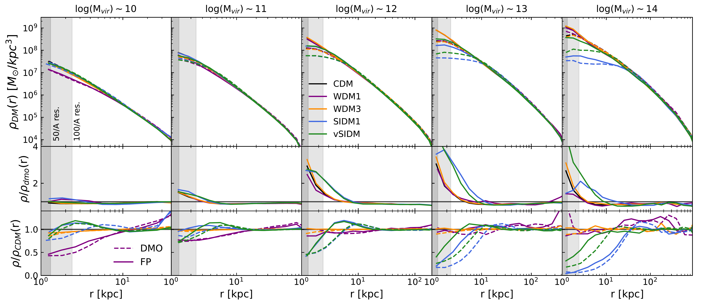
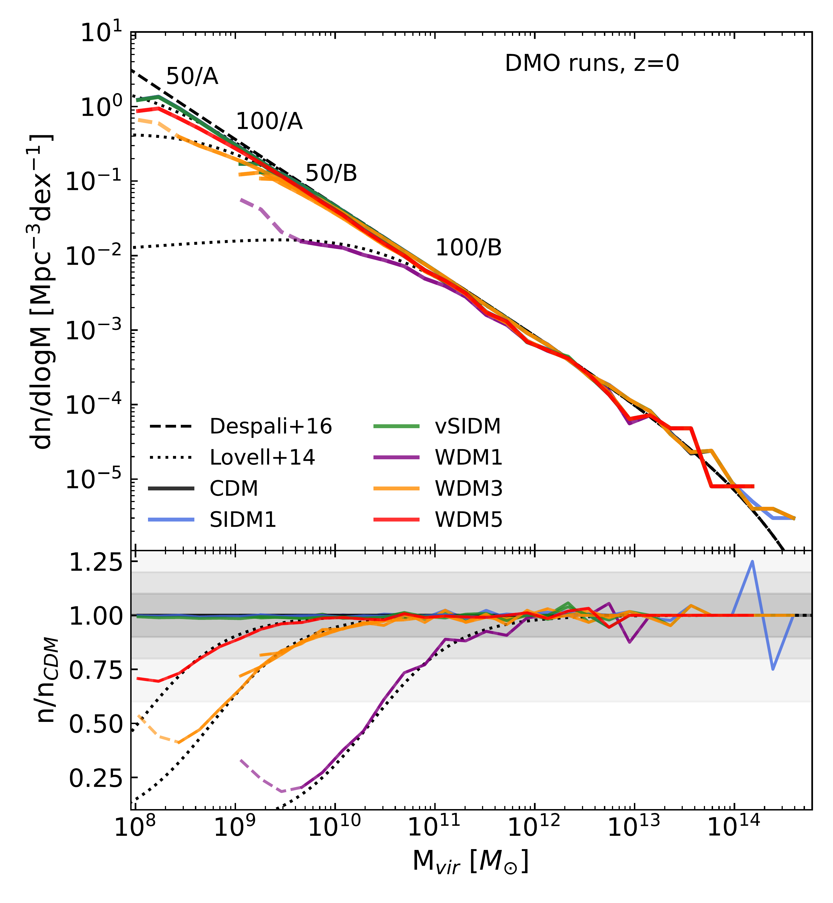
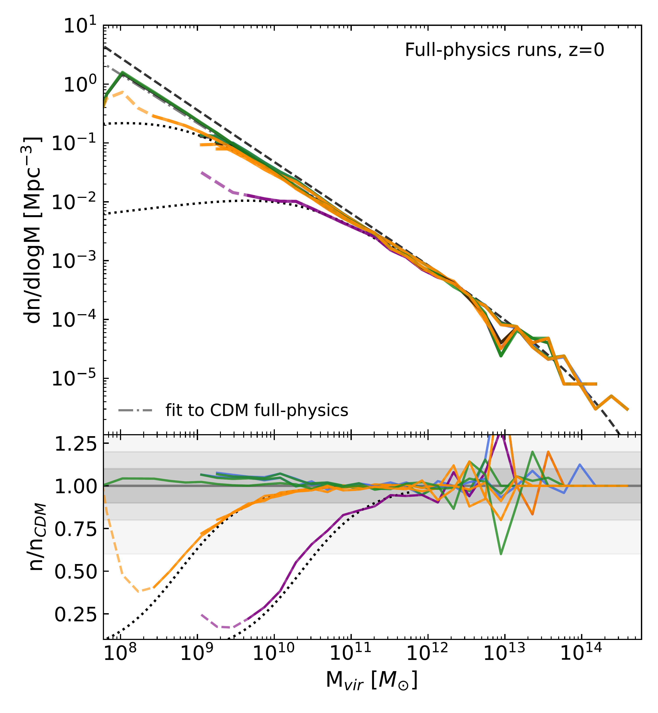

$\newcommand{\ensuremath}{}$
$\newcommand{\xspace}{}$
$\newcommand{\object}[1]{\texttt{#1}}$
$\newcommand{\farcs}{{.}''}$
$\newcommand{\farcm}{{.}'}$
$\newcommand{\arcsec}{''}$
$\newcommand{\arcmin}{'}$
$\newcommand{\ion}[2]{#1#2}$
$\newcommand{\textsc}[1]{\textrm{#1}}$
$\newcommand{\hl}[1]{\textrm{#1}}$
$\newcommand{\footnote}[1]{}$
$\newcommand{\arraystretch}{1.3}$

# Introducing the AIDA-TNG project:\\galaxy formation in alternative dark matter models

<mark>Appeared on: 2025-01-23</mark> -  _20 pages, 18 figures, submitted to A&A. Comments welcome, get in touch to know more about opportunities to use the runs - this https URL_

G. Despali, et al. -- incl., <mark>A. Pillepich</mark>

**Abstract:** We introduce the AIDA-TNG project, a suite of cosmological magnetohydrodynamic simulations that simultaneously model galaxy formation and different variations of the underlying dark matter model. We consider the standard cold dark matter model and five variations, including three warm dark matter scenarios and two self-interacting models with constant or velocity-dependent cross-section. In each model, we simulate two cosmological boxes of 51.7 and 110.7 Mpc on a side, with the same initial conditions as TNG50 and TNG100, and combine the variations in the physics of dark matter with the fiducial IllustrisTNG galaxy formation model. The AIDA-TNG runs are thus ideal for studying the simultaneous effect of baryons and alternative dark matter models on observable properties of galaxies and large-scale structures. We resolve haloes in the range between $10^{8}$ and $4\times10^{14} $ M $_{\odot}$ and scales down to the nominal resolution of 570 pc in the highest resolution runs. This work presents the first results on statistical quantities such as the halo mass function and the matter power spectrum; we quantify the modification in the number of haloes and the power on scales smaller than 1 Mpc, due to the combination of baryonic and dark matter physics. Despite being calibrated on cold dark matter, we find that the TNG galaxy formation model can produce a realistic galaxy population in all scenarios. The stellar and gas mass fraction, stellar mass function, black hole mass as a function of stellar mass and star formation rate density are very similar in all dark matter models, with some deviations only in the most extreme warm dark matter model. Finally, we also quantify changes in halo structure due to warm and self-interacting dark matter, which appear in the density profiles, concentration-mass relation and galaxy sizes.

**Figure 11. -** Dark matter density profiles at $z=0$ when considering five halo mass bins (left to right). We calculate the mean dark matter profile in bins of $\Delta \log(M_{\rm vir})=0.2$ dex around the mean value, both in the full-physics (solid) and dark (dashed) runs. The profiles are calculated in logarithmically spaced spherical shells from 1 kpc to the halo virial radius. In order to capture both a good statistics at high masses and the highest resolution, we average profiles from both the 50/A and 100/A runs for all models -- except WDM1, where 50/B is employed. The small panels show, $(i)$ the ratio of each mean profile to its dark counterpart, and $(ii)$ to the CDM version. We observe an opposite trend in mass in the WDM and SIDM models: the latter create larger density cores at high masses and cuspy profiles at $M_{\rm vir}\leq 10^{12} {\rm M}_{\odot}$, the former instead lowers the central density at low masses, i.e. halo masses below the half-mode mass $M_{\rm hm}$. In all panels, the gray bands indicate 2.3$\epsilon_{\rm DM}$ for both runs, which is often used as the minimum distance for reliable measurements. (*fig:prof1*)

**Figure 8. -** Halo mass function at $z=0$ in the DMO (left) and FP (right) runs of the four simulation sets listed in Table \ref{table:1}. For each set, we only plot haloes with masses $M_{\rm vir}\geq100 m_{\rm DM}$, corresponding to increasingly smaller low-mass limits as indicated by the labels in the top-left panel. The smaller panels show the ratio of each model to CDM. The dashed black line gives the theoretical prediction calculated by [Despali, Giocoli and Angulo (2016)]() -- which agrees very well with the mass function measured in the DMO runs, while the dotted lines are calculated by applying to it the correction derived by [Lovell, Frenk and Eke (2014)](). In the right panel, we also plot the CDM DMO mass function (black dashed line) to highlight the suppression generated by baryons at the low-mass end, compared to the DMO case. For the WDM runs, the transition between dashed and solid lines marks the limiting mass $M_{\rm lim}$ below which the runs are affected by artificial fragmentation. (*fig:massf*)

**Figure 5. -** Visualisation of the dark matter (top), gas (middle) and stellar (bottom) projected mass distributions in a Milky-Way mass halo ($M_{\rm vir}=6.9\times10^{12} {\rm M}_{\odot}$ in CDM at $z=0$) from the 100/A runs: from left to right, CDM, SIDM1, vSIDM and WDM3. We zoom onto the central parts of the halo, $\sim0.5 r_{\rm vir}$ in the top and middle panels, and $\sim0.25 r_{\rm vir}$ in the stellar distribution. In the latter, we also mark the distance corresponding to twice the stellar half-mass radius. We can observe a decrease in the number of substructures in WDM3, as well as a clear difference in the gas dynamics and the shape of the stellar distribution.
               (*fig:visual1*)

