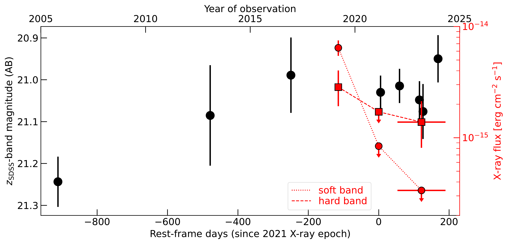
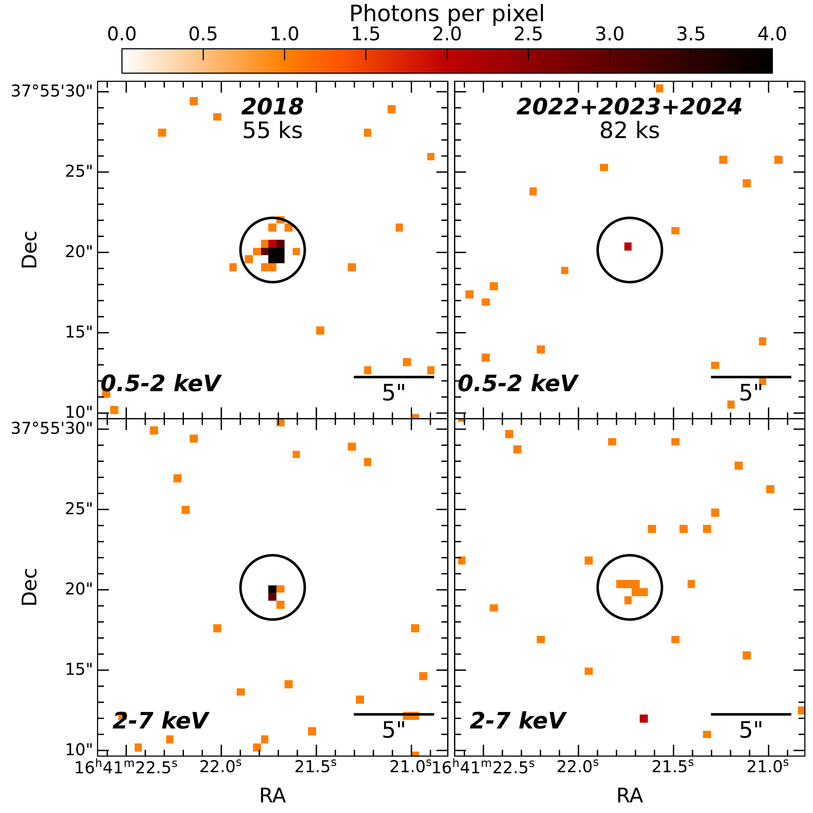

$\newcommand{\ensuremath}{}$
$\newcommand{\xspace}{}$
$\newcommand{\object}[1]{\texttt{#1}}$
$\newcommand{\farcs}{{.}''}$
$\newcommand{\farcm}{{.}'}$
$\newcommand{\arcsec}{''}$
$\newcommand{\arcmin}{'}$
$\newcommand{\ion}[2]{#1#2}$
$\newcommand{\textsc}[1]{\textrm{#1}}$
$\newcommand{\hl}[1]{\textrm{#1}}$
$\newcommand{\footnote}[1]{}$
$\newcommand{\chandra}{\textit{Chandra}\xspace}$
$\newcommand{\xmm}{\textit{XMM-Newton}\xspace}$
$\newcommand{\alma}{\textit{ALMA}\xspace}$
$\newcommand{\ang}{\mathrm{Å}\xspace}$
$\newcommand{\um}{~\mathrm{\mu m}\xspace}$
$\newcommand{\daox}{\mbox{\Delta\alpha_{ox}}}$
$\newcommand{\aox}{\mbox{\alpha_{\mathrm{ox}}}}$
$\newcommand{\LUV}{\mbox{L_{\mathrm{UV}}}}$
$\newcommand{\zsdss}{\mbox{z_{\mathrm{SDSS}}}}$

# Intervening nuclear obscuration changing the X-ray look of the $z\approx6$ QSO CFHQS J164121+375520

<mark>Appeared on: 2025-01-23</mark> -  _Accepted for publication on A&A Letters_

F. Vito, et al. -- incl., <mark>S. Belladitta</mark>

**Abstract:** X-ray observations of the optically selected $z=6.025$ QSO CFHQS J164121+375520 (hereafter J1641) revealed that its flux dropped by a factor $\gtrsim7$ from 2018, when it was a bright and soft X-ray source, to 2021. Such a strong variability amplitude has not been observed before among $z>6$ QSOs, and the underlying physical mechanism was unclear. We carried out a new X-ray and rest-frame UV monitoring campaign of J1641 over 2022--2024. We detected J1641 with $\chandra$ in the 2--7 keV band, while no significant emission is detected at softer X-ray energies, making J1641 an X-ray changing look QSO at $z>6$ . Comparing with the 2018 epoch, the 0.5--2 keV flux dropped dramatically by a factor $>20$ . We ascribe this behaviour to intervening, and still ongoing, obscuration by  Compton-thick gas intercepting our line of sight between 2018 and 2021. The screening material could be an inner disk or a failed nuclear wind that increased their thickness. Another possibility is that we have witnessed an occultation event due to dust-free clouds located at sub-pc/pc scales, similar to those recently invoked to explain the remarkable X-ray weakness of AGN discovered by JWST. These interpretations are also consistent with the lack of strong variations of the QSO rest-frame UV lightcurve over the same period.	Future monitoring of J1641 and the possible discovery of other X-ray changing look QSOs at $z>6$ will provide us with precious information about the physics of rapid supermassive black-hole growth at high redshift.

**Figure 2. -** X-ray lightcurve of J1641 as a function of observation time: red circles and squares are the soft-band and hard-band observed fluxes, respectively. The most recent red points refer to the stacked $\chandra$ observations taken in 2022, 2023, and 2024, and are plotted at the average observing date (Tab. \ref{Tab_Xray_cts}), with horizontal error bars encompassing the times of the three stacked observations.
  The soft-band flux of J1641 dropped by a factor $>20$, while the QSO is still detected in the hard band, with at most a modest dimming. Black points are the $z$-band magnitudes of J1641 (\citetalias{Vito22} and Tab. \ref{Tab_UV}), and show no significant variation over the period covered by the X-ray observations.   (*Fig_lightcurve*)

**Figure 1. -** _Chandra_ images ($20^{\prime\prime}\times20^{\prime\prime}$) of J1641. The left and right columns display the 2018 epoch and the stacked image of the new $\chandra$ monitoring program (2022-2024), respectively, and the associated ACIS-S exposure time. Soft-band  and hard-band  images are shown in the top and bottom rows, respectively.The $R=2$\arcsec$$ circles are the apertures used for X-ray photometry.
	 (*Fig_Xray_images*)

