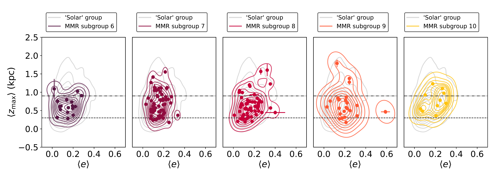
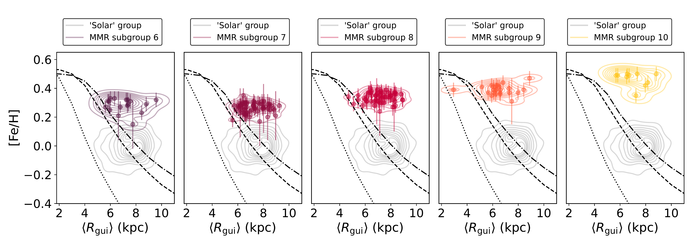
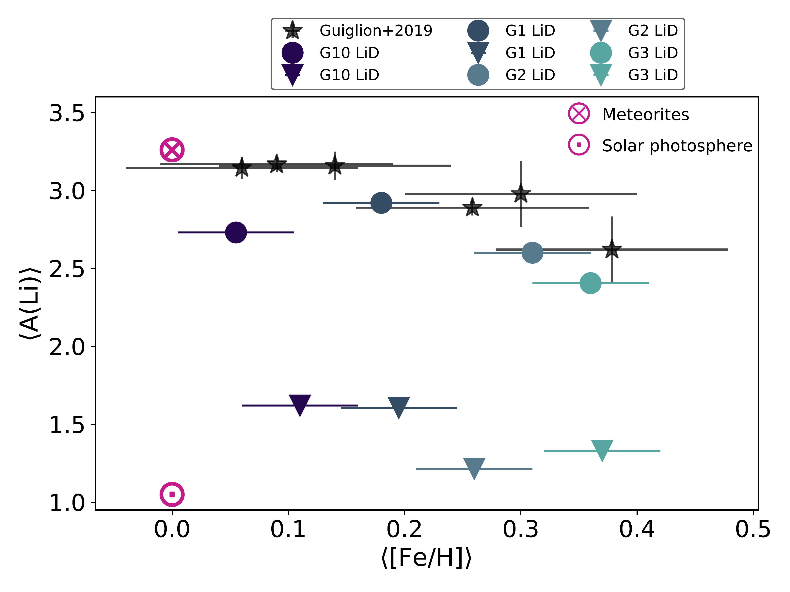
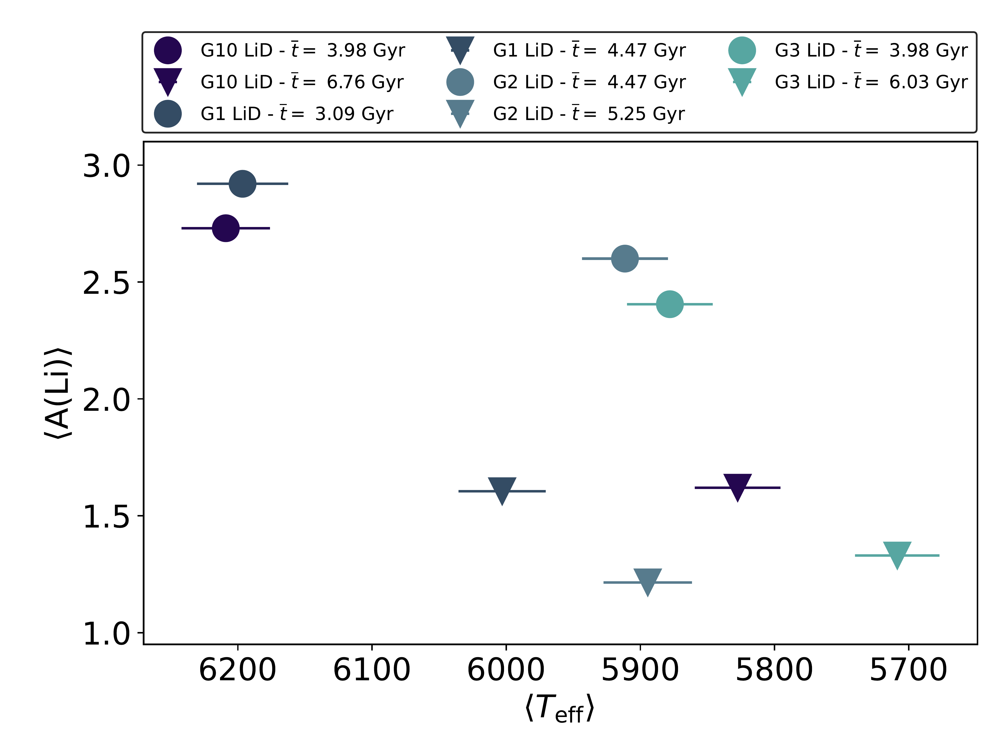

$\newcommand{\ensuremath}{}$
$\newcommand{\xspace}{}$
$\newcommand{\object}[1]{\texttt{#1}}$
$\newcommand{\farcs}{{.}''}$
$\newcommand{\farcm}{{.}'}$
$\newcommand{\arcsec}{''}$
$\newcommand{\arcmin}{'}$
$\newcommand{\ion}[2]{#1#2}$
$\newcommand{\textsc}[1]{\textrm{#1}}$
$\newcommand{\hl}[1]{\textrm{#1}}$
$\newcommand{\footnote}[1]{}$
$\newcommand{\feh}{[Fe/H]}$
$\newcommand{\zmax}{\langle Z_{\rm{max}} \rangle}$
$\newcommand{\eccentricity}{\langle e \rangle}$
$\newcommand{\aj}{AJ}$
$\newcommand{\araa}{ARA\&A}$
$\newcommand{\apj}{ApJ}$
$\newcommand{\apjl}{ApJ}$
$\newcommand{\apjs}{ApJS}$
$\newcommand{\apss}{Ap\&SS}$
$\newcommand{\aap}{A\&A}$
$\newcommand{\aapr}{A\&A~Rev.}$
$\newcommand{\aaps}{A\&AS}$
$\newcommand{\mnras}{MNRAS}$
$\newcommand{\pasp}{PASP}$
$\newcommand{\pasj}{PASJ}$
$\newcommand{\qjras}{QJRAS}$
$\newcommand{\nat}{Nature}$
$\newcommand{\aplett}{Astrophys.~Lett.}$
$\newcommand{\aas}{AAS}$
$\newcommand{\eprint}{e--print}$

# The interplay between super-metallicity, lithium depletion, and radial migration in nearby stars

<mark>Appeared on: 2025-01-29</mark> -  _To appear in the proceedings of IAU Symposium 395 (3 pages)_

M. L. L. Dantas, et al. -- incl., <mark>G. Guiglion</mark>

**Abstract:** We report the discovery of a peculiar set of old super-metal-rich dwarf stars with orbits of low eccentricity that reach a maximum height from the Galactic plane between $\sim$ 0.5-1.5 kpc observed by the $*Gaia*$ -ESO Survey. These stars show lithium (Li) depletion, which is anti-correlated with their [ Fe/H ] . To investigate these stars' chemo-dynamical properties, we used data from the $*Gaia*$ -ESO Survey. We applied hierarchical clustering to group the stars based on their abundances (excluding Li). Orbits were integrated using $*Gaia*$ astrometry and radial velocities from $*Gaia*$ -ESO. Our analysis suggests that the high metallicity of these stars is incompatible with their formation in the solar neighbourhood. We also found that their Li envelope abundance is below the benchmark meteoritic value, in agreement with previous works. This result supports the idea that the Li abundance in old, super-metal-rich dwarf stars should not be considered a proxy for the local interstellar medium Li.

**Figure 2. -** *Top panel*: $\zmax$*vs.*$\eccentricity$ for the five subgroups of the most metal-rich group. The Solar-metallicity group parameters are shown in grey for comparison. The thin and thick disc scale-heights are shown as black dashed and dot-dashed lines respectively. *Bottom panel*: similar to the top panel, but showing [Fe/H]*vs.*$\langle R_{\rm gui} \rangle$(guiding radius). The dotted, dashed, and dot-dashed black curves respectively depict the 3.3, 8, and 11 Gyr models described in \citet{Magrini2009}. The analysis encompassing the full sample with all metallicities is discussed in Dantas et al. (in review). (*fig:zmax_ecc*)

**Figure 1. -** *Left panel:*$\langle{\rm A(Li)} \rangle$ vs $\feh$ for the super-solar groups of the sample, split into those with a direct detection of Li (LiD) and those with an upper limit estimate (LiUL). In this representation, only the median of the top six stars with the highest A(Li) is shown in each marker. The black star-shaped markers display the data from \citet{Guiglion2016}. *Right panel:*$\langle{\rm A(Li)} \rangle$ vs $\langle T_{\rm eff} \rangle$. It is possible to see that A(Li) seems to decrease with decreasing $T_{\rm eff}$. Warmer temperatures seem to have a protective effect on A(Li) due to their thinner convective layers of the stars. (*fig:li*)

