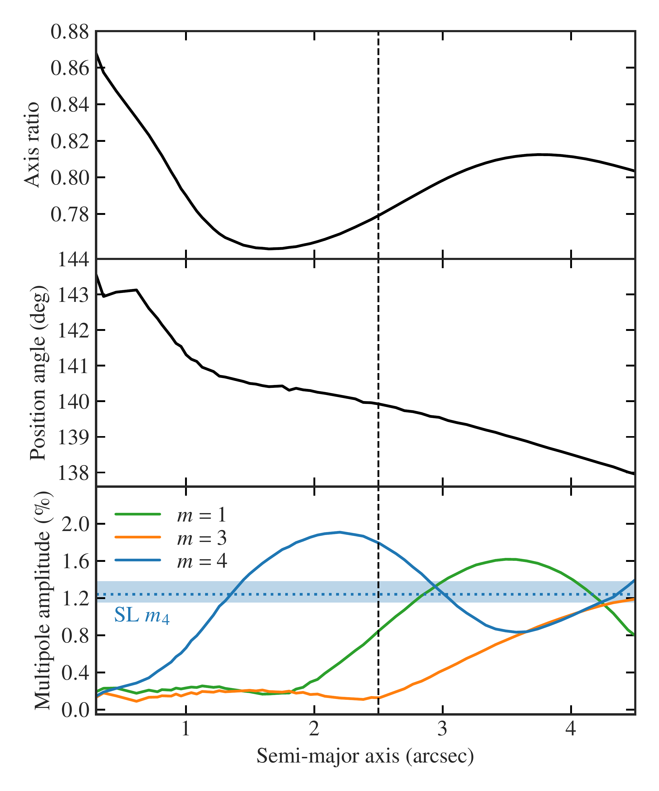
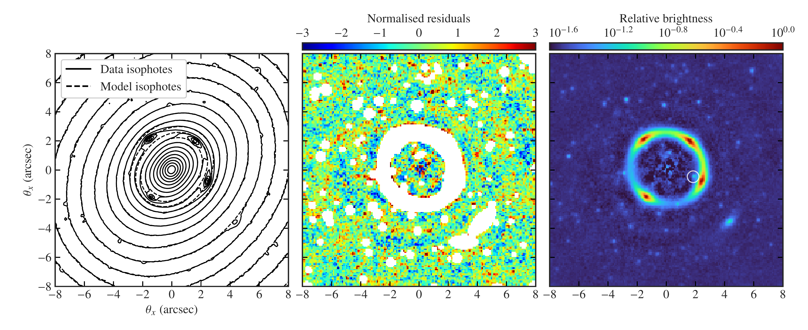
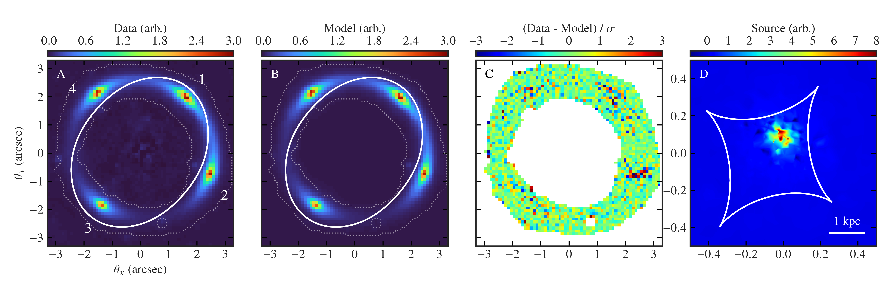

$\newcommand{\ensuremath}{}$
$\newcommand{\xspace}{}$
$\newcommand{\object}[1]{\texttt{#1}}$
$\newcommand{\farcs}{{.}''}$
$\newcommand{\farcm}{{.}'}$
$\newcommand{\arcsec}{''}$
$\newcommand{\arcmin}{'}$
$\newcommand{\ion}[2]{#1#2}$
$\newcommand{\textsc}[1]{\textrm{#1}}$
$\newcommand{\hl}[1]{\textrm{#1}}$
$\newcommand{\footnote}[1]{}$
$\newcommand{\zsvalue}{0.4058}$
$\newcommand{\lensname}{Altieri's lens}$
$\newcommand{\galaxyname}{NGC~6505}$
$\newcommand{\galaxycoords}{RA~\ra{17;51;07.46}, Dec~+\ang{65;31}\ang{;;50.78}}$
$\newcommand{\zl}{z_\mathrm{d}}$
$\newcommand{\zs}{z_\mathrm{s}}$
$\newcommand{\erad}{\theta_\mathrm{E}}$
$\newcommand{\sigmav}{\sigma_\mathrm{v}}$
$\newcommand{\dmfraction}{f_\mathrm{DM}}$
$\newcommand{\Dls}{D_\mathrm{ls}}$
$\newcommand{\Dl}{D_\mathrm{l}}$
$\newcommand{\etheta}{\theta_q}$
$\newcommand{\lensx}{\theta_{\mathrm{l}_x}}$
$\newcommand{\lensy}{\theta_{\mathrm{l}_y}}$
$\newcommand{\posa}{\phi_\mathrm{L}}$
$\newcommand{\lambdas}{\lambda_\mathrm{s}}$
$\newcommand{\extshear}{\gamma_\mathrm{ext}}$
$\newcommand{\imfmismatch}{\alpha_\mathrm{IMF}}$
$\newcommand{\Reff}{R_\mathrm{eff}}$
$\newcommand{\chisqnu}{\chi^2_\nu}$
$\newcommand{\ndof}{N_\mathrm{dof}}$
$\newcommand$
$\newcommand{\prob}[2]{\mathrm{Pr}\left(#1\vert#2\right)}$
$\newcommand{\prior}[1]{\mathrm{Pr}\left(#1\right)}$
$\newcommand{\ev}{\varepsilon}$
$\newcommand{\Msun}{M_\odot}$
$\newcommand{\orcid}[1]$
$\newcommand{\mstarChab}{M_{\star}^\mathrm{Chab}}$
$\newcommand{\mstarmod}{M_{\star}^\mathrm{mod}}$

#     $\Euclid$\/: A complete Einstein ring in NGC 6505    $\thanks{This paper is published on behalf of the Euclid Consortium}$

<mark>Appeared on: 2025-02-11</mark> -  _Accepted in A&A. Press release: this https URL_

C. M. O'Riordan, et al. -- incl., <mark>M. Schirmer</mark>

**Abstract:** We report the discovery of a complete Einstein ring around the elliptical galaxy $\galaxyname$ , at $z=0.042$ . This is the first strong gravitational lens discovered in $\Euclid$ and the first in an NGC object from any survey. The combination of the low redshift of the lens galaxy, the brightness of the source galaxy ( $\IE=18.1$ lensed, $\IE=21.3$ unlensed), and the completeness of the ring make this an exceptionally rare strong lens, unidentified until its observation by $\Euclid$ . We present deep imaging data of the lens from the $\Euclid$ Visible Camera (VIS) and Near-Infrared Spectrometer and Photometer (NISP) instruments, as well as resolved spectroscopy from the _Keck_ Cosmic Web Imager (KCWI). The $\Euclid$ imaging in particular presents one of the highest signal-to-noise ratio optical/near-infrared observations of a strong gravitational lens to date. From the KCWI data we measure a source redshift of $z=0.406$ . Using data from the Dark Energy Spectroscopic Instrument (DESI) we measure a velocity dispersion for the lens galaxy of $\sigma_\star=303\pm15 \kms$ . We model the lens galaxy light in detail, revealing angular structure that varies inside the Einstein ring. After subtracting this light model from the VIS observation, we model the strongly lensed images, finding an Einstein radius of $\ang{;;2.5}$ , corresponding to $2.1 \mathrm{kpc}$ at the redshift of the lens. This is small compared to the effective radius of the galaxy, $R_\mathrm{eff}\sim \ang{;;12.3}$ . Combining the strong lensing measurements with analysis of the spectroscopic data we estimate a dark matter fraction inside the Einstein radius of $\dmfraction = (11.1_{-3.5}^{+5.4})\%$ and a stellar initial mass-function (IMF) mismatch parameter of $\imfmismatch = 1.26_{-0.08}^{+0.05}$ , indicating a heavier-than-Chabrier IMF in the centre of the galaxy.

**Figure 1. -** Properties of the lens galaxy isophotes as a function of the elliptical semi-major axis. _Top panel_: the axis ratio, $q=b/a$, _middle panel_: the position angle of the major axis, _bottom panel_: the total amplitude of multipole perturbations of orders $m=1,3,4$. The multipole perturbations are formulated such that a positive order $m=4$ amplitude produces boxiness. The dotted horizontal line and shaded area indicate the median $m=4$ amplitude measured by the lens modelling only, and its uncertainty respectively. The vertical dashed line indicates the elliptical radius at the critical curve, equivalent to the Einstein radius. (*fig:isophote-properties*)

**Figure 7. -** Modelling of the lens galaxy light profile. _Left_: Isophotes from the final light model plotted with data isophotes in the inner region of NGC 6505. The lensed source emission and emission from other compact sources are visible in the data isophotes. _Middle_: The difference between the data and the model, normalised by the noise in each pixel. Empty pixels are those masked from the fitting procedure. The residuals here show no evidence of a central strongly lensed image. _Right_: The lens light subtracted data, to be used for strong lens modelling presented in Sect. \ref{sec:lens-modelling}. The white circle indicates the compact source of emission included in the lens model. (*fig:vis-light-model*)

**Figure 8. -** Elliptical power-law plus external shear and multipole model of the strongly lensed images. (A) the VIS data with the four lensed images labelled as in Table \ref{tab:image-properties}, (B) the maximum a posteriori model, both in arbitrary flux units, (C) the normalised residuals, and (D) the pixellated source reconstruction in the same units as the data and model. Solid curves in the image plane and source plane are the critical curves and caustics respectively. In (A) and (B) the mask used to model the data is indicated by the dotted white shapes. The physical scale in the source plane is indicated. (*fig:lens-modelling*)

