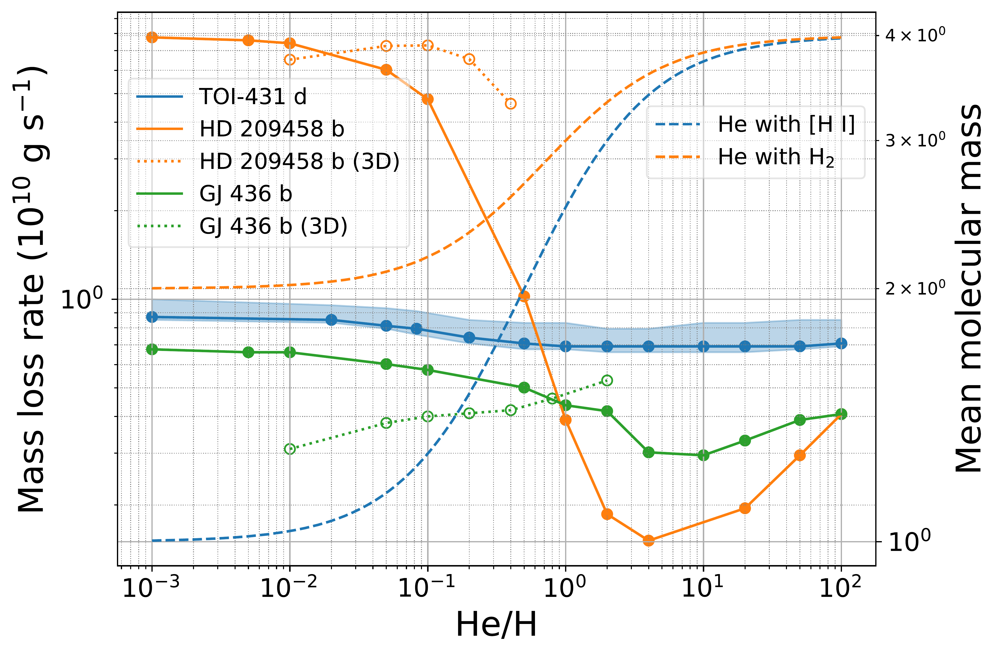
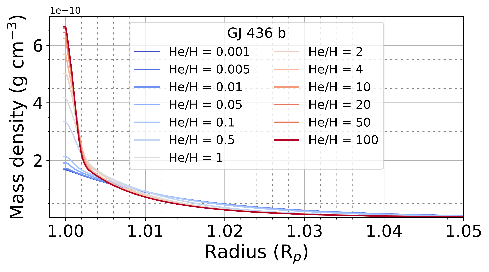
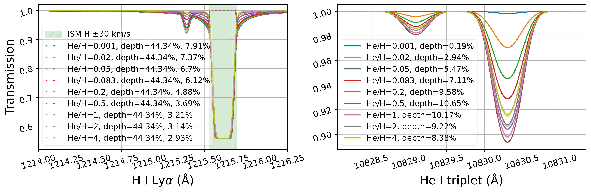

$\newcommand{\ensuremath}{}$
$\newcommand{\xspace}{}$
$\newcommand{\object}[1]{\texttt{#1}}$
$\newcommand{\farcs}{{.}''}$
$\newcommand{\farcm}{{.}'}$
$\newcommand{\arcsec}{''}$
$\newcommand{\arcmin}{'}$
$\newcommand{\ion}[2]{#1#2}$
$\newcommand{\textsc}[1]{\textrm{#1}}$
$\newcommand{\hl}[1]{\textrm{#1}}$
$\newcommand{\footnote}[1]{}$
$\newcommand{\vdag}{(v)^\dagger}$
$\newcommand$
$\newcommand$

# Estimate the Mass Escaping Rates of Radius-valley-spanning Planets in TOI-431 System via XUV Evaporation

<mark>Appeared on: 2025-02-12</mark> -  _16 pages, 14 figures, 4 tabels. Accepted by ApJ_

X. Jiang (蒋效铭), J. H. Jiang, <mark>R. Burn</mark>, Z.-H. Zhu

**Abstract:** TOI-431 system has 3 close-in exoplanets, which gives an ideal lab to study gas escape.In this study, we measure the XUV luminosity for TOI-431 with XMM-Newton/EPIC-pn and OM data, then calculate the fluxes for the planets in the system. We find that, TOI-431 b's $\rm F_{XUV,b}=70286^{+12060}_{-2611}\rm  erg cm^{-2}s^{-1}$ is 75 times of TOI-431 d $\rm F_{XUV,d}=935^{+160}_{-35}\rm  erg cm^{-2}s^{-1}$ .Adopting the energy limit method and hydrodynamic code $ATES$ with a set of He/H ratios, we obtain the mass-loss rates of $10^{10.51^{+0.07}_{-0.02}}$ g s $^{-1}$ for TOI-431 b, $10^{9.14^{+0.07}_{-0.02}}$ and $10^{9.84\sim 9.94}$ g s $^{-1}$ for TOI-431 d. We predict the $2.93\sim 7.91 \%$ H I Ly $\alpha$ and $0.19\sim 10.65\%$ He I triplet absorption depths for TOI-431 d, thus its gas escaping is detectable in principle.For both TOI-431 b and d, we select similar planets from the New Generation Planetary Population Synthesis (NGPPS) data. Then show that considering the mass-loss rates, TOI-431 b should be a naked solid planet, and TOI-431 d will likely maintain its gas envelope until the host star dies.According to the formation and evolution tracks, we find that TOI-431 b's potential birthplace (0.1-2 AU) should be inner than TOI-431 d (2-12 AU).Our results are consistent with the interpretation of the radius valley being caused by atmospheric escape. The intrinsic reason may be their birthplace, which will determine how close they can migrate to the host star, then lose mass and result in the Fulton gap.

**Figure 8. -** **Left axis:** relation of He/H ratio and mass loss rate of TOI-431 d, HD205498 b, and GJ436 b from $ATES$(solid lines) and 3D model in \cite{2018MNRAS.481.5315S}(dotted lines); **Right axis:** relation of He/H ratio and average molecular mass of the atmosphere (dashed line). (*fig:heh_mass_dot_all*)

**Figure 9. -** Density profiles of different He/H ratios for GJ 436 b from $ATES$. As the He/H ratio increases, the atmosphere will fall down quickly. (*fig:density_profiles*)

**Figure 12. -** Theoretical intrinsic (solid) and ISM absorbed (dashed) transmission profiles of H I Ly$\alpha$(the ISM absorbed depths values are listed after the intrinsic depths) and He I triplet for TOI-431 d with the uncertainties range derived from the mass-loss rate uncertainties. The theoretical intrinsic maximum H I Ly$\alpha$ transit depths are almost unchanged $44.34\%$ at 1215.6 $\rm Å$, but with the ISM absorption, transit depths will decrease continually as He/H ratio goes up, and much weaker than the intrinsic transit depth. The He I triplet absorption depths at 10830.3 $\rm Å$ will increase up to 10.65 $\%$ at He/H of 0.5, then decrease as He/H goes up. (*figures/transmission_all_ism_2*)

