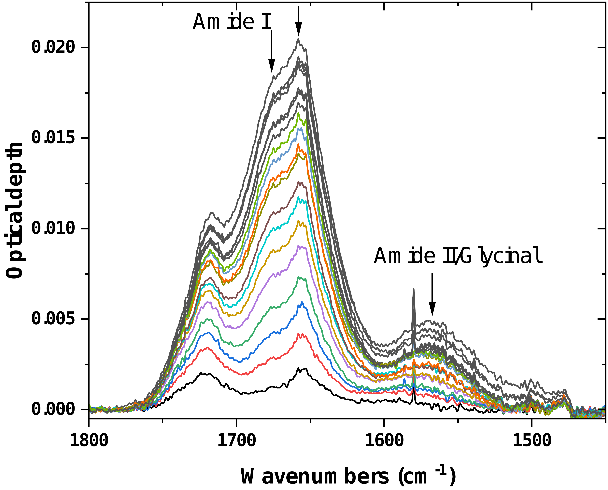
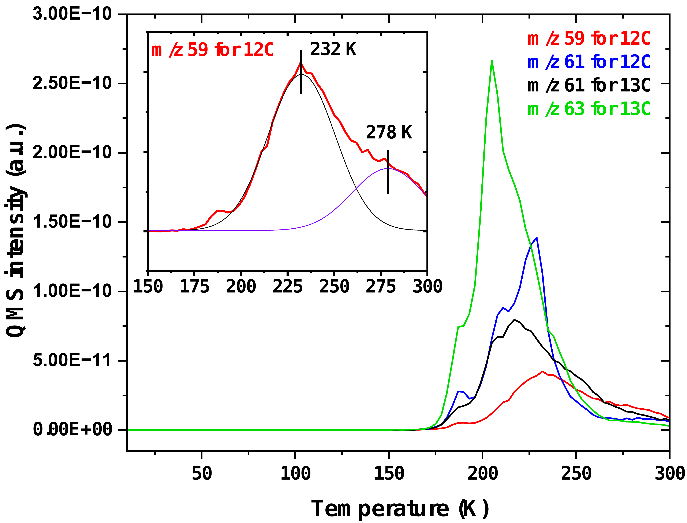
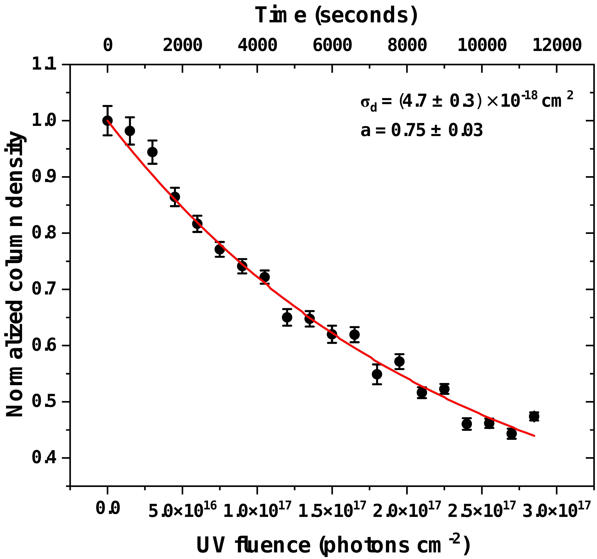
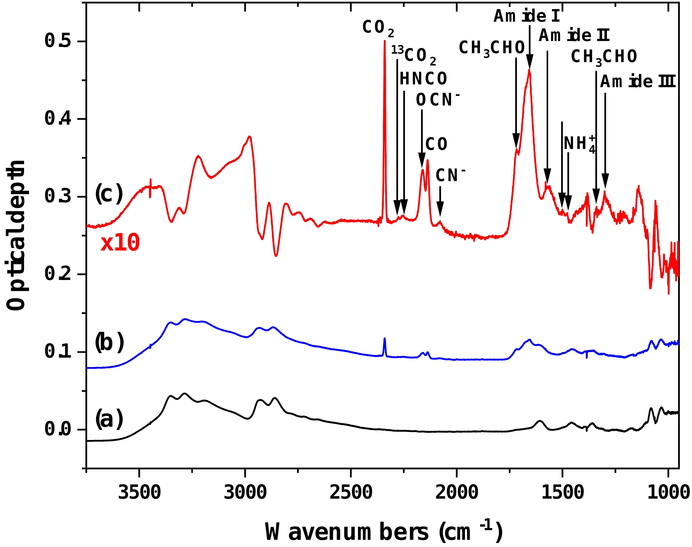

$\newcommand{\ensuremath}{}$
$\newcommand{\xspace}{}$
$\newcommand{\object}[1]{\texttt{#1}}$
$\newcommand{\farcs}{{.}''}$
$\newcommand{\farcm}{{.}'}$
$\newcommand{\arcsec}{''}$
$\newcommand{\arcmin}{'}$
$\newcommand{\ion}[2]{#1#2}$
$\newcommand{\textsc}[1]{\textrm{#1}}$
$\newcommand{\hl}[1]{\textrm{#1}}$
$\newcommand{\footnote}[1]{}$
$\newcommand{\vdag}{(v)^\dagger}$
$\newcommand$
$\newcommand$

# Ly-$\alpha$ processing of solid-state Ethanolamine: Potential Precursors to Sugar and Peptide Derivatives

<mark>Appeared on: 2025-02-13</mark> - 

<mark>T. Suhasaria</mark>, et al. -- incl., <mark>S. Krasnokutski</mark>, <mark>K. Schwarz</mark>, <mark>T. Henning</mark>

**Abstract:** Ethanolamine (EA), a key component of phospholipids, has recently been detected in the interstellar medium within molecular clouds. To understand this observation, laboratory studies of its formation and destruction are essential and should be complemented by astrochemical models. This study investigates the photostability of EA ice under Lyman (Ly)- $\alpha$ (10.2 eV) irradiation at 10 K, and explores its potential role in the formation of simple and complex organic molecules in molecular clouds. The UV destruction cross section of EA was estimated to be ( $4.7\pm0.3)\times10^{-18}$ cm $^2$ , providing insight into its half-life of $6.5\times10^{7}$ yr in dense interstellar clouds. Fourier transform infrared spectroscopy and quadrupole mass spectrometry were used to identify various photoproducts, with their formation pathways discussed. Ethylene glycol and serine were tentatively detected during the warming up process following irradiation, suggesting that EA could contribute to the formation of prebiotic molecules such as sugars, peptides and their derivatives. High mass signals detected in the mass spectrometer suggest the presence of several complex organic molecules, and further analysis of residues at room temperature is planned for future work. The results suggest that EA could contribute to the formation of prebiotic molecules in space, with implications for the origin of life.

**Figure 9. -** The left-hand panel shows a series of mid-IR spectra, where the increasing UV fluence clearly leads to the growth of the amide I and II peaks, along with glycinal in EA-$^{12}$C$2$. In the right-hand panel, the TPD traces obtained via QMS after UV irradiation are displayed. The mass signals at m/z= 59 and 61 correspond to the desorption of glycinal tautomer and EA-$^{12}$$C_2$, respectively. The inset highlights the mass signal at m/z= 59, with peaks around T = 232 K and 278 K, likely corresponding to the desorption of 2-aminoethenol and 1-aminoethenol, respectively. For comparison, the mass signals at m/z= 61 and 63 corresponding to glycinal tautomer and EA-$^{13}$$C_2$ are also shown.   (*glycinal*)

**Figure 1. -** Normalised column density of total C-H stretching band as represented by filled black circles for EA ice on KBr at 10 K, as the UV photon fluence increases. These values are normalised using the corresponding initial column densities. The error arising from baseline subtraction was considered in the error estimation. The best fit of Eq. \ref{A} to the data is depicted with the solid red line. The estimated destruction cross-section ($\sigma_{d}$) and the asymptotic destruction ($_a_$) are also provided. (*cross-section*)

**Figure 2. -** Mid-IR spectrum of about 60 ML EA-$^{12}$$C_2$ film on KBr at 10 K, shown as deposited (a, black line) and after UV irradiation with 2.8$\times10^{17}$ photons cm$^{-2}$(b, blue line). The new products following irradiation are evident in the difference spectrum (c, red line), which represents the spectrum after irradiation minus the spectrum before irradiation. Negative bands correspond to the parent species, while positive bands indicate new products. For clarity, the blue and red curves are offset along the ordinate axis. (*products*)

