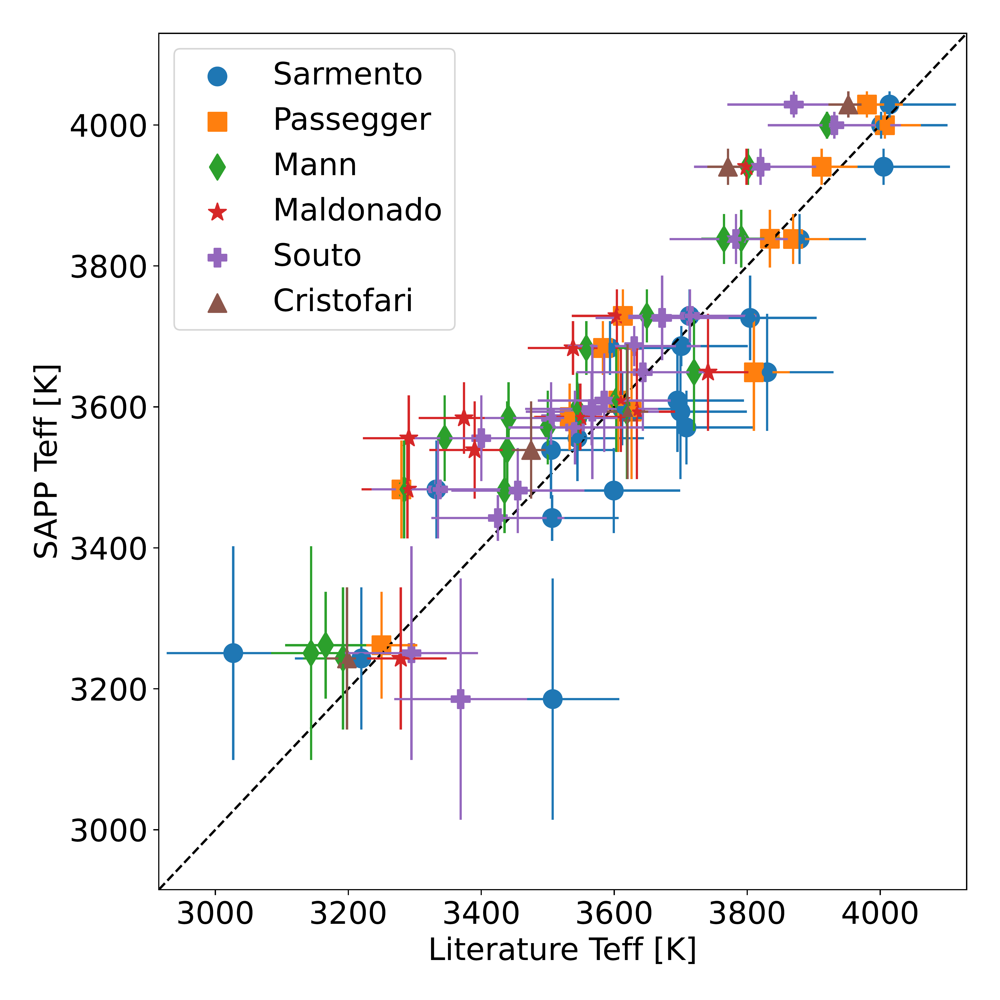
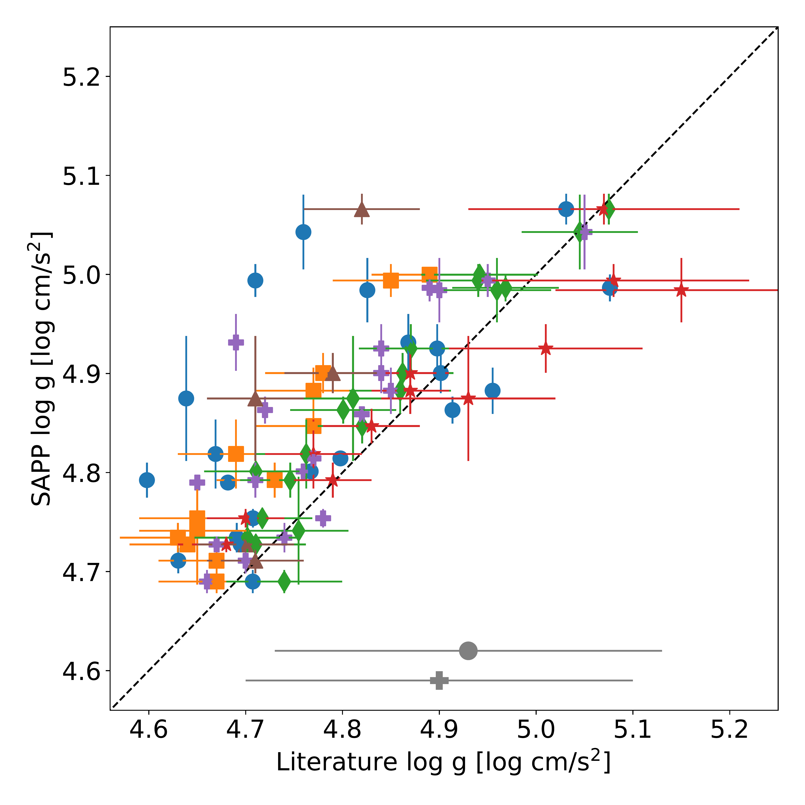
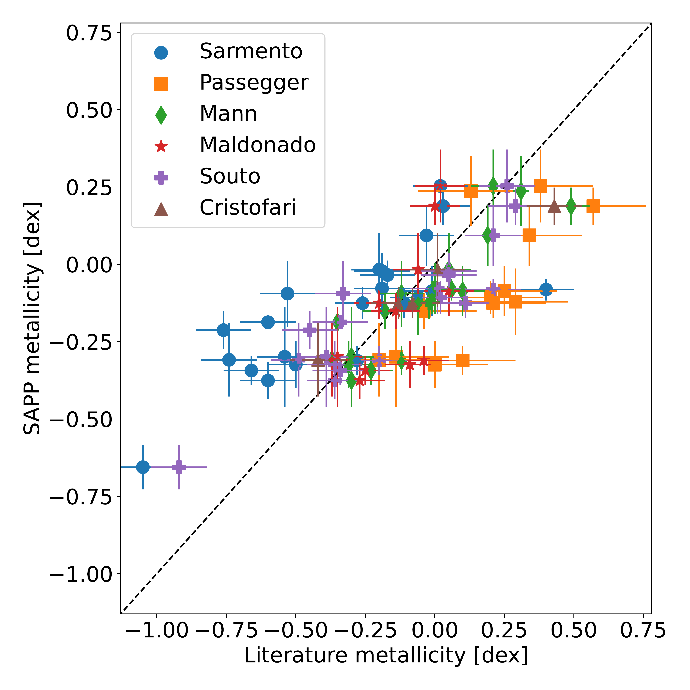
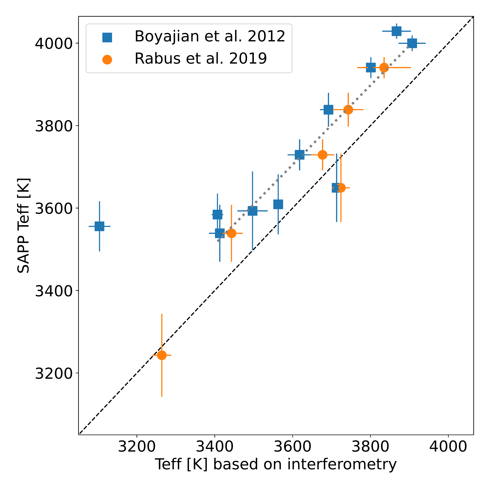
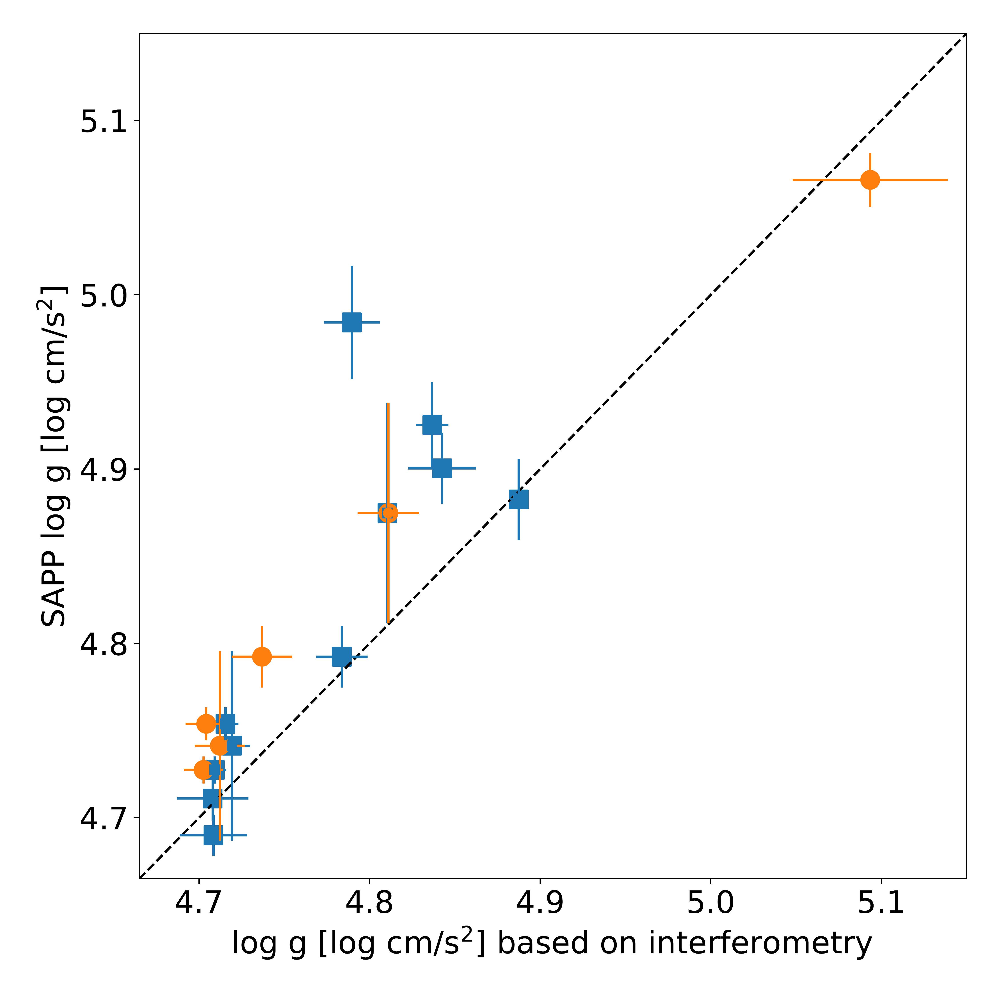

$\newcommand{\ensuremath}{}$
$\newcommand{\xspace}{}$
$\newcommand{\object}[1]{\texttt{#1}}$
$\newcommand{\farcs}{{.}''}$
$\newcommand{\farcm}{{.}'}$
$\newcommand{\arcsec}{''}$
$\newcommand{\arcmin}{'}$
$\newcommand{\ion}[2]{#1#2}$
$\newcommand{\textsc}[1]{\textrm{#1}}$
$\newcommand{\hl}[1]{\textrm{#1}}$
$\newcommand{\footnote}[1]{}$
$\newcommand{\plato}{\textsc{Plato}}$
$\newcommand{\gaia}{\textit{Gaia}}$
$\newcommand{\ag}{\ensuremath{A_G}\xspace}$
$\newcommand{\ebpminrp}{\ensuremath{E(G_{\rm BP} - G_{\rm RP})}\xspace}$
$\newcommand{\bpminrp}{\ensuremath{G_\mathrm{BP}-G_\mathrm{RP}}\xspace}$
$\newcommand{\gmag}{\ensuremath{G}}$
$\newcommand{\bpmag}{\ensuremath{G_\mathrm{BP}}}$
$\newcommand{\rpmag}{\ensuremath{G_\mathrm{RP}}}$
$\newcommand{\mg}{M_\gmag}$
$\newcommand{\diam}{\theta_{\rm LD}}$
$\newcommand{\marcs}{\texttt{MARCS}}$
$\newcommand{\phoenix}{\texttt{PHOENIX}}$
$\newcommand{\sme}{\texttt{SME}}$
$\newcommand{\pysme}{\texttt{PySME}}$
$\newcommand{\vald}{\texttt{VALD}}$
$\newcommand{\teff}{T_{\mathrm{eff}}}$
$\newcommand{\lgg}{\log{g}}$
$\newcommand{\lggu}{\log{g / \mathrm{cm s^{-2}}}}$
$\newcommand{\rv}{\varv_{\mathrm{r}}}$
$\newcommand{\vsini}{\varv \sin i}$
$\newcommand{\vbroad}{\varv_{\text{broad}}}$
$\newcommand{\vmic}{V_{\mathrm{turb}}}$
$\newcommand{\vmac}{\xi_{\text{mac}}}$
$\newcommand{\lggf}{\log{gf}}$
$\newcommand{\feh}{\mathrm{\left[Fe/H\right]}}$
$\newcommand{\afe}{\mathrm{\left[\alpha/Fe\right]}}$
$\newcommand{\xfe}[1]{\mathrm{\left[#1/Fe\right]}}$
$\newcommand{\xh}[1]{\mathrm{\left[#1/H\right]}}$
$\newcommand{\abrat}[2]{\mathrm{\left[#1/#2\right]}}$
$\newcommand{\lgeps}[1]{\log{\epsilon_{\mathrm{#1}}}}$
$\newcommand{\dex}{\mathrm{dex}}$
$\newcommand{\nm}{\mathrm{nm}}$
$\newcommand{\kelvin}{\mathrm{K}}$
$\newcommand{\kms}{\mathrm{km s^{-1}}}$
$\newcommand\natexlab{#1}$

# Performance of the _Stellar Abundances and atmospheric Parameters Pipeline_ adapted for M dwarfs: I. Atmospheric parameters from the spectroscopic module

<mark>Appeared on: 2025-02-14</mark> -  _Accepted in A&A_

T. Olander, et al. -- incl., <mark>M. Bergemann</mark>, <mark>E. Magg</mark>

**Abstract:** M dwarfs are important targets in the search for Earth-like exoplanets due to their small masses and low luminosities. Several ongoing and upcoming space missions are targeting M dwarfs for this reason, and the ESA $\plato$ mission is one of these. In order to fully characterise a planetary system the properties of the host star must be known. For M dwarfs we can derive effective temperature, surface gravity, metallicity, and abundances of various elements from spectroscopic observations in combination with photometric data. The Stellar Abundances and atmospheric Parameters Pipeline (SAPP) has been developed to serve as a prototype for one of the stellar science softwares within the $\plato$ consortium. The pipeline combines results from a spectroscopy, a photometry, an interferometry, and an asteroseismology module to derive stellar parameters for FGK-type stars. We have modified the pipeline to be able to analyse the M dwarf part of the $\plato$ target sample. The current version of the pipeline for M dwarfs mostly relies on spectroscopic observations. The module processing these data is based on the machine learning algorithm The Payne and fits a grid of model spectra to an observed spectrum to derive effective temperature and metallicity. We use spectra in the H-band, as the near-infrared region is beneficial for M dwarfs because there are fewer molecular lines and they are brighter in this wavelength region than in the optical. A method based on synthetic spectra was developed for the continuum normalisation of the spectra, taking into account the pseudo-continuum formed by numerous lines of the water molecule. Photometry is used to constrain the surface gravity. We tested the modified SAPP on spectra of M dwarfs from the APOGEE survey. Our validation sample of 26 stars includes stars with interferometric observations and binaries. We found a good agreement between our derived values and reference values from a range of previous studies. We estimate the overall uncertainties in the derived effective temperature, surface gravity, and metallicity to be 100 K, 0.1 dex, and 0.15 dex, respectively. We find that the modified SAPP performs well on M dwarfs and identify possible areas of future development that should lead to an improved precision of the derived stellar parameters.

**Figure 10. -** SAPP results compared with spectroscopic results from \citet{APOGEE_Sarmento2021,Pass2019,2015ApJMann,2020AAMaldonado,2022ApJSouto,2022MNRAS.516.3802C}.
   Values derived using the SAPP are shown on the vertical axis, and the literature values are shown on the horizontal axis.
   _Left:_ effective temperature.
   _Middle:_ surface gravity. The uncertainties for \citet{APOGEE_Sarmento2021} and \citet{2022ApJSouto} are represented at the bottom of the figure in grey. One star is located outside of the borders of the figure: LSPM J1204+1728S for which the SAPP value is 4.86 dex and \citet{APOGEE_Sarmento2021} obtained 5.31 dex.
   _Right:_ metallicity. The black dashed line in all panels corresponds to the 1:1 ratio.
    (*Fig:Spec_param*)

**Figure 8. -** Normalised observed spectrum of the star GJ 880 as black dashed line, and best-fit model (synthetic spectrum predicted by the Payne's ANN for the parameters given in Table \ref{tab:Result_analysis}) as orange solid line. Grey shaded areas indicate the location of the line mask we used. Derived parameters for this star are $\teff$: 3649 K, $\lgg$: 4.8 dex, and $\feh$: 0.25 dex. (*Fig:GJ880_spec*)

**Figure 3. -** Comparing $\teff$(top) and $\lgg$(bottom) derived from the SAPP with corresponding parameters based on interferometric angular diameters \citep{Boyajian2012,Rabus2019}. The black dashed line in both figures corresponds to the 1:1 ratio and the grey dotted line in the top panel corresponds to a linear fit to the values from \citet{Boyajian2012}. We excluded the outlier GJ 725B for which the SAPP derived a $\teff$ of roughly 3550 K (leftmost blue square in top panel) from the linear fit, for reasons discussed in the text. We note that the K3 dwarf GJ 105A with $\teff\sim$4600 K is not shown in the figures. (*Fig:Interferometry*)

