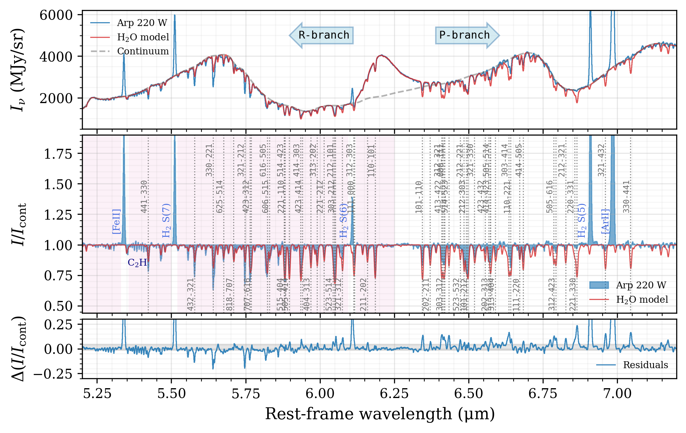
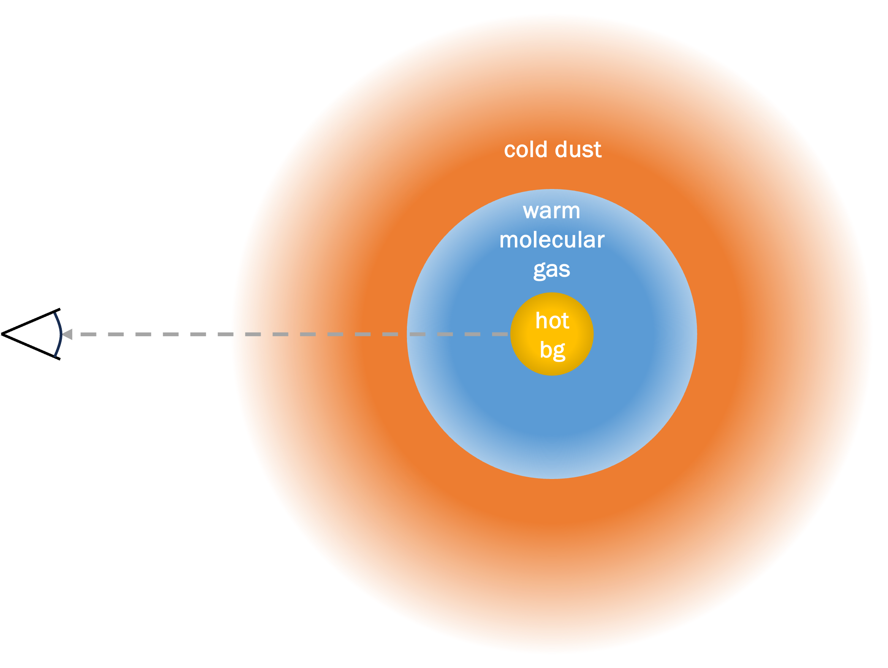
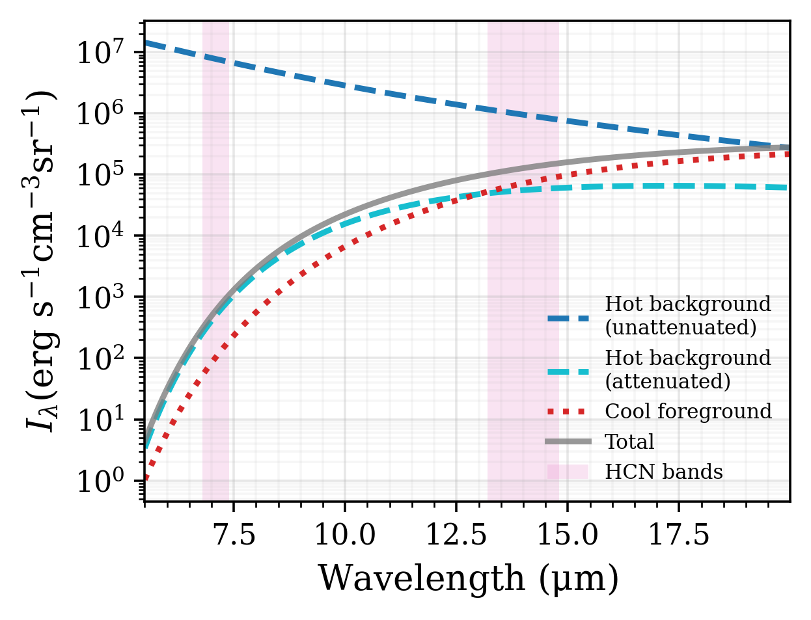
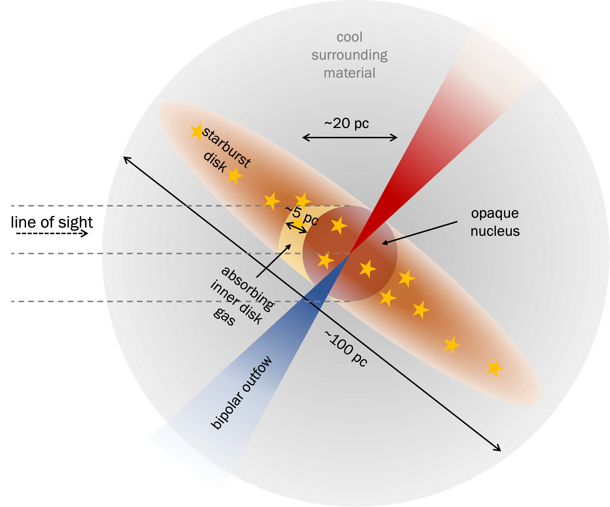

$\newcommand{\ensuremath}{}$
$\newcommand{\xspace}{}$
$\newcommand{\object}[1]{\texttt{#1}}$
$\newcommand{\farcs}{{.}''}$
$\newcommand{\farcm}{{.}'}$
$\newcommand{\arcsec}{''}$
$\newcommand{\arcmin}{'}$
$\newcommand{\ion}[2]{#1#2}$
$\newcommand{\textsc}[1]{\textrm{#1}}$
$\newcommand{\hl}[1]{\textrm{#1}}$
$\newcommand{\footnote}[1]{}$
$\newcommand{\thought}[1]{\textcolor{red}{#1}}$
$\newcommand{\PvdW}[1]{\textcolor{purple}{[PvdW: #1]}}$
$\newcommand{\pvdw}[1]{\textcolor{purple}{[PvdW: #1]}}$

# MICONIC: JWST Unveils Shocked Hot Core Chemistry in the Western Nucleus of Arp 220

<mark>Appeared on: 2025-02-17</mark> -  _Submitted to A&A_

V. Buiten, et al. -- incl., <mark>T. Henning</mark>

**Abstract:** We present full $\qtyrange{3}{28}{\micron}$ JWST MIRI/MRS and NIRSpec/IFU spectra of the western nucleus of Arp 220, the nearest ultraluminous infrared galaxy. This nucleus has long been suggested to possibly host an embedded Compton-thick AGN. Millimeter observations of the dust continuum suggest the presence of a distinct $\qty{20}{\parsec}$ core with a dust temperature of $T_\mathrm{d} \gtrsim \qty{500}{\kelvin}$ , in addition to a $\qty{100}{\parsec}$ circumnuclear starburst disk. However, unambiguously identifying the nature of this core is challenging, due to the immense obscuration, the nuclear starburst activity, and the nearby eastern nucleus. With the JWST integral field spectrographs, we can, for the first time, separate the two nuclei across this full wavelength range, revealing a wealth of molecular absorption features towards the western nucleus. We analyse the rovibrational bands detected at $\qtyrange[range-units=single]{4}{22}{\micron}$ , deriving column densities and rotational temperatures for 10 distinct species. Optically thick features of $\ce{C2H2}$ , $\ce{HCN}$ and $\ce{HNC}$ suggest that this molecular gas is hidden behind a curtain of cooler dust, and indicate that the column densities of $\ce{C2H2}$ and $\ce{HCN}$ are an order of magnitude higher than previously derived from _Spitzer_ observations. We identify a warm $\ce{HCN}$ component with rotational temperature $T_\mathrm{rot} = \qty{330}{\kelvin}$ , which we associate with radiative excitation by the hot inner nucleus. We propose a geometry where the detected molecular gas is located in the inner regions of the starburst disk, directly surrounding the hot $\qty{20}{\parsec}$ core. The chemical footprint of the western nucleus is reminiscent of that of hot cores, with additional evidence for shocks. No evidence for the presence of an AGN in the form of X-ray-driven chemistry or extreme excitation is found.

**Figure 8. -** The spectrum around \SI{6}{\micron} and the best-fit \ce{H2O} model for $f_\mathrm{bg} = 0.35$. The top panel shows the absolute flux spectrum and continuum model. The middle panel shows the continuum-extracted spectrum. Strong \ce{H2O} lines are labelled by their upper- and lower-level quantum numbers as $J_{u}, K_{a,u}, K_{c,u} - J_l, K_{a,l}, K_{c,l}$. Several strong emission lines and absorption lines of \ce{C2H} are labelled as well. The pink shaded area indicates the spectral region considered in the fit. The bottom panel shows the residuals on the continuum-extracted spectrum; the grey shaded area indicates their 68\% interval. (*fig:H2O_model_spec*)

**Figure 2. -** Top: schematic illustration of the proposed line-of-sight geometry. The molecular gas is embedded in cool dust that produces significant foreground emission, filling in the features produced by absorption of hot background photons. Bottom: expected continuum spectrum for a toy model consisting of a \SI{1000}{\kelvin} background blackbody and a \SI{100}{\kelvin} foreground modified blackbody. (*fig:geometry_los_illustration*)

**Figure 5. -** Schematic illustration of the proposed geometry of the WN along the line of sight. Following the interpretation of \citet{Sakamoto2021b}, we assume that the south side of the disk is facing us with an inclination of $i \approx \ang{60}$, and that the biconical outflow is normal to the disk. The direction of the tilt is debated \citep[][Van der Werf et al. in prep]{Scoville1998}, but we note that it does not affect the interpretation of the absorption bands in this work. (*fig:WN_geometry_cartoon*)

