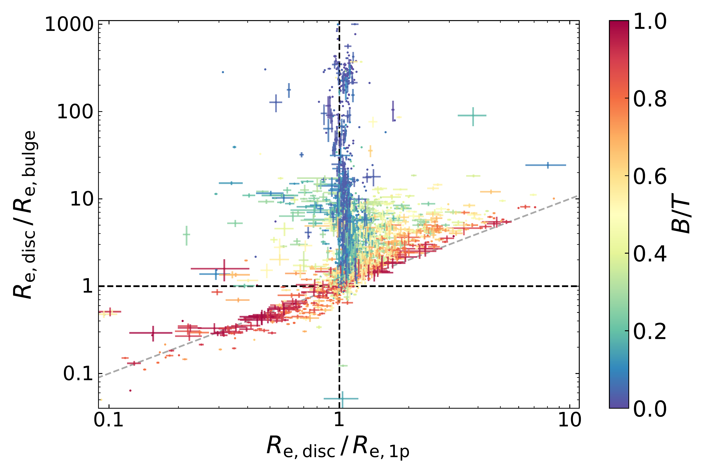
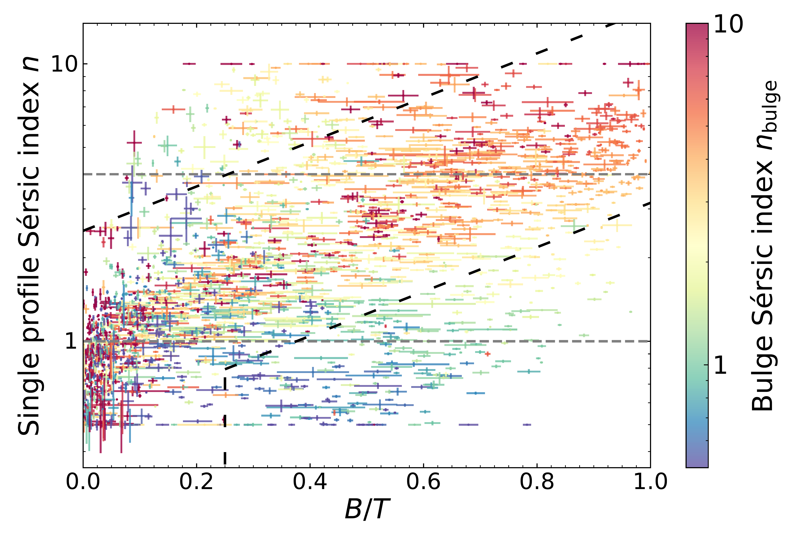
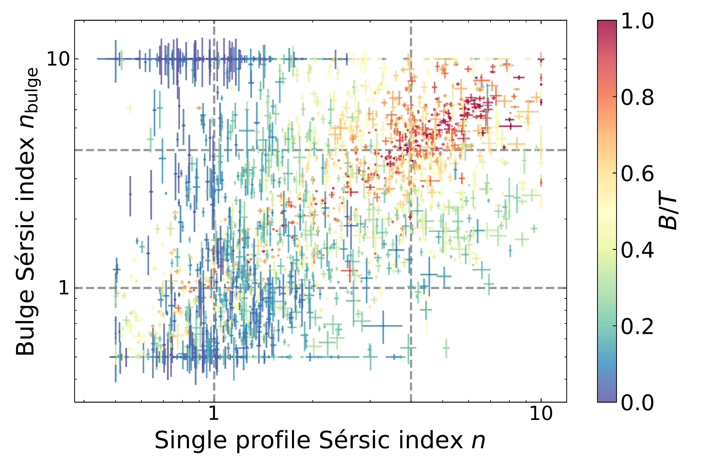
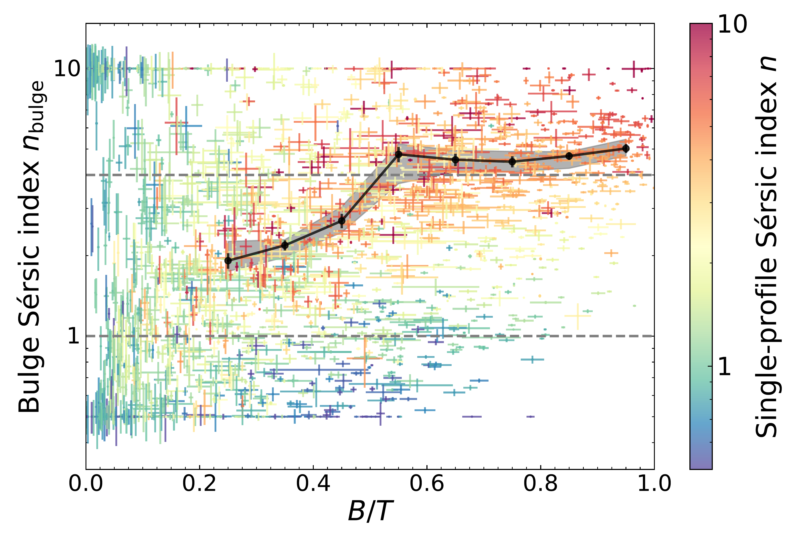
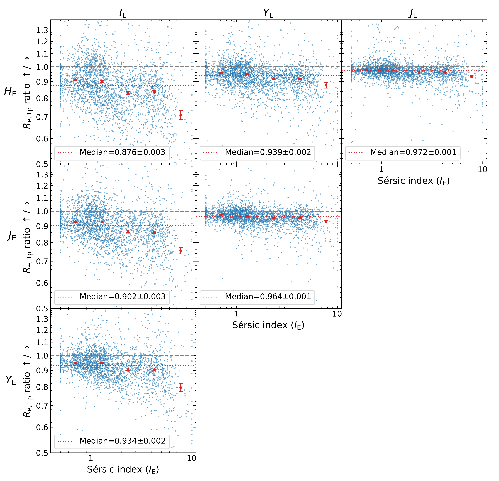

$\newcommand{\ensuremath}{}$
$\newcommand{\xspace}{}$
$\newcommand{\object}[1]{\texttt{#1}}$
$\newcommand{\farcs}{{.}''}$
$\newcommand{\farcm}{{.}'}$
$\newcommand{\arcsec}{''}$
$\newcommand{\arcmin}{'}$
$\newcommand{\ion}[2]{#1#2}$
$\newcommand{\textsc}[1]{\textrm{#1}}$
$\newcommand{\hl}[1]{\textrm{#1}}$
$\newcommand{\footnote}[1]{}$
$\newcommand{\orcid}[1]{\orcidlink{#1}}$
$\newcommand{\rms}{RMS~}$
$\newcommand{\resp}{resp{.}}$
$\newcommand{\ie}{i{.}e{.}~}$
$\newcommand{\eg}{e{.}g{.}~}$
$\newcommand{\eq}{Eq{.}~}$
$\newcommand{\eqs}{Eqs{.}~}$
$\newcommand{\tab}{Table~}$
$\newcommand{\fg}{Fig{.}~}$
$\newcommand{\fgs}{Figs{.}~}$
$\newcommand{\sct}{Sect{.}~}$
$\newcommand{\scts}{Sects{.}~}$
$\newcommand{\col}{Col{.}}$
$\newcommand{\cols}{Cols{.}}$
$\newcommand{\magn}{^\mathrm{mag}}$
$\newcommand{\pg}{p{.}~}$
$\newcommand{\ppg}{pp{.}~}$
$\newcommand{\hmpc}{~h^{-1}~Mpc}$
$\newcommand{\hkpc}{~h^{-1}~kpc}$
$\newcommand{\hmpcs}{~h^{-2}~Mpc^2}$
$\newcommand{\hmpcc}{~h^{-3}~Mpc^3}$
$\newcommand{\phiunit}{~h^3~Mpc^{-3}~mag^{-1}}$
$\newcommand{\etal}{{\it et\thinspace al.} }$
$\newcommand{\lo}[2]{\noindent{\color{royalblue} \bf[ \triangle \st{#1} #2]}}$
$\newcommand{\val}[2]{\noindent{\bf[\color{darkred} \spadesuit \st{#1} #2]}}$
$\newcommand{\va}[2]{\noindent{\bf[\color{magenta} \spadesuit \st{#1} #2]}}$
$\newcommand{\vl}[2]{\noindent{\bf[\color{violet} \spadesuit \st{#1} #2]}}$
$\newcommand{\redcom}[2]{\noindent{\bf[\color{darkred} \st{#1} #2]}}$
$\newcommand{\id}[2]{\noindent{\bf[\color{brown} \st{#1} IVANA: #2]}}$
$\newcommand{\chg}[2]{\noindent{#2}}$
$\newcommand{\chgs}[2]$
$\newcommand{\chgc}[2]$

# $\Euclid$: Galaxy morphology and photometry from bulge-disc decomposition of Early Release Observations$\thanks{This paper is published on behalf of the Euclid Consortium}$

<mark>Appeared on: 2025-02-24</mark> -  _Submitted to A&A, comments welcome. 27 pages, 19 figures, 6 tables (+ appendix of 6 pages, 18 figures - exemples gallery, 1 table)_

L. Quilley, et al. -- incl., <mark>K. Jahnke</mark>

**Abstract:** The background galaxies in $\Euclid$ Early Release Observations (ERO) images of the Perseus cluster make up a remarkable sample in its combination of $0.57$ deg $^2$ area, 25.3 and 23.2 AB mag depth, as well as $\ang{;;0.1}$ and $\ang{;;0.3}$ angular resolutions, in optical and near-infrared bands, respectively.Towards characterising the history of the Hubble sequence, we perform a preliminary morphological analysis of $2445$ and $12 786$ galaxies with $\IE\le21$ and $\IE\le23$ , respectively.We use single-Sérsic profiles and the sums of a Sérsic bulge and an exponential disc to model these galaxies with \texttt{SourceXtractor++} and analyse their positional, structural, and flux parameters in order to assess their consistencies and biases.The fitted galaxies to $\IE\le21$ span the various Hubble types with ubiquitous bulge and disc components, and a bulge-to-total light ratio $B/T$ taking all values from 0 to 1. The median effective radius of the single-Sérsic profile is a biased estimate of galaxy size, intermediate between the bulge and disc effective radii, depending on $B/T$ . The axis ratio of the single-Sérsic profile overestimates that of the disc, increasingly so with $B/T$ . The type of model impacts the photometry with $-0.08$ to 0.01 mag median systematic $\IE$ offsets between single-Sérsic and bulge-disc total magnitudes, and a 0.05 to 0.15 mag dispersion, from low to high $B/T$ . We measure a median $0.4$ mag bulge-disc colour difference in $\IE-\JE$ that originates from the disc-dominated galaxies, whereas bulge-dominated galaxies have similar median colours of their components. Remarkably, we also measure redder-inside disc colour gradients, based on 5 to 10 \% systematic variations of disc effective radii between the optical and near-infrared bands.This analysis demonstrates the usefulness and limits of single-Sérsic profile modelling, and the power of bulge-disc decomposition for reliably characterising the morphology of lenticulars and spirals in $\Euclid$ images.

**Figure 13. -** Ratios of the disc-to-bulge effective radii as a function of the ratios of the disc-to-single-Sérsic effective radii, all in the \IE band, for the $2445$ galaxies with $\IE\le21$. In the upper vertical concentration of disc-dominated galaxies (in blue, $B/T\approx0$) and on the right diagonal concentration of bulge-dominated galaxies (in red, $B/T\approx1$), the single-Sérsic effective radius is consistent with that of either a dominating disc or bulge component. The single-Sérsic effective radius of the $74.7\%$ of galaxies in the top-right cone is intermediate between the disc effective radius (the largest) and the bulge effective radius (the smallest), with a smooth gradient in the ratio of the disc to single-Sérsic effective radius, while $B/T$ varies from zero to one. These galaxies are visually indistinguishable from the types in the present-time Hubble sequence, whereas objects in other regions of the diagram are identified as either non-physical bulge-disc modelling, or biased bulge fits due to bars. (*all-radii-related-cmap-BT*)

**Figure 4. -** Relations between the Sérsic index $n$ from the single-Sérsic modelling, the bulge-to-total light ratio $B/T$, and the bulge Sérsic index $n_\mathrm{B}$ from the bulge-disc decomposition, for the $2445$ galaxies with $\IE\le21$. Each plot shows one projection of this 3D parameter space, and incorporates the third parameter as a colour map on the points. Grey horizontal dashed lines indicate Sérsic index values of 1 and 4. The inclined purple dotted lines in the left panel delimit above and below the visually inspected samples (see text). Once spurious fits and bulges that are too small or too faint to be modelled are identified and discarded, there remains an overall correlation between $n$, $B/T$, and $n_\mathrm{B}$, which all increase jointly, as galaxy types change from late to earlier types along the Hubble sequence, and as their bulges grow from small pseudo-bulges to more prominent classical bulges. In this latter regime, the increase in $n_\mathrm{B}$\chg{with $B/T$} flattens, $\chg${as shown by the black solid line displaying the median values and bootstrap uncertainties of $n_\mathrm{bulge}$ in $B/T$ intervals of $0.1$ in width from $0.2$ to $1.0$ (the grey shaded area shows the 10--90\% percentile range around these values)} (*nsersic-nsersicB-BT-3d-space*)

**Figure 17. -** Ratios of the single-Sérsic effective radius $R_\mathrm{e,1p}$ between different bands as a function of the Sérsic index measured in the \IE VIS band for the $2328$ galaxies to $\IE\le21$, with $R_\mathrm{e,disc} /R_\mathrm{e,bulge} \ge 1$ or $R_\mathrm{e,disc}/R_\mathrm{e,1p} > 0.9$ in the \IE band. All possible pairs of \Euclid bands are shown in the six panels, with the band whose $R_\mathrm{e,1p}$ is the numerator (denominator) appearing on the left (top). Overall median values of the $R_\mathrm{e,1p}$ ratio appear on each panel as a red dotted horizontal line, whereas the red points and error bars correspond to the median and standard error for bins of $n_{\IE}$ listed in $\tab$\ref{tab-Re-ratio-1p}. Redder bands have smaller $R_\mathrm{e,1p}$ than bluer bands for the majority of galaxies, and this effect is stronger for bands that are further apart in wavelength. Most galaxies have blue to red inward gradients, which are the largest between the VIS band and any NISP bands, and are interpreted as resulting mostly from the colour dichotomy of bulges and discs shown in $\fg$\ref{bulge-disk-colors}, which in turn originates from the different stellar populations in the bulge and disc components of spiral galaxies. (*color-grad-Re-1p*)

