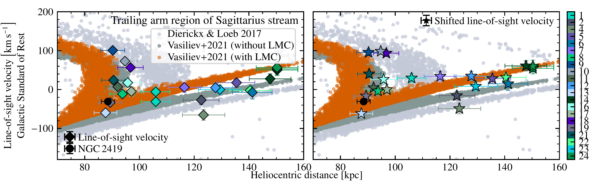
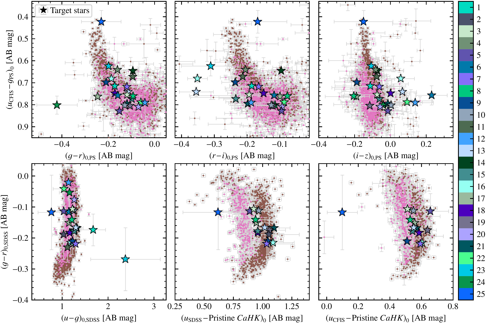
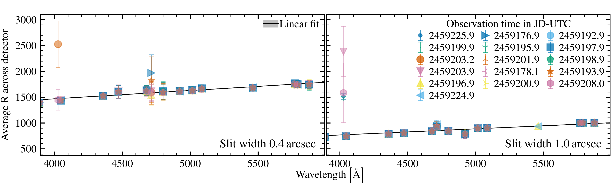

$\newcommand{\ensuremath}{}$
$\newcommand{\xspace}{}$
$\newcommand{\object}[1]{\texttt{#1}}$
$\newcommand{\farcs}{{.}''}$
$\newcommand{\farcm}{{.}'}$
$\newcommand{\arcsec}{''}$
$\newcommand{\arcmin}{'}$
$\newcommand{\ion}[2]{#1#2}$
$\newcommand{\textsc}[1]{\textrm{#1}}$
$\newcommand{\hl}[1]{\textrm{#1}}$
$\newcommand{\footnote}[1]{}$
$\newcommand$
$\newcommand$
$\newcommand$

# A Pristine-UNIONS view on the Galaxy: Kinematics of the         distant spur feature of the Sagittarius stream traced by Blue         Horizontal Branch stars

<mark>Appeared on: 2025-02-25</mark> -  _21 pages, 12 figures, submitted to A&A, abridged abstract_

M. Bayer, et al. -- incl., <mark>N. Martin</mark>

**Abstract:** Providing a detailed picture of the Sagittarius (Sgr) stream offers   important constraints on the build-up of the Galactic halo as well   as its gravitational potential at large radii. While several   attempts have been made to model the structure of the Sgr stream, no   model has yet been able to match all the features observed for the   stream. Moreover, for several of these features, observational   characterisation of their properties is rather limited, particularly   at large distances. The aim of this work is to investigate the kinematics of the Sgr   stream outermost spur feature using blue horizontal branch (BHB)   stars. Candidate BHB stars were selected by combining two approaches; one   capitalising on Pan-STARRS1 3 $\Pi$ _griz_ and _u_ photometry taken as part of UNIONS, the other using Pristine Survey _CaHK_ and SDSS _ugr_ photometry. Follow-up optical   spectra are obtained using ESO/VLT/FORS2 to confirm their BHB nature   and obtain line-of-sight (LOS) velocities. Of our 25 candidates, 20 stars can be confirmed as bona fide BHB   stars. Their LOS velocities, together with the 3D positions of these   stars qualitatively match well with Sgr model predictions and trace   the outer apocentre of the trailing arm and its spur feature very   nicely. The quantitative offsets that are found between our data and   the different models can be used to provide information about the   Galactic gravitational potential at large distances. We present a   first, tentative, analysis in this direction, showing that the model   of vasiliev_et_al2021 would provide better agreement with our   observations if the   enclosed mass of the Milky Way within 100 kpc   were lowered to $(5.3\!\pm\!0.4)\!\times\!10^{11} \mathrm{M}_\odot   \left(\text{versus} (5.6\!\pm\!0.4)\!\times\!10^{11}    \mathrm{M}_\odot\right)$ . Our selection of BHB stars provides a new view on the outermost   structure in 3D positions and LOS velocities of the Sgr debris.

**Figure 11. -** Comparison of the observational data on the LOS velocities
             in the Galactic Standard of Rest of the BHB stars (diamonds
             and stars) and predictions from the
             dierickx_loeb2017(lightgreyish points) and
             vasiliev_et_al2021 without (darkgreyish points)
             and with LMC (orange points) models in the same angular
             range across the stream. Left panel: big diamond markers
             indicate LOS velocities in Galactic Standard of Rest of BHB
             stars estimated with \lowercase{RVSpecFit} from
             the FORS2 spectra. Right panel: stars represent the same
             velocities with an applied shift as reported in Figs.
             \ref{fig:comparison_los_vel_estimates_vel_sts_main}
             and
             \ref{
               fig:comparison_los_vel_estimates_vel_sts_appendix
             }.
             The plot shows also the position of globular cluster
             NGC 2419 (filled circle) in this projection of phase
             space. The LOS velocity of NGC 2419 comes from
             vasiliev_baumgardt2021 assuming also the right
             ascension and declination provided in the
             vasiliev_baumgardt2021 catalogue while we use the
             heliocentric distance of NGC 2419 from
             baumgardt_vasiliev2021. (*fig:dist_sgr_stream_vel_struct_main*)

**Figure 10. -** An overview of the target stars in multiple colour-colour
  	         spaces is shown. Data were gathered from multiple sources.
             These are: the Panoramic Survey Telescope and Rapid
             Response System 1 3$\Pi$ survey Data Release 2
              (ps1,  magnier_et_al2020) ,
             the Canada-France Imaging Survey, the Sloan Digital Sky
             Survey Data Release 18  (sdss_dr18) , and
             the Pristine Survey  (starkenburg_et_al2017) . The
             candidate BHB stars in our sample are colour-coded
             according to the number of their id given in
             \autoref{tab:cand_bhb_stars}. The background stars come
             from two samples. The pink markers are blue straggler
             stars from the xue_et_al2008 set while the brown
             symbols represent BHB stars from the xue_et_al2011
             dataset. (*fig:target_selection*)

**Figure 12. -** VLT/FORS2/600B+22 grism resolving power trends across
               detector for gathered data of arc-lamps at
               different observation times for the two used slit
               configurations. (*fig:vlt_fors2_600b22_resolving_power_trend*)

