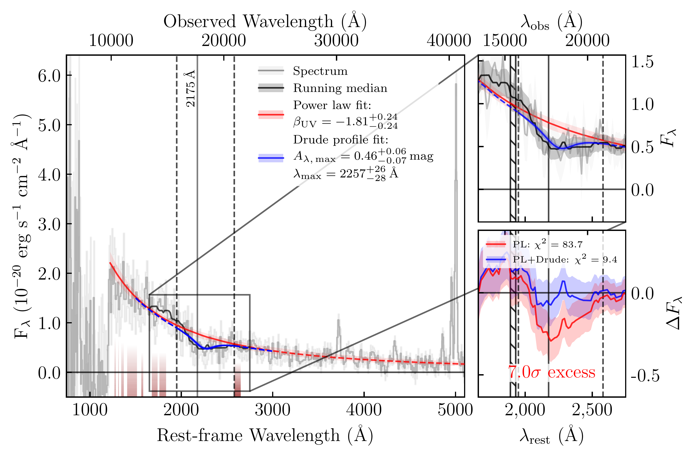
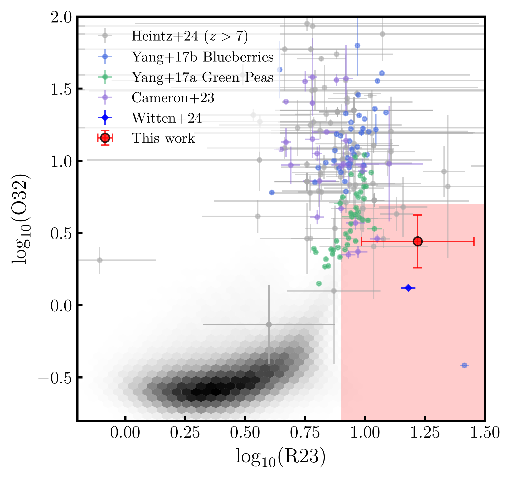
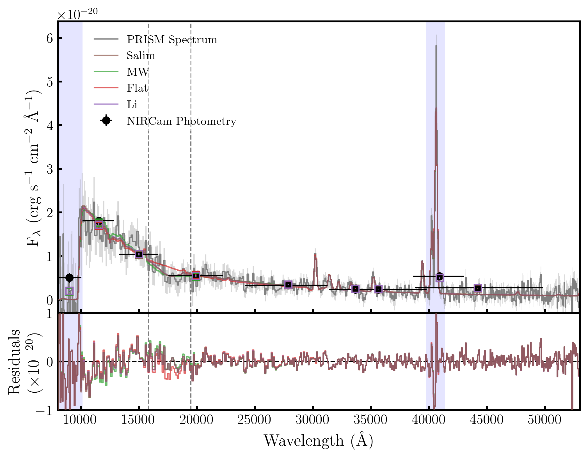

$\newcommand{\ensuremath}{}$
$\newcommand{\xspace}{}$
$\newcommand{\object}[1]{\texttt{#1}}$
$\newcommand{\farcs}{{.}''}$
$\newcommand{\farcm}{{.}'}$
$\newcommand{\arcsec}{''}$
$\newcommand{\arcmin}{'}$
$\newcommand{\ion}[2]{#1#2}$
$\newcommand{\textsc}[1]{\textrm{#1}}$
$\newcommand{\hl}[1]{\textrm{#1}}$
$\newcommand{\footnote}[1]{}$
$\newcommand{\um}{\mu\mathrm{m}}$
$\newcommand{\id}{GNWY-7379420231}$
$\newcommand{\orcid}[2]{\href{http://orcid.org/#2}{#1}}$
$\newcommand{\orcidsymb}[2]{#1\href{http://orcid.org/#2}{\adjustbox{trim={-.15\width} {0\height} {-.15\width} {0\height},clip}{\includegraphics[height=10pt]{Figures/orcid.pdf}}}}$
$\newcommand{\arraystretch}{1.5}$
$\newcommand{\arraystretch}{1.5}$
$\newcommand{\thebibliography}{\DeclareRobustCommand{\VAN}[3]{##3}\VANthebibliography}$

# Detection of the $2175$${Å}$ UV Bump at $z>7$: Evidence for Rapid Dust Evolution in a Merging Reionisation-Era Galaxy

<mark>Appeared on: 2025-03-04</mark> -  _Submitted to MNRAS_

K. Ormerod, et al. -- incl., <mark>A. d. Graaff</mark>

**Abstract:** Dust is a fundamental component of the interstellar medium (ISM) within galaxies, as dust grains are highly efficient absorbers of UV and optical photons. Accurately quantifying this obscuration is crucial for interpreting galaxy spectral energy distributions (SEDs). The extinction curves in the Milky Way (MW) and Large Magellanic Cloud (LMC) exhibit a strong feature known as the $2175$ Å UV bump, most often attributed to small carbonaceous dust grains. This feature was recently detected in faint galaxies out to $z\sim7$ suggesting rapid formation channels.Here we report the detection of a strong UV bump in a luminous Lyman-break galaxy at $z=7.11235 $ , GNWY-7379420231,   through observations taken as part of the NIRSpec Wide GTO survey. We fit a dust attenuation curve that is consistent with the MW extinction curve within $1\sigma$ , in a galaxy just $\sim 700$ Myr after the Big Bang.From the integrated spectrum, we infer a young mass-weighted age ( $t_\star \sim 22-59$ Myr) for this galaxy, however spatially resolved SED fitting unveils the presence of an older stellar population ( $t_\star \sim 252$ Myr). Furthermore, morphological analysis provides evidence for a potential merger. The underlying older stellar population suggests the merging system could be pre-enriched, with the dust illuminated by a merger-induced starburst. Moreover, turbulence driven by stellar feedback in this bursty region may be driving PAH formation through top-down shattering.The presence of a UV bump in GNWY-7379420231 solidifies growing evidence for the rapid evolution of dust properties within the first billion years of cosmic time.

**Figure 12. -** Spectrum of GNWY-7379420231 (grey solid line) with a power-law fit to the UV continuum (red solid line). The dark red shading represents the UV slope fitting windows. The zoom in panel of the region around 2175Å shows the running median, indicated by a solid black line. This represents the attenuated stellar continuum, and shows a localised absorption feature. The Drude profile fit is shown by the solid blue line, within the fitting window indicated by the vertical dashed lines. The hatched region shows the location of the Ciii doublet. The bottom right panel shows the residuals of the power-law fit (PL) and the combined power-law and Drude profile fit (PL+Drude). The power-law fit alone has a $7.0\sigma$ negative flux excess, with the PL+Drude model showing a significantly better fit, as supported by the BIC values.  (*fig:UV fit*)

**Figure 2. -** Dust corrected O$_{32}$-R$_{23}$ plot, showing GNWY-7379420231 compared to NIRSpec data  ([ and Heintz 2024](https://ui.adsabs.harvard.edu/abs/2024arXiv240402211H),  cameron_jades_2023, [ and Witten 2025](https://ui.adsabs.harvard.edu/abs/2025MNRAS.537..112W)) , local analogues  ([ and Yang 2017](https://ui.adsabs.harvard.edu/abs/2017ApJ...844..171Y),  Yang_blueberries) , and the Sloan Digital Sky Survey \citep[SDSS;][]{SDSS} Data Release 7  ([ and Abazajian 2009](https://ui.adsabs.harvard.edu/abs/2009ApJS..182..543A)) , shown in black. The red shading shows the region $\log_{10}\mathrm{O}{32} < 0.7$ and $\log_{10}\mathrm{R}_{23} >0.9$ which may contain galaxies hosting an older stellar population  ([ and Witten 2025](https://ui.adsabs.harvard.edu/abs/2025MNRAS.537..112W)) . (*fig:O32_R23*)

**Figure 6. -** Top: Posterior spectra obtained from bagpipes fitting. The observed spectrum and associated errors are shown in grey, with the observed NIRCam photometry shown in black. The x error bars represent the filter width at $50\%$ of the maximum transmission. The posterior photometric points obtained from bagpipes are shown by open squares. Bottom: The residuals from the bagpipes fitting. The dashed vertical lines show the UV bump fitting region, and the blue shaded regions show the spectral regions masked in the bagpipes fitting. (*fig:bagpipes_models*)

