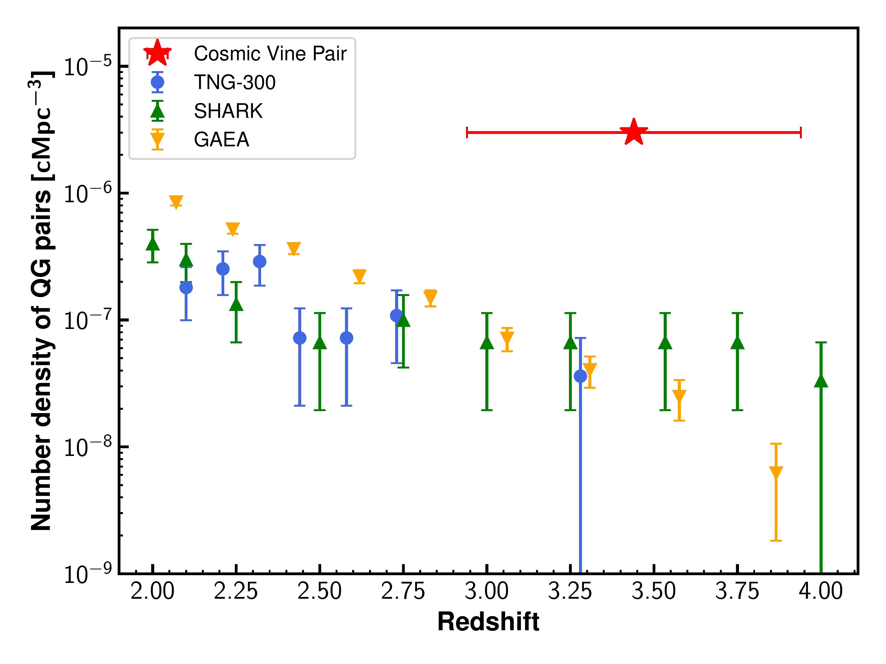
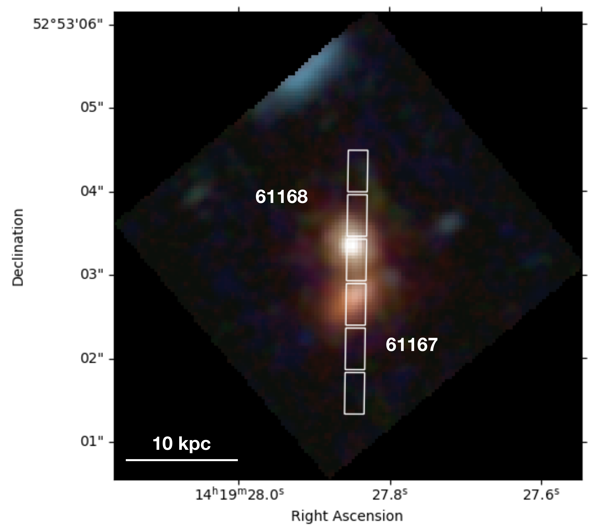

$\newcommand{\ensuremath}{}$
$\newcommand{\xspace}{}$
$\newcommand{\object}[1]{\texttt{#1}}$
$\newcommand{\farcs}{{.}''}$
$\newcommand{\farcm}{{.}'}$
$\newcommand{\arcsec}{''}$
$\newcommand{\arcmin}{'}$
$\newcommand{\ion}[2]{#1#2}$
$\newcommand{\textsc}[1]{\textrm{#1}}$
$\newcommand{\hl}[1]{\textrm{#1}}$
$\newcommand{\footnote}[1]{}$
$\newcommand{\vdag}{(v)^\dagger}$
$\newcommand$
$\newcommand$
$\newcommand{\mstar}{M_\star}$
$\newcommand{\msun}{M_\odot}$
$\newcommand{\hb}{H\beta}$
$\newcommand{\ha}{H\alpha}$
$\newcommand{\lya}{Ly\alpha}$
$\newcommand{\oiii}{[O {\footnotesize III}]}$
$\newcommand{\oii}{[O {\footnotesize II}]}$
$\newcommand{\nii}{[N {\footnotesize II}]}$
$\newcommand{\sii}{[S {\footnotesize II}]}$
$\newcommand{\kms}{km s^{-1}}$
$\newcommand{\myr}{M_{\odot} yr^{-1}}$
$\newcommand{\hii}{H {\footnotesize II}}$
$\newcommand$
$\newcommand$

# A merging pair of massive quiescent galaxies at $z=3.44$ in the Cosmic Vine

<mark>Appeared on: 2025-03-05</mark> -  _8 pages, 5 figures, 1 table + Appendix. Accepted for publication in A&A on Feb 28, 2025. Spectra and photometry used in this paper are available at this https URL , See Valentino et al. (2025) on arXiv today for another result from the JWST "DeepDive" program_

K. Ito, et al. -- incl., <mark>A. d. Graaff</mark>, <mark>L. Xie</mark>

**Abstract:** We report the spectroscopic confirmation of a merging pair of massive quiescent galaxies at $z=3.44$ . Using $* JWST*$ observations, we confirm that the two galaxies lie at a projected separation of 4.5 kpc with a velocity offset of $\sim 680$ $\kms$ ( $\delta_z \sim 0.01$ ). The pair resides in the core of a known rich overdensity of galaxies, dubbed the "Cosmic Vine". For both pair members, modeling of the Spectral Energy Distributions and faint rest-frame optical emission lines indicate high stellar masses ( $\log{(M_\star/M_\odot)}\sim10.9$ ) and suppressed star formation ( $\log{\rm (sSFR/yr^{-1})}<-10$ ), more than an order of magnitude below the level of the star formation main sequence at this redshift. We then explore the Illustris-TNG simulation and the GAEA and SHARK semi-analytical models to examine whether they produce a pair of massive quiescent galaxies akin to that of the Cosmic Vine. While all models produce close pairs of massive quiescent galaxies at $2<z<4$ with comparable separations and velocity offsets, their predicted number densities are 10–80 times lower than our observational constraint. This discrepancy cannot be fully explained by coarse time sampling in these models or the general challenge of forming early massive quiescent galaxies in simulations. Given that $>90$ \% of simulated pairs in the models that we analyzed merge by $z=0$ , our findings suggest that our observed pair will likely coalesce into a single massive galaxy. The merger, occurring in the dense core of a large-scale structure, might represent a critical event in the formation of a brightest cluster galaxy and the morphological transformation of high-redshift disky quiescent galaxies into early-type ellipticals.

**Figure 4. -** Summary of spectra of two quiescent galaxies in the Cosmic Vine. The first two rows represent the spectrum of the 61168, and the latter two represent the 61167. For each galaxy, the upper panel shows the observed NIRSpec medium-resolution spectrum (black line), photometry (blue squares), and the best fit in SED fitting (red line). The gray hatch indicates the wavelength masked in the SED fitting. The bottom left panel shows the continuum-subtracted spectrum around the $\hb$ emission line. In addition to the observed spectrum (black) and best-fit spectrum (red), the narrow and broad components of the best-fit are shown in blue and green lines, respectively. The bottom right panel shows that around the $\ha$ emission line. The meanings of the lines are identical to those of the bottom left panel. The difference between the observed spectrum and the best-fit model is shown at the bottom of each panel. (*fig:linefit*)

**Figure 3. -** The number density of pairs of quiescent galaxies at each snapshot. Blue circles, green triangles, and yellow inverse triangles correspond to those of the TNG-300, SHARK, and GAEA, respectively. Their error bar is determined based on the Poisson noise. The red star shows the observationally estimated number density from the CEERS survey volume. Its error bar along the x-axis is $\pm 0.5  {\rm Gyr}$, which is the time used in deriving the number density.  (*fig:rho_QGpair*)

**Figure 1. -** JWST/NIRCam color image of the pair of quiescent galaxies reported in this paper. F115W+F150W, F200W+F277W, and F356W+F444W images from the CEERS survey are used for blue, green, and red, respectively. This image is generated with  {\sc Trilogy}\protect$\footnote$mark. The point spread function of the blue and green images is matched to that of the F444W image. The white rectangles correspond to the open MSA shutter position. (*fig:image*)

