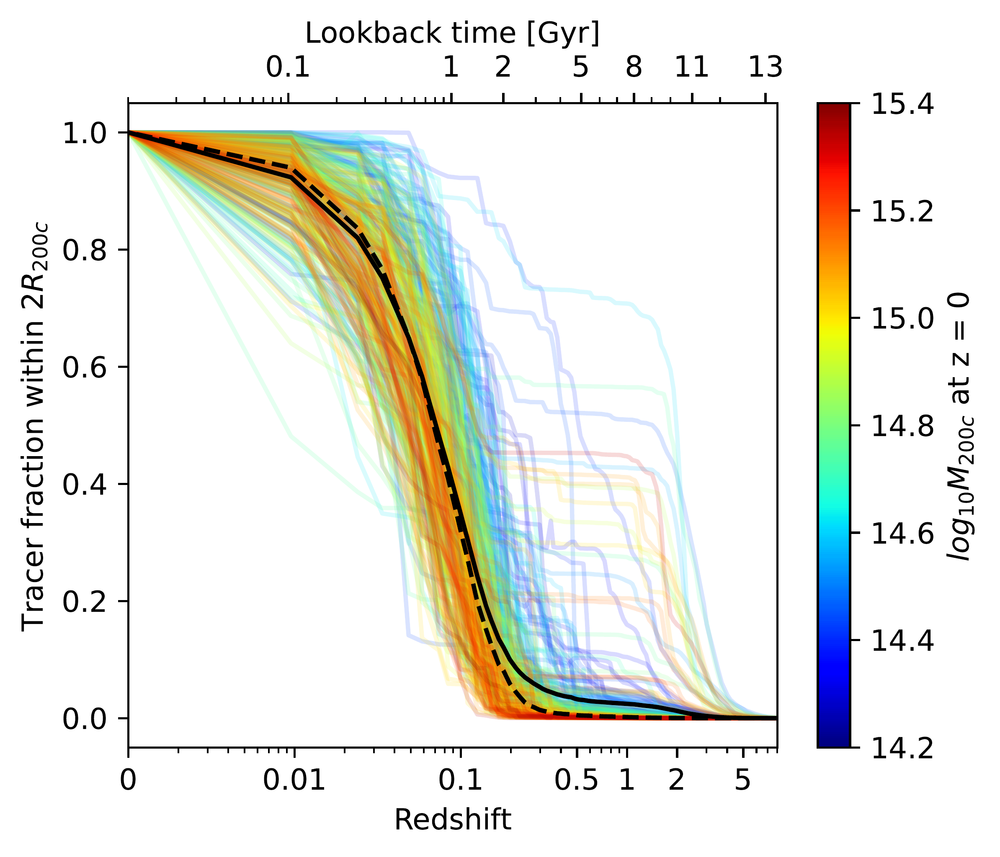
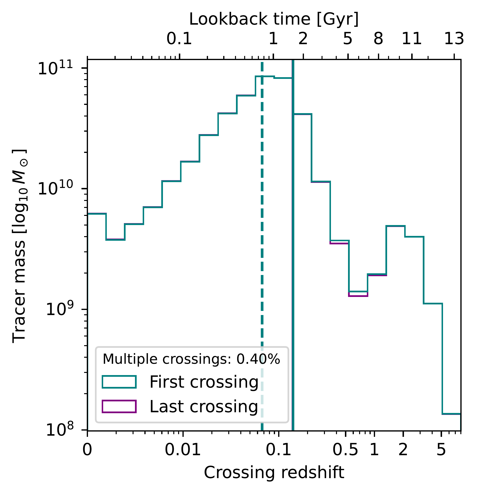
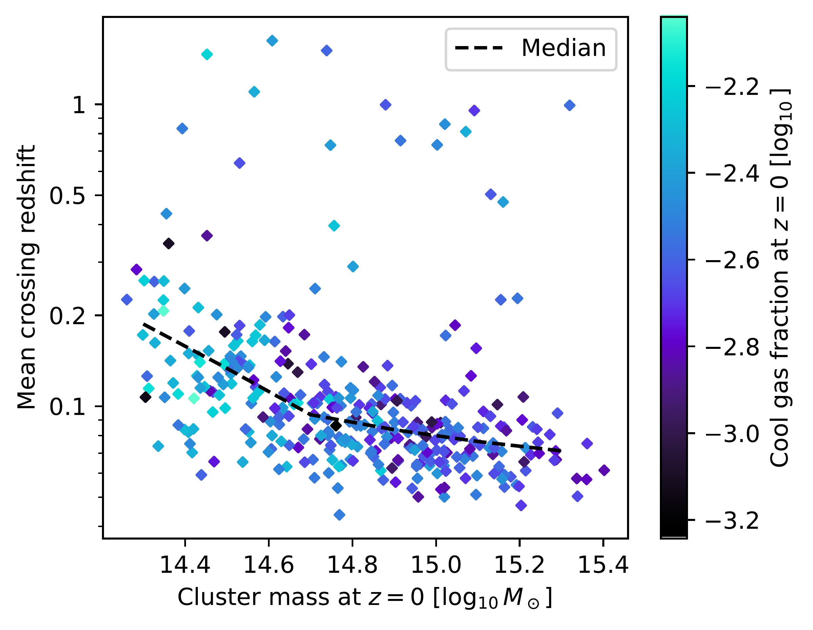
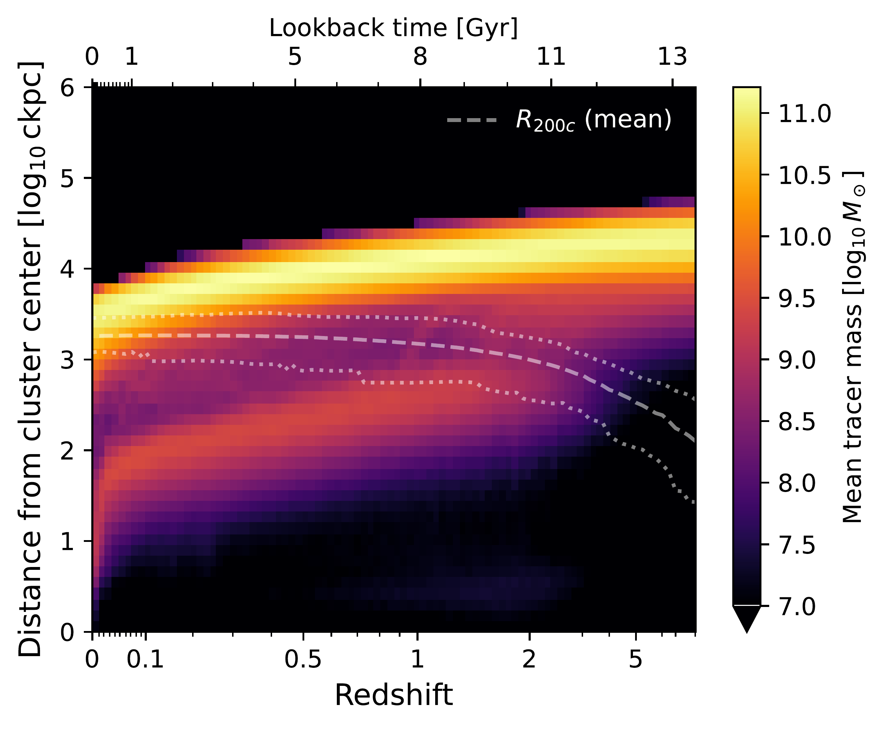
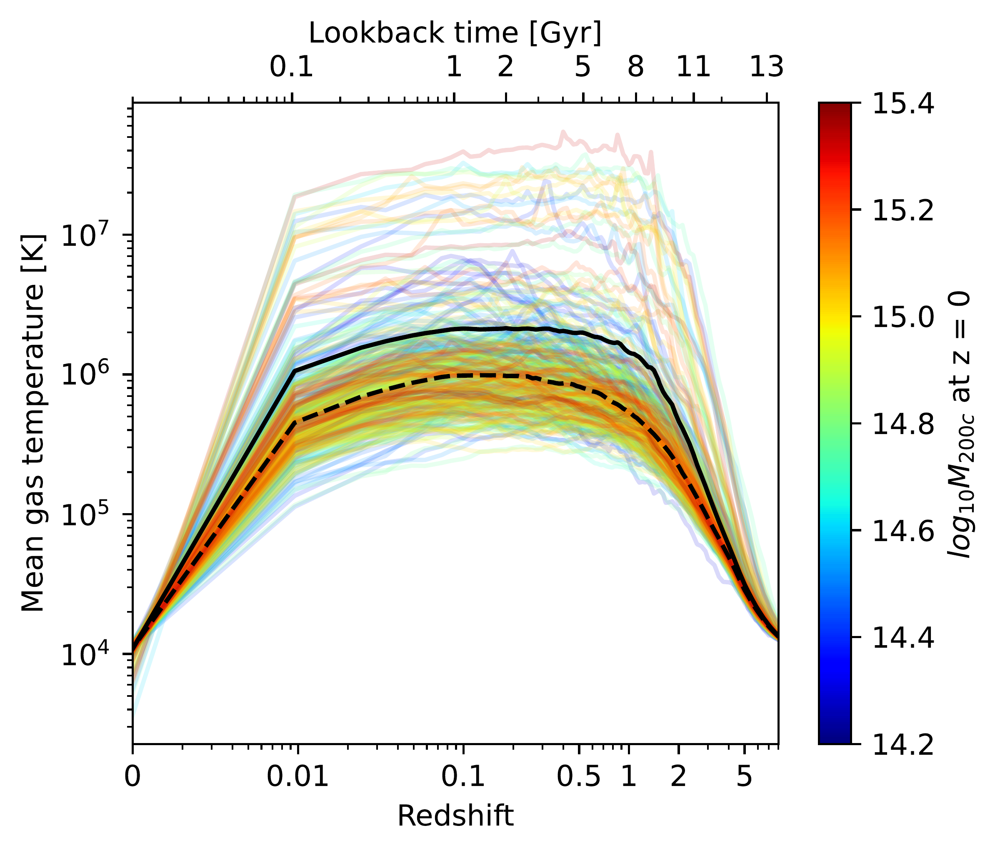
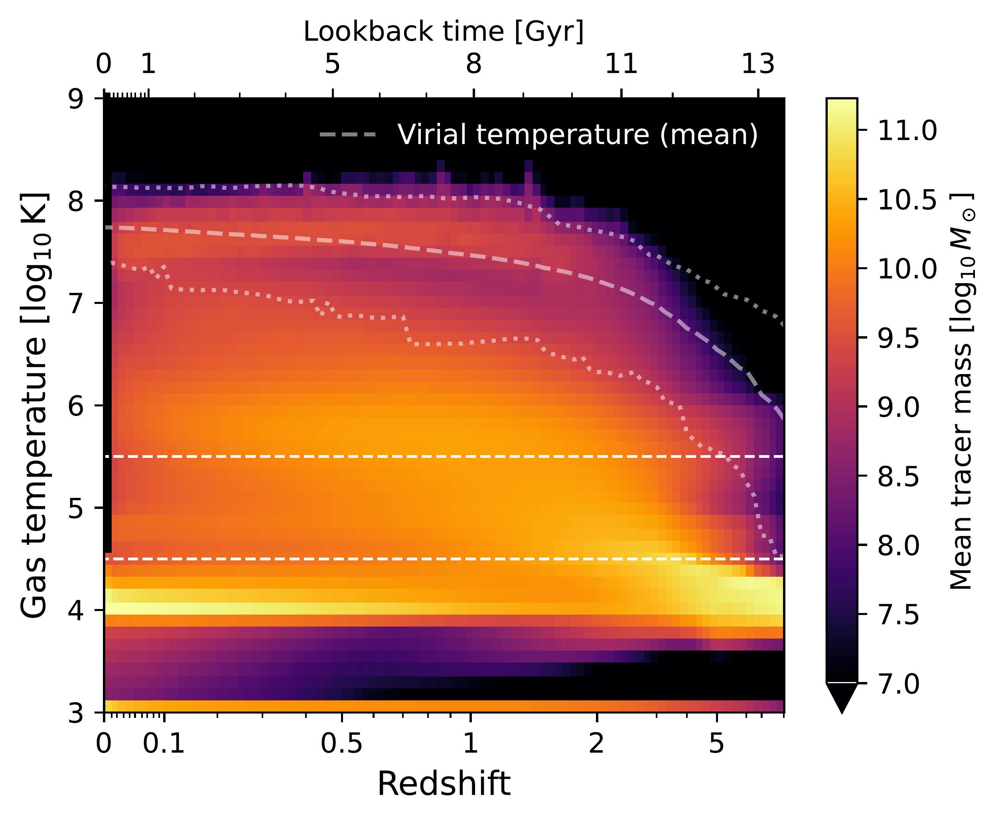
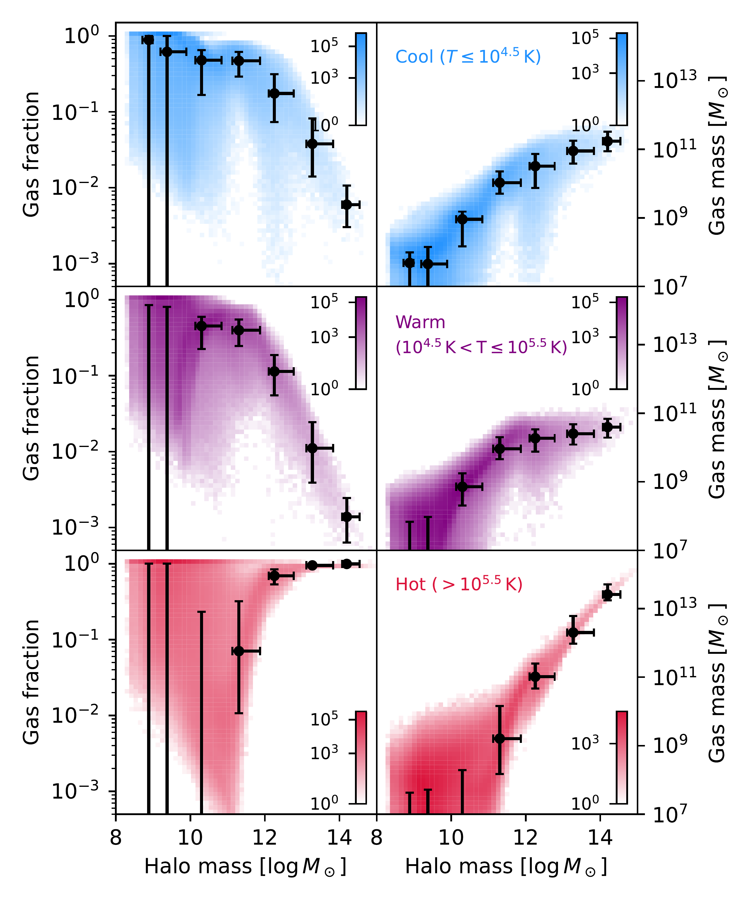

$\newcommand{\ensuremath}{}$
$\newcommand{\xspace}{}$
$\newcommand{\object}[1]{\texttt{#1}}$
$\newcommand{\farcs}{{.}''}$
$\newcommand{\farcm}{{.}'}$
$\newcommand{\arcsec}{''}$
$\newcommand{\arcmin}{'}$
$\newcommand{\ion}[2]{#1#2}$
$\newcommand{\textsc}[1]{\textrm{#1}}$
$\newcommand{\hl}[1]{\textrm{#1}}$
$\newcommand{\footnote}[1]{}$
$\newcommand{\LambdaCDM}{\Lambda\rm CDM}$
$\newcommand{\metalline}[2]{#1 \textsc{#2}}$
$\newcommand{\nth}[1]{#1\textsuperscript{th}}$
$\newcommand{\milan}[1]{\textcolor{purple}{[Milan] #1}}$
$\newcommand{\reza}[1]{\color{magenta}#1\color{black}}$
$\newcommand{\rezac}[1]{\color{magenta}\textit{[#1]}\color{black}}$
$\newcommand{\rezas}[1]{\color{magenta}\sout{#1} \color{black}}$
$\newcommand{\er}[1]{{\color{teal}#1}}$

# The abundance and origin of cool gas in galaxy clusters \\in the TNG-Cluster simulation

<mark>Appeared on: 2025-03-05</mark> -  _The TNG-Cluster simulation is now fully publicly released at this https URL (see also science results today from Prunier+, Chatzigiannakis+, and Lehle+ today)_

M. Staffehl, et al. -- incl., <mark>E. Rohr</mark>, <mark>A. Pillepich</mark>

**Abstract:** In addition to the hot intracluster medium, massive galaxy clusters host complex, multi-phase gaseous halos. In this work, we quantify the abundance, spatial distribution, and origin of the cool ( $T\leq10^{4.5} \rm{K}$ ) gas within clusters. To do so, we combine the TNG-Cluster and TNG300 cosmological magnetohydrodynamical simulations, yielding a sample of 632 simulated galaxy clusters at $z=0$ with masses $M_{200c} \sim 10^{14-15.4} \rm{M_\odot}$ . We find that cool gas is present in every cluster at $z=0$ , although it constitutes only a small fraction of the total gas mass within twice the virial radius, ranging from $\sim 10^{-4}$ to a few per cent. The majority of cool gas resides in the cluster outskirts in infalling satellites and other halos. More rarely, cool gas can also be present in the central regions of clusters. More massive halos contain larger amounts (but not fractions) of cool gas ( $\sim 10^{10-12} \rm{M_\odot}$ ), and we identify correlations between cluster cool gas fraction and several global halo and galaxy properties at fixed halo mass. Using Monte-Carlo Lagrangian tracer particles, we then track the origin of cool gas in present-day clusters. We find that the primary source is recent accretion at $z \lesssim 0.1$ , predominantly in the form of pre-cooled gas carried by infalling satellite galaxies and other halos. However, in-situ cooling of the hot intracluster medium gas accreted at earlier epochs also contributes, especially in present-day cool-core clusters.

**Figure 10. -** Evolution of the spatial distribution of tracers that contribute to $z=0$ cool gas in clusters, from TNG-Cluster. In practice, here we follow those tracers that at $z=0$ are associated with gas cells of temperatures below $10^{4.5} \rm K$ and within $2R_{200c}$ of their host cluster. Top left: Fraction of selected tracers within $2R_{200c}$ as a function of redshift. The virial radius $R_{200c}$ develops with redshift and is that of the cluster progenitor which eventually hosts the cool gas at redshift $z = 0$. Top right: Mean distribution of crossing redshifts, defined as the first (green) or last (purple) redshift at which the distance from a tracer to the progenitor of its $z = 0$ host cluster decreases below $2R_{200c}$. The solid (dashed) vertical line shows the mean (median) crossing redshift. Bottom left: Mean $2R_{200c}$ crossing redshift of every cluster in TNG-Cluster versus the $z = 0$ mass of the cluster. The individual points are colored by the cluster cool gas mass fraction at $z = 0$, while the black dashed line shows the median trend. Bottom right: Marginalized distribution of distances of tracers as a function of redshift. Color indicates the bin-wise mean tracer mass, per bin per cluster. The dashed white line shows the mean virial radius of the cluster sample, and the two dashed white lines show the minimum and maximum virial radius of the sample in each redshift bin. Clusters gather most of the gas that eventually forms redshift $z=0$ cool gas around $z \sim 0.1$. (*fig:results:tracers_dist*)

**Figure 12. -** Evolution of the temperature of tracers that contribute to $z=0$ cool gas in clusters, from TNG-Cluster. Left panel: mean temperature of gas cells associated with the cool gas tracers in each cluster as a function of redshift. Each halo of TNG-Cluster is shown as a single line, with color denoting the $z=0$ cluster mass $M_{200c}$. The black solid (dashed) line shows the mean (median) over the entire cluster sample. Right panel: distribution of temperature for gas cells associated with the selected tracers with redshift, showing the bin-wise mean over the individual distributions of all clusters. The faint dashed white line shows the mean virial temperature of the cluster sample, and the two faint dashed white lines show the minimum and maximum virial radius of the sample in each redshift bin. The two straight dashed white lines show the division between the temperature regimes at $10^{4.5}$(below which we talk of cool gas) and $10^{5.5} \rm K$(above which we talk of hot gas), respectively. The predecessor gas to redshift $z=0$ cool gas on average spends most of the time since $z = 8$ at temperatures $> 10^5  \rm K$, but below the virial temperature of the host cluster, and cooled only recently. (*fig:results:temperature_evo*)

**Figure 1. -** The fraction of each gas phase relative to the total gas mass (left) and the absolute gas mass for each phase (right) as functions of halo mass (x-axis) across all halos and clusters of TNG300 at $z=0$ . We divide gas into cool (first row, blue), warm (second row, purple), and hot (third row, red) components. The color indicates the number of halos per pixel. The black markers are the median in both gas fraction/gas mass and halo mass for mass bins of width 1 dex from $10^8$ to $10^{15}  \rm M_\odot$. The error bars denote the $\nth${16} and $\nth${84} percentile along both axes. More massive clusters host larger amounts of cool gas within their FoF halos, even though fractionally the contribution of cool and warm gas to clusters decreases with total mass. (*fig:results:mass_trends_tng300*)

