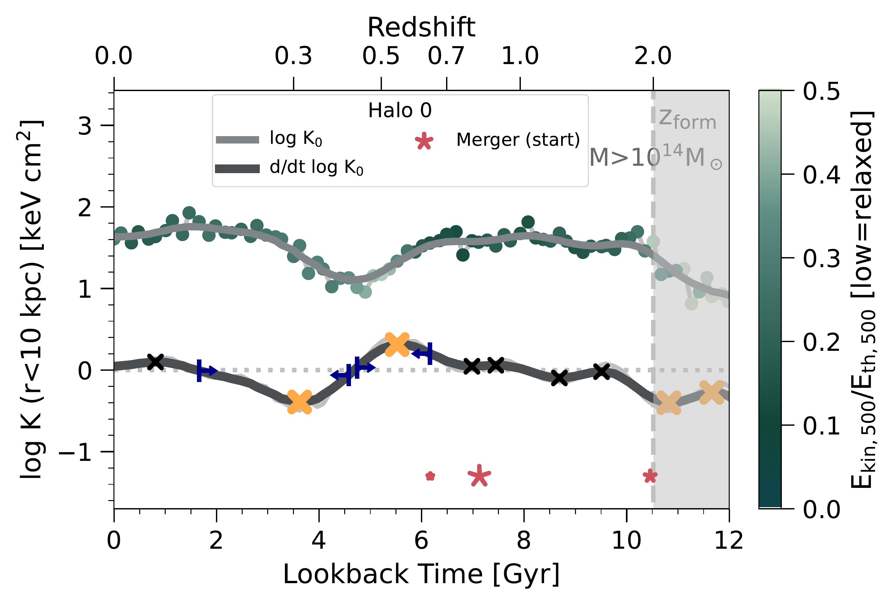
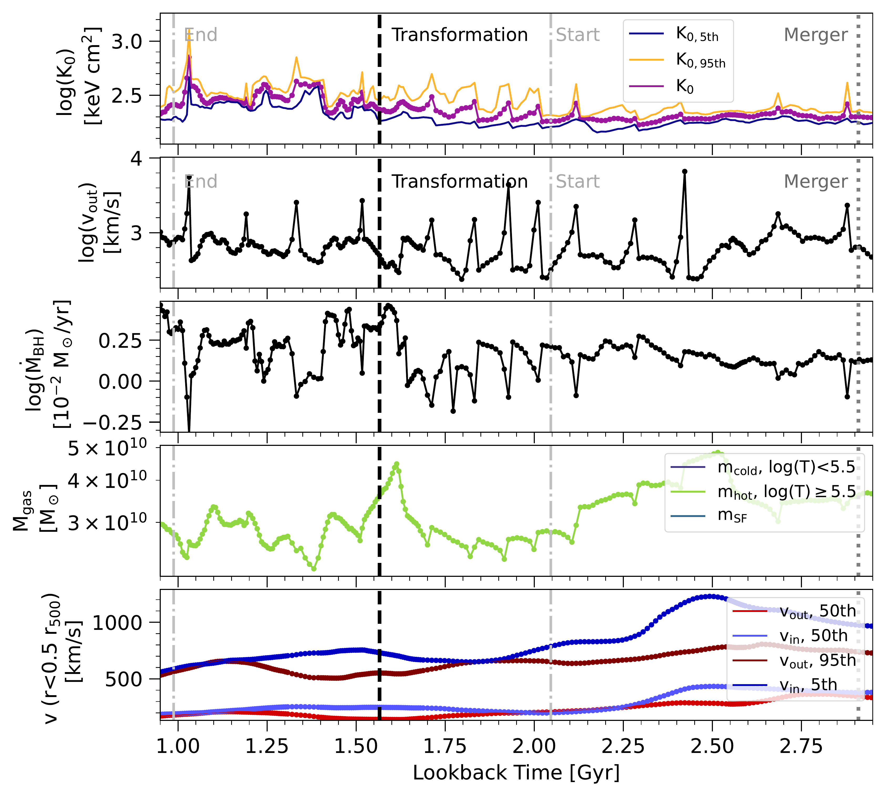
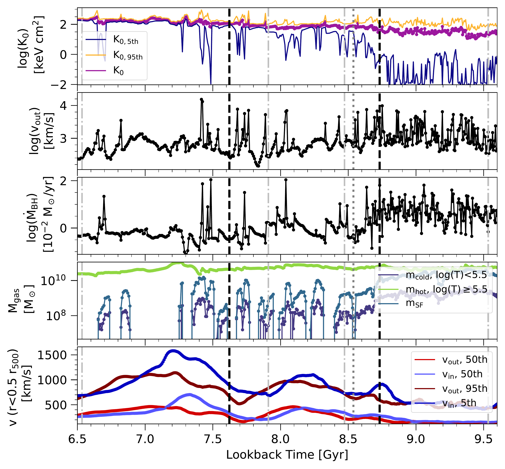

$\newcommand{\ensuremath}{}$
$\newcommand{\xspace}{}$
$\newcommand{\object}[1]{\texttt{#1}}$
$\newcommand{\farcs}{{.}''}$
$\newcommand{\farcm}{{.}'}$
$\newcommand{\arcsec}{''}$
$\newcommand{\arcmin}{'}$
$\newcommand{\ion}[2]{#1#2}$
$\newcommand{\textsc}[1]{\textrm{#1}}$
$\newcommand{\hl}[1]{\textrm{#1}}$
$\newcommand{\footnote}[1]{}$
$\newcommand{\mvir}{{\rm M}_{\rm 500c}}$
$\newcommand{\rvir}{r_{\rm 500c}}$
$\newcommand{\mtc}{{\rm M}_{\rm 200c}}$
$\newcommand{\rtc}{r_{\rm 200c}}$
$\newcommand{\msun}{\rm{M}_\odot}$
$\newcommand{\arraystretch}{1.3}$

# What Drives Cluster Cool-Core Transformations?\\A Population Level Analysis of TNG-Cluster

<mark>Appeared on: 2025-03-05</mark> -  _The data of the TNG-Cluster simulation is now fully public and accessible at this https URL. See also science results by Chatzigiannakis+, Prunier+ and Staffehl+ on astro-ph today. Submitted to A&A_

K. Lehle, D. Nelson, <mark>A. Pillepich</mark>

**Abstract:** In this study, we examine the frequency and physical drivers of transformations from cool-core (CC) into non-cool-core (NCC) clusters, and vice versa, in a sample of 352 massive galaxy clusters ( $\mvir = 10^{14-15.3} \msun$ ) from the TNG-Cluster magnetohydrodynamical cosmological simulation of galaxies. By identifying transformations based on the evolution of central entropy and focusing on $z\lesssim2.5$ , we find that clusters frequently undergo such events, depending on their diverse assembly and supermassive black hole (SMBH) histories. On average, clusters experience two to three transformations. Transformations can occur in both directions and can be temporary, but those to higher entropy cores, i.e. in the qualitative direction from CC to NCC states, are the overwhelming majority. CC phases are also shorter than NCC phases, and thus overall the TNG-Cluster population forms with low-entropy cores and moves towards NCC states as cosmic time progresses. We study the role that mergers play in driving transformations, and find that mergers within $\sim 1$ Gyr prior to a transformation towards higher (but not lower) entropy cores occur statistically more often than in a random control sample. Most importantly, we find examples of mergers associated with cool-cores disruption regardless of their mass ratio or angular momentum. However, past merger activity is not a good predictor for $z=0$ CC status, at least based on core entropy, even though clusters undergoing more major and minor mergers eventually have the highest core entropy values at $z=0$ . We therefore consider the interplay between AGN feedback and evolving cluster core thermodynamics. We find that core transformations are accompanied by an increase in AGN activity, whereby frequent and repeated (kinetic) energy injections from the central SMBHs can produce a collective, long-term impact on central entropy, ultimately heating cluster cores. Whether such fast-paced periods of AGN activity are triggered by mergers is plausible, but not necessary.

**Figure 13. -** Representative time evolution of the central cooling state of a massive galaxy cluster. In particular, the central entropy of the most massive $z=0$ halo in TNG-Cluster is given by the circular symbols (color indicating relaxedness, in terms of the ratio of kinetic to thermal energy within $\rvir$). Correspondingly, the light gray line shows the smoothed time evolution of $K_0$, while the dark gray curve shows its time derivative. Local extrema of the derivative are indicated by crosses, with larger orange crosses marking significant core transformation events (see text). The blue markers indicate the timescales or duration of the two core transformations (see text for a definition). This halo undergoes a core transformation between $z \sim 0.3-0.5$ wherein the core evolves towards a more cool-core (CC) state. In this case the transformation is temporary and lasts $\sim 2-3$ Gyr, after which the central entropy returns to its previous level. This type of behavior is one of several archetypes (see text for discussion). The pink stars mark the start of the three most massive merger events in the history of this cluster. The size of the markers indicate the mass ratio of the merging event. We mark the formation time of the cluster with the silver vertical, dashed line. Note that throughout the paper, time evolves from right to left in all plots that depict a time evolution. (*fig:K0vsTime*)

**Figure 19. -** Evolution of the thermodynamical cluster core properties, as well as AGN feedback activity, as a function of time of an example cluster, the most massive cluster of TNG300 for which we have high temporal cadence output. We show a single halo, followed using the high time-resolution subbox (see text). We focus on a $\sim 2$ Gyr period of time centered on $z \simeq 0.1$ and the last transformation, and last merger, of this cluster. From top to bottom the panels show: the mean central entropy measured within 10 kpc (purple) and the 5th (blue) and 95th (orange) percentiles; the 95th percentile of the outflow velocity within 10 kpc around the central black hole (black); the instantaneous accretion rate of the central black hole (black); the gas mass within 30 kpc split into hot ($T\geq 10^{5.5}$ K, green), cold ($T< 10^{5.5}$ K, blue), and star forming phases (teal); the bulk outflow and inflow velocities within $0.5$\rvir$$(red and blue, respectively) and the 5th percentile of the inflow velocity (dark blue) and the 95th percentile of the outflow velocity (dark red) also measured within $0.5$\rvir$$. The vertical black dashed lines indicate the transformations, the light gray dash-dotted lines indicate the start and end of a transformation, and the dark gray dotted lines show the time of the closest associated merger (all lines are labeled in the first two rows). Repeated AGN feedback episodes are visible as short time-scale peaks in outflow velocity and central entropy that collectively help to transform this cluster into a NCC state. (*fig:timeseries*)

**Figure 20. -** As in Fig. \ref{fig:timeseries}, showing the same five quantities and tracking the same cluster from TNG300 through time but here focusing on high redshift, i.e. showing details of the first two transformations to higher core entropy. These occur at $z \simeq 1.2$ and $z \simeq 0.95$, and are marked with the vertical black dotted lines. The merger at $t_{\rm lb} \simeq 8.5$ Gyr causes strong bulk motions in the inner ICM, enhancing the episodic AGN accretion and feedback, that collectively transform and remove cool gas from the cluster core. (*fig:timeseries2*)

