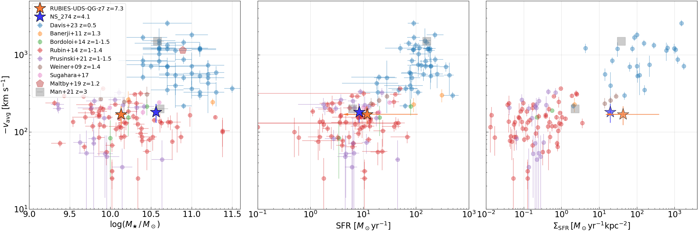
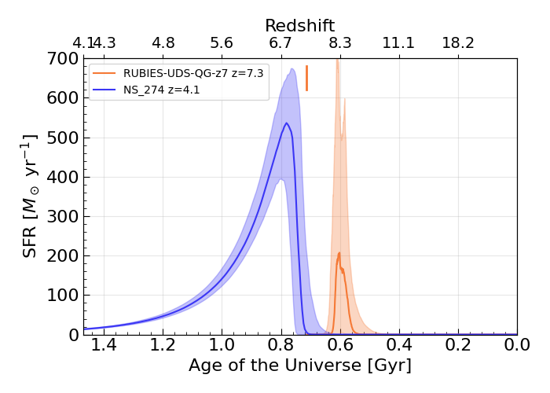
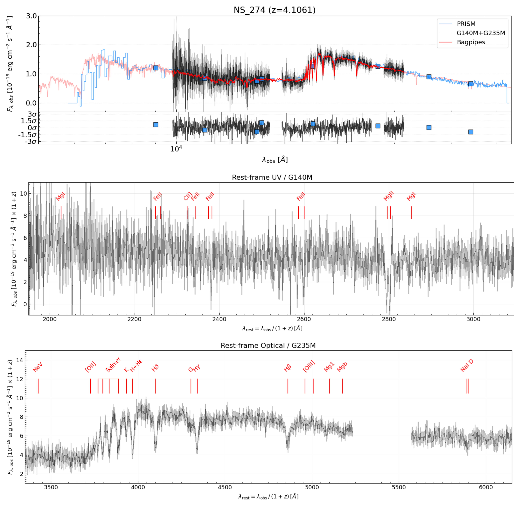

$\newcommand{\ensuremath}{}$
$\newcommand{\xspace}{}$
$\newcommand{\object}[1]{\texttt{#1}}$
$\newcommand{\farcs}{{.}''}$
$\newcommand{\farcm}{{.}'}$
$\newcommand{\arcsec}{''}$
$\newcommand{\arcmin}{'}$
$\newcommand{\ion}[2]{#1#2}$
$\newcommand{\textsc}[1]{\textrm{#1}}$
$\newcommand{\hl}[1]{\textrm{#1}}$
$\newcommand{\footnote}[1]{}$
$\newcommand{\hb}{H\beta}$
$\newcommand{\ha}{H\alpha}$
$\newcommand{\lya}{Ly\alpha}$
$\newcommand{\neiii}{[Ne {\footnotesize III}]}$
$\newcommand{\oiii}{[O {\footnotesize III}]}$
$\newcommand{\oii}{[O {\footnotesize II}]}$
$\newcommand{\nii}{[N {\footnotesize II}]}$
$\newcommand{\sii}{[S {\footnotesize II}]}$
$\newcommand{\kms}{km s^{-1}}$
$\newcommand{\myr}{M_{\odot} yr^{-1}}$
$\newcommand{\msun}{M_{\odot}}$
$\newcommand{\zsun}{Z_{\odot}}$
$\newcommand{\mstar}{M_{\star}}$
$\newcommand{\mgas}{M_{\rm gas}}$
$\newcommand{\mdust}{M_{\rm dust}}$
$\newcommand{\mdyn}{M_{\rm dyn}}$
$\newcommand{\kkmspc}{K~km~s^{-1}~pc^2}$
$\newcommand{\jykms}{Jy~km~s^{-1}}$
$\newcommand{\ci}{[C {\footnotesize I}]}$
$\newcommand{\hi}{H {\footnotesize I}}$
$\newcommand{\hii}{H {\footnotesize II}}$
$\newcommand{\co}{CO}$
$\newcommand{\citwo}{[C {\footnotesize I}](^3P_2 -  ^{3}P_1)}$
$\newcommand{\coseven}{CO (7-6)}$
$\newcommand{\lcitwo}{L_{\mathrm{[C \scriptscriptstyle{I}\scriptstyle{]}}^3P_2 -  ^3P_1}}$
$\newcommand{\lciplus}{L_{\rm[CII]}}$
$\newcommand{\lprimecitwo}{L'_{\mathrm{[C \scriptscriptstyle{I}\scriptstyle{]}}^3P_2 -  ^3P_1}}$
$\newcommand{\lprimecoseven}{L'_{\rm CO(7-6)}}$
$\newcommand{\lir}{L_{\rm IR}}$
$\newcommand{\lfir}{L_{\rm FIR}}$
$\newcommand{\lsun}{L_{\odot}}$
$\newcommand{\tdust}{T_{\rm dust}}$
$\newcommand{\subl}{sub-L^{\star}}$
$\newcommand{\cii}{[C {\footnotesize II}]}$
$\newcommand{\jwst}{JWST}$
$\newcommand{\hst}{HST}$
$\newcommand{\um}{\mum}$
$\newcommand{\cgs}{\rm erg cm^{-2} s^{-1} Å^{-1}}$
$\newcommand{\sigmastar}{\sigma_\star}$
$\newcommand{\mgii}{Mg {\sc ii}}$
$\newcommand{\mgi}{Mg {\sc i}}$
$\newcommand{\feii}{Fe {\sc ii}}$
$\newcommand{\mout}{M_{\rm out}}$
$\newcommand{\mdotout}{\dot{M}_{\rm out}}$
$\newcommand$
$\newcommand$
$\newcommand{\brenda}[1]{\textcolor{orange}{[#1]}}$
$\newcommand{\snhope}{NS\_274}$
$\newcommand{\rubies}{RUBIES-UDS-QG-z7}$
$\newcommand{\arraystretch}{1.3}$

# Gas outflows in two recently quenched galaxies at $z=4$ and $7$

<mark>Appeared on: 2025-03-05</mark> -  _13 pages, 7 figures + Appendix. Submitted to A&A on Jan 27, 2025. See Ito et al. (2025) on arXiv today for another result from the JWST "DeepDive" program_

F. Valentino, et al. -- incl., <mark>A. d. Graaff</mark>

**Abstract:** Outflows are a key element in the baryon cycle of galaxies, impacting their evolution by extracting gas, momentum, energy, and then injecting them into the surrounding medium.  The properties of gas outflows provide a fundamental test for our models of how galaxies transition from a phase of active star formation to quiescence. Here we report the detection of outflowing gas signatures in two recently quenched, massive ( $M_\star \sim 10^{10.2} M_\odot$ ) galaxies at $z=4.106$ ( $\snhope$ ) and $z=7.276$ ( $\rubies$ ) observed at rest-frame ultra-violet (UV) to near-infrared wavelengths with JWST/NIRSpec. The outflows are traced by blue-shifted magnesium (MgII) absorption lines, and in the case of the $z=4.1 $ system, also by  iron (FeII) and sodium (NaI) features. Together, these transitions broadly trace the chemically enriched neutral phase of the gaseous medium. The rest-frame optical spectra of the two sources are similar to those of local post-starburst galaxies, showing deep Balmer stellar features, relatively low $D_{\rm n}4000$ index, and minimal ongoing star formation on 10 Myr timescales as traced by the lack of bright nebular and recombination emission lines, also suggesting the absence of a strong and radiatively efficient AGN activity. The galaxies' star formation histories are consistent with a recent and abrupt quenching of star formation, which continued at rates of $\sim15$ $\myr$ averaged over the last 100 Myr of their life. In the case of $\snhope$ , dedicated millimeter observations allow us to strongly constrain also the dust obscured SFR to $<12$ $\myr$ , unambiguously confirming its quiescence. Under simple geometrical assumptions, we derive mass loading factors $\eta=\dot{M}_{\rm out}/\mathrm{SFR_{100 Myr}}\lesssim1$ and $\sim50$ for the $z=4.1$ and $z=7.3$ systems, respectively, and similarly different  energy carried by the outflows ( $\dot{E}_{\rm out} \lesssim5\times10^{40}$ and $\sim2\times10^{42} \mathrm{erg} \mathrm{s}^{-1}$ ). Supernovae feedback can account for the mass and energy of the outflow in $\snhope$ . However, the low mass loading factor and average gas velocity ( $\sim180$ $\kms$ , lower than the stellar velocity dispersion) suggest that the observed outflow is unlikely to be the primary reason behind the quenching of $\snhope$ , but it might represent a relic of the star formation process winding down. Star formation-related processes seem to be also insufficient to explain the extreme mass outflow rate of $\rubies$ , which would require an additional ejective mechanism such as an undetected AGN.  Finally, the average outflow velocities per unit stellar mass, SFR, or its surface area are consistent with those of lower-redshift post-starburst galaxies, suggesting that outflows in rapidly quenched galaxies might in substance occur similarly across cosmic time. Our findings hint at the existence of a rich tapestry of galaxy quenching pathways at high redshift, and they remark the importance of large spectroscopic samples mapping different spectral features to account for the different timescales on which different mechanisms contribute to this process.

**Figure 9. -** Average outflow velocity as a function of the stellar mass, $\mathrm{SFR}_{\rm 100Myr}$, and surface density of $\mathrm{SFR}_{\rm 100Myr}$(corrected by the magnification factor for $\snhope$). Filled stars indicate the targets analyzed in this work. The colored filled circles represent the homogenized literature compilation of $\mgii$ outflows across redshifts by $\ci$te[][and references therein]{davis_2023}. The results form stacking of post-starburst galaxies at $z\sim1.2$ from $\ci$te{maltby_2019} are shown with a red pentagon.
    The location of two $z\sim3$ recently quenched sources in $\ci$te{man_2021} is marked by grey squares. (*fig:literature*)

**Figure 2. -** Star formation histories of our targets. In orange and blue, we show the best-fit double power-law SFHs of $\rubies$ and $\snhope$ and their uncertainties, respectively. The age of the Universe is truncated at the observed redshift of $\snhope$. The orange segment marks the observed redshift of $\rubies$. (*fig:sfh*)

**Figure 6. -** Spectra, photometry, and SED modeling of $\snhope$ at $z=4.1061\pm0.0003$. _Top:_ Here we indicate the photometry (blue squares), JWST/NIRSpec medium resolution spectra (G140M+G235M, black line), and their uncertainties (gray line) that we jointly modeled with Bagpipes (red line) in the observed frame. The normalized residuals of the modeling are shown in the lower inset. For reference, we also show the PRISM spectrum (blue).
    _Center:_ rest-frame UV spectrum covered by the G140M grating. _Bottom:_ rest-frame optical spectrum covered by the G235M grating. We mark in red the expected location of emission and absorption lines at the derived systemic redshift $z_{\rm spec}=4.1061$, as labeled. The flux densities in the bottom panels have been rescaled by $(1+z)$ to conserve the energy. (*fig:sed_snhope*)

