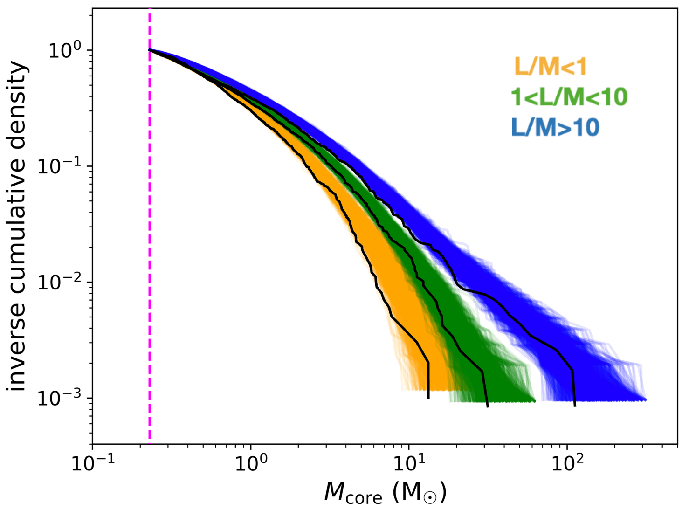
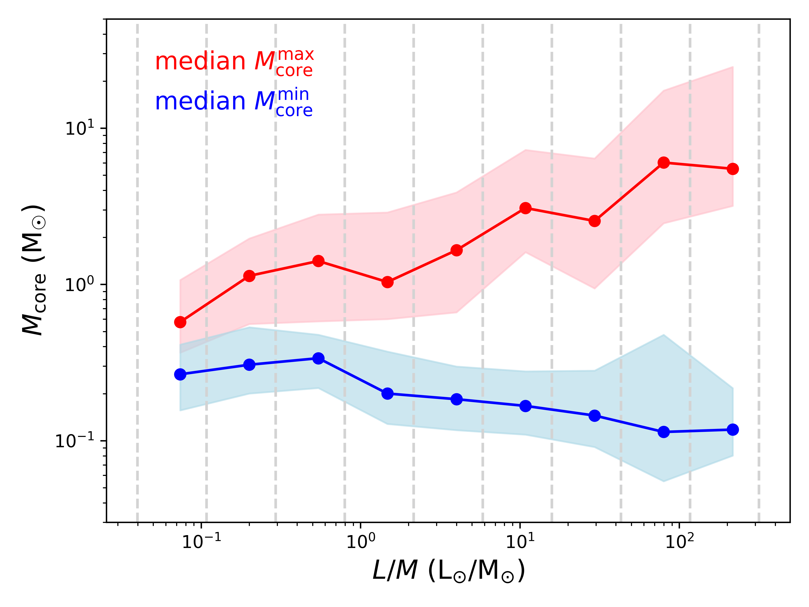
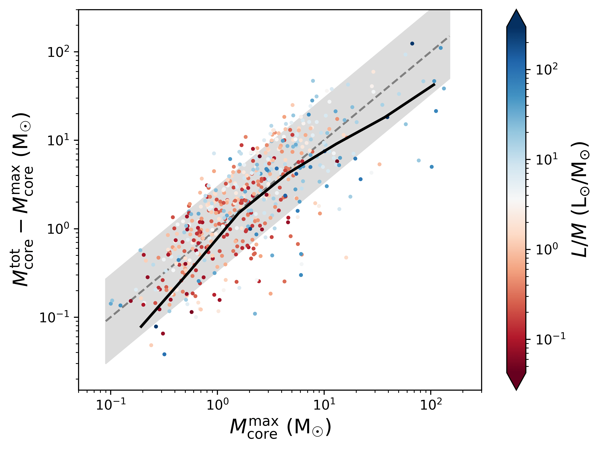
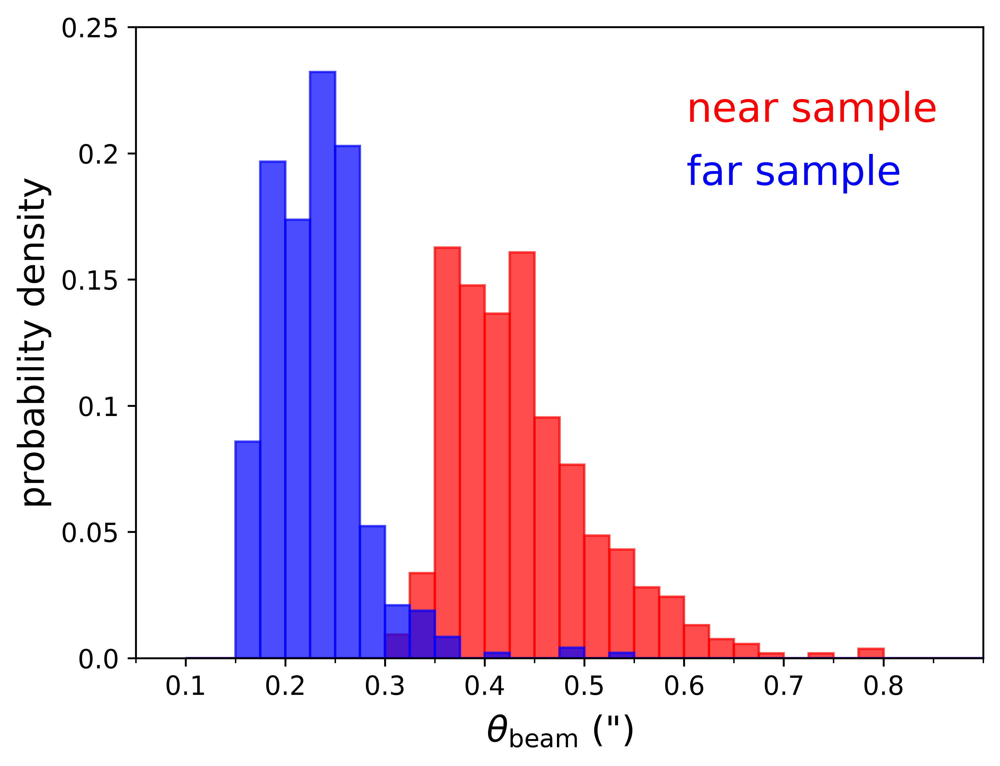
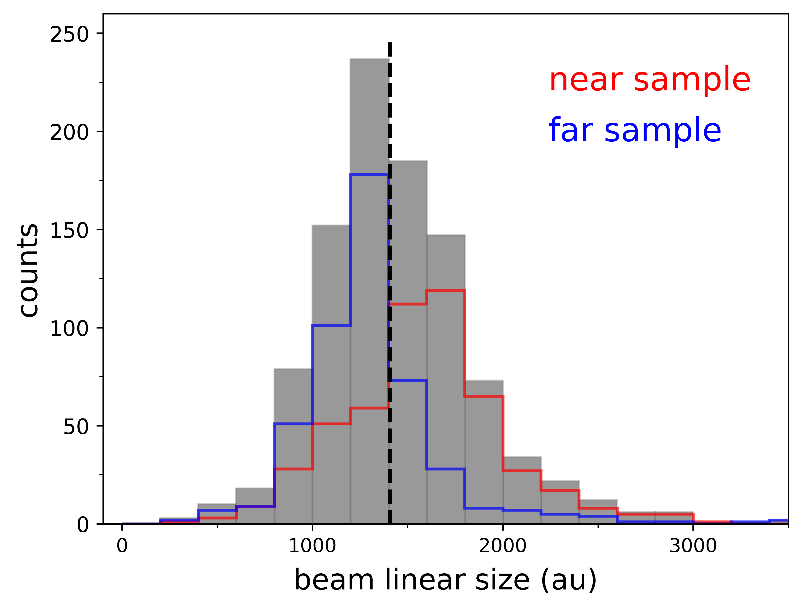

$\newcommand{\ensuremath}{}$
$\newcommand{\xspace}{}$
$\newcommand{\object}[1]{\texttt{#1}}$
$\newcommand{\farcs}{{.}''}$
$\newcommand{\farcm}{{.}'}$
$\newcommand{\arcsec}{''}$
$\newcommand{\arcmin}{'}$
$\newcommand{\ion}[2]{#1#2}$
$\newcommand{\textsc}[1]{\textrm{#1}}$
$\newcommand{\hl}[1]{\textrm{#1}}$
$\newcommand{\footnote}[1]{}$
$\newcommand{\juan}[1]{{\bf #1}}$

# ALMAGAL III. Compact source catalog: Fragmentation statistics and physical evolution of the core population

<mark>Appeared on: 2025-03-10</mark> -  _35 pages, 63 figures, accepted for publication in the Astronomy & Astrophysics journal, abstract adapted from original_

A. Coletta, et al. -- incl., <mark>H. Beuther</mark>

**Abstract:** The physical mechanisms behind the fragmentation of high-mass dense clumps into compact star-forming cores and the properties of these cores are fundamental topics that are heavily investigated in current astrophysical research. The ALMAGAL survey provides the opportunity to study this process at an unprecedented level of detail and statistical significance, featuring high-angular resolution $1.38$ mm ALMA observations of $1013$ massive dense clumps at various Galactic locations. These clumps cover a wide range of distances ( $\sim2-8$ kpc), masses ( $\sim10^{2}-10^{4} \mathrm{M_{\odot}}$ ), surface densities ( $0.1-10$ g $\mathrm{cm^{-2}}$ ), and evolutionary stages (luminosity over mass ratio indicator of $\sim0.05<L/M<450 \mathrm{L_{\odot}/M_{\odot}}$ ).Here, we present the catalog of compact sources obtained with the _CuTEx_ algorithm from continuum images of the full ALMAGAL clump sample combining ACA- $7$ m and $12$ m ALMA arrays, reaching a uniform high median spatial resolution of $\sim1400$ au (down to $\sim800$ au). We characterize and discuss the revealed fragmentation properties and the photometric and estimated physical parameters of the core population.The ALMAGAL compact source catalog   includes $6348$ cores detected in $844$ clumps ( $83\%$ of the total), with a number of cores per clump between $1$ and $49$ (median of $5$ ). The estimated core diameters are mostly within $\sim800-3000$ au (median of $1700$ au). We assigned core temperatures based on the $L/M$ of the hosting clump, and obtained core masses from $0.002$ to $345 \mathrm{M_{\odot}}$ (complete above $0.23 \mathrm{M_{\odot}}$ ), exhibiting a good correlation with the core radii ( $M\propto R^{2.6}$ ).We evaluated the variation in the core mass function (CMF) with evolution as traced by the clump $L/M$ , finding a clear, robust shift and change in slope among CMFs within subsamples at different stages. This finding suggests that the CMF shape is not constant throughout the star formation process, but rather it builds (and flattens) with evolution, with higher core masses reached at later stages.We found that all cores within a clump grow in mass on average with evolution, while a population of possibly newly formed lower-mass cores is present throughout. The number of cores increases with the core masses, at least until the most massive core reaches $\sim10 \mathrm{M_{\odot}}$ .More generally, our results favor a clump-fed scenario for high-mass star formation, in which cores form as low-mass seeds, and then gain mass while further fragmentation occurs in the clump.

**Figure 7. -** Observed CMFs (black lines, expressed as inverse cumulative number density distributions) for the three populations of ALMAGAL cores classified, as reported, according to the $L/M$ evolutionary indicator of the hosting clump, as explained in Sect. \ref{Tcore_model}. The three colored bands trace, for each population, the $1000$ MC realizations of CMFs computed by assigning to each core a random temperature within the ranges defined in Table \ref{Tcore_tab}. Less evolved sources (i.e., with $L/M\leq1  \mathrm{L_{\odot}/M_{\odot}}$) are marked by golden lines, the intermediate ones ($1<L/M\leq10  \mathrm{L_{\odot}/M_{\odot}}$) by green lines, and the more evolved sources ($L/M>10 \mathrm{L_{\odot}/M_{\odot}}$) by blue lines. Note: we include only cores above the mass completeness value of $0.23 \mathrm{M_{\odot}}$, marked by the vertical dashed magenta line (see text for explanation). (*CMF_evolution*)

**Figure 25. -** Evolution of core masses. _Left panel_: Median values of the maximum ($M_{\rm{core}}^{\rm{max}}$, red) and the minimum ($M_{\rm{core}}^{\rm{min}}$, blue) core masses revealed within different bins of clump $L/M$(delimited by vertical dashed grey lines). The respective colored shaded areas mark the 25th and 75th percentiles of the two distributions within the same $L/M$ bins.
    _Right panel_: Combined mass of the cores ($M_{\rm{core}}^{\rm{tot}}$) minus the mass of the MMC within each clump, as a function of the latter. Data points are color-coded by the clump $L/M$. The solid black line draws the trend of the median value of the quantity on the $y$-axis in given bins of $M_{\rm{core}}^{\rm{max}}$. The dashed grey line corresponds to the $M_{\rm{core}}^{\rm{max}}=50\% M_{\rm{core}}^{\rm{tot}}$ relation, while the shaded grey area marks (from top to bottom) the $25-75\%$ range. (*core_mass_growth*)

**Figure 14. -** Beam properties of the ALMAGAL continuum maps. _Left panel_: Probability density distribution of the circularized angular sizes of the map beam, separately for near (red) and far (blue) observational samples, respectively (see \citealt{Sanchez+25} for more details).
    _Right panel_: Distribution of the corresponding linear sizes (i.e., achieved spatial resolution). The grey histogram represents the overall distribution, with the vertical dashed black line marking its median value ($1400$ au). Near and far subsamples are overplotted with the same color coding of the left panel.
    It can be noted that, due to the distance variation across our sample, the bimodal distribution in the left panel converts into a fairly uniform beam linear size overall distribution (see text for details). (*beam_circ_props_plots*)

