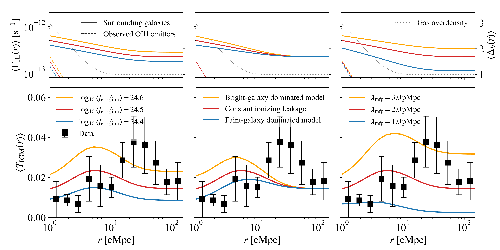
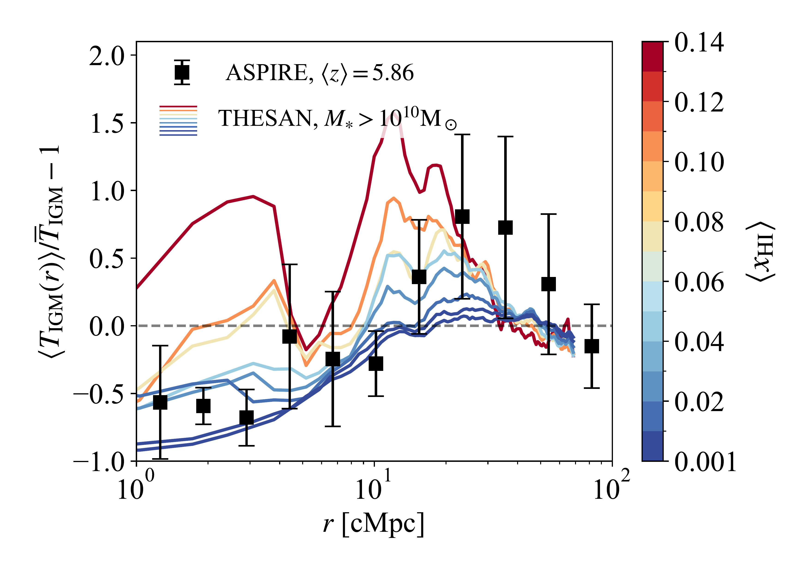
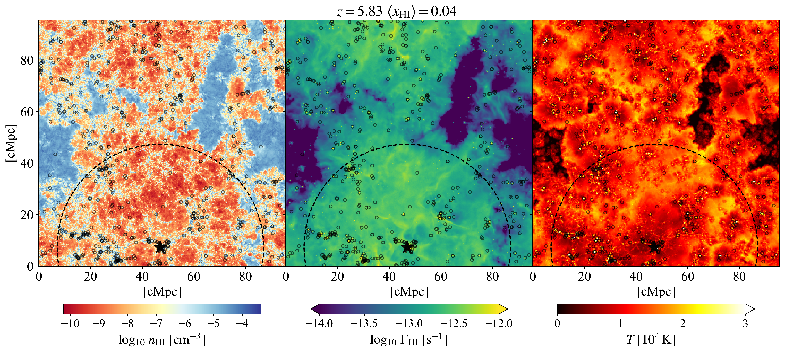

$\newcommand{\ensuremath}{}$
$\newcommand{\xspace}{}$
$\newcommand{\object}[1]{\texttt{#1}}$
$\newcommand{\farcs}{{.}''}$
$\newcommand{\farcm}{{.}'}$
$\newcommand{\arcsec}{''}$
$\newcommand{\arcmin}{'}$
$\newcommand{\ion}[2]{#1#2}$
$\newcommand{\textsc}[1]{\textrm{#1}}$
$\newcommand{\hl}[1]{\textrm{#1}}$
$\newcommand{\footnote}[1]{}$
$\newcommand{\HI}{{\rm H {\scriptstyle I}}}$
$\newcommand{\HII}{{\rm H {\scriptstyle II}}}$
$\newcommand{\HeI}{{\rm He {\scriptstyle I}}}$
$\newcommand{\HeII}{{\rm He {\scriptstyle II}}}$
$\newcommand{\HeIII}{{\rm He {\scriptstyle III}}}$
$\newcommand{\CII}{{\rm C {\scriptstyle II}}}$
$\newcommand{\CIII}{{\rm C {\scriptstyle III}}}$
$\newcommand{\CIV}{{\rm C {\scriptstyle IV}}}$
$\newcommand{\SiII}{{\rm Si {\scriptstyle II}}}$
$\newcommand{\SiIII}{{\rm Si {\scriptstyle III}}}$
$\newcommand{\MgII}{{\rm Mg {\scriptstyle II}}}$
$\newcommand{\NII}{{\rm N {\scriptstyle II}}}$
$\newcommand{\NI}{{\rm N {\scriptstyle I}}}$
$\newcommand{\NV}{{\rm N {\scriptstyle V}}}$
$\newcommand{\NVI}{{\rm N {\scriptstyle VI}}}$
$\newcommand{\OI}{{\rm O {\scriptstyle I}}}$
$\newcommand{\OII}{{\rm[O {\scriptstyle II}]}}$
$\newcommand{\OIII}{{\rm[O {\scriptstyle III}]}}$
$\newcommand{\OVI}{{\rm O {\scriptstyle VI}}}$
$\newcommand{\SII}{{\rm S {\scriptstyle II}}}$
$\newcommand{\rmnum}[1]{\romannumeral #1}$
$\newcommand{\Rmnum}[1]{\expandafter\@slowromancap\romannumeral #1@}$
$\newcommand{\nHI}{n_{\rm HI}}$
$\newcommand{\xHI}{x_{\rm HI}}$
$\newcommand{\xHII}{x_{\mbox{\tiny H\Rmnum{2}}}}$
$\newcommand{\eHI}{\epsilon_{\mbox{\tiny H\Rmnum{1}}}}$
$\newcommand{\LyA}{\mbox{Ly}\alpha}$
$\newcommand{\NHI}{N_{\mbox{\tiny H\Rmnum{1}}}}$
$\newcommand{\fHI}{\langle f_{\mbox{\tiny H\Rmnum{1}}}\rangle}$
$\newcommand{\fHII}{\langle f_{\mbox{\tiny H\Rmnum{2}}}\rangle}$
$\newcommand{\CDDF}{\frac{\partial^2\mathcal{N}}{\partial\NHI\partial z}}$
$\newcommand{\sigmaHI}{\sigma_{\mbox{\tiny H\Rmnum{1}}}}$
$\newcommand{\Muv}{M_{\mbox{\tiny UV}}}$
$\newcommand{\br}{\boldsymbol{r}}$
$\newcommand{\A}{\mbox{Å}}$
$\newcommand{\TIGM}{T_{\rm IGM}}$
$\newcommand{\TIGMi}{T_{{\rm IGM},i}}$
$\newcommand{\TIGMr}{\langle\overline{T}_{\rm IGM}(r_\perp)\rangle}$
$\newcommand{\Mh}{M_{\rm h}}$
$\newcommand{\comment}{\textcolor{red}}$

# $\vspace{-0.5cm}$JWST ASPIRE: How Did Galaxies Complete Reionization? \ Evidence for Excess IGM Transmission around $\OIII$ Emitters during Reionization$\vspace{-15mm}$

<mark>Appeared on: 2025-03-11</mark> -  _31 pages, 22 figures, submitted to the Open Journal of Astrophysics_

K. Kakiichi, et al. -- incl., <mark>E. Bañados</mark>, <mark>F. Walter</mark>

**Abstract:** The spatial correlation between galaxies and the Ly $\alpha$ forest of the intergalactic medium (IGM) provides insights into how galaxies reionized the Universe. Here, we present initial results on the spatial cross-correlation between $\OIII$ emitters and Ly $\alpha$ forest transmission at $5.4<z<6.5$ from the JWST ASPIRE NIRCam/F356W Grism Spectroscopic Survey in $z>6.5$ QSO fields. Using data from five QSO fields, we find $2\sigma$ evidence for excess Ly $\alpha$ forest transmission at $\sim20-40 \rm cMpc$ around $\OIII$ emitters at $\langle z\rangle\simeq5.86$ , indicating that $\OIII$ emitters reside within a highly ionized IGM. At smaller scales, the Ly $\alpha$ forest is preferentially absorbed, suggesting gas overdensities around $\OIII$ emitters. Comparing with models, including THESAN cosmological radiation hydrodynamic simulations, we interpret the observed cross-correlation as evidence for significant large-scale fluctuations of the IGM and the late end of reionization at $z<6$ , characterized by ionized bubbles over $50\rm cMpc$ around $\OIII$ emitters. The required UV background necessitates an unseen population of faint galaxies around the $\OIII$ emitters with average LyC leakage of $\log_{10} \langle f_{\text{esc}} \xi_{\text{ion}} \rangle / [{\text{erg}^{-1} \text{Hz}}] \simeq 24.5$ down to $M_{\text{UV}} = -10$ . Furthermore, we find that the number of observed $\OIII$ emitters near individual transmission spikes is insufficient to sustain reionization in their surroundings, even assuming all $\OIII$ emitters harbour AGN with $100 \%$ LyC escape fractions. Despite broad agreement, a careful analysis of ASPIRE and THESAN, using the observed host halo mass from the clustering of $\OIII$ emitters, suggests that the simulations underpredict the observed excess IGM transmission around $\OIII$ emitters, challenging our model of reionization. Potential solutions include larger ionized bubbles at $z<6$ , further enhancement of large-scale UV background or temperature fluctuations of the IGM, and possibly a patchy early onset of reionization at $z>10$ . Current observational errors are dominated by cosmic variance, meaning future analyses of more QSO fields from JWST will improve the results.

**Figure 16. -** Comparison of the observed mean Ly$\alpha$ forest transmission around $\OIII$ emitters at $\langle z\rangle=5.86$ with the theoretical model based on analytic radiative transfer + CLF framework  ([ and Kakiichi 2018](https://ui.adsabs.harvard.edu/abs/2018MNRAS.479...43K)) . The top panels show the average photoionization rate around $\OIII$ emitters, $\langle \Gamma_{\rm HI}(r) \rangle$(solid line: contribution from surrounding galaxies; dashed line: central $\OIII$ emitters) on the left y-axis. The average gas overdensity profile around $\OIII$ emitters is indicated on the right y-axis. The bottom panels indicate the mean Ly$\alpha$ forest transmission around $\OIII$ emitters, $\langle T_{\rm IGM}(r)\rangle$ as a function of radial distance from $\OIII$ emitters. (Left): The model prediction with varying average LyC leakage $\langle f_{\rm esc}\xi_{\rm ion}\rangle=24.4,24.5,24.6$. The other parameters are fixed to the fiducial values as indicated in the text. (Middle): The model prediction with varying relative contribution from bright vs faint galaxies (see text). (Right): The model prediction with varying mean free path $\lambda_{\rm mfp}=1.0,2.0,3.0\rm pMpc$. The black squares show the observed mean Ly$\alpha$ forest transmission around $\OIII$ emitters with $1\sigma$ error estimated from the Jackknife method. (*fig:model*)

**Figure 17. -** Comparison of the observed $\OIII$ emitter-Ly$\alpha$ forest cross-correlation, $\langle T_{\rm IGM}(r)\rangle/\overline{T}_{\rm IGM}-1$, at $\langle z\rangle=5.86$(black squares) with the results from the THESAN cosmological radiation hydrodynamic simulation. The coloured curves show the results form THESAN-1 snapshots from $z=6.2$ to $5.5$ corresponding to global $\HI$ fractions of $\langle$\xHI$\rangle=0.14$ to $3.4\times10^{-3}$. We chose the central galaxies with stellar mass of $M_\ast>10^{10} \rm M_\odot$ from the THESAN simulation. The black errorbars show the $1\sigma$ error estimated from the Jackknife method. (*fig:thesan*)

**Figure 18. -** Sliced maps of the $\HI$ number density $n_{$\HI$}$(left), the photoionization rate $\Gamma_{\rm HI}$(middle), and the temperature $T$(right) around a central galaxy (black star symbol) with a stellar mass of $M_\ast>10^{10} \rm M_\odot$ in the THESAN-1 snapshot at $z=5.83$, corresponding to the fourth bluest galaxy-Ly$\alpha$ forest cross-correlation in Figure \ref{fig:thesan}. The open circles show the distribution of surrounding galaxies with stellar masses of $M_\ast>5\times10^7 \rm M_\odot$. The large dashed circle indicates a radius of $40\rm cMpc$ around the central galaxy. All sliced maps have a width of $3.7 \rm cMpc$. (*fig:thesan_map*)

